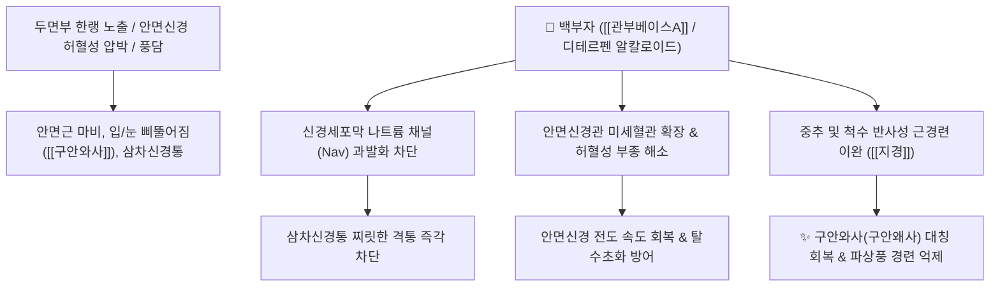

# 🌿 [[백부자]] (白附子, Aconiti Koreani Tuber)

> **핵심 요약 (Key Summary)**:
> 미나리아재비과(*Ranunculaceae*) 백부자(*Aconitum koreanum*)의 덩이뿌리
> 디테르펜 알칼로이드인 [[관부베이스A]](Guanfubase A)와 [[코레아닌]](Koreanine)이 나트륨 통로를 조절하여 신경 전도를 정상화하고 안면부 미세순환 개선
> 두면부 풍담(風痰)으로 인한 구안와사(안면신경마비)·삼차신경통·편두통 및 파상풍을 치료하는 대표적인 [[거풍화담지경]](祛風化痰止痙)·[[산한거습지통]](散寒祛濕止痛) 약재

---
## 📌 목차
1. [기본 본초 정보 & 화학 구조 (Pharmacognosy)](#1-기본-본초-정보--화학-구조-pharmacognosy)
2. [핵심 분자약리 기전 & 신경 전도·항부정맥 네트워크](#2-핵심-분자약리-기전--신경-전도항부정맥-네트워크)
3. [해부생체역학 / 안면신경 & 삼차신경 연계](#3-해부생체역학--안면신경--삼차신경-연계)
4. [사상의학 및 임상 응용 (적응증 vs 독성 법제)](#4-사상의학-및-임상-응용-적응증-vs-독성-법제)
5. [고전 의학 및 배오 원리 (견정산 배오)](#5-고전-의학-및-배오-원리-견정산-배오)
6. [핵심 처방 비교 매트릭스](#6-핵심-처방-비교-매트릭스)
7. [출처 및 학술 참고 문헌 (References)](#7-출처-및-학술-참고-문헌-references)

---
## 1. 기본 본초 정보 & 화학 구조 (Pharmacognosy)

> [!abstract]+ 🧪 3D 약리 분자 구조 (Interactive 3D Viewer)
> <iframe src="https://molecule-viewer-rho.vercel.app/?cid=222284" style="width: 100%; height: 600px; border: none; border-radius: 12px; box-shadow: 0 4px 20px rgba(0,0,0,0.15);" allowfullscreen></iframe>


| 항목 | 상세 내용 |
| :--- | :--- |
| **기원 식물** | 미나리아재비과(Ranunculaceae) 백부자 *Aconitum koreanum* R. Raymund의 덩이뿌리(괴근) |
| **성미 (性味)** | 辛·甘, 大溫, 有毒 (유독) |
| **귀경 (歸經)** | 胃·肝經 (위경, 간경) |
| **효능 (Actions)** | [[거풍화담지경]](祛風化痰止痙), [[산한거습지통]](散寒祛濕止痛), [[해독산결]](解毒散結) |
| **주요 성분** | • **C20 디테르펜 알칼로이드**: [[관부베이스A]] (Guanfubase A-G), [[코레아닌]] (Koreanine), Aconitine계 미량 성분<br>• **다당류 및 스테롤**: $\beta$-Sitosterol, Daucosterol |

> **[유래 및 본초학적 기전]**:
> * 부자(附子)와 형태가 비슷하고 색이 희어 '백부자(白附子)'라 불리지만, 부자(오두)가 전신 회양구역(回陽救逆)에 집중되는 반면 백부자는 두면부(얼굴)의 풍담(風痰)을 뚫어주는 데 특화되어 있습니다.
> * 혈액순환 장애로 인한 사지 마비·저림, 중풍 후유증으로 말을 똑똑히 못 하는 실어증(설강어건 舌强語蹇), 안면신경마비(구안와사), 삼차신경통, 편두통 등 얼굴과 머리 부위 신경 질환의 명약입니다.

### 🔬 백부자의 C20 디테르페노이드 골격 화학 구조
```
      [ 7환성 C20 디테르펜 골격 ]
                 │
           (C-13/C-14 부위 OH)
                 │
      관부베이스 A (Guanfubase A)
```
> **[구조적 특징 및 이온통로 차단]**: 아코니틴과 달리 벤조일기가 없는 C20 디테르펜 구조(관부베이스 A)는 아코니틴계 맹독성에 비해 안전역이 넓으며, 전위의존성 나트륨 통로($\text{Nav}1.5$)를 가역적으로 차단하여 강력한 진통 및 항부정맥 활성을 발휘합니다.

---
## 2. 핵심 분자약리 기전 & 신경 전도·항부정맥 네트워크



### (1) 표적 신경세포 안정 및 안면 신경 재생
* **안면신경 마비(구안와사 口眼喎斜) 회복**:
  * 안면신경관 내의 한랭성 혈관 수축과 신경 부종을 신속히 풀어주어 표정근 운동 신경 전달을 복원합니다.
* **삼차신경통 및 편두통 진통 기전**:
  * 감각신경 섬유의 이상 과발화를 차단하여 칼로 베는 듯한 안면 신경통과 혈관성 편두통을 진정시킵니다.
* **파상풍 및 풍담 경련 억제 ([[지경]] 止痙)**:
  * 뇌간 및 척수의 신경근 연축을 억제하여 파상풍의 아관긴급(입을 벌리지 못함)과 전신 강직을 치료합니다.

---
## 3. 해부생체역학 / 안면신경 & 삼차신경 연계

* **안면신경 줄기(Cranial Nerve VII) 압박 완화**:
  * 경유돌공(Stylomastoid foramen) 주변 연부조직의 염증성 부종을 소산시켜 신경 압박을 경감합니다.
* **안륜근 및 구륜근 연축 정상화**:
  * 눈이 감기지 않거나 입이 한쪽으로 돌아간 안면근육 비대칭을 교정합니다.

---
## 4. 사상의학 및 임상 응용 (적응증 vs 독성 법제)

```
[✅ 최적 적응증 (Sweet Spot)]
• 구안와사(안면신경마비): 찬바람을 쐬거나 과로 후 눈이 안 감기고 입이 비뚤어진 경우
• 삼차신경통 및 완고한 두통: 뺨이나 턱 부위가 찌릿찌릿하게 전기가 오듯 아픈 신경통
• 파상풍(破傷風): 상처 감염 후 턱이 굳고 경련이 일어나는 응급 질환
• 피부과 및 외과: 흉터(반흔) 완화, 여드름 자국, 림프절 결절

[⚠️ 신중 투여 및 법제 안전성 (Safety / Caution)]
• 독성 본초: 생용(生用)을 금하고 반드시 생강과 백반으로 전탕 처리한 제백부자(製白附子) 사용
• 내복량 준수: 1일 3~6g 범위 내 처방, 임산부 절대 금기
```

---
## 5. 고전 의학 및 배오 원리 (견정산 배오)

### (1) 구안와사의 최고 명방: 견정산(牽正散)
* **3대 풍담 약재 배오**:
  * [[백부자]] $\rightarrow$ **두면부로 올라가 풍담을 뚫고 통증을 멎게 함** (引藥上行, 祛風化痰)
  * [[백강잠]] $\rightarrow$ **경락을 통하게 하고 신경 연축을 풀어줌** (息風止痙)
  * [[전갈]] $\rightarrow$ **풍독(風毒)을 사하고 굳은 신경을 뚫어줌** (通絡鎭痙)
* **시너지**: 세 약재가 비뚤어진 얼굴을 바르게(正) 잡아당겨(牽) 원상태로 복원.

---
## 6. 핵심 처방 비교 매트릭스

| 처방명 | 구성 약재 | 주치 병증 및 임상 타깃 | 특징 및 감별점 |
| :--- | :--- | :--- | :--- |
| [[견정산]] | [[백부자]], [[백강잠]], [[전갈]] (동량 분말) | **풍담조락(風痰阻絡), 구안와사(안면마비), 구각유연** | 안면신경마비 치료의 최고 특효 처방 |
| [[옥진산]] | [[백부자]], [[남성]], [[방풍]], [[백지]], [[천마]], [[강활]] | **파상풍, 아관긴급(턱관절 굳음), 각궁반장(전신 활처럼 휨)** | 파상풍 구급 및 중증 근경련 해소 |
| [[백부자산]] | [[백부자]], [[천오]], [[육계]], [[세신]] | **풍한습비, 완고한 안면 신경통, 관절 냉통** | 강력한 온통진통제로 한성 통증 제어 |

---
## 7. 출처 및 학술 참고 문헌 (References)

   **Liu Y et al. (2026)**. Aconitum coreanum (H.Lév l.) Rapaics exerts neuroprotective effects on cerebral ischemic stroke by inhibiting autophagy through the AMPK/mTOR/ULK1 pathway. *Journal of integrative medicine*, 24: 210-223. [PMID: 41469250](https://pubmed.ncbi.nlm.nih.gov/41469250/)
   - **[연구 요약]**: 백부자(Aconitum coreanum)의 허혈성 뇌손상 신경보호 연구.
2. **대한민국약전외한약(생약)규격집(KHP) (2022)**. 백부자 (Aconiti Koreani Tuber) 규격 기준.
   - **[공정서 규격]**: 미나리아재비과 백부자 괴근의 성상, 순도시험(이물, 중금속, 비소) 및 건조감량 13.0% 이하 기준 명시.
