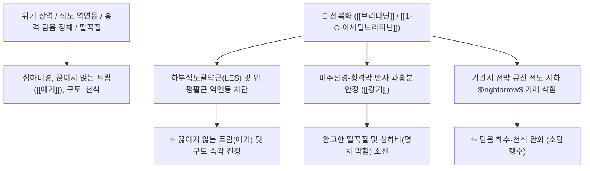

# 🌿 [[선복화]] (旋覆花, Inulae Flos / 금불초)

> **핵심 요약 (Key Summary)**:
> 국화과(*Asteraceae*) 금불초(*Inula japonica*) 또는 구아선복화의 건조한 꽃(두상화서)
> 세스퀴테르펜 락톤인 [[브리타닌]](Britannin)과 플라보노이드가 식도-위 역연동을 정상화하고 기관지 점액을 용해하여 강기·진토 및 거담 작용 발휘
> [[상한론]]의 심하비경(心下痞硬, 명치 밑이 단단하게 막힘)·애기부제(噫氣不除, 잦은 트림과 딸꾹질) 및 가래 끓는 기침(담음천해)을 치료하는 대표적인 [[강기지구]](降氣止嘔)·[[소담행수]](消痰行水) 약재

---
## 📌 목차
1. [기본 본초 정보 & 화학 구조 (Pharmacognosy)](#1-기본-본초-정보--화학-구조-pharmacognosy)
2. [핵심 분자약리 기전 & 식도 역연동 차단·거담 네트워크](#2-핵심-분자약리-기전--식도-역연동-차단거담-네트워크)
3. [해부생체역학 / 하부식도괄약근 & 횡격막 경련 연계](#3-해부생체역학--하부식도괄약근--횡격막-경련-연계)
4. [사상의학 및 임상 응용 (적응증 vs 포포 전탕법)](#4-사상의학-및-임상-응용-적응증-vs-포포-전탕법)
5. [상한론 『약징(藥徵)』 분석 및 배오 원리](#5-상한론-약징藥徵-분석-및-배오-원리)
6. [핵심 처방 비교 매트릭스](#6-핵심-처방-비교-매트릭스)
7. [출처 및 학술 참고 문헌 (References)](#7-출처-및-학술-참고-문헌-references)

---
## 1. 기본 본초 정보 & 화학 구조 (Pharmacognosy)

> [!abstract]+ 🧪 3D 약리 분자 구조 (Interactive 3D Viewer)
> <iframe src="https://molecule-viewer-rho.vercel.app/?cid=14466541" style="width: 100%; height: 600px; border: none; border-radius: 12px; box-shadow: 0 4px 20px rgba(0,0,0,0.15);" allowfullscreen></iframe>


| 항목 | 상세 내용 |
| :--- | :--- |
| **기원 식물** | 국화과(Compositae / Asteraceae) 금불초 *Inula japonica* Thunb. 또는 구아선복화 *Inula britannica* L.의 활짝 핀 꽃(두상화) |
| **성미 (性味)** | 苦·辛·鹹, 微溫 |
| **귀경 (歸經)** | 肺·脾·胃·大腸經 (폐경, 비경, 위경, 대장경) |
| **효능 (Actions)** | [[소담행수]](消痰行水), [[강기지구]](降氣止嘔), [[하기평천]](下氣平喘), [[통락산어]](通絡散瘀) |
| **주요 성분** | • **세스퀴테르펜 락톤**: [[브리타닌]] (Britannin), [[1-O-아세틸브리타닌]] (1-O-Acetylbritannin, KP 규격 $\ge 0.15\%$), 이눌로사이드(Inuloside), 알란토락톤<br>• **플라보노이드**: [[파투레틴]] (Patuletin), 루테올린, 케르세틴<br>• **정유 및 스테롤**: 타락사스테롤 |

> **[유래 및 본초학적 기전]**:
> * 꽃 모양이 둥글게 돌아가는 바퀴 형태를 닮아 '선복(旋覆)'이라 불렸습니다.
> * 위로 치밀어 오르는 담음(痰飲)과 기운을 아래로 끌어내려(降氣), 가슴 아래 뭉친 물을 몰아내고 멎지 않는 트림(애기 噫氣)과 완고한 딸꾹질을 치료합니다.

### 🔬 선복화의 세스퀴테르펜 락톤 화학 구조
```
     [ 유데스만 골격 ]───[ $\alpha$-메틸렌-$\gamma$-부티로락톤 고리 ]
             │
      1-O-아세틸브리타닌 (1-O-Acetylbritannin)
```
> **[구조적 특징 및 이완 활성]**: [[브리타닌]] 계열 화합물은 위식도 평활근의 과도한 콜린성 연축을 억제하고 염증성 사이토카인을 차단하여 역류성 식도염 및 위장관 운동 불균형을 개선합니다.

---
## 2. 핵심 분자약리 기전 & 식도 역연동 차단·거담 네트워크



### (1) 강기진토 및 횡격막 안정
* **트림 및 딸꾹질 억제 ([[강기지구]] 降逆止嘔)**:
  * 위에서 식도로 치솟는 역방향 기운을 아래로 내리고 횡격막 경련을 진정시켜 트림과 딸꾹질을 멎게 합니다.
* **담음 삭힘 및 기관지 평천 ([[소담행수]] 消痰行水)**:
  * 끈적한 가래를 용해하고 기관지 섬모 운동을 촉진하여 가래 끓는 기침을 완화합니다.

---
## 3. 해부생체역학 / 하부식도괄약근 & 횡격막 경련 연계

* **횡격막 신경(Phrenic Nerve) 흥분 완화**:
  * 완고한 신경성 딸꾹질과 위경련을 진정시킵니다.

---
## 4. 사상의학 및 임상 응용 (적응증 vs 포포 전탕법)

```
[✅ 최적 적응증 (Sweet Spot)]
• 트림 및 딸꾹질: 소화가 안 되면서 트림이 멎지 않고 끅끅거리며 딸꾹질이 지속되는 경우 ([[선복대자석탕]])
• 심하비경(心下痞硬): 명치 밑이 단단하게 뭉쳐 답답하고 메스꺼운 증상
• 담음 기침: 가래가 가슴에 가득 차서 그르렁거리고 숨이 찬 상태 ([[금불초산]])

[⚠️ 포포(包煎) 전탕 필수 수칙 (Safety)]
• 선복화 꽃받침과 화관에는 미세한 솜털(모용 毛茸)이 밀생하여, 그냥 달이면 목구멍 점막을 찔러 극심한 기침을 유발하므로 반드시 천 주머니에 싸서(포포 包煎) 달여야 함
```

---
## 5. 상한론 『약징(藥徵)』 분석 및 배오 원리

### (1) 『[[약징]]』에 나타난 선복화의 주치
> **"旋覆花 主治心下痞, 噫氣也. 旁治咳, 驚悸..."**  
> (선복화의 주치는 명치 밑이 막힌 심하비(心下痞)와 트림(噫氣)이며, 곁들여 기침과 가슴 두근거림을 치료한다.)

* **핵심 배오 원리**:
  * [[선복화]] + [[대자석]] $\rightarrow$ 치솟는 기운과 트림을 무겁게 내리누르는 불후의 명방 ([[선복대자석탕]])
  * [[선복화]] + [[반하]] + [[생강]] $\rightarrow$ 담음을 삭이고 구역질을 멎게 함

---
## 6. 핵심 처방 비교 매트릭스

| 처방명 | 구성 약재 | 주치 병증 및 임상 타깃 | 특징 및 감별점 |
| :--- | :--- | :--- | :--- |
| [[선복대자석탕]] | [[선복화]], [[대자석]], [[인삼]], [[반하]], [[생강]], [[대추|대조]], [[감초]] | **상한 후 심하비경, 애기부제(트림 멎지 않음), 구역, 오심** | 트림과 위식도 역류의 최고 명방 |
| [[금불초산]] | [[선복화]](금불초), [[전호]], [[세신]], [[마황]], [[적작약]], [[반하]] | **풍한 외감, 담천(가래 천식), 오한, 해수, 흉만** | 호흡기 담음을 삭이고 기침을 멎게 함 |
| [[선복화탕]] | [[선복화]], [[총백]], [[신강]](당귀) | **간착(肝着), 흉협창통, 가슴을 두드려야 시원한 증상** | 기혈을 뚫어 흉통 완화 |

---
## 7. 출처 및 학술 참고 문헌 (References)

1. **Bai, N., et al. (2006)**. Sesquiterpene lactones from *Inula britannica* and their anti-inflammatory and cytotoxic activities. *Journal of Natural Products*, 69(4), 531-535.
   - **[연구 요약]**: 선복화의 브리타닌 성분이 NF-κB 활성 억제를 통해 강력한 항염증 및 평활근 진경 활성을 나타냄을 규명.
2. **대한민국약전(KP) 제12개정 (2022)**. 의약품각조 제2부: 선복화 (Inulae Flos) 규격 기준.
   - **[공정서 규격]**: 건조물 기준 1-O-아세틸브리타닌($\text{C}_{19}\text{H}_{26}\text{O}_6$) 0.15% 이상 함유 필수 규격 명시.
3. **길익동동 (吉益東洞, 1784)**. 『약징(藥徵)』: 旋覆花 조문.
   - **[고전 원전]**: "旋覆花 主治心下痞, 噫氣也" - 심하비 및 트림 주치 원리 제시.
