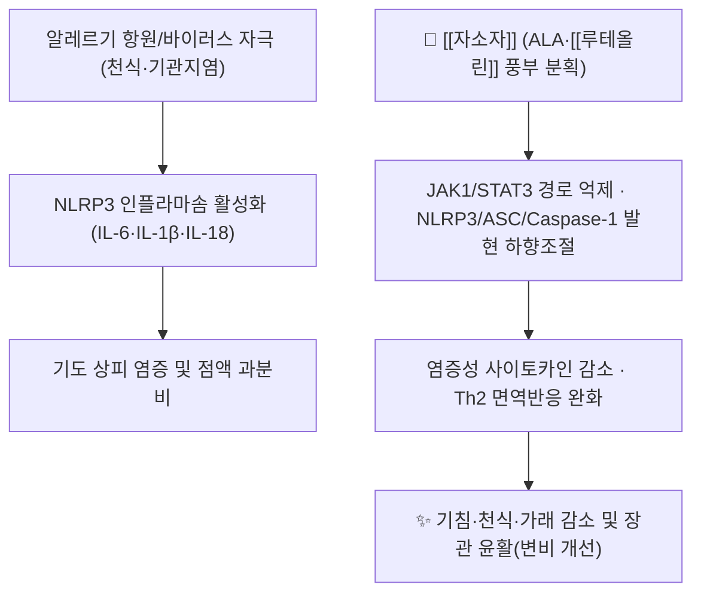

# 🌿 [[자소자]] (紫蘇子, Perillae Fructus / Perilla Seed)

> 🖼️ **이미지 규격(정본)**: `.agents\rules\이미지_가이드.md` §3.3 참조. **이미지 3장(기원식물·생약원물·지표성분 구조식) 미확보** — 자동화(정원 가꾸기) 세션 특성상 Wikimedia Commons 실사 소싱을 생략함. 작업기록 §결과에 사유 기재.

> **핵심 요약 (Key Summary)**:
> 꿀풀과(Lamiaceae) [[자소엽]] 기원식물인 차즈기(*Perilla frutescens* (L.) Britton)의 잘 익은 씨를 말린 것으로, 잎(자소엽)과 달리 **강기화담(降氣化痰)·지해평천(止咳平喘)·윤장통변(潤腸通便)**을 주효능으로 하는 별도 약용부.
> 종자유의 약 50~60%를 차지하는 [[알파-리놀렌산]](α-Linolenic acid, ALA)과 함께 [[루테올린]]·로즈마린산 등 폴리페놀이 지표 활성성분으로, NLRP3 인플라마솜·JAK1/STAT3 경로 억제를 통한 항염증·항천식 작용이 최근 연구로 확인됨.
> 담음해수(痰飮咳嗽)·상기천촉(上氣喘促)·변비를 겸한 노인·허약자의 해수천식에 응용되는 대표적 지해평천약으로, [[삼자양친탕]]·소자강기탕의 군약(君藥)으로 쓰인다.

---
## 📌 목차
1. [기본 본초 정보 & 화학 구조 (Pharmacognosy)](#1-기본-본초-정보--화학-구조-pharmacognosy)
2. [핵심 분자약리 기전 & 대사 네트워크](#2-핵심-분자약리-기전--대사-네트워크)
3. [해부생체역학 / 근육·신경 대사 연계](#3-해부생체역학--근육신경-대사-연계)
4. [사상의학 및 체질별 임상 응용 (적응증 vs 금기)](#4-사상의학-및-체질별-임상-응용-적응증-vs-금기)
5. [한의학적 고찰(유래와 특징)](#5-한의학적-고찰유래와-특징)
6. [핵심 처방 비교 매트릭스](#6-핵심-처방-비교-매트릭스)
7. [출처 및 학술 참고 문헌 (References)](#7-출처-및-학술-참고-문헌-references)

---
## 1. 기본 본초 정보 & 화학 구조 (Pharmacognosy)

| 항목 | 상세 내용 |
| :--- | :--- |
| **기원 식물** | 꿀풀과(Lamiaceae) 차즈기 *Perilla frutescens* (L.) Britton var. *frutescens* 또는 근연식물의 잘 익은 씨(과실) |
| **성미 (性味)** | 신(辛), 온(溫) |
| **귀경 (歸經)** | 폐(肺)·대장(大腸) |
| **효능 (Actions)** | 강기화담(降氣化痰)·지해평천(止咳平喘)·윤장통변(潤腸通便) — [[자소엽]](해표산한·행기관중)과 효능이 뚜렷이 구분됨 |
| **주요 성분** | • **종자유 주성분**: [[알파-리놀렌산]](ALA, 오일 중 약 50~60%), 리놀레산(34~44%), 올레산·팔미트산 등<br>• **폴리페놀 활성 성분**: [[루테올린]], 로즈마린산(Rosmarinic acid), 페릴알데히드 |
| **PubChem CID (α-리놀렌산)** | [5280934](https://pubchem.ncbi.nlm.nih.gov/compound/5280934) (C18H30O2) |
| **종자유 함량** | 씨 전체 중량의 약 41~45%가 지방유 — 아마씨유·차아씨유를 상회하는 식물성 ALA 최고 함유 오일 중 하나로 보고됨 |

### 🌿 자소엽과의 감별
* 동일 기원식물의 **잎(자소엽)과 씨(자소자)**는 KP·KHP상 별도 약재로 등재되며, 자소엽은 신온해표(辛溫解表)·행기관중(行氣寬中), 자소자는 강기화담·지해평천·윤장통변으로 효능이 뚜렷이 나뉜다.
* 종자유의 고농도 ALA(오메가-3 다가불포화지방산)가 잎에는 없는 자소자 고유의 지질 약리 활성(항염·항천식·윤장) 기반이 된다.

---
## 2. 핵심 분자약리 기전 & 대사 네트워크



### (1) 표적 수용체 및 신호전달 경로
* **NLRP3 인플라마솜·JAK1/STAT3 억제**: 자소자 종자박(seed meal)의 루테올린 풍부 분획(추출물 중 루테올린 약 248.8mg/g)이 SARS-CoV-2 스파이크 S1 단백질로 자극한 A549 폐상피세포에서 IL-6·IL-1β·IL-18·NLRP3 유전자 발현을 용량의존적으로 억제하고, JAK1/STAT3 경로를 하향조절함이 확인됨(Frontiers in Medicine 2022, DOI: 10.3389/fmed.2022.1072056).
* **항천식·면역조절**: 자소자 추출물 피하주사가 난백알부민(OVA) 유발 천식 마우스 모델에서 기도 호산구 침윤과 Th2 사이토카인(IL-4·IL-5)을 억제하고 면역글로불린 E(IgE) 반응을 조절함이 보고됨(PMID [18955277](https://pubmed.ncbi.nlm.nih.gov/18955277/)).
* **루테올린의 항염·항알레르기 작용**: 비만세포 탈과립 억제 및 류코트리엔·히스타민 유리 억제를 통한 항알레르기 기전이 규명됨(PMID [12230117](https://pubmed.ncbi.nlm.nih.gov/12230117/)).

---
## 3. 해부생체역학 / 근육·신경 대사 연계

* **기관지 평활근 및 호흡 대사**:
  * ALA 대사산물(EPA·DHA 유사 오메가-3 경로) 및 루테올린이 기관지 평활근의 과반응성을 완화하고 COX-2/5-LOX 경로를 통한 류코트리엔 생성을 억제해 천식 발작 빈도 감소에 기여하는 것으로 추정된다.
* **장관 평활근 및 배변 대사**:
  * 종자유의 지질 함량이 장관 내용물 윤활 및 연동운동을 보조하여 노인성 진액부족형 변비(潤腸通便)에 임상적으로 활용된다.

---
## 4. 사상의학 및 체질별 임상 응용 (적응증 vs 금기)

```
[✅ 최적 적응증 (Sweet Spot)]
• 담음해수(痰飮咳嗽)·상기천촉(上氣喘促)을 겸한 고령·허약 체질의 만성 기침·가래
• 노인성 진액부족형 변비를 동반한 해수·천식(윤장통변 겸용)
• 소자강기탕·삼자양친탕 등 상실하허(上實下虛) 천해(喘咳) 변증

[⚠️ 신중 투여 및 금기 (Caution / Contraindication)]
• 이제마 『동의수세보원』에 자소자의 체질 특이적 귀속이 명문화되어 있지 않아, 특정 체질 전용약으로 단정하기보다 담음·해수 변증 중심으로 변증 사용
• 기허 설사 경향 환자는 윤장 작용으로 인한 변비 완화 효과가 과할 수 있어 용량 조절 필요
• 항응고제 복용자는 ALA(오메가-3)의 항혈소판 경향 고려
```

---
## 5. 한의학적 고찰(유래와 특징)

* 『상한론』에는 자소자가 직접 등재되지 않으며, 후대 방서인 『태평혜민화제국방』의 소자강기탕(蘇子降氣湯), 『한씨의통(韓氏醫通)』의 삼자양친탕(자소자·백개자·나복자)을 통해 강기화담·지해평천약으로 정착되었다.
* **핵심 배오의 묘미**:
  * [[자소자]] + [[반하]]·[[후박]] → 담음 상역(上逆)으로 인한 흉민(胸悶)·해천 완화(소자강기탕 골격)
  * [[자소자]] + [[백개자]]·[[나복자]] → 삼자양친탕, 노인 담다해수(痰多咳嗽)의 대표 배오
  * [[자소자]] + [[행인]]·[[욱리인]] 등 윤장 종자류 → 진액부족형 변비 겸증 해소

---
## 6. 핵심 처방 비교 매트릭스

| 처방명 | 구성 약재 | 주치 병증 및 임상 타깃 | 특징 및 감별점 |
| :--- | :--- | :--- | :--- |
| **[[삼자양친탕]]** | 자소자, 백개자, 나복자 | 노인 담다해수(痰多咳嗽)·식체 겸증 | 씨앗 3종 배오, 용량 소(小)·완만한 강기화담 |
| **소자강기탕** | 자소자(군약), 반하, 전호, 후박, 당귀, 육계, 감초 | 상실하허(上實下虛)의 천해·흉민 | 상부 담음 실증과 하부 신허(腎虛)를 함께 다스리는 냉면허천(冷面虛喘) 대표방 |
| **[[정천탕]]** | 마황, 행인, 백과, 자소자 가감 등 | 담음 해천(咳喘), 기관지 천식 | 마황 배오로 발산력이 강해 실증 위주, 자소자는 보조적 강기 역할 |

---
* **양약 상호작용 (Herb–Drug Interaction)**:
  * **출혈 위험** — ALA(오메가-3) 함량으로 인한 항혈소판 경향 가능성. 항응고제(와파린·DOAC)·아스피린 병용 시 모니터링 권고.
  * **지질강하제 병용** — 오메가-3 계열 보충제와 유사하게 중성지방 강하 상가 효과 가능, 스타틴 병용 시 특이 상호작용 보고는 제한적.
  * **위장관 자극** — 다량 복용 시 지방유 함량으로 인한 연변·복부팽만 가능, 설사 경향자 감량.

## 7. 출처 및 학술 참고 문헌 (References)

1. **Dissook S et al. (2022)**. Luteolin-rich fraction from Perilla frutescens seed meal inhibits spike glycoprotein S1 of SARS-CoV-2-induced NLRP3 inflammasome lung cell inflammation via regulation of JAK1/STAT3 pathway: A potential anti-inflammatory compound against inflammation-induced long-COVID. *Frontiers in medicine*. 2022;9:1072056. [PMID 36698809](https://pubmed.ncbi.nlm.nih.gov/36698809/) · DOI: [10.3389/fmed.2022.1072056](https://www.frontiersin.org/journals/medicine/articles/10.3389/fmed.2022.1072056/full)
   - **[연구 요약]**: 자소자 종자박 루테올린 풍부 분획이 A549 폐상피세포에서 Spike S1 유발 NLRP3 인플라마솜·JAK1/STAT3 경로를 용량의존적으로 억제, long-COVID 관련 폐염증에 대한 잠재적 항염 후보물질로 제시.
2. **Yim YK et al. (2010)**. Anti-inflammatory and immune-regulatory effects of subcutaneous Perillae Fructus extract injections on OVA-induced asthma in mice. *Evidence-based complementary and alternative medicine*. 2010;7(1):79-86. [PMID 18955277](https://pubmed.ncbi.nlm.nih.gov/18955277/)
   - **[연구 요약]**: OVA 유발 천식 마우스에서 자소자 추출물 피하주사가 기도 호산구 침윤·Th2 사이토카인·IgE 반응을 억제함을 확인.
3. **Ueda H, Yamazaki C, Yamazaki M (2002)**. Luteolin as an anti-inflammatory and anti-allergic constituent of Perilla frutescens. *Biological & pharmaceutical bulletin*. 2002;25(9):1197-1202. [PMID 12230117](https://pubmed.ncbi.nlm.nih.gov/12230117/)
   - **[연구 요약]**: 자소 식물 유래 루테올린이 비만세포 탈과립 및 염증 매개체 유리를 억제하는 항알레르기 기전을 규명.
4. **Bondioli P, Folegatti L, Rovellini P (2020)**. Oils rich in alpha linolenic acid: chemical composition of perilla (Perilla frutescens) seed oil. *OCL - Oilseeds and fats, Crops and Lipids*. 2020;27:67. [OCL 2020, 27, 67](https://www.ocl-journal.org/articles/ocl/full_html/2020/01/ocl200104/ocl200104.html)
   - **[연구 요약]**: 자소자 종자유의 ALA 함량이 약 60%로 아마씨유·차아씨유 대비 높은 오메가-3 공급원임을 지방산 조성 분석으로 확인, 종자유 함량 41~45%.
5. **한무(韓懋, 明代)**. 『한씨의통(韓氏醫通)』 — 삼자양친탕.
   - **[고전 원전]**: 자소자·백개자·나복자 배오로 노인 담다해수를 치료하는 배오 원리 기록.

> 검증 메모 (2026-10-03): PubMed·발행처 대조 결과, 출처 1의 저자를 "Chomchalow N"으로 적었으나 실제 저자는 "Dissook S et al."(Front Med 2022;9:1072056, PMID 36698809)이므로 교정하였다. 출처 2의 저자 "Kim SH"·연도 "2009"는 실제 "Yim YK et al."(Evid Based Complement Alternat Med 2010;7(1):79-86)과 달라 "Yim YK et al. (2010)"으로 교정하였다. 출처 3의 저자 목록에 누락된 "Yamazaki C"를 보완하고 서지(저널·권·페이지)를 추가하였다. 출처 4의 저자 "Bruni R, Guerrini A"·문헌번호 "27, 4"는 실제 "Bondioli P, Folegatti L, Rovellini P"·"27:67"과 달라 교정하였다.
