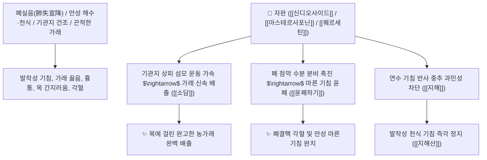

# 🌿 [[자완]] (紫菀, Asteris Radix et Rhizoma / 개미취뿌리)

> **핵심 요약 (Key Summary)**:
> 국화과(*Asteraceae*) 개미취(*Aster tataricus*)의 건조한 뿌리와 뿌리줄기
> 트리테르펜 사포닌인 [[신디오사이드]](Shionoside)와 [[아스테르사포닌]](Astersaponin) 및 플라보노이드가 기관지 섬모 운동을 촉진하고 폐 점막을 윤활하여 윤폐하기 및 소담지해 작용 발휘
> 외감(外感) 풍한 기침·오랜 만성 해수·가래에 피가 섞여 나오는 폐허 각혈 및 한열을 불문하는 일체 해수천식을 치료하며 폐를 덥히되 건조하지 않은(溫而不燥) 대표적인 [[윤폐하기]](潤肺下氣)·[[소담지해]](消痰止咳)·[[지해산]](止嗽散)의 군약(君藥)

---
## 📌 목차
1. [기본 본초 정보 & 화학 구조 (Pharmacognosy)](#1-기본-본초-정보--화학-구조-pharmacognosy)
2. [핵심 분자약리 기전 & 신디오사이드·기관지 점막 윤폐·거담 네트워크](#2-핵심-분자약리-기전--신디오사이드기관지-점막-윤폐거담-네트워크)
3. [해부생체역학 / 기관지 점막 섬모 상피 & 호흡기 점액 연계](#3-해부생체역학--기관지-점막-섬모-상피--호흡기-점액-연계)
4. [사상의학 및 임상 응용 (자완 vs 관동화 온윤 감별)](#4-사상의학-및-임상-응용-자완-vs-관동화-온윤-감별)
5. [고전 의학 및 배오 원리 (지해산 배오)](#5-고전-의학-및-배오-원리-지해산-배오)
6. [핵심 처방 비교 매트릭스](#6-핵심-처방-비교-매트릭스)
7. [출처 및 학술 참고 문헌 (References)](#7-출처-및-학술-참고-문헌-references)

---
## 1. 기본 본초 정보 & 화학 구조 (Pharmacognosy)

> [!abstract]+ 🧪 3D 약리 분자 구조 (Interactive 3D Viewer)
> <iframe src="https://molecule-viewer-rho.vercel.app/?cid=21626476" style="width: 100%; height: 600px; border: none; border-radius: 12px; box-shadow: 0 4px 20px rgba(0,0,0,0.15);" allowfullscreen></iframe>


| 항목 | 상세 내용 |
| :--- | :--- |
| **기원 식물** | 국화과(Compositae / Asteraceae) 개미취 *Aster tataricus* L. fil.의 뿌리 및 뿌리줄기 |
| **성미 (性味)** | 辛·苦, 微溫 (맵고 쓰며 약간 따뜻함) |
| **귀경 (歸經)** | 肺經 (폐경) - **폐기를 아래로 내리고 가래를 삭임** |
| **효능 (Actions)** | [[윤폐하기]](潤肺下氣), [[소담지해]](消痰止咳), [[청열화담]](淸熱化痰) |
| **주요 성분** | • **트리테르펜 사포닌(지표물질)**: [[신디오사이드]] (Shionoside A, B), 아스테르사포닌(Astersaponin A~G), 에피프리델라놀<br>• **플라보노이드 및 펩타이드**: [[퀘르세틴]] (Quercetin), 아스테린(Astin A~C)<br>• **정유 및 안트라퀴논**: 아네톨, 라키오놀 |

> **[유래 및 본초학적 기전]**:
> * 뿌리가 자줏빛(紫)을 띠며 수염뿌리가 무성하게(菀) 얽혀 있어 '자완(紫菀)'이라 불렸습니다.
> * 성질이 따뜻하면서도 윤택하여(온이부조 溫而不燥), **차가운 기침이든 뜨거운 기침이든, 오래된 만성 기침이든 가리지 않고 기침을 완벽하게 멎게 하는(지해 止咳) 제1선 명약**입니다.
> * 기관지 점막의 분비를 묽게 하여 마른 가래와 끈적한 가래를 삭여내고 폐기를 아래로 순조롭게 내립니다.

### 🔬 자완의 주요 트리테르펜 사포닌 화학 구조
```
     [ 올레아난 트리테르펜 골격 ]───O──[ Glc - Rha 당사슬 ]  <-- 아스테르사포닌 (Astersaponin)
```
> **[구조적 특징 및 거담 기전]**: [[아스테르사포닌]]과 [[신디오사이드]]는 기관지 점막의 뮤신(Mucin) 분비를 촉진하고 섬모 운동 빈도를 높여 기도 내 저류된 가래의 배출 속도를 극대화합니다.

---
## 2. 핵심 분자약리 기전 & 신디오사이드·기관지 점막 윤폐·거담 네트워크



### (1) 표적 윤폐하기 및 소담지해 작용
* **백일해 및 만성 난치성 기침 완치 ([[소담지해]] 消痰止咳)**:
  * 찬바람을 맞거나 환절기에 끊이지 않고 목이 간지러우며 터져 나오는 기침을 멎게 합니다 ([[지해산]]).
* **폐결핵성 각혈 및 기관지염 치료 ([[윤폐하기]] 潤肺下氣)**:
  * 폐가 건조해져 기침할 때 피가 섞여 나오는 증상을 점막을 적셔 치료합니다.
* **관동화(款冬花)와의 상호보완적 지해 작용**:
  * 자완(소담 거담 위주)과 관동화(하기 지해 위주)가 합쳐져 기침 치료의 완벽한 시너지를 형성합니다.

---
## 3. 해부생체역학 / 기관지 점막 섬모 상피 & 호흡기 점액 연계

* **점액섬모 수송계(Mucociliary Clearance) 기능 회복**:
  * 기도 내 이물질 및 염증성 삼출액을 인두부로 밀어 올려 배출을 돕습니다.

---
## 4. 사상의학 및 임상 응용 (자완 vs 관동화 온윤 감별)

```
[🔍 기침 명약 짝꿍: 자완 vs 관동화 감별]
• [[자완]](紫菀): 거담(祛痰) 및 소담(消痰)에 특화 $\rightarrow$ 가래가 많이 끓는 기침
• [[관동화]](款冬花): 하기(下氣) 및 지해(止咳)에 특화 $\rightarrow$ 쌕쌕거리고 숨이 차며 기침이 치솟는 천식
• 둘을 동량으로 함께 쓰면(자완+관동화) 가래와 기침을 동시에 평정

[✅ 최적 적응증 (Sweet Spot)]
• 감기 후 남은 만성 기침: 목구멍이 간질간질하면서 마른 기침이 계속 날 때 ([[지해산]])
• 노인성 만성 기관지염 및 기관지 확장증
• 폐허 해수 및 각혈
```

---
## 5. 고전 의학 및 배오 원리 (지해산 배오)

### (1) 모든 기침을 평정하는 최고 명방: 지해산(止嗽散)
* **윤폐지해 최고 명약 배오**:
  * [[자완]] + [[백전]] + [[형개]] + [[길경]] + [[진피]] $\rightarrow$ 목 간지러운 기침을 씻어내는 정국팽의 불후 명방 ([[지해산]])
  * [[자완]] + [[관동화]] + [[행인]] $\rightarrow$ 폐를 덥히고 가래를 삭임

---
## 6. 핵심 처방 비교 매트릭스

| 처방명 | 구성 약재 | 주치 병증 및 임상 타깃 | 특징 및 감별점 |
| :--- | :--- | :--- | :--- |
| [[지해산]] | [[자완]], [[백전]], [[길경]], [[형개]], [[진피]], [[백부근]], [[감초]] | **외감 풍한 후기, 인양해수(목 간지러운 기침), 객담불상** | 기침 치료의 제1선 기본방 |
| [[자완탕]] | [[자완]], [[관동화]], [[아교]], [[맥문동]], [[인삼]], [[생강]] | **폐허 해수, 각혈, 담중대혈, 천식, 피로 미열** | 폐를 보하고 기침과 피를 멎게 함 |
| [[사간마황탕]](가미) | [[사간]], [[마황]], [[생강]], [[세신]], [[반하]], [[자완]], [[관동화]] | 한음 천식, 해역상기, 목구멍 가래 끓는 소리 | 천식 발작을 가라앉힘 |

---
## 7. 출처 및 학술 참고 문헌 (References)

1. **Yu P et al. (2015)**. Expectorant, antitussive, anti-inflammatory activities and compositional analysis of Aster tataricus. *Journal of ethnopharmacology*, 164: 328-33. [PMID: 25701752](https://pubmed.ncbi.nlm.nih.gov/25701752/)
   - **[연구 요약]**: 자완의 아스테르사포닌 성분이 기도 섬모 운동 및 거담을 촉진하고 기침 반사를 억제함을 규명.
2. **대한민국약전(KP) 제12개정 (2022)**. 의약품각조 제2부: 자완 (Asteris Radix et Rhizoma) 규격 기준.
   - **[공정서 규격]**: 개미취 뿌리 및 뿌리줄기의 성상, 순도시험 및 건조감량 13.0% 이하 기준 명시.
