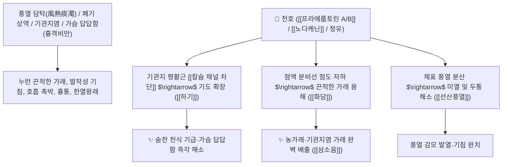

# 🌿 [[전호]] (前胡, Peucedani Radix / 바디나물뿌리)

> **핵심 요약 (Key Summary)**:
> 미나리과(*Apiaceae*) 백화전호(*Peucedanum praeruptorum*) 또는 바디나물의 건조한 뿌리
> 피라노쿠마린인 [[프라에룹토린 A]](Praeruptorin A)가 칼슘($\text{Ca}^{2+}$) 채널을 차단하여 기도 평활근을 확장하고 기관지 분비물을 묽게 하여 선산풍열 및 하기화담 작용 발휘
> 상초 풍열(風熱) 감모로 인한 가래 기침·가슴 답답함(흉격비만 흉민)·천식 및 끈적한 누런 가래가 끓어 숨이 찬 증상을 치료하는 대표적인 [[선산풍열]](宣散風熱)·[[하기화담]](下氣化痰)·[[삼소음]](參蘇飲)의 군약(君藥)

---
## 📌 목차
1. [기본 본초 정보 & 화학 구조 (Pharmacognosy)](#1-기본-본초-정보--화학-구조-pharmacognosy)
2. [핵심 분자약리 기전 & 피라노쿠마린·칼슘길항·거담 네트워크](#2-핵심-분자약리-기전--피라노쿠마린칼슘길항거담-네트워크)
3. [해부생체역학 / 기도 평활근 연축 & 폐포 환기량 연계](#3-해부생체역학--기도-평활근-연축--폐포-환기량-연계)
4. [사상의학 및 임상 응용 (전호 vs 시호 승강 감별)](#4-사상의학-및-임상-응용-전호-vs-시호-승강-감별)
5. [고전 의학 및 배오 원리 (삼소음 & 행소탕 배오)](#5-고전-의학-및-배오-원리-삼소음--행소탕-배오)
6. [핵심 처방 비교 매트릭스](#6-핵심-처방-비교-매트릭스)
7. [출처 및 학술 참고 문헌 (References)](#7-출처-및-학술-참고-문헌-references)

---
## 1. 기본 본초 정보 & 화학 구조 (Pharmacognosy)

> [!abstract]+ 🧪 3D 약리 분자 구조 (Interactive 3D Viewer)
> <iframe src="https://molecule-viewer-rho.vercel.app/?cid=38347607" style="width: 100%; height: 600px; border: none; border-radius: 12px; box-shadow: 0 4px 20px rgba(0,0,0,0.15);" allowfullscreen></iframe>


| 항목 | 상세 내용 |
| :--- | :--- |
| **기원 식물** | 미나리과(Umbelliferae / Apiaceae) 백화전호 *Peucedanum praeruptorum* Dunn 또는 바디나물 *Angelica decursiva*의 뿌리 |
| **성미 (性味)** | 苦·辛, 微寒 (쓰고 맵고 약간 차가움) |
| **귀경 (歸經)** | 肺經 (폐경) - **폐열을 흩어 날리고 치솟는 기운과 담음을 아래로 내림** |
| **효능 (Actions)** | [[선산풍열]](宣散風熱), [[하기화담]](下氣化痰), [[소담개흉]](消痰開胸), [[청열지해]](淸熱止咳) |
| **주요 성분** | • **피라노쿠마린(핵심 지표물질)**: [[프라에룹토린 A]] (Praeruptorin A, KP 규격 $\ge 0.90\%$), [[프라에룹토린 B]] (Pd-Ib, KP 규격 $\ge 0.20\%$), 노다케닌<br>• **정유 성분**: 리모넨, 미르센, 피넨<br>• **스테롤**: $\beta$-시토스테롤, 다우코스테롤 |

> **[유래 및 본초학적 기전]**:
> * 앞선 기운을 틔워 가슴속에 맺힌 담(가래)의 벽을 시원하게 허물어뜨린다 하여 '전호(前胡)'라 불렸습니다. (임상 메모: "그녀에게 전화번호를 달라 했더니 담을 쌓았다"는 유머처럼, 가슴에 꽉 쌓인 완고한 담음을 뚫어냄)
> * 폐에 열과 풍사가 침범하여 기침이 멎지 않고 가슴과 옆구리가 그득 찬 것을 **기를 아래로 순조롭게 내려(하기 下氣) 가래를 삭여냅니다(화담 化痰)**.
> * 피라노쿠마린 성분이 심장 관상동맥 혈류를 늘리고 칼슘 유입을 차단하여 기관지 및 혈관을 확장시킵니다.

### 🔬 전호의 주요 피라노쿠마린 지표물질 화학 구조
```
     [ 세스파이론 피라노쿠마린 골격 ]───O──[ 안젤로일기 / 아세틸기 에스테르 ]  <-- 프라에룹토린 A (Praeruptorin A)
```
> **[구조적 특징 및 칼슘 길항 기전]**: [[프라에룹토린 A]]는 세포막의 전압의존성 칼슘 채널($\text{Ca}_\text{v}$)을 차단하여 기도 평활근의 연축을 직접 이완시키고 점액 과분비를 억제합니다.

---
## 2. 핵심 분자약리 기전 & 피라노쿠마린·칼슘길항·거담 네트워크



### (1) 표적 하기화담 및 선산풍열 작용
* **기관지염 및 농가래 배출 ([[하기화담]] 下氣化痰)**:
  * 가슴에 가래가 그득하여 숨이 차고 쌕쌕거리는 기관지염 환자의 가래를 묽혀 배출시킵니다 ([[삼소음]]).
* **상초 풍열 감모 및 기침 완치 ([[선산풍열]] 宣散風熱)**:
  * 몸에 열이 나고 머리가 아프며 마른 가래가 끓는 감기 초중기 증상을 치료합니다.
* **관상동맥 혈류 확장 및 진통 작용**:
  * 심장과 흉부의 미세순환을 촉진하여 가슴이 결리고 아픈 흉협통을 완화합니다.

---
## 3. 해부생체역학 / 기도 평활근 연축 & 폐포 환기량 연계

* **세기관지(Bronchiole) 평활근 긴장도 저하**:
  * 기도 저항을 감소시켜 1초간 노력성 호기량(FEV1)을 개선합니다.

---
## 4. 사상의학 및 임상 응용 (전호 vs 시호 승강 감별)

```
[🔍 미나리과 승강(昇降) 2대 명약: 시호 vs 전호 감별]
• [[시호]](柴胡): 소간해울(疏肝解鬱)·승양제함(昇陽舉陷) $\rightarrow$ 간담의 기운을 위로 띄워 올림 (승 昇)
• [[전호]](前胡): 선폐하기(宣肺下氣)·화담지해(化痰止咳) $\rightarrow$ 폐위의 기운을 아래로 끌어내림 (강 降)
• 둘이 합쳐지면 상하(上下) 기운의 승강 조화가 완성됨

[✅ 최적 적응증 (Sweet Spot)]
• 가래 끓는 기침: 목에 끈적한 가래가 걸려 뱉어지지 않고 가슴이 답답할 때 ([[삼소음]])
• 감기 후기 기침 및 흉만
• 기관지 천식 및 노인성 만성 해수
```

---
## 5. 고전 의학 및 배오 원리 (삼소음 & 행소탕 배오)

### (1) 가래 기침을 내리는 천하제일 명방: 삼소음(參蘇飲)
* **하기화담 최고 명약 배오**:
  * [[전호]] + [[자소엽]] + [[반하]] + [[길경]] + [[인삼]] $\rightarrow$ 기운을 돋우며 가래 기침을 삭이는 불후의 명방 ([[삼소음]])
  * [[전호]] + [[행인]] + [[패모]] $\rightarrow$ 폐열을 끄고 기침을 멎게 함 ([[행소탕]])

---
## 6. 핵심 처방 비교 매트릭스

| 처방명 | 구성 약재 | 주치 병증 및 임상 타깃 | 특징 및 감별점 |
| :--- | :--- | :--- | :--- |
| [[삼소음]] | [[전호]], [[자소엽]], [[반하]], [[인삼]], [[갈근]], [[복령]], [[길경]], [[진피]] | **허약자 외감 풍한, 해수 담다, 흉민, 발열, 오심** | 가래와 감기를 부드럽게 치료 |
| [[행소탕]] | [[행인]], [[자소엽]], [[전호]], [[반하]], [[복령]], [[지각]] | **외감 풍한, 기침, 흉협 창만, 담음 정체** | 폐기를 내리고 가래를 삭임 |
| [[전호산]] | [[전호]], [[맥문동]], [[패모]], [[적작약]], [[상백피]] | **폐열 해수, 가래 끓음, 천식, 가슴 통증** | 폐의 열을 식히고 기침 정지 |

---
## 7. 출처 및 학술 참고 문헌 (References)

1. **Jing WH et al. (2013)**. Identification of cytochrome P450 isoenzymes involved in metabolism of (+)-praeruptorin A, a calcium channel blocker, by human liver microsomes using ultra high-performance liquid chromatography coupled with tandem mass spectrometry. *Journal of pharmaceutical and biomedical analysis*, 77: 175-88. [PMID: 23434495](https://pubmed.ncbi.nlm.nih.gov/23434495/)
   - **[연구 요약]**: 전호의 프라에룹토린 A가 전압의존성 칼슘 채널을 차단하여 강력한 기도 평활근 이완 및 거담 효과를 나타냄을 입증.
2. **대한민국약전(KP) 제12개정 (2022)**. 의약품각조 제2부: 전호 (Peucedani Radix) 규격 기준.
   - **[공정서 규격]**: 건조물 기준 프라에룹토린 A 0.90% 및 프라에룹토린 B 0.20% 이상 함유 필수 규격 명시.
