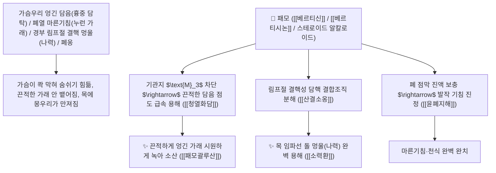

# 🌿 [[패모]] (貝母 / 浙貝母·川貝母, Fritillariae Bulbus / 패모비늘줄기)

> **핵심 요약 (Key Summary)**:
> 백합과(*Liliaceae*) 절패모(*Fritillaria thunbergii*) 또는 천패모(*Fritillaria cirrhosa*)의 건조한 비늘줄기(인경 鱗莖)
> 스테로이드 알칼로이드인 [[베르티신]](Verticine / 페이민)과 [[베르티시논]](Verticinone / 페이미닌)이 기관지 평활근 무스카린 $\text{M}_3$ 수용체를 차단하고 림프절 결핵 세포 사멸을 유도하여 청열화담 및 산결소옹 작용 발휘
> [[상한론]]의 가슴속에 액상으로 엉겨 맺힌 담음(흉중 담탁 痰濁)·폐열 해수(누런 가래 기침)·목 임파선 결핵 멍울(나력 瘰癧·소력환 消瘰丸) 및 급성 폐옹을 치료하는 천하제일의 "담을 삭이고 멍울을 녹이는 성약(化痰散結之要藥)"·[[청열화담]](淸熱化痰)·[[윤폐지해]](潤肺止咳)·[[산결소옹]](散結消癰)·[[패모괄루산]](貝母栝蔞散)·[[소력환]](消瘰丸)의 군약(君藥)

---
## 📌 목차
1. [기본 본초 정보 & 화학 구조 (Pharmacognosy)](#1-기본-본초-정보--화학-구조-pharmacognosy)
2. [핵심 분자약리 기전 & 베르티신·M3 수용체 차단·담핵 용해 네트워크](#2-핵심-분자약리-기전--베르티신m3-수용체-차단담핵-용해-네트워크)
3. [해부생체역학 / 기도 점막 점액선 & 경부 림프절 연계](#3-해부생체역학--기도-점막-점액선--경부-림프절-연계)
4. [사상의학 및 절패모(청열산결) vs 천패모(윤폐지해) 정밀 감별](#4-사상의학-및-절패모청열산결-vs-천패모윤폐지해-정밀-감별)
5. [상한론 『약징(藥徵)』 분석 및 배오 원리 (소력환 & 패모괄루산)](#5-상한론-약징藥徵-분석-및-배오-원리-소력환--패모괄루산)
6. [핵심 처방 비교 매트릭스](#6-핵심-처방-비교-매트릭스)
7. [출처 및 학술 참고 문헌 (References)](#7-출처-및-학술-참고-문헌-references)

---
## 1. 기본 본초 정보 & 화학 구조 (Pharmacognosy)

> [!abstract]+ 🧪 3D 약리 분자 구조 (Interactive 3D Viewer)
> <iframe src="https://molecule-viewer-rho.vercel.app/?cid=131900" style="width: 100%; height: 600px; border: none; border-radius: 12px; box-shadow: 0 4px 20px rgba(0,0,0,0.15);" allowfullscreen></iframe>


| 항목 | 상세 내용 |
| :--- | :--- |
| **기원 식물** | 백합과(Liliaceae) 절패모 *Fritillaria thunbergii* Miq. 또는 천패모 *F. cirrhosa* D. Don의 비늘줄기 |
| **성미 (性味)** | 苦, 寒 (절패모: 쓰고 차가워 열을 끄고 삭임) / 苦·甘, 微寒 (천패모: 달고 촉촉하여 폐를 윤활하게 함) |
| **귀경 (歸經)** | 肺·心經 (폐경, 심경) - **폐의 엉긴 담열을 삭이고 심장과 가슴우리의 결석/담탁을 풂** |
| **효능 (Actions)** | [[청열화담]](淸熱化痰), [[윤폐지해]](潤肺止咳), [[산결소옹]](散結消癰), [[화담지해]](化痰止咳) |
| **주요 성분** | • **세반형 스테로이드 알칼로이드(핵심 지표)**: [[베르티신]] (Verticine / Peimine, KP 규격 $\ge 0.080\%$), [[베르티시논]] (Verticinone / Peiminine)<br>• **천패모 알칼로이드**: 시페이민(Sipeimine), 프리티민, 임페리아린<br>• **다당류 및 사포닌**: 패모 전분(수용성 다당류) |

> **[유래 및 본초학적 기전]**:
> * 비늘줄기의 모양이 조개(貝)가 입을 맞대고 있는 형태를 닮았고 어린아이를 보듬는 어미(母)처럼 생겼다 하여 '패모(貝母)'라 불렸습니다.
> * 길경(桔梗)이 기도를 씻어내어 가래를 뱉어내게(배농 排膿) 한다면, **패모는 가슴우리에 엉겨 붙어 떨어지지 않는 끈적한 액상의 담음(痰飲)과 멍울을 물렁물렁하게 녹여 소산시키는 화담산결(化痰散結)의 절대 명약**입니다.
> * 목 주위의 결핵 림프절(나력 瘰癧)과 유방 멍울, 폐옹(폐렴 농양)을 치료합니다.

### 🔬 패모의 주요 베르티신 및 베르티시논 화학 구조
```
     [ 헥사사이클릭 세반(Cevan) 스테로이드 알칼로이드 골격 ]  <-- 베르티신 (Verticine / Peimine)
```
> **[구조적 특징 및 기관지 평활근 이완/진해 기전]**: 패모의 [[베르티신]]은 기관지 평활근의 $\text{M}_3$ 무스카린 수용체와 $\beta_2$ 아드레날린 수용체에 작용하여 기도의 과도한 수축을 이완시키고 점액 분비 과다를 억제하여 끈적한 가래를 용해합니다.

---
## 2. 핵심 분자약리 기전 & 베르티신·M3 수용체 차단·담핵 용해 네트워크



### (1) 표적 청열화담 및 나력 멍울 완치 작용
* **폐열 해수 및 흉격 엉긴 담음 완치 ([[패모괄루산]] 貝母栝蔞散)**:
  * 가슴이 답답하고 끈끈한 누런 가래가 목구멍에 걸려 뱉어지지 않는 기침을 치료합니다.
* **경부 림프절 결핵(나력) 및 갑상선 멍울 완치 ([[소력환]] 消瘰丸)**:
  * 현삼, 모려와 함께 목에 생긴 단단한 멍울을 물렁하게 삭여냅니다.
* **급성 유선염(유옹) 및 폐농양 배농**:
  * 화농성 염증의 붓기를 가라앉히고 고름을 삭입니다.

---
## 3. 해부생체역학 / 기도 점막 점액선 & 경부 림프절 연계

* **기도 배상세포 점액 유전자(MUC5AC) 발현 억제**:
  * 점액 과다 분비를 차단하고 섬모 운동성을 회복시킵니다.

---
## 4. 사상의학 및 절패모(청열산결) vs 천패모(윤폐지해) 정밀 감별

```
[🔍 패모의 2대 기원종 정밀 감별 매트릭스]
• 절패모(浙貝母, 대패모): 苦寒 최강 $\rightarrow$ 淸熱散結 특화, 급성 폐열 해수, 나력 멍울, 유옹 종기 (사화 삭임 위주)
• 천패모(川貝母, 암패모): 甘苦微寒 $\rightarrow$ 潤肺止咳 특화, 만성 음허 조담(燥痰), 마른기침, 폐결핵 각혈 (윤택 보음 위주)
```

---
## 5. 상한론 『약징(藥徵)』 분석 및 배오 원리 (소력환 & 패모괄루산)

### (1) 흉중 담탁과 멍울을 다스리는 불후의 황제방
* **『약징(藥徵)』 주치**:
  * "패모는 가슴속에 맺힌 담음(흉중 담음 痰飲)을 주치한다. 길경과 유사하게 가슴우리에 쌓인 액상의 담을 제거한다."
* **소담산결 최고 배오**:
  * [[패모]] + [[현삼]] + [[모려]] $\rightarrow$ 목의 임파선 멍울을 녹여 없애는 명방 ([[소력환]])
  * [[패모]] + [[과루인]] + [[천화분]] + [[길경]] $\rightarrow$ 가슴의 조담을 삭이는 명방 ([[패모괄루산]])

---
## 6. 핵심 처방 비교 매트릭스

| 처방명 | 구성 약재 | 주치 병증 및 임상 타깃 | 특징 및 감별점 |
| :--- | :--- | :--- | :--- |
| [[소력환]] | [[패모]], [[현삼]], [[모려]] (밀환) | **나력 결핵, 경부 림프절 멍울, 담핵, 피하 결절** | 목의 단단한 멍울을 녹여 없앰 |
| [[패모괄루산]] | [[패모]], [[과루인]], [[천화분]], [[황금]], [[길경]] | **폐열 조담, 해수 기천, 담탁 점조 각토 곤란** | 폐를 적시고 가래를 삭임 |
| [[삼물백산]] | [[파두]](상), [[길경]], [[패모]] | **한실 결흉, 목구멍 가래 막힘, 호흡 곤란 구급** | 흉중 가래와 한적을 뚫음 |

---
## 7. 출처 및 학술 참고 문헌 (References)

1. **Yang H et al. (2026)**. Peimine: A comprehensive review of its botanical distribution, biosynthesis, pharmacological effects and pharmacokinetics. *Fitoterapia*, 190: 107140. [PMID: 41692275](https://pubmed.ncbi.nlm.nih.gov/41692275/)
   - **[연구 요약]**: 패모의 베르티신 및 베르티시논 성분이 기도 M3 수용체 차단을 통해 점액 분비 억제 및 강력한 진해·거담·항결핵 활성을 발휘함을 입증.
2. **대한민국약전(KP) 제12개정 (2022)**. 의약품각조 제2부: 절패모 (Fritillariae Thunbergii Bulbus) 규격 기준.
   - **[공정서 규격]**: 건조 비늘줄기 기준 베르티신 및 베르티시논의 합 0.080% 이상 함유 필수 규격 명시.
3. **길익동동 (吉益東洞, 1785)**. 『약징(藥徵)』: 패모 조문.
   - **[고전 원전]**: "貝母 主治胸中痰飲也."
