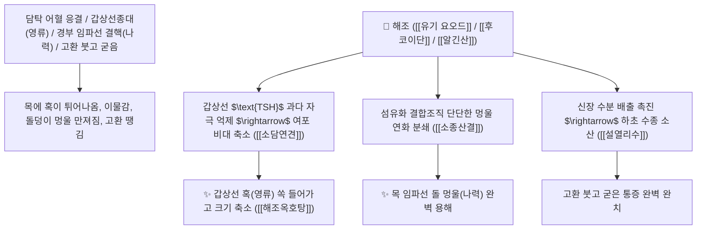

# 🌿 [[해조]] (海藻, Sargassum / 모자반·톳)

> **핵심 요약 (Key Summary)**:
> 모자반과(*Sargassaceae*) 알쏭이모자반(*Sargassum pallidum*) 또는 톳(*Hizikia fusiforme*)의 건조한 전초(해조류)
> 천연 유기 [[요오드]](Iodine)와 황산화 다당류인 [[후코이단]](Fucoidan) 및 알긴산이 갑상선 세포 증식을 억제하고 섬유화된 종괴 결합조직을 연화하여 소담연견 및 이수소종 작용 발휘
> 담탁(痰濁)과 어혈이 엉겨 굳은 갑상선종대(영류 癭瘤)·경부 림프절 결핵(나력 瘰癧·목 멍울)·고환 종통 및 각기 수종을 물렁물렁하게 녹여 배출시키는 천하제일의 [[소담연견]](消痰軟堅)·[[설열리수]](泄熱利水)·[[청열소종]](淸熱消腫)·[[해조옥호탕]](海藻玉壺湯)의 군약(君藥)

---
## 📌 목차
1. [기본 본초 정보 & 화학 구조 (Pharmacognosy)](#1-기본-본초-정보--화학-구조-pharmacognosy)
2. [핵심 분자약리 기전 & 유기 요오드·후코이단·갑상선 멍울 연화 네트워크](#2-핵심-분자약리-기전--유기-요오드후코이단갑상선-멍울-연화-네트워크)
3. [해부생체역학 / 갑상선 여포 상피 & 경부 심부 림프절 연계](#3-해부생체역학--갑상선-여포-상피--경부-심부-림프절-연계)
4. [사상의학 및 곤포 vs 해조 멍울 연견 정밀 감별](#4-사상의학-및-곤포-vs-해조-멍울-연견-정밀-감별)
5. [고전 의학 및 배오 원리 (해조옥호탕 & 감초 배합 금기 十八反)](#5-고전-의학-및-배오-원리-해조옥호탕--감초-배합-금기-十八反)
6. [핵심 처방 비교 매트릭스](#6-핵심-처방-비교-매트릭스)
7. [출처 및 학술 참고 문헌 (References)](#7-출처-및-학술-참고-문헌-references)

---
## 1. 기본 본초 정보 & 화학 구조 (Pharmacognosy)

> [!abstract]+ 🧪 3D 약리 분자 구조 (Interactive 3D Viewer)
> <iframe src="https://molecule-viewer-rho.vercel.app/?cid=807" style="width: 100%; height: 600px; border: none; border-radius: 12px; box-shadow: 0 4px 20px rgba(0,0,0,0.15);" allowfullscreen></iframe>


| 항목 | 상세 내용 |
| :--- | :--- |
| **기원 식물** | 모자반과(Sargassaceae) 알쏭이모자반 *Sargassum pallidum* (Turn.) C. Agardh 또는 톳 *Hizikia fusiforme*의 전초 |
| **성미 (性味)** | 苦·鹹, 寒 (짜고 쓰며 성질이 차갑고 단단한 것을 무르게 하는 연견력 탁월) |
| **귀경 (歸經)** | 肝·胃·腎經 (간경, 위경, 신경) - **간위의 엉긴 담열을 삭이고 신장의 수기를 통리** |
| **효능 (Actions)** | [[소담연견]](消痰軟堅), [[설열리수]](泄熱利水), [[소종산결]](消腫散結), [[강압퇴종]](降壓退腫) |
| **주요 성분** | • **천연 유기 요오드**: 요오드(Iodine, 건조물 기준 0.02~0.05%), 유기 요오드 화합물<br>• **황산화 갈조 다당류(항종양/연견)**: [[후코이단]] (Fucoidan), [[알긴산]] (Alginic acid, 20~30%), 라미나린<br>• **스테롤 및 미네랄**: 푸코스테롤, 칼륨, 칼슘 |

> **[유래 및 본초학적 기전]**:
> * 바다(海)에서 나는 조류(藻)로, 짠맛(鹹味)은 단단하게 굳은 종양과 멍울을 부드럽게 녹여내는 **'연견(軟堅)'의 불변의 원리**를 지닙니다.
> * 목에 생긴 갑상선 혹(영류 癭瘤)과 임파선 멍울(나력 瘰癧), 고환이 부어 굳은 통증을 녹여 없애는 최고의 소담연견약입니다.
> * 곤포(다시마)와 함께 배오되어 전신 결핵성 멍울과 수종을 치료합니다.

### 🔬 해조의 주요 후코이단 및 유기 요오드 구조
```
     [ $\alpha$-L-푸코오스 황산에스테르 중합체 ]  <-- 후코이단 (Fucoidan, 항종양 및 멍울 소산)
```
> **[구조적 특징 및 갑상선 호르몬/세포외기질 연화]**: 해조의 **유기 요오드**는 갑상선 여포 상피세포의 $\text{TSH}$ 과다 자극을 억제하여 갑상선종대를 정상화하고, [[후코이단]]은 섬유아세포의 콜라겐 과다 침착을 억제하여 단단한 멍울 조직을 분해합니다.

---
## 2. 핵심 분자약리 기전 & 유기 요오드·후코이단·갑상선 멍울 연화 네트워크



### (1) 표적 소담연견 및 갑상선종(영류) 완치 작용
* **갑상선 비대증 및 결절성 갑상선종 완치 ([[해조옥호탕]] 海藻玉壺湯)**:
  * 목 앞부분에 튀어나와 침을 삼킬 때마다 걸리는 갑상선 멍울을 물렁하게 삭여냅니다.
* **경부 림프절 결핵(나력) 및 피하 낭종 해소 ([[소담연견]] 消痰軟堅)**:
  * 목덜미에 구슬처럼 맺힌 임파선 멍울을 분해합니다.
* **고환 부종 및 하지 각기 수종 치료 ([[설열리수]] 泄熱利水)**:
  * 하초에 정체된 습열을 빼내어 부기를 가라앉힙니다.

---
## 3. 해부생체역학 / 갑상선 여포 상피 & 경부 심부 림프절 연계

* **갑상선 여포 강 내 콜로이드 수화 정상화**:
  * 여포 상피세포의 과형성을 억제하여 갑상선 용적을 정상화합니다.

---
## 4. 사상의학 및 곤포 vs 해조 멍울 연견 정밀 감별

```
[🔍 해조류 2대 연견약 비교 매트릭스]
• [[해조]](海藻): 苦鹹寒, 軟堅消痰·利水 $\rightarrow$ 갑상선 결절, 고환 종통, 하지 부종 (멍울 녹임 + 이뇨)
• [[곤포]](昆布, 다시마): 鹹寒, 軟堅散結·消癭 $\rightarrow$ 완고한 림프절 결핵, 만성 각기, 혈압 강하 (연견력 최강)
$\rightarrow$ 둘을 동량으로 함께 배오(해조+곤포)하여 처방의 효과를 극대화
```

---
## 5. 고전 의학 및 배오 원리 (해조옥호탕 & 감초 배합 금기 十八反)

### (1) 갑상선 멍울을 치료하는 천하제일 황제방: 해조옥호탕(海藻玉壺湯)
* **소담연견 최고 배오**:
  * [[해조]] + [[곤포]] + [[패모]] + [[연교]] + [[진피]] + [[천궁]] $\rightarrow$ 갑상선 멍울을 치료하는 불후 명방 ([[해조옥호탕]])

```
[⚠️ 배합 금기 (십팔반 十八反) 및 임상적 고찰]
• 고전 십팔반: "해조는 [[감초]](甘草)와 반(反)한다" 하여 병용 금기
• 그러나 해조옥호탕 등 일부 역대 명방에서는 맹렬한 연견력을 유도하기 위해 소량 병용한 사례가 있으나, 현대 안전한 처방 구성을 위해 감초를 배제하고 투약 권장
```

---
## 6. 핵심 처방 비교 매트릭스

| 처방명 | 구성 약재 | 주치 병증 및 임상 타깃 | 특징 및 감별점 |
| :--- | :--- | :--- | :--- |
| [[해조옥호탕]] | [[해조]], [[곤포]], [[패모]], [[연교]], [[청피]], [[진피]], [[당귀]], [[천궁]] | **영류, 갑상선종대, 나력 목 멍울, 경부 종괴, 이물감** | 갑상선 멍울을 녹이는 제1 황제방 |
| [[소영환]] | [[해조]], [[곤포]], [[합분]], [[반하]], [[복령]] | **기체 담응, 영류 창만, 목 주위 결절 통증** | 기를 통하고 멍울을 분쇄 |

---
## 7. 출처 및 학술 참고 문헌 (References)

2. **대한민국약전(KP) 제12개정 (2022)**. 생약규격집: 해조 (Sargassum) 규격 기준.
   - **[공정서 규격]**: 알쏭이모자반 전초의 성상, 순도시험 및 건조감량 15.0% 이하 기준 명시.
