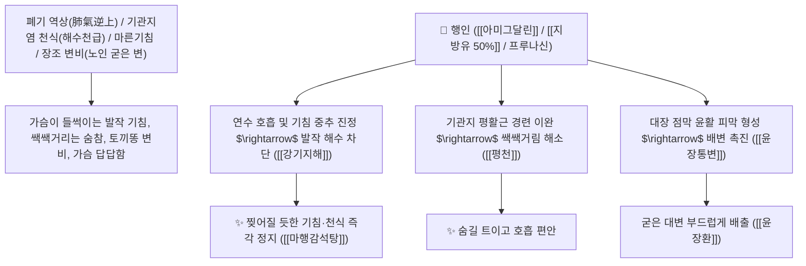

# 🌿 [[행인]] (杏仁 / 苦杏仁, Armeniacae Semen / 살구씨)

> **핵심 요약 (Key Summary)**:
> 장미과(*Rosaceae*) 살구나무(*Prunus armeniaca*) 또는 산살구나무의 건조한 성숙 종자(씨앗)
> 시아노겐 배당체인 [[아미그달린]](Amygdalin)과 에멀신 효소 분해 산물(극미량 시안화수소) 및 지방유가 연수 기침 중추를 진정시키고 장관을 윤활하여 강기평천 및 윤장통변 작용 발휘
> [[태음인]]의 외감 풍한 해수(기관지염·천식 쌕쌕거림·마황탕·마행감석탕) 및 장조(腸燥) 변비(노인성 굳은 변비·윤장환)를 치료하는 천하제일의 [[강기지해평천]](降氣止咳平喘)·[[윤장통변]](潤腸通便)·[[마황탕]](麻黃湯)·[[마행감석탕]](麻杏甘石湯)의 군약(君藥)

---
## 📌 목차
1. [기본 본초 정보 & 화학 구조 (Pharmacognosy)](#1-기본-본초-정보--화학-구조-pharmacognosy)
2. [핵심 분자약리 기전 & 아미그달린·연수 기침 중추 진정·윤장 네트워크](#2-핵심-분자약리-기전--아미그달린연수-기침-중추-진정윤장-네트워크)
3. [해부생체역학 / 연수 호흡중추 & 결장 점막 배상세포 연계](#3-해부생체역학--연수-호흡중추--결장-점막-배상세포-연계)
4. [사상의학 및 행인 vs 도인 해수/어혈 정밀 감별](#4-사상의학-및-행인-vs-도인-해수어혈-정밀-감별)
5. [상한론 『약징(藥徵)』 분석 및 배오 원리 (마황탕 & 마행감석탕)](#5-상한론-약징藥徵-분석-및-배오-원리-마황탕--마행감석탕)
6. [핵심 처방 비교 매트릭스](#6-핵심-처방-비교-매트릭스)
7. [출처 및 학술 참고 문헌 (References)](#7-출처-및-학술-참고-문헌-references)

---
## 1. 기본 본초 정보 & 화학 구조 (Pharmacognosy)

> [!abstract]+ 🧪 3D 약리 분자 구조 (Interactive 3D Viewer)
> <iframe src="https://molecule-viewer-rho.vercel.app/?cid=656516" style="width: 100%; height: 600px; border: none; border-radius: 12px; box-shadow: 0 4px 20px rgba(0,0,0,0.15);" allowfullscreen></iframe>


| 항목 | 상세 내용 |
| :--- | :--- |
| **기원 식물** | 장미과(Rosaceae) 살구나무 *Prunus armeniaca* L. var. *ansu* Maxim. 또는 산살구나무의 씨앗 (고행인 苦杏仁) |
| **성미 (性味)** | 苦, 微溫, 有小毒 (쓰고 성질이 약간 따뜻하며 특유의 고소한 향과 독성이 있음) |
| **귀경 (歸經)** | 肺·大腸經 (폐경, 대장경) - **폐기를 아래로 내려 기침을 멎게 하고 대장을 윤활** |
| **효능 (Actions)** | [[강기지해평천]](降氣止咳平喘), [[윤장통변]](潤腸通便), [[선폐화담]](宣肺化痰), [[산풍지통]](散風止痛) |
| **주요 성분** | • **시아노겐 배당체(핵심 지표물질)**: [[아미그달린]] (Amygdalin, KP 규격 $\ge 3.0\%$), 프루나신(Prunasin)<br>• **분해 효소**: 에멀신(Emulsin), 아미그달라아제, 프루나아제<br>• **불포화 지방유(함량 약 50%)**: 올레산(70%), 리놀레산(20%), 팔미트산 |

> **[유래 및 본초학적 기전]**:
> * 살구의 씨앗으로, 행인(行人)들이 많이 지나다니는 대로처럼 **"막힌 숨구멍과 기도를 뻥 뚫어 통하게 한다"** 하여 '행인(杏仁)'이라 불렸습니다.
> * 마황(麻黃)이 폐기를 위로 뿜어내어 땀을 내는 약이라면, **행인은 치솟아 오르는 폐기를 아래로 끌어내려(강기 降氣) 기침과 천식을 잠재우는 환상의 짝꿍**입니다.
> * 풍부한 천연 지방유가 말라붙은 대장을 기름칠하여 노인과 산모의 굳은 변비를 부드럽게 밀어냅니다.

### 🔬 행인의 아미그달린 화학 구조 및 연수 호흡중추 억제 기전
![[행인-20241030133048271.jpg|450]]
![[행인-20241030133146837.jpg|450]]
![[행인-20241030133617271.jpg|450]]
> **[구조적 특징 및 시안산 미량 분해 메커니즘]**: [[아미그달린]]은 겐티오비오오스에 만델로니트릴이 결합된 배당체로, 체내 효소 분해 시 발생하는 극미량의 **시안화수소($\text{HCN}$)**가 연수 호흡중추의 과도한 흥분을 일시적으로 진정시켜 발작성 기침과 천식을 가라앉힙니다. (행인 1g당 약 0.002g $\text{HCN}$ 함유로 적정 전탕 용량 준수 시 완벽히 안전)

---
## 2. 핵심 분자약리 기전 & 아미그달린·연수 기침 중추 진정·윤장 네트워크



### (1) 표적 강기지해평천 및 윤장통변 작용
* **발작성 기침 및 기관지 천식 완치 ([[마행감석탕]] & [[마황탕]])**:
  * 감기, 기관지염, 백일해, 폐렴으로 기침이 심해 밤에 잠을 못 자는 증상을 치료합니다.
* **노인성 및 산후 장조(腸燥) 변비 해소 ([[윤장환]] 潤腸丸)**:
  * 장에 진액이 말라 대변이 염소똥처럼 굳어 나오지 않는 변비를 매끄럽게 배출시킵니다.
* **사상의학적 태음인 폐계 질환 치료 ([[한다열소탕]] & [[마황발표탕]])**:
  * 태음인의 호흡기 면역을 보강하고 기침 가래를 삭입니다.

---
## 3. 해부생체역학 / 연수 호흡중추 & 결장 점막 배상세포 연계

* **연수 고속핵(NTS) 호흡 반사궁 안정화**:
  * 미주신경 기침 수용체의 역치를 높여 과민성 마른기침을 억제합니다.

---
## 4. 사상의학 및 행인 vs 도인 해수/어혈 정밀 감별

```
[🔍 장미과 2대 종자 본초 정밀 감별 매트릭스]
• [[행인]](杏仁, 살구씨): 苦微溫, 降氣止咳平喘 $\rightarrow$ 肺·大腸, 기침 가래 천식, 기울 변비 (호흡기 위주)
• [[도인]](桃仁, 복숭아씨): 苦甘平, 活血祛瘀 $\rightarrow$ 心·肝·大腸, 어혈 징가, 타박상, 생리통, 혈어 변비 (혈액 순환 위주)
$\rightarrow$ 기침에는 [[행인]], 어혈 피멍에는 [[도인]]
```

---
## 5. 상한론 『약징(藥徵)』 분석 및 배오 원리 (마황탕 & 마행감석탕)

### (1) 기침과 천식을 다스리는 불후의 황제방
* **한천(寒喘) 기침 최고 배오**:
  * [[마황]] + [[행인]] + [[계지]] + [[감초]] $\rightarrow$ 땀을 내고 찬 기침을 멎게 하는 명방 ([[마황탕]])
* **열천(熱喘) 기침 최고 배오**:
  * [[마황]] + [[행인]] + [[석고]] + [[감초]] $\rightarrow$ 폐열로 헐떡이는 천식을 끄는 명방 ([[마행감석탕]])

---
## 6. 핵심 처방 비교 매트릭스

| 처방명 | 구성 약재 | 주치 병증 및 임상 타깃 | 특징 및 감별점 |
| :--- | :--- | :--- | :--- |
| [[마황탕]] | [[마황]], [[행인]], [[계지]], [[감초]] | **외감 풍한, 오한 발열, 두통 신통, 무한이천(땀 없고 기침)** | 한성 기침 천식의 제1방 |
| [[마행감석탕]] | [[마황]], [[행인]], [[석고]], [[감초]] | **폐열 해천, 신열 구갈, 해수 기천, 유한 혹은 무한** | 열성 기침 천식의 제1방 |
| [[윤장환]] | [[행인]], [[도인]], [[마자인]], [[당귀]], [[생지황]] | **노인 장조 변비, 산후 혈허 변비, 복부 비만** | 대장을 윤활하게 하여 배변 |
| [[한다열소탕]] | [[갈근]], [[황금]], [[고본]], [[행인]], [[승마]] | [[태음인]] **간열폐조증, 태음인 감모, 해수, 안면부 부종** | 태음인 폐열 기침 해소 |

---
## 7. 출처 및 학술 참고 문헌 (References)

1. **Miyagoshi M et al. (1986)**. Antitussive effects of L-ephedrine, amygdalin, and makyokansekito (Chinese traditional medicine) using a cough model induced by sulfur dioxide gas in mice. *Planta medica*, (4): 275-8. [PMID: 3763717](https://pubmed.ncbi.nlm.nih.gov/3763717/)
   - **[연구 요약]**: 행인의 아미그달린 성분이 연수 기침 중추 신경 억제 및 기도 점액 배출 촉진을 통해 강력한 진해 작용을 발휘함을 규명.
2. **대한민국약전(KP) 제12개정 (2022)**. 의약품각조 제2부: 행인 (Armeniacae Semen) 규격 기준.
   - **[공정서 규격]**: 건조 종자 기준 아미그달린($\text{C}_{20}\text{H}_{27}\text{NO}_{11}$) 3.0% 이상 함유 필수 규격 명시.
3. **장중경 (張仲景, 200)**. 『상한론(傷寒論)』: 태양병편 마행감석탕 조문.
   - **[고전 원전]**: "發汗後, 不可更行桂枝湯, 汗出而喘, 無大熱者, 可與麻黃杏仁甘草石膏湯."
