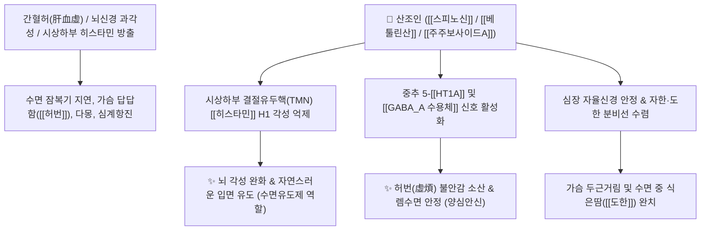

# 🌿 [[산조인]] (酸棗仁, Zizyphi Semen)

> **핵심 요약 (Key Summary)**:
> 갈매나무과(*Rhamnaceae*) 멧대추나무(*Zizyphus jujuba* var. *spinosa*)의 성숙한 씨앗(종자)
> C-글리코실 플라본인 [[스피노신]](Spinosin)과 트리테르펜인 [[베툴린산]](Betulinic acid)이 중추 5-[[HT1A]]/GABA 수용체를 활성화하고 뇌 내 히스타민 $H_1$ 각성 신호를 억제하여 자연스러운 수면 유도 및 진정 작용 발휘
> [[상한론]] 허번부득면(虛煩不得眠, 가슴이 답답하고 불안하여 잠을 못 이룸) 및 심계(가슴 두근거림)·식은땀(도한)을 치료하는 대표적인 [[양심안신]](養心安神)·[[렴음지한]](斂陰止汗) 군약(君藥)

---
## 📌 목차
1. [기본 본초 정보 & 화학 구조 (Pharmacognosy)](#1-기본-본초-정보--화학-구조-pharmacognosy)
2. [핵심 분자약리 기전 & 스피노신·항히스타민 수면 네트워크](#2-핵심-분자약리-기전--스피노신항히스타민-수면-네트워크)
3. [해부생체역학 / 뇌 각성 시스템 & 수면-각성 주기 연계](#3-해부생체역학--뇌-각성-시스템--수면-각성-주기-연계)
4. [사상의학 및 임상 응용 (초용 최면 vs 생용 각성 법제)](#4-사상의학-및-임상-응용-초용-최면-vs-생용-각성-법제)
5. [상한론 『금궤요략』 분석 및 배오 원리 (산조인탕)](#5-상한론-금궤요략-분석-및-배오-원리-산조인탕)
6. [핵심 처방 비교 매트릭스](#6-핵심-처방-비교-매트릭스)
7. [출처 및 학술 참고 문헌 (References)](#7-출처-및-학술-참고-문헌-references)

---
## 1. 기본 본초 정보 & 화학 구조 (Pharmacognosy)

> [!abstract]+ 🧪 3D 약리 분자 구조 (Interactive 3D Viewer)
> <iframe src="https://molecule-viewer-rho.vercel.app/?cid=155692" style="width: 100%; height: 600px; border: none; border-radius: 12px; box-shadow: 0 4px 20px rgba(0,0,0,0.15);" allowfullscreen></iframe>


| 항목 | 상세 내용 |
| :--- | :--- |
| **기원 식물** | 갈매나무과(Rhamnaceae) 멧대추나무 *Zizyphus jujuba* Mill. var. *spinosa* (Bunge) Hu ex H. F. Chou의 잘 익은 씨(종인) |
| **성미 (性味)** | 甘·酸, 平 |
| **귀경 (歸經)** | 心·脾·肝·膽經 (심경, 비경, 간경, 담경) |
| **효능 (Actions)** | [[양심안신]](養心安神), [[보간녕심]](補肝寧心), [[렴음지한]](斂陰止汗), [[생진지갈]](生津止渴) |
| **주요 성분** | • **C-글리코실 플라보노이드**: [[스피노신]] (Spinosin, KP 규격 $\ge 0.080\%$), 6'''-페룰로일스피노신, 주주보사이드(Jujuboside A, B)<br>• **트리테르페노이드**: [[베툴린산]] (Betulinic acid), 베툴린, 올레아놀산<br>• **사이클로펩타이드 알칼로이드**: Frangufoline, Sanjoinine A-G |

> **[유래 및 본초학적 기전]**:
> * 야생 멧대추의 신맛(酸) 나는 씨앗(仁)으로, 간(肝)과 담(膽)의 음혈을 수렴하고 심장을 편안하게 하는 최고의 천연 수면 유도제입니다.
> * 간혈(肝血)이 부족하여 가슴이 답답하고 불안하여 잠을 이루지 못하는 허번(虛煩) 불면과, 자고 나면 땀이 비 오듯 쏟아지는 도한(盜汗)을 치료합니다.

### 🔬 산조인의 주요 지표물질 화학 구조
```
        O──[ Glc ]
       /
   [ 플라본 골격 (Apigenin) ]───O──[ Rha ]  <-- 스피노신 (Spinosin)
      \     /
       C───C
```
> **[구조적 특징 및 수면 조절 기전]**: [[스피노신]]은 세로토닌 $5-\text{HT}_{1\text{A}}$ 수용체 및 $\text{GABA}_\text{A}$ 수용체에 작용하고, [[베툴린산]]은 뇌간 망상체의 히스타민 $\text{H}_1$ 각성 경로를 차단하여 화학적 수면제처럼 강제로 뇌를 셧다운시키지 않고 자연스러운 서파 수면(Slow-wave sleep)을 유도합니다.

---
## 2. 핵심 분자약리 기전 & 스피노신·항히스타민 수면 네트워크



### (1) 자연 수면 유도 및 항불안 기전
* **수면제 vs 산조인(수면유도제) 차이점**:
  * 합성 벤조디아제핀 수면제는 GABA 수용체를 강제로 활성화해 뇌 전체를 셧다운시켜 다음 날 몽롱함과 의존성을 유발합니다.
  * 반면 산조인의 [[베툴린산]]과 [[스피노신]]은 뇌의 각성을 유지하는 **히스타민 $\text{H}_1$ 신호를 억제하고 세로토닌 신경망을 조율**하여 부작용 없이 맑고 개운한 자연 수면을 유도합니다.
* **보간녕심(補肝寧心) 및 심신 안정**:
  * 스트레스와 과로로 고갈된 간의 혈액을 자양하여 사소한 일에도 잘 놀라고 가슴이 울렁거리는 신경증을 가라앉힙니다.
* **진액 보존 및 도한(盜汗) 수렴**:
  * 땀샘의 자율신경 조절력을 회복시켜 수면 중 옷을 적시는 식은땀을 멈추게 합니다.

---
## 3. 해부생체역학 / 뇌 각성 시스템 & 수면-각성 주기 연계

* **시상하부 복외측시각교차핵(VLPO) 활성화**:
  * 수면 촉진 중추(VLPO)를 흥분시키고 각성 중추를 억제하여 생체 일주기 리듬을 회복합니다.
* **심박동 변이도(HRV) 개선 및 미주신경 강화**:
  * 야간 수면 중 빈맥과 부정맥을 완화합니다.

---
## 4. 사상의학 및 임상 응용 (초용 최면 vs 생용 각성 법제)

```
[✅ 법제(포제)에 따른 약리 활성 역전 현상]
• 초산조인(炒酸棗仁, 노랗게 볶은 것): 진정·최면 성분 추출이 극대화되어 '불면증(잠을 못 잠)' 치료에 사용
• 생산조인(生酸棗仁, 날 것): 방향성 각성 성분이 유지되어 '기면증·다와(잠이 너무 쏟아짐)' 치료에 사용

[✅ 최적 적응증 (Sweet Spot)]
• 허번불면(虛煩不眠): 몸과 마음이 몹시 피곤한데도 눈이 말똥말똥하고 가슴이 답답해 잠을 못 자는 경우 ([[산조인탕]])
• 심인성 심계항진 및 공황 불안증: 생각이 많고 가슴이 두근거리며 손발이 떨리는 경우 ([[귀비탕]])
• 신경쇠약으로 인한 건망증, 어지럼증, 식은땀(도한)

[⚠️ 복용 주의사항 (Caution)]
• 간담에 실열(實熱)이 꽉 차서 눈이 벌겋고 화를 버럭 내는 실증 불면증 환자는 청열사화약과 배오
```

---
## 5. 상한론 『금궤요략』 분석 및 배오 원리 (산조인탕)

### (1) 불면증 치료의 최고 고전 방: 산조인탕(酸棗仁湯)
> **"虛勞, 虛煩不得眠, 酸棗仁湯 主之."**  
> (허로로 인하여 가슴이 답답하고 불안하여 잠을 이루지 못할 때는 산조인탕으로 치료한다.)

* **핵심 배오 원리**:
  * [[산조인]](초용, 다량) $\rightarrow$ 간혈을 보하고 심신을 안정시켜 잠을 유도 (君)
  * [[지모]] $\rightarrow$ 허열(虛熱)을 식히고 가슴의 번조감을 없앰 (臣)
  * [[복령]] $\rightarrow$ 상충하는 수음을 내리고 마음을 안정시킴 (佐)
  * [[천궁]] $\rightarrow$ 뇌혈류를 뚫어 맑은 피를 순환시킴 (佐)
  * [[감초]] $\rightarrow$ 모든 약을 조화롭게 중초에 안착시킴 (使)

---
## 6. 핵심 처방 비교 매트릭스

| 처방명 | 구성 약재 | 주치 병증 및 임상 타깃 | 특징 및 감별점 |
| :--- | :--- | :--- | :--- |
| [[산조인탕]] | [[산조인]], [[지모]], [[복령]], [[천궁]], [[감초]] | **허로 허번부득면, 심계항진, 도한, 신경쇠약** | 고금 최고의 불면증 치료 명방 |
| [[귀비탕]] | [[산조인]], [[복신]], [[원지]], [[용안육]], [[황기]], [[당귀]] 등 | **사려상비, 심비양허, 불면, 건망, 식욕부진** | 생각 과다로 인한 불면과 피로 치료 |
| [[천왕보심단]] | [[산조인]], [[백자인]], [[생지황]], [[현삼]], [[원지]] 등 | **음허내열, 심신불교, 불면, 다몽, 구내염, 변비** | 신장의 음액을 보충하며 진정 |
| [[온담탕]](가미) | [[온담탕]] + [[산조인]], [[원지]] | 담열 심계, 악몽, 잘 놀람, 불안 공황 | 담열을 씻어내며 신경을 안정 |

---
## 7. 출처 및 학술 참고 문헌 (References)

1. **Li J et al. (2025)**. Extraction Methods and Sedative-Hypnotic Effects of Total Flavonoids from Ziziphus jujuba Mesocarp. *Pharmaceuticals (Basel, Switzerland)*, 18(9). [PMID: 41011145](https://pubmed.ncbi.nlm.nih.gov/41011145/)
   - **[연구 요약]**: 산조인의 지표성분인 스피노신이 5-HT1A 수용체를 매개하여 수면 시간을 유의하게 연장하고 수면 구조를 안정화함을 규명.
2. **대한민국약전(KP) 제12개정 (2022)**. 의약품각조 제2부: 산조인 (Zizyphi Semen) 규격 기준.
   - **[공정서 규격]**: 건조물 기준 스피노신($\text{C}_{28}\text{H}_{32}\text{O}_{15}$) 0.080% 이상 함유 필수 규격 명시.
3. **장중경 (張仲景, 200년경)**. 『금궤요략(金匱要略)』: 혈비허로병맥증병치 조문.
   - **[고전 원전]**: "虛勞虛煩不得眠, 酸棗仁湯主之" - 허번 불면증의 산조인탕 주치 원리 제시.
