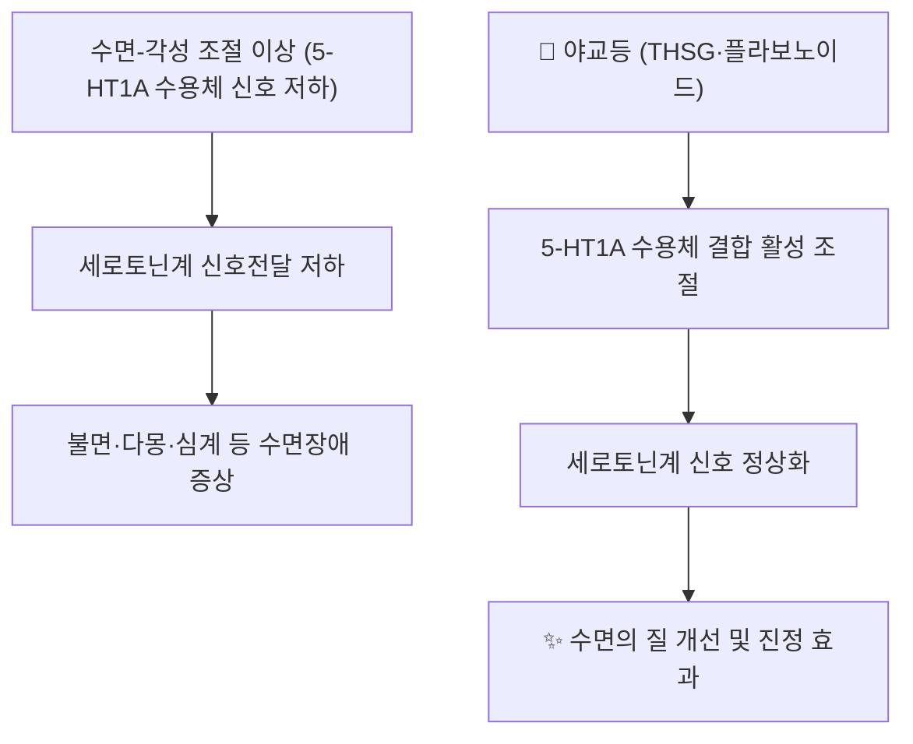

# 🌿 [[야교등]] (夜交藤, Polygoni Multiflori Caulis / Ye Jiao Teng)

> **핵심 요약 (Key Summary)**:
> 마디풀과(Polygonaceae) 하수오 *Polygonum multiflorum* Thunb.(이명 *Fallopia multiflora*, *Reynoutria multiflora*)의 덩굴성 줄기(藤莖)를 건조한 것으로, 뿌리(하수오, 何首烏)와는 동일 기원식물이나 약용 부위가 다른 별도 생약입니다.
> 중국약전 공식 지표성분인 [[THSG]](2,3,5,4′-테트라하이드록시스틸벤-2-O-β-D-글루코사이드)와 안트라퀴논([[에모딘]], [[피시온]]), 플라보노이드 성분이 수면 관련 수용체(5-HT1A) 및 항산화·항염 경로를 조절하여 분자약리 효과 발휘.
> [[상한론]] 이후 후대 본초서의 [[양심안신]](養心安神), [[거풍통락]](祛風通絡)을 대표하는 안신약(安神藥)으로, 심혈허(心血虛)로 인한 불면·다몽·심계와 풍습으로 인한 사지 마목·관절통을 치료하는 한의학적 효능을 가짐.

---
## 📌 목차
1. [기본 본초 정보 & 화학 구조 (Pharmacognosy)](#1-기본-본초-정보--화학-구조-pharmacognosy)
2. [핵심 분자약리 기전 & 대사 네트워크](#2-핵심-분자약리-기전--대사-네트워크)
3. [해부생체역학 / 근육·신경 대사 연계](#3-해부생체역학--근육신경-대사-연계)
4. [사상의학 및 체질별 임상 응용 (적응증 vs 금기)](#4-사상의학-및-체질별-임상-응용-적응증-vs-금기)
5. [한의학적 고찰(유래와 특징)](#5-한의학적-고찰유래와-특징)
6. [핵심 처방 비교 매트릭스](#6-핵심-처방-비교-매트릭스)
7. [출처 및 학술 참고 문헌 (References)](#7-출처-및-학술-참고-문헌-references)

---
## 1. 기본 본초 정보 & 화학 구조 (Pharmacognosy)
> [!abstract]+ 🧪 핵심 지표성분 3D 분자 구조 (Interactive 3D Viewer)
> <iframe src="https://molecule-viewer-rho.vercel.app/?cid=5321884" width="100%" height="450px" frameborder="0" allow="webgl" style="border-radius: 8px;"></iframe>

| 항목 | 상세 내용 |
| :--- | :--- |
| **기원 식물** | 마디풀과(Polygonaceae) 하수오 *Polygonum multiflorum* Thunb.의 덩굴성 줄기(藤莖) — 뿌리(하수오, 何首烏)와 동일 기원식물, 약용 부위만 다름(⚠️ 두 부위는 화학 성분 함량비가 상이하므로 혼동 주의) |
| **성미 (性味)** | 甘, 平 (달고 성질이 평함) |
| **귀경 (歸經)** | 心·肝經 (심경, 간경) |
| **효능 (Actions)** | [[양심안신]](養心安神), [[거풍통락]](祛風通絡), 지양(止痒, 외용 시) |
| **주요 성분** | • **지표 성분**: [[THSG]](2,3,5,4′-테트라하이드록시스틸벤-2-O-β-D-글루코사이드, 중국약전 공식 지표)<br>• **안트라퀴논류**: [[에모딘]] (Emodin), [[피시온]] (Physcion)<br>• **유효 활성 성분군**: 다이안트론 배당체(Dianthrone glycosides), 플라보노이드(퀘르세틴 배당체 등) |
| **PubChem CID** | [5321884](https://pubchem.ncbi.nlm.nih.gov/compound/5321884) (THSG 기준) |

### 🔬 주요 지표물질 화학 구조
> **[구조적 특징 및 활성]**: THSG는 스틸벤(stilbene) 골격에 포도당이 O-배당체 형태로 결합한 구조로, 하수오속 식물의 항산화·신경보호 활성과 밀접하게 연관되는 것으로 보고됩니다. 정확한 THSG 함량(%)은 산지·가공 방식에 따라 편차가 크며, 이번 조사에서 KP(대한민국약전) 규격상의 구체적 기준 함량 수치는 확인하지 못해 ⚠️ 확인 필요로 표기합니다.

---
## 2. 핵심 분자약리 기전 & 대사 네트워크



### (1) 5-HT1A 수용체 표적 신호전달 경로
* 야교등(안식향과 배오한 처방 조합 연구)에서 고정화 5-HT1A 수용체 크로마토그래피 기법으로 항불면 활성 화합물을 동정·검증한 최신 연구가 보고되어, 세로토닌 5-HT1A 수용체 결합이 야교등의 진정·수면 개선 효과의 핵심 분자 표적 중 하나로 제시됨(PMID 41325769).
### (2) 항산화·항염 대사 조절
* THSG·에모딘 등 지표 성분이 항산화·항염 활성을 나타냄이 하수오속 전반의 리뷰에서 보고되나, 야교등(줄기)만을 대상으로 한 인체 임상 항산화 데이터는 검색 범위 내에서 확인하지 못해 ⚠️ 확인 필요로 표기합니다(PMID 25449462, 26130933).

---
## 3. 해부생체역학 / 근육·신경 대사 연계

* **신경계 조절**:
  * 5-HT1A 수용체 경유 세로토닌계 신호전달 조절을 통한 수면-각성 주기 정상화(PMID 41325769).
* **근육·관절 대사**:
  * 전통적으로 [[거풍통락]] 효능을 통해 풍습으로 인한 사지 마목(麻木)·관절통에 활용되어 왔으나, 이에 대한 현대 분자약리 기전 문헌은 이번 조사 범위 내에서 확인하지 못해 ⚠️ 확인 필요로 표기합니다.

---
## 4. 사상의학 및 체질별 임상 응용 (적응증 vs 금기)

```
[✅ 최적 적응증 (Sweet Spot)]
• 심혈허(心血虛)로 인한 불면·다몽·심계·건망 (안신정지환·천왕보심단류 배오)
• 간양상항(肝陽上亢)형 고혈압에 동반된 두통·어지럼증·불면 ([[천마구등음]] 배오)
• 풍습으로 인한 전신 마목·관절통

[⚠️ 신중 투여 및 금기 (Caution / Contraindication)]
• 체질별 세부 적응증·금기에 대한 구체적 임상 문헌은 이번 조사 범위 내에서 확인하지 못해 ⚠️ 확인 필요로 표기합니다.
• 하수오 뿌리(何首烏)의 간독성 이슈가 널리 보고되어 있으나(PMID 33485980), 줄기(야교등)에 동일 수준의 간독성 위험이 있는지는 근거가 상이하므로 임상 적용 시 개별 확인 권고.
```

---
## 5. 한의학적 고찰(유래와 특징)

* **명칭 유래**: '밤에 서로 얽힌다(夜交)'는 뜻으로, 하수오 덩굴이 밤에 서로 감기는 생태적 특성에서 유래한 이름이며, 이 상서로운 생태적 이미지가 안신(安神) 효능과 연결되어 전통적으로 활용되어 왔습니다.
* **배오의 묘미**:
  * [[야교등]] + [[산조인]] → 심혈허 불면 강화 (안신 효능 상승)
  * [[야교등]] + [[천마]]·[[구등]] → 간양상항 고혈압·두통·어지럼증 치료 ([[천마구등음]])
  * [[야교등]] + [[계혈등]] → 혈행 개선 및 거풍통락 강화

---
## 6. 핵심 처방 비교 매트릭스

| 처방명 | 구성 약재(볼트 내 확인) | 주치 병증 및 임상 타깃 | 특징 및 감별점 |
| :--- | :--- | :--- | :--- |
| [[천마구등음]] | [[천마]], [[구등]], [[상기생]], [[야교등]], [[석결명]] 등 | 간양상항(肝陽上亢) 고혈압, 두통, 어지럼증, 불면 | 뇌혈관 안정화·혈압 강하 중심, 야교등이 안신 보조 |
| [[혈부축어탕]] | (야교등 포함 가감 활용) | 어혈로 인한 통증·불면 동반 병증 | 활혈거어 중심 처방에 안신 목적으로 가감 |
| [[산조인탕]] | (야교등 포함 가감 활용) | 허번불면(虛煩不眠) | 산조인 중심 안신제, 야교등으로 안신 효능 보강 |

> ⚠️ 위 처방의 구체적 용량·가감 비율은 이번 조사 범위 내에서 확인하지 못했습니다. 각 처방 노트의 기존 서술을 우선 참고해 주세요.

---
## 7. 출처 및 학술 참고 문헌 (References)

1. **Fan Y, et al. (2026)**. *Identification and Verification of the Anti-Insomnia Compounds From Herbal Pair Albiziae Cortex and Polygoni Multiflori Caulis Using Immobilized 5-HT1A Receptor Chromatography*. Biomedical Chromatography.
   - [PubMed: PMID 41325769](https://pubmed.ncbi.nlm.nih.gov/41325769/)
   - **[연구 요약]**: 합환피-야교등 배오에서 고정화 5-HT1A 수용체 크로마토그래피로 항불면 활성 화합물을 동정·검증, 5-HT1A 수용체 결합이 핵심 기전임을 제시.
2. **Bounda GA, Feng Y (2015)**. *Review of clinical studies of Polygonum multiflorum Thunb. and its isolated bioactive compounds*.
   - [PubMed: PMID 26130933](https://pubmed.ncbi.nlm.nih.gov/26130933/)
   - **[연구 요약]**: 하수오(뿌리·줄기 포함) 임상 연구 및 분리 활성 성분을 정리한 리뷰.
3. **Lin L, et al. (2015)**. *Traditional usages, botany, phytochemistry, pharmacology and toxicology of Polygonum multiflorum Thunb.: a review*.
   - [PubMed: PMID 25449462](https://pubmed.ncbi.nlm.nih.gov/25449462/)
   - **[연구 요약]**: 하수오속 전통 용법·식물학·화학성분·약리·독성을 종합한 리뷰, 뿌리·줄기 성분 차이 포함.
4. **Lei X, et al. (2021)**. *Polygonum multiflorum: Recent updates on newly isolated compounds, potential hepatotoxic compounds and their mechanisms*.
   - [PubMed: PMID 33485980](https://pubmed.ncbi.nlm.nih.gov/33485980/)
   - **[연구 요약]**: 하수오의 신규 분리 성분과 잠재적 간독성 성분·기전을 정리, 주로 뿌리(하수오)의 간독성 이슈를 다룸.
5. **Sun HY, et al. (2013)**. *Quality assessment on Polygoni Multiflori Caulis using HPLC/UV/MS combined with principle component analysis*. BMC Chemistry(Chemistry Central Journal).
   - [PubMed/PMC: PMC3695832](https://pmc.ncbi.nlm.nih.gov/articles/PMC3695832/)
   - **[연구 요약]**: 중국약전이 야교등(줄기)의 공식 품질관리 지표성분으로 THSG를 지정했음을 확인하고, 에모딘·피시온 등 안트라퀴논 함량을 HPLC로 정량.

> ⚠️ 확인 불가/추정 표시 총괄: KP 규격상 정확한 THSG 기준 함량, 체질별 세부 금기, 처방 내 정확한 용량·가감 비율, 야교등(줄기) 고유의 항산화 인체 임상 데이터 및 거풍통락 기전의 분자적 근거는 검색 범위 내에서 실측 확인하지 못해 위 각 섹션에 개별 표시했습니다. 상기 PubChem CID·PMID 4건 및 PMC 1건은 모두 실제 데이터베이스에서 확인된 값입니다.
