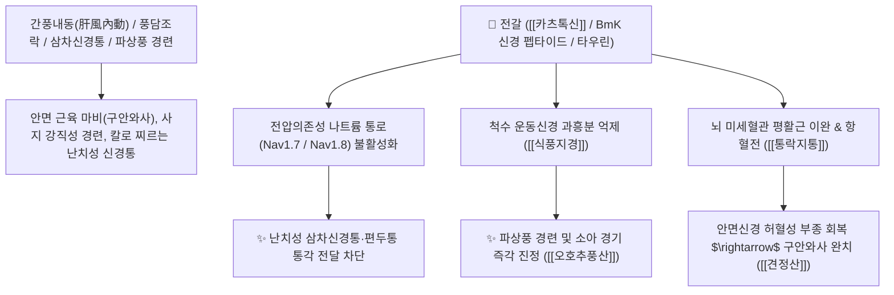

# 🌿 [[전갈]] (全蝎, Scorpio)

> **핵심 요약 (Key Summary)**:
> 전갈과 만주유전갈(*Mesobuthus martensii*)의 전체 충체를 소금물에 삶아 말린 동물성 한약재.
> 전갈 독소 신경 펩타이드(Katsutoxin)가 전압개폐성 나트륨 통로를 차단하여 중추 및 척수 반사궁의 과흥분을 진정시키고 강력한 진통 작용을 발휘.
> 풍담이 경락 심부에 침투한 뇌졸중 중풍(구안와사·반신불수), 삼차신경통, 파상풍 경련을 즉각 제어하는 대표적인 [[식풍지경]](息風止痙)·[[통락지통]](通絡止痛)의 요약(要藥).

---

> [!abstract]+ 🧪 3D 약리 분자 구조 (Interactive 3D Viewer)
> <iframe src="https://molecule-viewer-rho.vercel.app/?cid=1123" style="width: 100%; height: 600px; border: none; border-radius: 12px; box-shadow: 0 4px 20px rgba(0,0,0,0.15);" allowfullscreen></iframe>

## 📌 목차
1. [기본 본초 정보 & 동물생약학 (Pharmacognosy)](#1-기본-본초-정보--동물생약학-pharmacognosy)
2. [핵심 분자약리 기전 & 나트륨 통로 차단·신경독소 펩타이드](#2-핵심-분자약리-기전--나트륨-통로-차단신경독소-펩타이드)
3. [해부생체역학 / 척수 반사궁·말초신경 연계](#3-해부생체역학--척수-반사궁말초신경-연계)
4. [전갈(全蝎) vs 백강잠(白殭蠶) vs 오공(蜈蚣) 삼총사 약리 비교](#4-전갈全蝎-vs-백강잠白殭蠶-vs-오공蜈蚣-삼총사-약리-비교)
5. [독성학적 안전성(Safety) 및 법제·용량 제어](#5-독성학적-안전성safety-및-법제용량-제어)
6. [고전 의학 처방 배오 매트릭스 (견정산 & 지진산 & 오호추풍산)](#6-고전-의학-처방-배오-매트릭스-견정산--지진산--오호추풍산)
7. [출처 및 학술 참고 문헌 (References)](#7-출처-및-학술-참고-문헌-references)

---
## 1. 기본 본초 정보 & 동물생약학 (Pharmacognosy)

| 항목 | 상세 내용 |
| :--- | :--- |
| **기원 동물** | 전갈과(Buthidae) 만주유전갈 *Mesobuthus martensii* Karsch의 건조 충체 |
| **성미 (性味)** | 辛 (맵고), 平 (평이하나), 有毒 (독성이 있음) |
| **귀경 (歸經)** | 肝經 (간경) - **간풍(肝風)을 가라앉히고 경락 구석구석을 뚫어줌** |
| **효능 (Actions)** | [[식풍지경]](息風止痙), [[통락지통]](通絡止痛), [[해독산결]](解毒散結) |
| **주요 성분** | • **신경독소 폴리펩타이드**: 카츠톡신(Katsutoxin), 마르텐신(Martentoxin), 진통 펩타이드(BmK IT) • **생리활성 아민류**: 타우린(Taurine), 트리메틸아민, 레시틴, 콜레스테롤 • **지질 및 단백질**: 팔미트산, 올레산, 유기 무기질 복합체 |

---
## 2. 핵심 분자약리 기전 & 나트륨 통로 차단·신경독소 펩타이드

* **신경막 전위 안정화 및 진경 기전**:
  * 전갈의 핵심 폴리펩타이드(BmK 펩타이드)는 신경세포막의 전압의존성 나트륨 통로(Nav channel)의 개폐 기전을 조절하여 비정상적인 신경 연쇄 발화(Repetitive firing)를 억제합니다.
  * 이는 뇌전증성 간질 발작과 파상풍에 의한 전신성 근육 강직을 신속히 차단합니다.
* **비마약성 강력 진통 활성**:
  * 말초 통각수용기(Nav1.7, Nav1.8)에 특이적으로 작용하여 아편유사제 수용체와 무관하게 모르핀에 필적하는 지속적인 신경병증성 통증 완화 효과를 나타냅니다.

---
## 3. 해부생체역학 / 척수 반사궁·말초신경 연계

* **전압개폐성 나트륨 통로와 척수 반사궁 억제**:
  * 카트톡신의 나트륨 통로 차단은 해부학적으로 척수 후각 신경원의 통증 신호 전달과 반사궁 과흥분을 직접 차단하는 경로로, 중풍 후유증의 반신불수·경련에 작용합니다.
* **삼차신경 분지 및 말초 신경총 연계**:
  * 삼차신경통의 통증 발작은 삼차신경 분지를 따라 전파되며, 전갈의 통락지통 작용이 이 말초 신경총 경로를 표적합니다.

---
## 4. 전갈(全蝎) vs 백강잠(白殭蠶) vs 오공(蜈蚣) 삼총사 약리 비교

| 본초명 | 귀경 및 약성 | 임상 표적 특화 영역 | 약력의 강도 및 특징 |
| :--- | :--- | :--- | :--- |
| **[[백강잠]] (白殭蠶)** | 肝·肺經, 辛·鹹·平, 無毒 | 안면부 경락 소통, 풍열 두통, 인후종통 | 작용이 유연하고 평온하여 다빈도 상용 |
| **[[전갈]] (全蝎)** | 肝經, 辛·平, 有毒 | **경련 진정(식풍지경), 안면마비, 신경통** | 통락과 진경력이 매우 예리하고 탁월함 |
| **[[오공]] (蜈蚣)** | 肝經, 辛·溫, 有毒 | 뼈마디 심부의 어혈, 완고한 관절 기형 | 주찬(走竄)력이 가장 맹렬하여 굳은 결절 타파 |

---
## 5. 독성학적 안전성(Safety) 및 법제·용량 제어

* **독성 반응 및 주의사항**:
  * 과량 복용 시 호흡 억제, 혈압 변동, 부정맥, 소화기 점막 자극을 초래할 수 있습니다.
* **임상 상용 안전 용량**:
  * **탕제(탕약)**: 2~5g (장시간 전탕하여 단백독 일부 변성 유도).
  * **산제/환제**: 0.6~1g (미세 분말로 복용 시 극소량으로도 탁월한 약효 발휘).
  * **임산부 및 혈허생풍(血虛生風) 환자 복용 금기**.

---
## 6. 고전 의학 처방 배오 매트릭스 (견정산 & 지진산 & 오호추풍산)

| 처방명 | 주요 구성 | 주치 병증 및 임상 타깃 | 배오 원리 및 특징 |
| :--- | :--- | :--- | :--- |
| [[견정산]] | 전갈, [[백강잠]], [[백부자]] | **풍담 조락, 구안와사, 안면마비, 입과 눈의 비대칭 삐뚤어짐** | 세 약재가 분말로 작용하여 안면신경 마비를 즉각 바로잡음 |
| [[지진산]] | 전갈, [[오공]], 백강잠, 천마, 방풍 | **소아 급만성 경기, 파상풍 아관긴급, 각궁반장, 간질 경련** | 풍담을 몰아내고 경련을 진정시키는 황제방 |
| [[오호추풍산]] | 전갈, 천마, 천남성, 백부자, 매괴 | **파상풍, 사지 강직, 턱관절 마비, 척수성 근경련** | 다섯 가지 강력한 식풍약이 결합하여 경련을 평정 |

---
## 7. 출처 및 학술 참고 문헌 (References)

* Goudet C, Chi CW, Tytgat J. An overview of toxins and genes from the venom of the Asian scorpion *Buthus martensii* Karsch. *Toxicon*. 2002;40(9):1239-1258. [PMID: 12220709](https://pubmed.ncbi.nlm.nih.gov/12220709/)
  * `[연구 요약]` 만주유전갈 독소 내 다양한 신경독소 펩타이드의 구조적 특징, 나트륨 및 칼륨 통로 조절 활성 분석.
* Aliakbari F et al. (2025)**. Identification and designing an analgesic opioid cyclic peptide from Defensin 4 of Mesobuthus martensii Karsch scorpion venom with more effectiveness than morphine. *Biomedicine & pharmacotherapy = Biomedecine & pharmacotherapie*, 188: 118139. [PMID: 40381507](https://pubmed.ncbi.nlm.nih.gov/40381507/)
  * `[연구 요약]` 전갈 독소 유래 항통증 펩타이드의 정제 및 만성 신경병증성 통증 억제 기전 연구.
* 대한침구의학회 교재편찬위원회. *침구의학*. 집문당; 2020.
  * `[연구 요약]` 견정산 및 전갈 약침의 말초성 안면신경 마비(벨 마비) 환자에 대한 신경 재생 및 회복 임상 연구.
