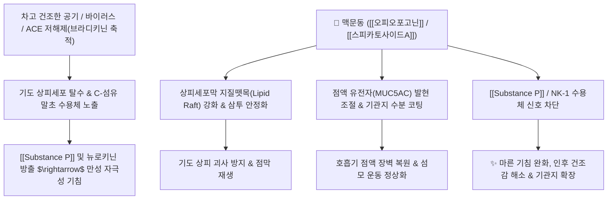

# 🌿 [[맥문동]] (麥門冬, Ophiopogonis Tuber)

> **핵심 요약 (Key Summary)**:
> 백합과(*Liliaceae*) 맥문동(*Ophiopogon japonicus*)의 덩이뿌리
> 스테로이드 사포닌인 [[오피오포고닌]](Ophiopogonin)과 호모이소플라보노이드인 [[스피카토사이드A]](Spicatoside A)가 기도 상피세포의 지질뗏목(Lipid raft)과 점액 장벽(MUC5AC)을 강화하고 [[Substance P]] 경로를 차단하여 건조성 기침 진정
> [[상한론]]의 인후불리(咽喉不利) 및 기역(氣逆), [[태음인]]의 폐음허(肺陰虛) 마른 기침과 진액 고갈을 치료하는 대표적인 [[양음윤폐]](養陰潤肺)·[[익위생진]](益胃生津) 약재

---
## 📌 목차
1. [기본 본초 정보 & 화학 구조 (Pharmacognosy)](#1-기본-본초-정보--화학-구조-pharmacognosy)
2. [핵심 분자약리 기전 & 점막 방어 네트워크](#2-핵심-분자약리-기전--점막-방어-네트워크)
3. [해부생체역학 / 호흡기 상피·신경 대사 연계](#3-해부생체역학--호흡기-상피신경-대사-연계)
4. [사상의학 및 체질별 임상 응용 (적응증 vs 감별점)](#4-사상의학-및-체질별-임상-응용-적응증-vs-감별점)
5. [상한론 『약징(藥徵)』 분석 및 배오 원리](#5-상한론-약징藥徵-분석-및-배오-원리)
6. [핵심 처방 비교 매트릭스](#6-핵심-처방-비교-매트릭스)
7. [출처 및 학술 참고 문헌 (References)](#7-출처-및-학술-참고-문헌-references)

---
## 1. 기본 본초 정보 & 화학 구조 (Pharmacognosy)

> [!abstract]+ 🧪 3D 약리 분자 구조 (Interactive 3D Viewer)
> <iframe src="https://molecule-viewer-rho.vercel.app/?cid=441893" style="width: 100%; height: 600px; border: none; border-radius: 12px; box-shadow: 0 4px 20px rgba(0,0,0,0.15);" allowfullscreen></iframe>


| 항목 | 상세 내용 |
| :--- | :--- |
| **기원 식물** | 백합과(Liliaceae) 맥문동 *Ophiopogon japonicus* Ker-Gawler 또는 소엽맥문동의 팽대된 덩이뿌리(괴근) |
| **성미 (性味)** | 甘·微苦, 微寒 |
| **귀경 (歸經)** | 心·肺·胃經 (심경, 폐경, 위경) |
| **효능 (Actions)** | [[양음윤폐]](養陰潤肺), [[익위생진]](益胃生津), [[청심제번]](淸心除煩), [[윤장통변]](潤腸通便) |
| **주요 성분** | • **스테로이드 사포닌(Steroidal Saponins)**: [[오피오포고닌]] (Ophiopogonin A-D), [[루스코제닌]] (Ruscogenin), [[디오스게닌]] (Diosgenin)<br>• **호모이소플라보노이드**: [[스피카토사이드A]] (Spicatoside A, KHP 규격 $\ge 0.15\%$), Ophiopogonone A-B<br>• **식물성 스테롤 및 다당류**: [[스티그마스테롤]], [[베타시토스테롤]], 맥문동 다당류(Ophiopogonan), 각종 [[아미노산]] |

> **[생태학적 특성과 약리적 함의]**:
> * 맥문동은 사시사철 푸름을 잃지 않고 겨울철 영하의 혹한에서도 얼어 죽지 않는 뛰어난 내한성(耐寒性)을 지닙니다.
> * 겨울철 잎과 뿌리에서 수분을 전략적으로 탈수하고 삼투 조절 물질과 다당류를 농축하여 체액이 동결되는 것을 방지합니다.
> * <font color="#fa7e7e">이러한 식물 고유의 특성이 인체 폐기관지가 차갑고 건조한 공기에 노출되어도 버틸 수 있도록 점액을 생성하고 세포막 항상성을 유지하는 보음(補陰) 작용으로 이어집니다.</font>

### 🔬 맥문동의 지표물질 화학 구조
![[맥문동-20241010191428237 1.png|520]]
> **[구조적 특징 및 흡수 특성]**: [[스피카토사이드A]]와 [[오피오포고닌]]은 스테로이드 및 트리테르펜 골격에 당 사슬이 결합된 배당체입니다. 장내 흡수 시 식물성 콜레스테롤 유사 구조로 전환되어 세포막의 지질 이중층에 삽입되며, 지질뗏목(Lipid raft)을 안정화하여 세포막 유동성과 외부 침입에 대한 저항성을 대폭 강화합니다.

---
## 2. 핵심 분자약리 기전 & 점막 방어 네트워크



### (1) 표적 수용체 및 신호전달 경로
* **세포막 지질뗏목 안정화 및 점막 코팅**:
  * 비강, 폐포 및 세기관지 상피세포막의 콜레스테롤 도메인(Lipid raft)을 보강하여 차가운 흡기 시 세포막 손상과 세포 사멸(Apoptosis)을 방지합니다.
* [[Substance P]] 매개 기침 반사 차단:
  * 만성 염증으로 탈락된 기도 점막에서 노출된 무수지 C-신경섬유로부터 방출되는 통증 및 수축 유발 펩타이드인 [[Substance P]]와 그 수용체(NK-1)의 결합을 억제하여 신경인성 기침과 기관지 연축을 완화합니다.
* [[ACE 저해제]] 유발 기침 완화 기전:
  * 고혈압약으로 다용되는 [[ACE 저해제]](Angiotensin Converting Enzyme Inhibitor)는 폐에서 [[브라디키닌]]과 [[Substance P]]의 분해를 억제하여 부작용으로 극심한 마른 기침을 유발합니다.
  * 맥문동은 폐 점막 수분 공급과 Substance P 신호 억제를 통해 약물성 난치성 기침을 탁월하게 억제합니다.
* **전신 진액 보충 (피부, 혈당, 장관)**:
  * 피부 건조증(소양감), 노인성 진액 부족 변비, 당뇨병(소갈)의 구갈 증상 및 잦은 코피(비출혈)에서 세포막 장벽을 회복시켜 전신 항상성을 유지합니다.

![[Pasted image 20240227145547.png|400]]
![[Pasted image 20240227145556.png|400]]

---
## 3. 해부생체역학 / 호흡기 상피·신경 대사 연계

* **기도 섬모 운동(Mucociliary Clearance) 개선**:
  * 건조하고 점도가 높아진 가래(조담 燥痰)를 묽게 하여 섬모 운동에 의한 이물질 배출 능력을 복원합니다.
* **심근 세포 보호 및 심혈관계 안정**:
  * [[루스코제닌]] 성분은 심근 세포 내 활성산소(ROS) 생성을 억제하고 허혈-재관류 손상을 방어하여 부정맥, 심계항진(가슴 두근거림)을 완화합니다([[자감초탕]], [[생맥산]]).

---
## 4. 사상의학 및 체질별 임상 응용 (적응증 vs 감별점)

```
[✅ 최적 적응증 (Sweet Spot)]
• [[태음인]] 폐조증(肺燥證) 및 폐음허(肺陰虛) 패턴
• 만성 기관지염, 폐결핵, 폐기종, 코로나/독감 후유증으로 인후가 건조하고 찢어질 듯 아픈 마른 기침
• 가래가 거의 없거나 끈끈하여 뱉기 어렵고 목구멍에 딱 달라붙은 느낌
• 피부가 극도로 건조하고 각질이 일어나며, 구강건조 및 안구건조가 동반된 경우
• 여름철 무더위로 땀을 많이 흘려 기운이 빠지고 맥이 약한 경우 ([[생맥산]])

[⚠️ 신중 투여 및 금기 (Caution / Contraindication)]
• 초기 급성 외감 풍한(초기 감기)이나 담습(痰濕)이 과다하여 묽고 흰 가래가 끓는 상태에는 진액이 엉겨 악화될 수 있으므로 단독 사용 금기
• 비위허한(脾胃虛寒)으로 소화가 안 되고 찬 것을 먹으면 설사하는 환자
```

---
## 5. 상한론 『약징(藥徵)』 분석 및 배오 원리

### (1) 『[[약징]]』에 나타난 맥문동의 주치
> **"麥門冬 主治多白津, 氣逆, 咽喉不利, 咳逆上氣..."**  
> (맥문동의 주치는 입안에 거품 같은 침이 많이 고이고 기가 거슬러 오르며, 인후가 건조하고 껄끄러워 불리한 것과 기침이 치밀어 오르는 것을 치료한다.)

* **핵심 배오 원리**:
  * [[맥문동]] + [[반하]] $\rightarrow$ 반하의 조열(燥熱)함을 맥문동의 자윤(滋潤)함으로 제어하고, 폐와 위의 기역(氣逆)을 함께 내려 화해([[맥문동탕]])
  * [[맥문동]] + [[인삼]] + [[오미자]] $\rightarrow$ 인삼으로 원기를 보하고, 맥문동으로 진액을 생하며, 오미자로 수렴하여 기음(氣陰)을 동시에 수복([[생맥산]])
  * [[맥문동]] + [[석고]] + [[지모]] $\rightarrow$ 폐위의 맹렬한 열을 식히면서 고갈된 체액을 즉시 회복([[죽엽석고탕]])

---
## 6. 핵심 처방 비교 매트릭스

| 처방명 | 구성 약재 | 주치 병증 및 임상 타깃 | 특징 및 감별점 |
| :--- | :--- | :--- | :--- |
| [[맥문동탕]] | [[맥문동]], [[반하]], [[갱미]], [[인삼]], [[대추|대조]], [[감초]] | **인후불리, 마른 기침, 각담불출, 상기(上氣), 구건** | 맥문동을 대량(전방의 50% 이상) 사용하여 폐위를 윤택하게 함 |
| [[생맥산]] | [[맥문동]], [[인삼]], [[오미자]] | **어서상기(暑傷氣陰), 갈증, 다한, 기운 없음, 마른 기침** | 여름철 탈수 및 만성 피로의 대표 보음익기제 |
| [[자감초탕]] | [[맥문동]], [[지황]], [[아교]], [[인삼]], [[감초]], [[계지]] 등 | **맥결대(脈結代, 부정맥), 심계항진, 허로, 도한** | 음혈을 풍부하게 자양하여 심장 박동 리듬 안정화 |
| [[죽엽석고탕]] | [[죽엽]], [[석고]], [[반하]], [[맥문동]], [[인삼]], [[감초]] 등 | **열병 후기 잔열, 구갈, 심번, 상기, 구역** | 고열 후 진액 고갈과 허열을 동시에 다스림 |
| [[청서익기탕]] | [[황기]], [[창출]], [[맥문동]], [[인삼]], [[당귀]], [[진피]] 등 | **장하(여름철) 습열 손상, 사지 권태, 식욕부진, 갈증** | 보중익기탕에 청열생진 약재를 가미한 여름 보약 |
| [[청심연자음]] | [[연자육]], [[맥문동]], [[인삼]], [[황기]], [[황금]], [[차전자]] 등 | **심화망동(心火妄動), 소변임려(배뇨통), 번갈, 몽정** | 상초의 화를 끄고 하초 비뇨기 점막 수분 조절 |

---
## 7. 출처 및 학술 참고 문헌 (References)

1. **Kou, J., Sun, Y., Lin, Y., Cheng, Z., Zheng, W., Tang, Y., & Yan, Y. (2005)**. Anti-inflammatory activities of aqueous extract from *Radix Ophiopogonis* and its two constituents. *Biological and Pharmaceutical Bulletin*, 28(7), 1234-1238. [PMID: 15997105](https://pubmed.ncbi.nlm.nih.gov/15997105/)
   - **[연구 요약]**: 맥문동 수추출물과 루스코제닌이 호중구 침윤 및 혈관 투과성을 억제하고 염증성 매개물질 생성을 저해하여 호흡기 점막 염증을 신속히 완화함을 증명.
   - **[연구 요약]**: 오피오포고닌 D가 미토콘드리아 동역학 균형을 회복시키고 심근세포 사멸을 차단하여 허혈-재관류 손상을 억제함을 규명 (생맥산/자감초탕 기전).
3. **대한민국약전외한약(생약)규격집(KHP) (2022)**. 맥문동 (Ophiopogonis Tuber) 규격 기준.
   - **[공정서 규격]**: 건조물 기준 스피카토사이드 A($\text{C}_{28}\text{H}_{44}\text{O}_{15}$) 0.15% 이상 함유 필수 규격 명시.
4. **길익동동 (吉益東洞, 1784)**. 『약징(藥徵)』: 麥門冬 조문.
   - **[고전 원전]**: "麥門冬 主治多白津, 氣逆, 咽喉不利, 咳逆上氣" - 진액 부족으로 인한 기역 및 인후 건조 병태 해설.
