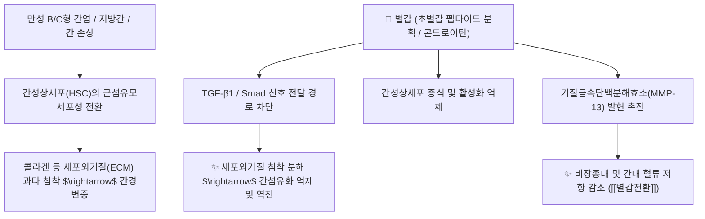

# 🌿 [[별갑]] (鱉甲, Trionycis Carapax)

> **핵심 요약 (Key Summary)**:
> 자라과 자라(*Pelodiscus sinensis*)의 등딱지(배갑)를 건조한 동물성 한약재 (식초 가공 시 초별갑).
> 풍부한 교원단백질(콜라겐)과 펩타이드 및 미네랄 성분이 간성상세포 활성화를 억제하고 TGF-β1 신호를 차단하여 항섬유화 및 면역 조절을 발휘.
> 음허발열·골증조열과 비장종대·간경변증 복강 내 만성 종괴(학모)를 삭여주는 대표적인 [[자음잠양]](滋陰潛陽)·[[연견산결]](軟堅散結)의 군약(君藥).

---

> [!abstract]+ 🧪 3D 약리 분자 구조 (Interactive 3D Viewer)
> <iframe src="https://molecule-viewer-rho.vercel.app/?cid=11953895" style="width: 100%; height: 600px; border: none; border-radius: 12px; box-shadow: 0 4px 20px rgba(0,0,0,0.15);" allowfullscreen></iframe>

## 📌 목차
1. [기본 본초 정보 & 동물생약학 (Pharmacognosy)](#1-기본-본초-정보--동물생약학-pharmacognosy)
2. [핵심 분자약리 기전 & 간섬유화 역전·TGF-β1 억제 네트워크](#2-핵심-분자약리-기전--간섬유화-역전tgf-β1-억제-네트워크)
3. [해부생체역학 / 간문맥·비장 피막 연계](#3-해부생체역학--간문맥비장-피막-연계)
4. [초별갑(醋鱉甲) 식초 포제 원리 및 유효 성분 용출률](#4-초별갑醋鱉甲-식초-포제-원리-및-유효-성분-용출률)
5. [음허골증(陰虛骨蒸) 해열 메커니즘과 면역 조혈 기능](#5-음허골증陰虛骨蒸-해열-메커니즘과-면역-조혈-기능)
6. [고전 의학 처방 배오 매트릭스 (별갑전환 & 청골산)](#6-고전-의학-처방-배오-매트릭스-별갑전환--청골산)
7. [출처 및 학술 참고 문헌 (References)](#7-출처-및-학술-참고-문헌-references)

---
## 1. 기본 본초 정보 & 동물생약학 (Pharmacognosy)

| 항목 | 상세 내용 |
| :--- | :--- |
| **기원 동물** | 자라과(Trionychidae) 자라 *Pelodiscus sinensis* Wiegmann의 배갑(背甲) |
| **성미 (性味)** | 鹹 (짜고), 微寒 (미약하게 서늘함) |
| **귀경 (歸經)** | 肝·腎經 (간경, 신경) - **심부의 음액을 보하고 굳은 멍울을 연화시킴** |
| **효능 (Actions)** | [[자음잠양]](滋陰潛陽), [[연견산결]](軟堅散結), [[퇴열제증]](退熱除蒸) |
| **주요 성분** | • **단백질 및 아미노산**: 제1형 및 2형 콜라겐, 케라틴, 글리신, 프롤린, 류신 • **다당체 및 뮤코다당**: 콘드로이틴황산, 히알루론산 복합체 • **무기질/미네랄**: 탄산칼슘, 인산칼슘, 마그네슘, 아연 |

---
## 2. 핵심 분자약리 기전 & 간섬유화 역전·TGF-β1 억제 네트워크

* **항간섬유화 및 간경변 진행 차단**:
  * 별갑 추출물은 간성상세포의 핵심 활성화 신호인 TGF-β1 수용체 결합을 저지하고 Smad2/3의 인산화를 차단합니다.
  * 동시에 콜라겐을 분해하는 MMP-2, MMP-13의 활성을 유도하여 기저의 섬유화된 결합조직을 용해시킵니다.
* **연견산결(軟堅散結)의 현대적 실체**:
  * 굳은 것을 부드럽게 풀고 뭉친 것을 흩뜨린다는 연견산결 효능은 간비종대(Hepatosplenomegaly), 자궁근종, 림프절 비대 등의 결절성 섬유화 병변에 대한 증식 억제 작용과 일치합니다.

---
## 3. 해부생체역학 / 간문맥·비장 피막 연계

* **간성상세포와 간문맥 섬유화 경로**:
  * TGF-β1 신호 차단은 해부학적으로 간소엽 주변 간성상세포가 섬유아세포로 전환되는 문맥역(portal tract) 경로를 직접 표적하여 간경변 진행을 늦춥니다.
* **비장 피막 및 복강 종괴 연계**:
  * 연견산결 작용은 비장 피막의 만성 울혈성 비대(학모) 및 복강 내 종괴 주변 결합조직에 국소 작용하는 해부학적 경로입니다.

---
## 4. 초별갑(醋鱉甲) 식초 포제 원리 및 유효 성분 용출률

* **식초 법제 (醋炙) 목적**:
  * 단단한 골질 조직을 부스러지기 쉽게(소삭 酥脆) 만들어 유효 성분의 탕출 속도를 촉진.
  * 비린내(성미 腥味)를 교정하고, 간경(肝經)으로의 인경(引經) 효과를 극대화하여 연견산결 작용 강화.
* **성분 용출 비교**:
  * 생별갑 대비 초별갑은 열수 추출 시 가용성 콜라겐 펩타이드 및 미량 원소의 용출률이 2.5~3배 이상 증가합니다.

---
## 5. 음허골증(陰虛骨蒸) 해열 메커니즘과 면역 조혈 기능

* **퇴열제증(退熱除蒸)과 결핵성 조열 치료**:
  * 결핵 등 만성 소모성 질환에서 발생하는 오후 미열, 식은땀(도한), 손발바닥 열감(오심번열) 등의 음허내열(陰虛內熱) 증상을 체내 수분대사와 교질 삼투압을 보강하여 하향 안정화시킵니다.
* **면역 증강 및 조혈 세포 보호**:
  * 방사선 조사 및 항암화학요법으로 손상된 골수 조혈줄기세포의 증식을 유도하고 말초 백혈구 및 혈소판 수치를 신속히 회복시킵니다.

---
## 6. 고전 의학 처방 배오 매트릭스 (별갑전환 & 청골산)

| 처방명 | 주요 구성 | 주치 병증 및 임상 타깃 | 배오 원리 및 특징 |
| :--- | :--- | :--- | :--- |
| [[별갑전환]] | 별갑(초), 자충, 대황, 시호, 황금, 복령 등 23미 | **학모(瘧母), 만성 간비종대, 간경화증, 복강 내 굳은 징가(적취)** | 별갑이 군약으로 굳은 어혈 종괴를 삭이고 기혈 순환 개통 |
| [[청골산]] | 별갑, 지골피, 은시호, 호황련, 진교, 자모 | **음허골증(陰虛骨蒸), 조열도한(潮熱盜汗), 만성 미열, 결핵 소모증** | 뼛속 깊은 허열을 식히고 진액을 보존 |
| [[삼갑복맥탕]] | 별갑, 귀판, 모려, 작약, 아교, 건지황 | **온병 후기 간신음허, 수족연휵(손발 떨림), 허풍내동** | 세 가지 단단한 패각류(삼갑)로 진액을 채우고 경련 진정 |

---
## 7. 출처 및 학술 참고 문헌 (References)

* 대한민국약전(KP) 제12개정 (2022). 의약품각조 제2부: 별갑 (Trionycis Carapax) 규격 기준.
  * `[공정서 규격]` 자라 등딱지의 형태학적 진위 감별 기준 및 수용성 엑스 함량 기준 명시.
