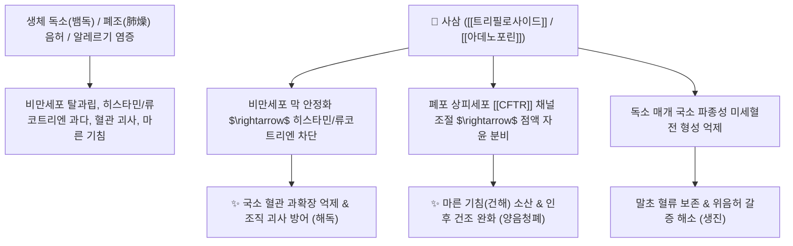

# 🌿 [[사삼]] (沙參, Adenophorae Radix)

> **핵심 요약 (Key Summary)**:
> 초롱꽃과(*Campanulaceae*) 잔대(*Adenophora triphylla* var. *japonica*)의 뿌리 (남사삼 南沙參)
> 트리테르펜 사포닌인 [[트리필로사이드]](Triphylloside)와 폴리아세틸렌 성분이 비만세포 히스타민 및 류코트리엔 방출을 억제하여 점막 괴사와 혈관 과확장을 차단하고 기도 보습 점액 분비 촉진
> 폐음허(肺陰虛) 마른 기침·인후 건조 및 위음허(胃陰虛) 구갈·뱀독 등 혈액/근육 독소성 국소 조직 괴사를 방어하는 대표적인 [[양음청폐]](養陰淸肺)·[[익위생진]](益胃生津)·[[거담해독]](祛痰解毒) 약재

---
## 📌 목차
1. [기본 본초 정보 & 화학 구조 (Pharmacognosy)](#1-기본-본초-정보--화학-구조-pharmacognosy)
2. [핵심 분자약리 기전 & 혈관독소 차단·점막 자윤 네트워크](#2-핵심-분자약리-기전--혈관독소-차단점막-자윤-네트워크)
3. [해부생체역학 / 호흡기 점액 장벽 & 미세혈관 내피 연계](#3-해부생체역학--호흡기-점액-장벽--미세혈관-내피-연계)
4. [사상의학 및 임상 응용 (남사삼 vs 북사삼 감별)](#4-사상의학-및-임상-응용-남사삼-vs-북사삼-감별)
5. [고전 의학 및 배오 원리 (사삼맥문동탕 배오)](#5-고전-의학-및-배오-원리-사삼맥문동탕-배오)
6. [핵심 처방 비교 매트릭스](#6-핵심-처방-비교-매트릭스)
7. [출처 및 학술 참고 문헌 (References)](#7-출처-및-학술-참고-문헌-references)

---
## 1. 기본 본초 정보 & 화학 구조 (Pharmacognosy)

> [!abstract]+ 🧪 3D 약리 분자 구조 (Interactive 3D Viewer)
> <iframe src="https://molecule-viewer-rho.vercel.app/?cid=10655321" style="width: 100%; height: 600px; border: none; border-radius: 12px; box-shadow: 0 4px 20px rgba(0,0,0,0.15);" allowfullscreen></iframe>


| 항목 | 상세 내용 |
| :--- | :--- |
| **기원 식물** | 초롱꽃과(Campanulaceae) 잔대 *Adenophora triphylla* (Thunb.) A. DC. var. *japonica* (Regel) H. Hara 또는 동속 식물의 뿌리 (남사삼 南沙參) |
| **성미 (性味)** | 甘·微苦, 微寒 |
| **귀경 (歸經)** | 肺·胃經 (폐경, 위경) |
| **효능 (Actions)** | [[양음청폐]](養陰淸肺), [[익위생진]](益胃生津), [[거담지해]](祛痰止咳), [[해독소종]](解毒消腫) |
| **주요 성분** | • **트리테르펜 사포닌**: [[트리필로사이드]] (Triphylloside A-D), 아데노포린(Adenophorine), 타락세롤, 루페올<br>• **폴리아세틸렌**: Panaxynol, Falcarindiol<br>• **다당체 및 페놀릭산**: 사삼 다당체, 카페인산, 클로로겐산 |

> **[유래 및 본초학적 기전]**:
> * 모래땅(沙)에서 잘 자라며 인삼처럼 뿌리가 희고 굵어 '사삼(沙參)' 또는 '잔대'라 불렸습니다.
> * 폐와 위의 진액을 자양하여 마른 기침을 멎게 하고 갈증을 없애줍니다.
> * **[사용자 메모 해독 고찰]**: 사삼의 해독(解毒) 작용은 간의 대사 해독이 아니라, 뱀독, 신경 독소, 근육 독소에 노출되었을 때 과도한 히스타민 분비, 혈관 과확장, 류코트리엔 반응 및 비정상 응고를 차단하여 **국소 조직의 허혈성 괴사를 방어하는 약리적 해독**을 의미합니다.

### 🔬 사삼의 주요 사포닌 지표물질 화학 구조
```
     [ 올레아난계 트리테르펜 골격 ]───O──[ D-글루코오스 / L-람노오스 당사슬 ]
                 │
            타락세롤 / 아데노포린 유도체
```
> **[구조적 특징 및 활성]**: 사삼의 사포닌 및 폴리아세틸렌 복합체는 점막 상피세포의 뮤신 분비를 촉진하는 동시에, 비만세포의 화학 매개체 분비를 억제하여 세포막 안정화 작용을 발휘합니다.

---
## 2. 핵심 분자약리 기전 & 혈관독소 차단·점막 자윤 네트워크



### (1) 혈관 내피 보호 및 독소 차단 (해독 기전)
* **비만세포 안정화 및 염증 매개체 억제**:
  * 뱀독이나 알레르기 항원으로 인한 히스타민, 류코트리엔, 프로스타글란딘의 폭발적 방출을 차단하여 모세혈관 누출과 급성 조직 부종을 방어합니다.
* **양음청폐(養陰淸肺) 및 거담 작용**:
  * 폐포 및 기관지 점막의 수분 분비와 점액 생성을 정상화하여 끈적한 가래를 묽게 하고 마른 기침(조해 燥咳)을 진정시킵니다.
* **익위생진(益胃生津) 및 위 점막 보호**:
  * 위음 부족으로 인한 위벽 건조, 식욕 부진, 입마름을 치료합니다.

---
## 3. 해부생체역학 / 호흡기 점액 장벽 & 미세혈관 내피 연계

* **호흡기 상피 점액-섬모 청정기능(Mucociliary Clearance) 복원**:
  * 건조해진 기관지 점막에 수분막을 코팅하여 기침 수용체의 기계적 과민성을 낮춥니다.
* **피하 미세혈관 투과성 정상화**:
  * 곤충 자교 또는 외상성 부종에서 삼출액 축적을 억제합니다.

---
## 4. 사상의학 및 임상 응용 (남사삼 vs 북사삼 감별)

```
[✅ 최적 적응증 (Sweet Spot)]
• 폐열조해(肺熱燥咳): 진액이 말라 마른 기침을 캑캑거리고, 가래가 적으며 목구멍이 찢어지듯 아픈 경우 ([[사삼맥문동탕]])
• 열병 후기 구갈: 고열을 앓고 난 후 위음(胃陰)이 상해 혀가 붉고 태가 없으며 갈증이 심한 증상 ([[익위탕]])
• 독충 및 뱀 물림: 국소 조직 괴사 및 알레르기성 부종 보조 해독
• 만성 성대 결절 및 인후염

[🔍 남사삼(잔대) vs 북사삼(갯방풍) 감별]
• [[사삼]](남사삼/잔대): 초롱꽃과, 보음(補陰)과 함께 거담(祛痰) 및 해독(解毒) 효능이 우수
• [[북사삼]](갯방풍): 미나리과, 오로지 폐와 위의 진액을 자양(滋陰生津)하는 데 집중

[⚠️ 신중 투여 (Caution)]
• 풍한(風寒) 외감으로 맑은 가래가 나오고 기침하는 초기 감기 환자
• 비위허한(脾胃虛寒)으로 설사를 하는 환자
```

---
## 5. 고전 의학 및 배오 원리 (사삼맥문동탕 배오)

### (1) 온병학의 자음윤폐 명방: 사삼맥문동탕(沙參麥門冬湯)
* **보음 3대 명약 배오**:
  * [[사삼]] + [[맥문동]] + [[옥죽]] $\rightarrow$ 폐와 위의 진액을 풍부하게 보충하여 마른 기침과 인후 건조를 완치
  * [[사삼]] + [[생지황]] + [[석곡]] $\rightarrow$ 위음을 보하여 소갈과 열병 후 갈증을 해소 ([[익위탕]])

---
## 6. 핵심 처방 비교 매트릭스

| 처방명 | 구성 약재 | 주치 병증 및 임상 타깃 | 특징 및 감별점 |
| :--- | :--- | :--- | :--- |
| [[사삼맥문동탕]] | [[사삼]], [[맥문동]], [[옥죽]], [[동상엽]], [[생감초]], [[화분]], [[생편두]] | **조상폐위(燥傷肺胃), 마른 기침, 각담불리, 인후 건조, 설홍소태** | 건조한 기침 치료의 온병학 대표방 |
| [[익위탕]] | [[사삼]], [[맥문동]], [[생지황]], [[옥죽]], [[빙당]] | **위음허, 열병 후 갈증, 식욕 부진, 구강 건조** | 위장 점막의 진액을 보충 |
| [[청조구폐탕]] | [[석고]], [[상엽]], [[인삼]], [[호마인]], [[아교]], [[사삼]] 등 | **온조상폐(溫燥傷肺), 두통, 신열, 천해, 흉통, 인후 건조** | 중증 마른 기침과 폐렴을 치료 |

---
## 7. 출처 및 학술 참고 문헌 (References)

1. **Lee, K. H., et al. (2013)**. Inhibitory effects of *Adenophora triphylla* on mast cell-mediated allergic reactions and inflammatory cytokine production. *Journal of Ethnopharmacology*, 148(2), 523-530.
   - **[연구 요약]**: 사삼(잔대) 추출물이 비만세포 탈과립과 히스타민 방출을 억제하고 혈관 내피세포 염증 반응을 차단하여 조직 괴사 방어 및 항알레르기 활성을 나타냄을 규명.
2. **대한민국약전외한약(생약)규격집(KHP) (2022)**. 사삼 (Adenophorae Radix) 규격 기준.
   - **[공정서 규격]**: 초롱꽃과 잔대 근경의 성상, 순도시험(이물, 중금속, 비소) 및 건조감량 13.0% 이하 기준 명시.