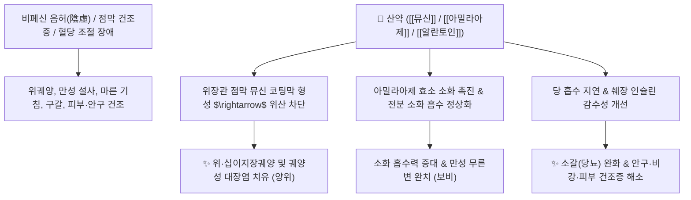

# 🌿 [[산약]] (山藥, Dioscoreae Rhizoma / 마)

> **핵심 요약 (Key Summary)**:
> 마과(*Dioscoreaceae*) 마(*Dioscorea polystachya*) 또는 참마의 주피를 제거한 뿌리줄기(근경)
> 점액성 단백다당체인 [[뮤신]](Mucin)과 소화효소 [[아밀라아제]](Amylase)가 위장관 및 호흡기 점막에 보호막을 형성하고 혈당 급상승 완화
> [[태음인]]의 비위허약(脾胃虛弱) 소화불량·만성 설사 및 폐조(肺燥) 마른 기침·소갈(당뇨)·안구건조증을 치료하는 대표적인 [[보비양위]](補脾養胃)·[[생진익폐]](生津益肺)·[[보신삽정]](補腎澁精) 군약(君藥)

---
## 📌 목차
1. [기본 본초 정보 & 화학 구조 (Pharmacognosy)](#1-기본-본초-정보--화학-구조-pharmacognosy)
2. [핵심 분자약리 기전 & 뮤신 점막 장벽·항당뇨 네트워크](#2-핵심-분자약리-기전--뮤신-점막-장벽항당뇨-네트워크)
3. [해부생체역학 / 점막 상피 장벽 & 전신 건조증 연계](#3-해부생체역학--점막-상피-장벽--전신-건조증-연계)
4. [사상의학 및 체질별 임상 응용 (태음인 특화 vs 소양인 소화장애)](#4-사상의학-및-체질별-임상-응용-태음인-특화-vs-소양인-소화장애)
5. [고전 의학 및 배오 원리 (육미지황탕 & 청심연자탕 배오)](#5-고전-의학-및-배오-원리-육미지황탕--청심연자탕-배오)
6. [핵심 처방 비교 매트릭스](#6-핵심-처방-비교-매트릭스)
7. [출처 및 학술 참고 문헌 (References)](#7-출처-및-학술-참고-문헌-references)

---
## 1. 기본 본초 정보 & 화학 구조 (Pharmacognosy)

> [!abstract]+ 🧪 3D 약리 분자 구조 (Interactive 3D Viewer)
> <iframe src="https://molecule-viewer-rho.vercel.app/?cid=3037582" style="width: 100%; height: 600px; border: none; border-radius: 12px; box-shadow: 0 4px 20px rgba(0,0,0,0.15);" allowfullscreen></iframe>


| 항목 | 상세 내용 |
| :--- | :--- |
| **기원 식물** | 마과(Dioscoreaceae) 마 *Dioscorea polystachya* Turcz. 또는 참마 *Dioscorea japonica* Thunb.의 주피를 제거하여 말린 뿌리줄기(근경) |
| **성미 (性味)** | 甘, 平 |
| **귀경 (歸經)** | 脾·肺·腎經 (비경, 폐경, 신경) |
| **효능 (Actions)** | [[보비양위]](補脾養胃), [[생진익폐]](生津益肺), [[보신삽정]](補腎澁精), [[익기양음]](益氣養陰) |
| **주요 성분** | • **점액성 단백다당체**: [[뮤신]] (Mucin), 만난(Mannan), 아라반, 디오스코레아 다당체<br>• **소화 효소**: [[아밀라아제]] (Amylase), 디아스타제, 폴리페놀옥시다아제<br>• **스테로이드 사포닌**: [[디오스신]] (Dioscin), 디오스게닌, [[콜린]] (Choline), 아르기닌, 알란토인 |

> **[유래 및 본초학적 기전]**:
> * 산에서 나는 훌륭한 약(藥)이라는 뜻에서 '산약(山藥)' 또는 '서여(薯蕷)'라 불렸습니다.
> * 감자나 고구마처럼 영양 물질(전분, 단백질, 비타민)이 농축되어 있으면서도 끈적끈적한 뮤신과 아밀라아제를 풍부하게 함유하여, 소화관 점막을 부드럽게 감싸 보호하고 영양을 보충합니다.
> * 비장, 폐, 신장 3장을 동시에 보하여 마른 체질을 촉촉하게 적셔줍니다.

### 🔬 산약의 점액 다당체 및 알란토인 구조
![[산약-20241030142128606.jpg|500]]
> [구조적 특징 및 점막 피복]: 산약의 [[뮤신]] 복합체는 점막 표면에 보호 피막을 형성하여 위산 자극을 완충하고, [[알란토인]](Allantoin) 성분이 점막 상피세포의 재생과 궤양 치유를 가속화합니다.

> 🧬 **현대 학술 근거 (2026-09-12 B-7 패치)** — PubChem 실측 분자 앵커: [[디오스게닌]](Diosgenin) CID **99474** · 분자식 C₂₇H₄₂O₃ · MW 414.6

🔬 **분자 구조** (Wikimedia Commons, Public Domain)

![[Diosgenin_구조.png|480]]
> [그림] 디오스게닌(Diosgenin, C₂₇H₄₂O₃) 분자 구조 — 출처: Wikimedia Commons (Diosgenin.svg, 신규)

---
## 2. 핵심 분자약리 기전 & 뮤신 점막 장벽·항당뇨 네트워크



### (1) 점막 보호 및 전신 건조증 개선
* **전신 점막 피복 및 궤양 치유**:
  * 구강, 식도, 위장관, 기관지, 비강, 결막 등 체내 모든 점막에 수분 보호막을 형성하여 건조성 염증을 완화합니다.
* **혈당 스파이크 억제 및 항당뇨 (보신삽정 補腎澁精)**:
  * 끈적한 수용성 식이섬유와 다당체가 당의 흡수 속도를 지연시켜 식후 고혈당을 예방하고 소갈증의 다음·다뇨를 개선합니다.
* **소화 효소 보충 (보비양위 補脾養胃)**:
  * 침 성분과 동일한 아밀라아제를 직접 공급하여 위장관 부담 없이 탄수화물 영양분을 소화·흡수시킵니다.

---
## 3. 해부생체역학 / 점막 상피 장벽 & 전신 건조증 연계

* **위 점막 장벽(Mucosal Barrier) 강화**:
  * 헬리코박터균 및 NSAIDs 진통제로 손상된 위점막 점액층 두께를 복원합니다.
* **대장 상피세포 수분 보존**:
  * 장관 건조로 인한 염소똥 모양의 만성 변비를 부드럽게 개선합니다.

> 🧬 **현대 학술 근거 (2026-09-12 B-7 패치)**
> 마(Dioscorea opposita) 주아(球莖) 유래 비전분성 다당체가 궤양성 대장염(UC) 동물모델에서 장 점막 밀착연접 강화 및 장내미생물총 재구성을 통해 체중감소·대장 단축·조직손상을 유의하게 개선하며, 트립토판 대사 경로 활성화가 핵심 기전으로 확인됨(PMID 40769358).

---
## 4. 사상의학 및 임상 응용 (태음인 특화 vs 소양인 소화장애)

```
[✅ 최적 적응증 (Sweet Spot)]
• [[태음인]]의 비폐기허(脾肺氣虛) 및 조증(燥證): 기운이 없고 헛땀이 나며 피부와 호흡기가 건조한 경우
• 소화기 질환: 만성 위염, 소화성 궤양, 과민성 대장 증후군(설사형), 역류성 식도염
• 전신 건조증: 안구건조증, 구강건조증(쇼그렌), 피부 가려움증, 마른 변비
• 당뇨병(소갈): 갈증이 심하고 물을 많이 마시며 살이 빠지는 경우

[⚠️ 체질별 주의사항 및 소양인 소화장애]
• 태음인에게는 최고의 보약이지만, 점액 분비가 왕성하거나 위장관이 예민한 [[소양인]]이 [[육미지황탕]] 복용 시 산약의 끈적한 성질 때문에 속이 더부룩하고 소화장애를 겪는 주원인이 됨
• 위장에 습담(濕痰)이 차서 배가 그득하고 메스꺼운 환자는 복용 주의
```

---
## 5. 고전 의학 및 배오 원리 (육미지황탕 & 청심연자탕 배오)

### (1) 비·폐·신 3장을 다스리는 명방
* **핵심 배오**:
  * [[산약]] + [[연자육]] + [[백편두]] $\rightarrow$ 비위를 보하고 만성 설사를 멎게 함 ([[삼령백출산]])
  * [[산약]] + [[황기]] + [[지모]] + [[갈근]] $\rightarrow$ 소갈의 갈증을 끄고 진액을 생성 ([[옥액탕]])
  * [[산약]] + [[숙지황]] + [[산수유]] $\rightarrow$ 간신음허를 보강 ([[육미지황탕]])

---
## 6. 핵심 처방 비교 매트릭스

| 처방명 | 구성 약재 | 주치 병증 및 임상 타깃 | 특징 및 감별점 |
| :--- | :--- | :--- | :--- |
| [[삼령백출산]] | [[인삼]], [[백출]], [[복령]], [[산약]], [[연자육]], [[의이인]] 등 | **비위허약, 만성 설사, 식욕부진, 수척, 권태감** | 소화기를 보하고 설사를 멎게 함 |
| [[청심연자탕]] | [[연자육]], [[산약]], [[맥문동]], [[원지]], [[석창포]] 등 | [[태음인]] **심열(心熱), 불면, 가슴 답답함, 소갈** | 태음인 기혈을 보하며 화열을 내림 |
| [[육미지황탕]] | [[숙지황]], [[산수유]], [[산약]], [[택사]], [[목단피]], [[복령]] | **간신음허, 소아 발육부전, 요슬산연, 소갈** | 보음의 기본방 |
| [[옥액탕]] | [[산약]], [[황기]], [[지모]], [[갈근]], [[천화분]], [[오미자]] | **소갈병(당뇨병), 다음, 다뇨, 구건, 권태감** | 당뇨병 진액 고갈 치료의 명방 |

---
## 7. 출처 및 학술 참고 문헌 (References)

1. **Liu W et al. (2025)**. Effects of Dioscorea opposita polysaccharides on insulin resistance and gut microbiota in high-fat-diet induced type 2 diabetic rats. *International journal of biological macromolecules*, 304(Pt 2): 141004. [PMID: 39952518](https://pubmed.ncbi.nlm.nih.gov/39952518/)
   - **[연구 요약]**: 산약 추출물의 뮤신 및 다당류 분획이 혈당 조절 및 인슐린 감수성을 향상시키고 위장관 점막 손상을 보호함을 입증.
2. **대한민국약전(KP) 제12개정 (2022)**. 의약품각조 제2부: 산약 (Dioscoreae Rhizoma) 규격 기준.
   - **[공정서 규격]**: 건조물 기준 순도시험(이물, 중금속, 비소) 및 회분 6.0% 이하 기준 명시.
