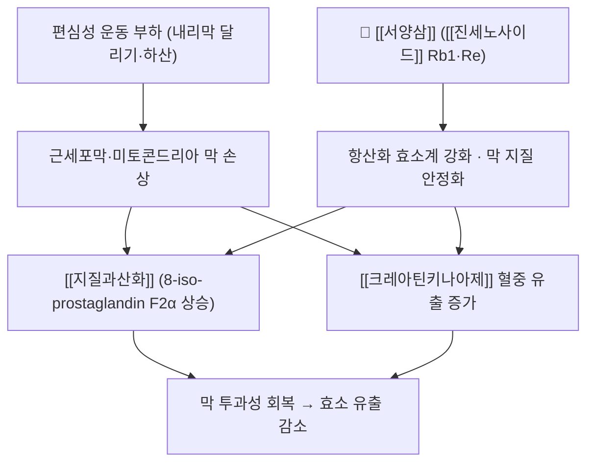

# 🌿 [[서양삼]] (西洋蔘, Panax quinquefolius)

> **핵심 요약 (Key Summary)**:
> 두릅나무과(Araliaceae) 기원식물 인삼속 *Panax quinquefolius* L.의 뿌리 — 인삼과 같은 속이지만 性이 凉해 운용이 다르다
> 지표 성분군인 [[진세노사이드]](Rb1 우세)가 항산화·세포막 안정화 경로를 통해 편심성 운동 후 근효소 유출과 [[지질과산화]]를 줄이는 방향으로 작용한다
> 한의학적으로 補氣養陰·淸熱生津 — 陰虛·虛熱·口渴·기력저하를 다스리는 凉補 약재로, 溫補 중심의 [[인삼]]과 자리를 나눈다

> 🖼️ **이미지 규격(정본)**: `.agents\rules\이미지_가이드.md` §3.3 — ①기원 식물 ②약용 부위(생약 원물) ③지표성분 2D 구조식. **검색은 학명으로** 수행했다.

## 📌 목차
1. [기본 본초 정보 & 화학 구조 (Pharmacognosy)](#1-기본-본초-정보--화학-구조-pharmacognosy)
2. [핵심 분자약리 기전 & 대사 네트워크](#2-핵심-분자약리-기전--대사-네트워크)
3. [해부생체역학 / 근육·신경 대사 연계](#3-해부생체역학--근육신경-대사-연계)
4. [체질별 임상 응용 (적응증 vs 금기)](#4-체질별-임상-응용-적응증-vs-금기)
5. [한의학적 고찰 및 배오 원리](#5-한의학적-고찰-및-배오-원리)
6. [인삼·서양삼 감별 및 배오 매트릭스](#6-인삼서양삼-감별-및-배오-매트릭스)
7. [출처 및 학술 참고 문헌 (References)](#7-출처-및-학술-참고-문헌-references)

---

## 1. 기본 본초 정보 & 화학 구조 (Pharmacognosy)

> [!abstract]+ 🧪 핵심 지표성분 3D 분자 구조 (Interactive 3D Viewer)
> <iframe src="https://molecule-viewer-rho.vercel.app/?cid=9898279" width="100%" height="450px" frameborder="0" allowwebgl style="border-radius: 8px;"></iframe>

| 항목 | 상세 내용 |
| :--- | :--- |
| **기원 식물** | 두릅나무과(Araliaceae) *Panax quinquefolius* L.의 뿌리(재배·야생) |
| **약용 부위** | 뿌리(근) — 건조 후 절편·분말로 유통 |
| **성미 (性味)** | 甘·微苦, 凉 |
| **귀경 (歸經)** | 心 · 肺 · 腎 |
| **효능 (Actions)** | 補氣養陰(益氣養陰) · 淸熱生津 · 除煩倦 |
| **주요 성분** | • 지표 성분군: [[진세노사이드]] — Rb1 우세(Rb1·Rb2·Rc·Rd·Re·Rg1)<br>• 그 외: 다당류, 폴리아세틸렌, 페놀성 성분 |
| **PubChem CID** | [9898279](https://pubchem.ncbi.nlm.nih.gov/compound/9898279) (진세노사이드 Rb1, C54H92O23 — 2026-09-30 PubChem 조회) |

### 🌿 기원 식물 및 생약 원물 (Botanical Source)
![[서양삼_01_기원식물_전초.jpg|420]]
> [그림 1: 기원 식물 — *Panax quinquefolius* 전초(장상복엽과 적색 장과) — Wikimedia Commons, Public domain]

![[서양삼_02_약용부위_건재절편.jpg|420]]
> [그림 2: 약용 부위 — 건조 절편(건재 원물) — Wikimedia Commons, Fumikas Sagisavas, CC0]

### 🔬 주요 지표물질 화학 구조
- [[진세노사이드]]의 2D 구조식 정본은 [[진세노사이드]] 노트에 수록돼 있다(같은 구조식을 두 노트에 중복 수록하지 않는다).
- **인삼([[인삼]])과의 조성 차이**: 인삼이 Rg1 계열 비중이 상대적으로 높은 반면, 서양삼은 Rb1·Re 계열 비중이 높은 조성으로 보고된다. 2026-09-30 리뷰 1번이 사용한 추출물도 **Rb1 8.67%·Re 5.08%·Rd 1.05%·Rc 0.99%** 로 Rb1 우세를 확인해 준다.
- **[구조적 특징 및 활성]**: 진세노사이드는 다마란계 트리테르펜 사포닌으로, 당이 붙은 위치·수에 따라 PPT(protopanaxadiol)·PPT(protopanaxatriol) 계열로 나뉜다. 배당체 극성이 커 장관 흡수율은 낮고 장내세균 대사(컴파운드 K 등)를 거친 뒤 활성을 나타낸다 — **혈중 지표 개선을 성분 단독 효능으로 확대 해석하지 않는 이유**다.

---

## 2. 핵심 분자약리 기전 & 대사 네트워크



### (1) 항산화·막 안정화 경로
- 진세노사이드는 세포막 지질 이중층의 과산화 연쇄를 억제하고 항산화 효소계(글루타티온 계열)를 강화하는 방향으로 보고돼 있다 → [[지질과산화]] · [[ROS]] · [[NF-κB]]
- 미토콘드리아 내막·근형질세망 막 안정화가 근효소 유출(CK) 감소와 연결된다는 해석이 제시됐다 → [[크레아틴키나아제]]
- 염증 사이토카인 조절: IL-1β·TNF-α 계열과 항염 사이토카인(IL-4·IL-10) 균형을 함께 본다 → [[TNF-a]] · [[IL-10]] · [[IL-4]]

### (2) 해석상 경계
- 2026-09-30 리뷰 1번에서 **IL-4는 서양삼군에서 오히려 낮게 유지**됐다. '항염 = 항염 사이토카인 증가'라는 단순 도식은 성립하지 않으므로, 사이토카인은 세트로 해석한다 → [[IL-4]]
- 근거의 층위: 현재 인체 근거는 **혈액 대리지표 개선** 단계이고, 통증·기능 같은 환자 중심 결과는 개선되지 않았다.

---

## 3. 해부생체역학 / 근육·신경 대사 연계

- **근육 섬유 대사**: 편심성 수축으로 손상된 근섬유는 위성세포 활성·단백질 합성 회복 과정을 거친다. 서양삼은 이 과정의 **산화 스트레스·막 손상 축**을 낮추는 보조로 위치한다 → [[위성세포(Satellite cell)]] · [[mTOR]]
- **신경 및 순환**: 인삼류는 일부 문헌에서 혈소판 기능·혈관 반응에 영향을 준다고 보고된다 — 항응고·항혈소판제 복용자에서는 병용 전 확인이 필요하다 → [[아스피린]] · [[와파린]]
- **운동 처방과의 관계(핵심)**: 보충제보다 **부하 관리가 먼저**다. 편심성 부하가 큰 훈련 후 48~72시간은 동일 근군 고강도 훈련을 피하고, 통증이 24시간 이상 지속되면 강도를 20~30% 낮춘다 → [[편심성 운동]] · [[점진적 과부하]]

---

## 4. 체질별 임상 응용 (적응증 vs 금기)

```
[✅ 최적 적응증 (Sweet Spot)]
• 陰虛·虛熱 패턴 — 오후 열감, 구갈, 도한, 만성 피로, 폐·위 음허에 따른 마른기침·口渴
• 기력 저하 + 음허가 겹친 환자(氣陰兩傷)에서 溫補 없이 기력을 올려야 하는 상황
• 운동·과로 후 회복 상담에서 '혈액 지표 단계'의 보조로 한정해 제안

[⚠️ 신중 투여 및 금기 (Caution / Contraindication)]
• 中陽虛寒·濕濁滯胃 — 복부 냉감·연변·식욕부진·복만에서는 凉性이 부담이 될 수 있다
• 항응고·항혈소판제 복용자(출혈 경향), 혈당강하제 병용자(저혈당 주의)
• 급성 감염·발열기(보충제 개입보다 원인 치료가 우선)
```

- ⚠️ **사상체질 분류**: 사상 처방 체계에 서양삼 전용 조문은 없다. 체질 분류로 단정하지 말고 **변증(陰虛·氣陰兩傷) 중심**으로 배오를 판단한다(원문 근거 없는 임의 분류 금지).

---

## 5. 한의학적 고찰 및 배오 원리

### (1) 문헌적 위치
- 『약징(藥徵)』에 서양삼 조문은 없다 — [[인삼]]의 「主治心下痞硬」 조문을 그대로 준용하지 않는다.
- 청대 이후 본초서(『本草從新』 등)에서 **補肺降火·生津止渴·除煩倦**, 즉 '虛而有火者宜之'로 정리된 흐름이 통설로 전해진다(고전 인용은 통설 수준이며, 원문 대조는 별도 확인이 필요하다).
- 국내 공정서 수재 여부·규격(지표성분 함량 기준)은 제품 표기와 함께 별도 확인 대상이다.

### (2) 배오(짝) 운용
- [[서양삼]] + [[맥문동]] → 養陰生津·潤肺: 마른기침·구갈
- [[서양삼]] + [[오미자]] → 斂肺生津·斂汗: 땀을 많이 흘리는 허약·구갈
- [[서양삼]] + [[황기]] → 益氣固表: 기허 + 음허가 겹친 만성 피로(단, 황기는 溫性이므로 熱象 확인)
- 補氣養陰 3종 조합([[인삼]] 대신 서양삼을 쓰는 운용)은 [[생맥산]] 계열 처방에서 임상 관행으로 시도된다 — 처방 조문의 정본 대체가 아니라 **운용상의 변형**임을 기록해 둔다.

---

## 6. 인삼·서양삼 감별 및 배오 매트릭스

| 약재·처방 | 기원·성미 | 주치 병증 및 임상 타깃 | 특징 및 감별점 |
| :--- | :--- | :--- | :--- |
| [[인삼]] | 오가피과 인삼, 甘微苦 溫 | 氣虛·陽虛, 心下痞硬, 脈微欲絶 | 溫補 — 실열·고혈압 조절 불량 시 주의 |
| [[서양삼]] | 두릅나무과 *P. quinquefolius*, 甘微苦 凉 | 陰虛火旺, 津傷口渴, 氣陰兩傷 | 凉補 — 寒濕·연변 환자에는 부담, 항응고 병용 확인 |
| [[맥문동]] | 養陰潤肺·益胃生津 | 마른기침, 위음허 구갈 | 서양삼 배오의 養陰 축 |
| [[오미자]] | 酸甘, 斂肺滋腎·生津斂汗 | 만성 기침, 도한, 구갈 | 收斂 — 급성 감염 초기에는 쓰지 않는다 |
| [[생맥산]] | [[인삼]] + [[맥문동]] + [[오미자]] | 기음양상, 脈虛·무력, 더위·과로 후 탈진 | 원방은 인삼 기준 — 서양삼 대체는 凉補가 필요할 때의 운용 변형 |

- **양약 상호작용 (Herb–Drug Interaction)**:
  - **출혈 위험** — [[와파린]]·[[아스피린]]·DOAC 병용 시 INR·출혈 경향 변동 보고가 있다. 수술 전 2주 중단 상담을 기본으로 한다.
  - **혈당 간섭** — 인슐린·설폰요소제·[[메트포르민]] 병용 시 저혈당 가능성을 확인하고 자가혈당 기록을 요청한다.
  - **CYP 효소** — 인삼류의 CYP3A4 등 효소 유도·억제 보고가 혼재한다. 다약제 복용자는 개별 확인이 원칙이다 → [[CYP3A4]]
  - **복용 시점** — 흡수 간섭을 줄이려 다른 약과 2시간 이상 간격을 권고한다.

---

## 7. 출처 및 학술 참고 문헌 (References)

1. **Lin CH, Lin YA, Chen SL, Hsu MC, Hsu CC. (2021)**. American Ginseng Attenuates Eccentric Exercise-Induced Muscle Damage via the Modulation of Lipid Peroxidation and Inflammatory Adaptation in Males. *Nutrients*, 14(1):78. [PMID: 35010953](https://pubmed.ncbi.nlm.nih.gov/35010953/)
   - **[연구 요약]** 건강한 남성 12명에서 서양삼 추출물 1.6 g/일 28일이 하향 달리기 후 크레아틴키나아제(48·72시간)와 8-iso-prostaglandin F2α(직후·2·24시간)를 유의하게 낮췄다. 주관적 근육통은 군간 차이가 없었다.
2. **Bell L, Fança-Berthon P, Cozannet RL, Ferguson D, Scholey A, Williams C. (2026)**. Effects of American ginseng (Panax quinquefolius) extract on human neurocognitive function: a review. *Nutritional Neuroscience*, 29(2):213-223. [PMID: 41017752](https://pubmed.ncbi.nlm.nih.gov/41017752/)
   - **[연구 요약]** 서양삼 추출물의 인체 인지기능 관련 임상 연구를 정리한 리뷰로, 서양삼의 표준화·용량·안전성 논의를 다룬다(본초 개요 근거로만 인용).
3. **PubChem Compound Summary** — Ginsenoside Rb1 (CID [9898279](https://pubchem.ncbi.nlm.nih.gov/compound/9898279)), Ginsenoside Rg1 (CID 441923).
   - **[공인 데이터]** 지표성분의 분자식·분자량 확인(2026-09-30 조회).
4. **Wikimedia Commons** — [Panax quinquefolius.jpg](https://commons.wikimedia.org/wiki/File:Panax_quinquefolius.jpg)(Public domain), [Dried american ginseng slices (1).jpg](https://commons.wikimedia.org/wiki/File:Dried_american_ginseng_slices_(1).jpg)(CC0, Fumikas Sagisavas).
   - **[이미지 출처]** 기원 식물·약용 부위 실사. 캡션은 시각 확인 후 작성했다.

> 검증 메모 (2026-10-03): 출처 1번의 저자·제목이 PubMed 실제 서지와 달라 교정하였다. 이전 판의 "Mendes-Junior EM, et al. (2021). Effect of American ginseng supplementation on eccentric exercise-induced muscle damage, lipid peroxidation and inflammation: a randomized, double-blind, placebo-controlled crossover trial"은 실제로 "Lin CH, Lin YA, Chen SL, Hsu MC, Hsu CC. (2021). American Ginseng Attenuates Eccentric Exercise-Induced Muscle Damage via the Modulation of Lipid Peroxidation and Inflammatory Adaptation in Males. *Nutrients*. 2021;14(1):78"(PMID 35010953)이다. 출처 2번의 제목 "American ginseng (Panax quinquefolius) extract and human neurocognitive function: a review"는 실제 제목 "Effects of American ginseng (Panax quinquefolius) extract on human neurocognitive function: a review"와 달라 교정하고, 누락된 저자(Bell L, Fança-Berthon P, Cozannet RL, Ferguson D, Scholey A, Williams C)와 권(호)·페이지(*Nutritional Neuroscience*. 2026;29(2):213-223)를 보완하였다.

<!-- 보관 태그(1회용·링크오류, 필요시 복원): 화기삼, 서양삼, American ginseng -->
