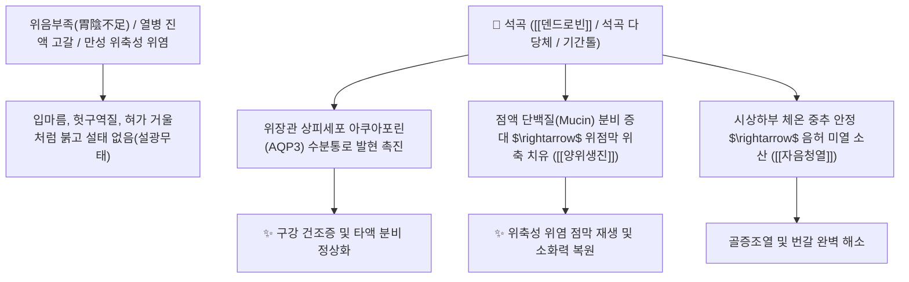

# 🌿 [[석곡]] (石斛, Dendrobii Caulis)

> **핵심 요약 (Key Summary)**:
> 난초과 다년생 초본 금차석곡(*Dendrobium nobile*)의 햇볕에 말린 줄기로 바위틈에서 자생하는 보음 생진 대표 본초.
> 세스퀴테르펜 알칼로이드인 덴드로빈과 수용성 다당체가 위점막 아쿠아포린 발현을 정상화하고 혈당 강하 및 망막 세포를 보호.
> 열병 후기 진액 고갈로 인한 극심한 구갈, 위음부족(설광무태·만성 위축성 위염), 시력 감퇴 및 신허 요통을 치료하는 [[양위생진]](養胃生津)·[[자음청열]](滋陰淸熱)의 군약(君藥).

---

> [!abstract]+ 🧪 3D 약리 분자 구조 (Interactive 3D Viewer)
> <iframe src="https://molecule-viewer-rho.vercel.app/?cid=442523" style="width: 100%; height: 600px; border: none; border-radius: 12px; box-shadow: 0 4px 20px rgba(0,0,0,0.15);" allowfullscreen></iframe>

## 📌 목차
1. [기본 본초 정보 & 식물생약학 (Pharmacognosy)](#1-기본-본초-정보--식물생약학-pharmacognosy)
2. [핵심 분자약리 기전 & 덴드로빈·위점막 아쿠아포린(AQP3) 네트워크](#2-핵심-분자약리-기전--덴드로빈위점막-아쿠아포린aqp3-네트워크)
3. [당뇨병성 소갈(消渴) 혈당 조절 및 췌장 베타세포 보호](#3-당뇨병성-소갈消渴-혈당-조절-및-췌장-베타세포-보호)
4. [안과 질환(명목 明目)과 망막 신경 보호 및 백내장 방어](#4-안과-질환명목-明目과-망막-신경-보호-및-백내장-방어)
5. [고전 의학 처방 배오 매트릭스 (석곡야광환 & 석곡탕)](#5-고전-의학-처방-배오-매트릭스-석곡야광환--석곡탕)
6. [출처 및 학술 참고 문헌 (References)](#6-출처-및-학술-참고-문헌-references)

---
## 1. 기본 본초 정보 & 식물생약학 (Pharmacognosy)

| 항목 | 상세 내용 |
| :--- | :--- |
| **기원 식물** | 난초과(Orchidaceae) 금차석곡 *Dendrobium nobile* Lindl. 또는 동속 근연식물의 줄기 |
| **성미 (性味)** | 甘·微苦 (달고 미약하게 쓰며), 微寒 (미약하게 서늘함) |
| **귀경 (歸經)** | 胃·腎經 (위경, 신경) - **위장의 진액을 샘솟게 하고 신장의 허화를 가라앉힘** |
| **효능 (Actions)** | [[양위생진]](養胃生津), [[자음청열]](滋陰淸熱), [[명목]](明目), 강요슬 |
| **주요 성분** | • **세스퀴테르펜 알칼로이드**: [[덴드로빈]](Dendrobine, 0.4% 이상 지표 성분), 노빌린 • **수용성 다당체**: 석곡 다당류(Dendrobium polysaccharides, 면역 활성) • **비벤질 및 페난트렌 화합물**: 기간톨(Gigantol), 모스카틸린(Moscatilin) |

---
## 2. 핵심 분자약리 기전 & 덴드로빈·위점막 아쿠아포린(AQP3) 네트워크

* **수분 대사 수송체(Aquaporin) 조절 기전**:
  * 석곡 추출물은 타액선 및 위 점막 상피세포의 수분 수송 통로인 **AQP3(Aquaporin-3)** 단백질 발현을 유의하게 상향 조절합니다.
  * 이는 진액이 말라붙어 혀가 거울처럼 매끄럽고 붉어지는 설광무태(舌光無苔) 및 쇼그렌 증후군 환자의 구강 건조를 분자 수준에서 치유합니다.
* **위축성 위염 점막 재생**:
  * 위점막 혈류량을 증가시키고 가스트린 및 펩시노겐 분비를 정상화하여 위축된 위선 세포의 회복을 유도합니다.

---
## 3. 당뇨병성 소갈(消渴) 혈당 조절 및 췌장 베타세포 보호

* **인슐린 저항성 개선**:
  * 골격근세포에서 GLUT4의 세포막 이동을 촉진하여 포도당 흡수를 증가시키고, 간에서 포도당신생합성(Gluconeogenesis) 효소 발현을 억제합니다.
* **췌장 베타세포 사멸 억제**:
  * 덴드로빈 성분은 고혈당으로 인한 산화 스트레스와 소포체 스트레스(ER stress)를 차단하여 인슐린 분비능을 보존합니다.

---
## 4. 안과 질환(명목 明目)과 망막 신경 보호 및 백내장 방어

* **알도오스 환원효소(Aldose Reductase) 억제**:
  * 비벤질계 성분인 기간톨(Gigantol)이 수정체 내 소비톨(Sorbitol) 축적을 차단하여 당뇨병성 백내장 진행을 저지합니다.
* **망막 광수용체 보호**:
  * 망막 색소상피세포(RPE)의 항산화 효소를 유도하여 황반변성 및 안정피로 시력 저하를 방어합니다.

---
## 5. 고전 의학 처방 배오 매트릭스 (석곡야광환 & 석곡탕)

| 처방명 | 주요 구성 | 주치 병증 및 임상 타깃 | 배오 원리 및 특징 |
| :--- | :--- | :--- | :--- |
| [[석곡야광환]] | 석곡, [[구기자]], [[숙지황]], 맥문동, 인삼, 청상자 | **간신음허, 시력 감퇴, 백내장 초기, 안구 건조증, 야맹증** | 간신을 보하고 눈을 밝게(명목) 하는 안과 명방 |
| [[석곡탕]] | 석곡, 맥문동, 생지황, 황련, 갈근 | **온열병 후기 진액 손상, 구갈 번조, 설홍무태, 당뇨 소갈** | 위열을 끄고 위장의 진액을 신속히 보충 |
| [[생진양혈탕]] | 석곡, 당귀, 백작약, 천화분, 지골피 | **항암 방사선 치료 후 구강 건조, 식욕 부진, 골증조열** | 진액을 살리고 혈액을 자양 |

---
## 6. 출처 및 학술 참고 문헌 (References)

* Zhao H et al. (2026)**. Phytochemistry, pharmacology, toxicology, and applications of the genus Dendrobium: An updated review from bioactive constituents and mechanisms to translational perspectives. *Phytomedicine : international journal of phytotherapy and phytopharmacology*, 159: 158536. [PMID: 42431106](https://pubmed.ncbi.nlm.nih.gov/42431106/)
  * `[연구 요약]` 석곡의 세스퀴테르펜 알칼로이드 및 다당류 성분의 약리 활성, 면역 증강 및 항당뇨 연구 종합.
* 대한민국약전(KP) 제12개정 (2022). 의약품각조 제2부: 석곡 (Dendrobii Caulis) 규격 기준.
  * `[공정서 규격]` 금차석곡 줄기의 덴드로빈(Dendrobine) 0.40% 이상 함유량 규격 명시.
