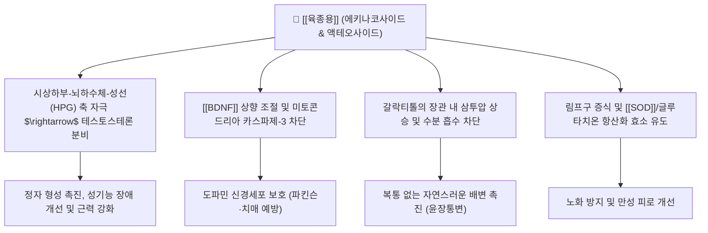

---
aliases:
  - 육종용
  - 肉蓯蓉
  - Cistanches Herba
  - 사막인삼
tags:
  - 본초
  - 보양약
  - 보신양
  - 익정혈
  - 윤장통변
  - 에키나코사이드
---
# 🌿 [[육종용]] (肉蓯蓉, Cistanches Herba, 사막인삼)

> **핵심 요약 (Key Summary)**:
> 열당과(Orobanchaceae) 기생 식물인 육종용(*Cistanche deserticola*) 또는 관화육종용의 건조 육질경
> 핵심 페닐에타노이드 배당체인 [[에키나코사이드]](Echinacoside)와 액테오사이드가 신경세포 보호와 테스토스테론 분비 촉진 및 삼투성 장관 운동 활성화
> 신양허(腎陽虛)로 인한 발기부전·불임·요슬냉통을 온보하되 조열하지 않고 노인성·허약자 장조변비를 윤장통변(潤腸通便)으로 치료하는 보양의 성약

---

> [!abstract]+ 🧪 3D 약리 분자 구조 (Interactive 3D Viewer)
> <iframe src="https://molecule-viewer-rho.vercel.app/?cid=11850" style="width: 100%; height: 600px; border: none; border-radius: 12px; box-shadow: 0 4px 20px rgba(0,0,0,0.15);" allowfullscreen></iframe>

## 📌 목차
1. [기본 본초 정보 & 생약 특징 (Pharmacognosy)](#1-기본-본초-정보--생약-특징-pharmacognosy)
2. [핵심 분자약리 기전 & 대사 네트워크](#2-핵심-분자약리-기전--대사-네트워크)
3. [해부생체역학 / 시상하부-뇌하수체-생식샘축 및 장관 연계](#3-해부생체역학--시상하부-뇌하수체-생식샘축-및-장관-연계)
4. [주요 약리학적 효능 (신경보호 & 생식내분비)](#4-주요-약리학적-효능-신경보호--생식내분비)
5. [사상의학 및 임상 감별 (Sweet Spot vs 금기)](#5-사상의학-및-임상-감별-sweet-spot-vs-금기)
6. [배합 처방 매트릭스](#6-배합-처방-매트릭스)
7. [출처 및 학술 참고 문헌 (References)](#7-출처-및-학술-참고-문헌-references)

---

## 1. 기본 본초 정보 & 생약 특징 (Pharmacognosy)

| 항목 | 상세 내용 |
| :--- | :--- |
| **기원 식물** | 열당과(Orobanchaceae) 육종용(*Cistanche deserticola*) 또는 관화육종용의 비늘잎이 달린 다육질 줄기 |
| **성미 (性味)** | 감(甘), 함(鹹), 온(溫) |
| **귀경 (歸經)** | 신경(腎經), 대장경(大腸經) |
| **효능 (Actions)** | 보신양(補腎陽), 익정혈(益精血), 윤장통변(潤腸通便) |
| **주요 성분** | • **페닐에타노이드 배당체당류**: 갈락티톨(Galactitol), 올리고당 • **이리도이드 배당체**: 제니포시드산 |

---

## 2. 핵심 분자약리 기전 & 대사 네트워크

* **보하되 조열하지 않은 온윤(溫潤)의 미학**:
  * 부자나 육계와 달리 화열(火熱)의 편향이 없고, 자황·숙지황처럼 기름져 체하지 않아 '종용(從容, 성질이 부드럽고 여유롭다)'하다는 본초명의 유래처럼 장기 복용 가능한 안전한 보신약.
* **삼투성 윤하 기전**:
  * 갈락티톨과 다당류 성분이 대장에서 수분을 끌어당겨 대변의 용적을 불리고 부드럽게 만들어 연하제(Laxative) 작용 수행.

---

## 3. 해부생체역학 / 시상하부-뇌하수체-생식샘축 및 장관 연계

* **시상하부-뇌하수체-생식샘축(HPG axis) 연계**:
  * 에키나코사이드의 테스토스테론 분비 촉진은 해부학적으로 시상하부 GnRH 뉴런과 고환 라이디히세포로 이어지는 HPG축을 자극하는 경로입니다.
* **대장 삼투압성 연동 경로**:
  * 액테오사이드 등 배당체의 윤장통변 작용은 대장 점막의 삼투압 구배를 완만히 변화시켜 노인성 장조변비를 해소하는 해부생리학적 경로입니다.

---
## 4. 주요 약리학적 효능 (신경보호 & 생식내분비)

* **도파민 신경세포 보호 및 파킨슨/치매 억제**:
  * 6-OHDA 및 MPTP 유도 신경독성 모델에서 흑질 선조체 도파민 신경세포 사멸을 유의하게 억제.
* **생식 기능 향상 및 테스토스테론 상승**:
  * 고환 내 스테로이드 합성 효소(CYP11A1, 3β-HSD) 발현을 유도하여 혈중 남성호르몬 농도 정상화.
* **면역 노화 지연 및 조혈 촉진**:
  * 흉선과 비장의 위축을 막고 NK세포 활성을 증대.

---

## 5. 사상의학 및 임상 감별 (Sweet Spot vs 금기)

* **최적 적응증 (Sweet Spot)**:
  * 노인성·산후·병후 허약자의 대변비결(힘이 없어 변을 보지 못하는 허증 변비).
  * 신양부족으로 인한 허리와 무릎의 시림 및 통증, 발기부전, 여성 불임.
* **금기 및 신중 투여**:
  * 위장에 열이 심하여 변비가 생긴 양명실열(陽明實熱) 환자.
  * 대변이 묽거나 설사를 자주 하는 비허설사 환자.

---

## 6. 배합 처방 매트릭스

| 처방명 | 배합 특징 | 임상 주치 |
| :--- | :--- | :--- |
| [[제천초]] | 육종용, 우슬, 당귀, 택사, 승마, 지각 | 신허기약 노인성 변비, 배변 무력 |
| [[지황음자]] | 숙지황, 파극천, 육종용, 산수유, 석창포 | 중풍 후유증 하폐상옹, 언어장애, 족폐음위 |
| [[반룡환]] 가감 | 녹용, 토사자, 육종용, 숙지황 | 신양허 극심한 요슬산통, 만성 골다공증 |

---

## 7. 출처 및 학술 참고 문헌 (References)
* State Pharmacopoeia Commission of PRC. *Pharmacopoeia of the People's Republic of China*. 2020: 140-141.
  * `[연구 요약]`: 육종용의 지표 성분 에키나코사이드 및 액테오사이드 정량 분석 규격.
* **Wang T et al. (2012)**. Cistanche deserticola Y. C. Ma, "Desert ginseng": a review. *The American journal of Chinese medicine*, 40(6): 1123-41. [PMID: 23227786](https://pubmed.ncbi.nlm.nih.gov/23227786/)
  * `[연구 요약]`: 육종용의 신경 보호, 면역 조절, 성기능 개선 및 윤장통변 약리 기전 총괄 리뷰.
