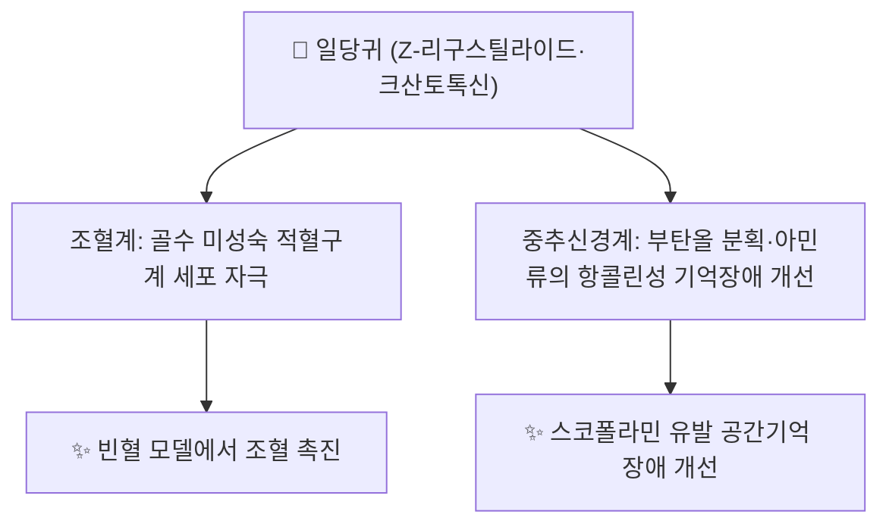

# 🌿 [[일당귀]] (日當歸, *Angelica acutiloba* (Siebold & Zucc.) Kitag.)

> **핵심 요약 (Key Summary)**:
> 산형과(Apiaceae) 일당귀(*Angelica acutiloba*, 일본명 토키/當帰)의 뿌리로, 한국 [[당귀]](참당귀, *A. gigas*)·중국당귀(*A. sinensis*)와 함께 당귀속(*Angelica*) 3대 기원식물 중 하나입니다.
> 중국당귀와 유전적으로 근연이나 지표 쿠마리드인 [[리구스틸라이드]] 함량이 뚜렷이 낮고(평균 약 133 µg/mL, 중국당귀 평균 829 µg/mL의 약 1/6 수준), 참당귀의 특징 성분인 [[데커신]]·[[데커시놀 안젤레이트]]는 함유하지 않는 것으로 보고됩니다.
> [[공진단]]·[[음양쌍보탕]] 등 보익 처방에서 참당귀와 함께 또는 대체 약재로 배오되나, 일당귀 단독의 인체 임상 연구는 극히 제한적입니다(⚠️).

---
## 📌 목차
1. [기본 본초 정보 & 화학 구조](#1-기본-본초-정보--화학-구조)
2. [핵심 분자약리 기전 & 전통 약리 활성](#2-핵심-분자약리-기전--전통-약리-활성)
3. [해부생체역학 / 근육·신경 대사 연계](#3-해부생체역학--근육신경-대사-연계)
4. [사상의학 및 체질별 임상 응용](#4-사상의학-및-체질별-임상-응용)
5. [한의학적 고찰(유래와 특징)](#5-한의학적-고찰유래와-특징)
6. [핵심 처방 비교 매트릭스](#6-핵심-처방-비교-매트릭스)
7. [출처 및 학술 참고 문헌 (References)](#7-출처-및-학술-참고-문헌-references)

---
## 1. 기본 본초 정보 & 화학 구조

| 항목 | 상세 내용 |
| :--- | :--- |
| **기원 식물** | 산형과(Apiaceae) 일당귀 *Angelica acutiloba* (Siebold & Zucc.) Kitagawa의 뿌리. 일본에서는 "토키(トウキ)", 국내에서는 "왜당귀"로도 불립니다. |
| **성미 (性味)** | 감(甘)·신(辛), 온(溫) — 당귀속 공통 성미로 통용되며, 일당귀 단독의 성미 규정은 이 노트 조사 범위에서 별도로 확인되지 않았습니다(⚠️ 당귀 계열 공통 기재 준용). |
| **귀경 (歸經)** | 간(肝)·심(心)·비(脾)경 — 당귀 계열 공통 귀경 준용(⚠️ 일당귀 단독 기재는 미확인). |
| **효능 (Actions)** | 보혈(補血)·활혈(活血)·윤장통변(潤腸通便) — 참당귀·중국당귀와 공유하는 당귀속 공통 전통 효능. |
| **주요 성분** | • **지표 성분**: [[리구스틸라이드]] ((Z)-Ligustilide, 참당귀·중국당귀보다 낮은 함량) • **유효 활성 성분군**: n-부틸리덴프탈라이드(n-Butylidenephthalide), [[페룰산]](Ferulic acid), [[클로로겐산]](Chlorogenic acid, 34~153 µg/mL), 크산토톡신(Xanthotoxin, 광감작성 푸라노쿠마린), 9,12-옥타데카디엔산 |
| **PubChem CID** | 본초 자체는 단일 화합물이 아니므로 CID가 없습니다. 지표성분 (Z)-리구스틸라이드는 [PubChem CID 5319022](https://pubchem.ncbi.nlm.nih.gov/compound/5319022)로 등록되어 있습니다. |

### 🔬 참당귀·중국당귀·일당귀 3종 비교 (기원 및 지표성분)

일본 HPLC/DAD 정량 비교 연구(Kitagawa 등, *Chem Pharm Bull* 2015, 63(7))에 따르면 당귀속 3종 뿌리의 지표성분 함량은 뚜렷이 구분됩니다.

| 구분 | 참당귀 (*A. gigas*, 한국) | 중국당귀 (*A. sinensis*) | **일당귀 (*A. acutiloba*, 일본)** |
| :--- | :--- | :--- | :--- |
| 데커신(Decursin) | 909~2,155 µg/mL — 참당귀 특유 성분 | 검출 미미/불검출 | 검출 미미/불검출 |
| 데커시놀 안젤레이트 | 460~1,580 µg/mL — 참당귀 특유 성분 | 검출 미미/불검출 | 검출 미미/불검출 |
| (Z)-리구스틸라이드 | 상대적으로 낮음 | 734~918 µg/mL(평균 829) — 최고 함량 | **59~308 µg/mL(평균 133) — 최저 함량** |
| 페룰산 | — | 15~348 µg/mL(평균 171) | 상대적으로 낮음 |
| 특이 성분 | 데커신류 쿠마린 | 코니페릴페룰레이트 | **크산토톡신, 클로로겐산** |

> 해당 연구는 "3종을 동일 생약으로 유통해서는 안 된다"고 결론지어 기원 감별의 중요성을 강조합니다(Kitagawa 2015). 유전학적으로는 중국당귀와 일당귀가 참당귀보다 서로 근연 관계에 있는 것으로 보고되어 있습니다(참당귀·중국당귀·일당귀 고찰 논문, 대한한의학회지 계열 32권 4호).

---
## 2. 핵심 분자약리 기전 & 전통 약리 활성

* **조혈 작용**: 일당귀 물 추출물이 5-플루오로우라실(5-FU)로 빈혈을 유도한 마우스에서 미성숙 적혈구계 세포(immature erythroid cell)를 자극하여 조혈을 촉진한다는 보고가 있습니다(참당귀·중국당귀·일당귀 비교 고찰 논문 인용).
* **인지기능(기억력) 개선**: 도키샤쿠야쿠산(當歸芍藥散, Toki-Shakuyaku-San)의 구성약재로서, 일당귀 부탄올 분획과 그 성분인 N-methyl-β-carboline-3-carboxamide 등 아민류가 스코폴라민(scopolamine) 유발 랫드 공간기억 장애를 8방 방사미로 시험에서 개선했다는 보고가 있습니다(Hatip-Al-Khatib et al., [PMID 15351791](https://pubmed.ncbi.nlm.nih.gov/15351791)).
* **광독성 주의**: 크산토톡신 등 광감작성 푸라노쿠마린을 함유하므로, 고용량·장기 국소 노출 시 광과민 반응 가능성이 이론적으로 존재합니다(푸라노쿠마린 일반 특성에 근거한 유추이며, 일당귀 단독의 광독성 임상 보고는 이 노트 조사 범위에서 확인되지 않았습니다 ⚠️).

> ⚠️ **내용 검토 필요**: 일당귀 관련 학술 문헌은 당귀속 전체 리뷰 논문 중에서도 6편 내외로 극히 제한적이며(대한한의학회지 계열 리뷰 지적), 인체 대상 임상시험 근거는 이 노트 조사 범위에서 확인되지 않았습니다. 위 서술은 대부분 동물실험(in vivo) 또는 성분 정량분석 연구에 근거합니다.

---
## 3. 해부생체역학 / 근육·신경 대사 연계

⚠️ 내용 검토 필요: 일당귀 단독의 근육·신경 대사(미토콘드리아 지방산 산화, 자율신경 조절 등)에 대한 직접 문헌은 이 노트 조사 범위에서 확인되지 않았습니다. [[당귀]](참당귀) 노트의 미세순환 개선(적혈구 연전현상 차단, ACE 억제) 기전은 데커신류 특이 성분에 근거한 것으로, 데커신이 없는 일당귀에는 그대로 적용하기 어렵습니다.

---
## 4. 사상의학 및 체질별 임상 응용

일당귀 자체의 사상의학적 체질 배속을 다룬 문헌은 이 노트 조사 범위에서 확인되지 않았습니다(⚠️). 임상에서는 [[당귀]](참당귀)의 보혈·활혈 적응증(혈허 위주 부인과·순환기 병증)을 준용하되, 참당귀 특유의 데커신류 근거(항종양·미세순환 개선)는 일당귀에 직접 적용하기 어렵다는 점(성분 조성 차이)에 유의해야 합니다.

---
## 5. 한의학적 고찰(유래와 특징)

일당귀는 일본 한방(漢方)에서 도키(トウキ)로 불리며 널리 쓰이는 당귀 기원 중 하나로, 도키샤쿠야쿠산·시모츠토(四物湯) 등 일본 한방 처방의 핵심 약재입니다. 국내 본초학에서는 참당귀(토당귀)를 정품으로 규정하는 경향이 강하며, 일당귀·중국당귀는 기원 감별·수입 유통 관리의 대상으로 다뤄지는 경우가 많습니다. 볼트 내 [[당귀]] 노트에서는 참당귀·중국당귀·일당귀를 부위별(당귀두·신·미) 효능과 함께 감별하고 있습니다.

---
## 6. 핵심 처방 비교 매트릭스

| 처방명 | 구성 약재(발췌) | 주치 병증 및 임상 타깃 | 특징 및 감별점 |
| :--- | :--- | :--- | :--- |
| [[공진단]] | [[녹용]], 일당귀, [[산수유]], [[사향]] | 선천·후천 원기 보강, 간신음허 | 참당귀 대신 일당귀를 배오하는 처방례로 볼트 내 확인됨 |
| [[음양쌍보탕]] | [[숙지황]], [[황기]], 일당귀, [[천궁]], [[백작약]] 등 다수 보익 약재 | 음양쌍보(陰陽雙補), 기혈 전반 허손 | 다수 보익약과 함께 배오되어 단일 약재 효능보다 방제 전체 시너지 목적 |

---
* **양약 상호작용 (Herb–Drug Interaction)**:
  * **항응고·항혈소판제 병용 주의** — 당귀속 약재 전반은 쿠마린류 성분을 함유하므로, 와파린·아스피린 등과 병용 시 출혈 위험 증가 가능성이 당귀 계열 공통 주의사항으로 다뤄집니다. 다만 참당귀의 데커신류와 달리 일당귀의 (Z)-리구스틸라이드·크산토톡신 자체의 항응고 상호작용을 직접 검증한 문헌은 이 노트 조사 범위에서 확인되지 않았습니다(⚠️).
  * **광과민성 약물 병용 주의** — 크산토톡신 등 푸라노쿠마린 함유로, 광과민성을 유발하는 양약(테트라사이클린계 항생제 등)과 병용 시 이론적으로 광독성이 더해질 가능성이 있습니다(직접 근거는 미확인 ⚠️).

## 7. 출처 및 학술 참고 문헌 (References)

1. Jeong SY, Kim HM, Lee KH, Kim KY, Huang DS. Quantitative analysis of marker compounds in Angelica gigas, Angelica sinensis, and Angelica acutiloba by HPLC/DAD. *Chemical & Pharmaceutical Bulletin*. 2015;63(7):504-511. PMID 25946978.
  * https://pubmed.ncbi.nlm.nih.gov/25946978/
   - **[연구 요약]**: HPLC/DAD로 3종 당귀속 뿌리의 데커신·데커시놀 안젤레이트·(Z)-리구스틸라이드·페룰산 등 함량을 정량 비교, 3종을 동일 생약으로 유통해서는 안 된다고 결론. (이전 판의 "Kitagawa I, 2015"는 제1저자 오기 — 실제 제1저자는 Jeong SY)
2. **참당귀, 중국당귀, 일당귀 및 그 구성 생화합물의 약리작용에 대한 고찰**. *대한한의학회지* 계열(제32권 4호). [원문 PDF](https://www.jkom.org/upload/32-4_01(1-24).pdf)
   - **[연구 요약]**: 3종 당귀 및 구성 생화합물의 약리작용을 종합한 국문 리뷰. 일당귀 관련 연구가 6편 내외로 매우 제한적임을 지적하며, 조혈작용(5-FU 유도 빈혈 마우스)·기억력 개선(스코폴라민 모델) 등 동물실험 근거를 정리.
3. Hatip-Al-Khatib I, Egashira N, Mishima K, Iwasaki K. Determination of the effectiveness of components of the herbal medicine Toki-Shakuyaku-San and fractions of Angelica acutiloba in improving the scopolamine-induced impairment of rat's spatial cognition in eight-armed radial maze test. *Journal of Pharmacological Sciences*. 2004;96(1):33-41. PMID 15351791.
  * https://pubmed.ncbi.nlm.nih.gov/15351791/
   - **[연구 요약]**: 도키샤쿠야쿠산 및 일당귀 분획이 스코폴라민 유발 랫드 공간기억 장애를 8방 방사미로 시험에서 개선함을 보고. (이전 판의 "Ang HH"는 제1저자 오기 — 실제 제1저자는 Hatip-Al-Khatib I)
4. **Angelica acutiloba**. Wikipedia; ScienceDirect Topics "Angelica Acutiloba".
   - **[참고]**: 기원식물 분류(산형과), 정유 성분(n-부틸 프탈라이드, γ-terpinene 등), 전통 부인과·빈혈 용도에 대한 일반 개요.

---

> 검증 메모 (2026-10-03): 서지를 PubMed와 대조하여 제1저자를 교정하였다 — ①"Kitagawa I, 2015, Chem Pharm Bull 63(7)" → 실제 제1저자 Jeong SY, 63(7):504-511 (PMID 25946978), ②"Ang HH" → 실제 제1저자 Hatip-Al-Khatib I, J Pharmacol Sci 2004;96(1):33-41 (PMID 15351791). 본문의 "Ang et al." 표기도 함께 교정. ②의 대한한의학회지 국문 리뷰는 PubMed 미색인으로 검증 대상에서 제외.
