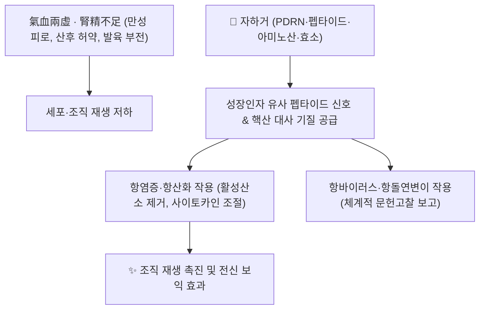

# 🌿 [[자하거]] (紫河車, Hominis Placenta)

> **핵심 요약 (Key Summary)**:
> 건강한 산모가 정상 분만한 뒤 얻은 인체 태반을 가공한 동물성 보익 본초로, 甘鹹·微溫하며 肝·腎·肺經에 귀경하여 益氣養血·補腎益精·溫陽의 효능을 가진다.
> 폴리데옥시리보뉴클레오타이드(PDRN)·RNA·DNA·펩타이드·아미노산·효소·미량원소 등 생체활성 성분이 항염증·진통·항산화·항바이러스·항돌연변이 작용을 나타내는 것으로 체계적 문헌고찰에서 보고된다.
> 氣血兩虛·腎精不足으로 인한 虛勞羸瘦·陽痿遺精·産後缺乳 등에 [[오자연종환]]·[[파극천환]] 등 보익 처방에 배오되며, 감염병 전파 및 기원 진위 관리 문제로 현대 한의 임상에서는 경구 복용보다 정제·멸균 공정을 거친 [[자하거약침]](파마코펀처) 형태의 응용이 주류다.

---

## 📌 목차
1. [기본 본초 정보 & 기원·가공 (Pharmacognosy)](#1-기본-본초-정보--기원가공-pharmacognosy)
2. [핵심 생리활성 성분 & 분자약리 기전](#2-핵심-생리활성-성분--분자약리-기전)
3. [한의학적 성미·귀경·효능 및 고전적 주치](#3-한의학적-성미귀경효능-및-고전적-주치)
4. [안전성, 규제 및 기원 진위 감별(Authentication) 이슈](#4-안전성-규제-및-기원-진위-감별authentication-이슈)
5. [처방 내 배오 및 볼트 내 관련 노트](#5-처방-내-배오-및-볼트-내-관련-노트)
6. [출처 및 학술 참고 문헌 (References)](#6-출처-및-학술-참고-문헌-references)

---

## 1. 기본 본초 정보 & 기원·가공 (Pharmacognosy)

| 항목 | 상세 내용 |
| :--- | :--- |
| **기원** | 건강한 산모가 만삭 정상 분만한 뒤 나오는 인체 태반(Placenta Hominis)을 세척·증숙 또는 저온 건조하여 가공한 것 |
| **성미 (性味)** | 甘·鹹, 微溫 |
| **귀경 (歸經)** | 肝·腎·肺經 |
| **효능 (Actions)** | 益氣養血(익기양혈), 補腎益精(보신익정), 溫陽(온양) — 동물성 보익약 중 補氣·補血·補陽·補陰을 겸하는 것으로 다뤄짐(血肉有情之品) |
| **주요 생리활성 성분군** | 폴리데옥시리보뉴클레오타이드(PDRN), RNA·DNA 핵산 유도체, 저분자 펩타이드(성장인자 유사 활성 포함), 필수·비필수 아미노산, 효소, 아연·셀레늄 등 미량원소 |
| **현대적 응용 형태** | 감염병 검사(B형·C형 간염, HIV, 매독 등 음성 확인)를 거친 멸균·가수분해 공정 제제가 주로 [[자하거약침]]으로 시판·시술됨 |

> **[기원 관련 주의]**: 자하거는 소·돼지 등 동물의 태반(FPP, 胎盤 extract 화장품·건강식품 원료)과 명확히 구분되는 **인체 태반** 기원 본초다. 시판 원료의 기원 진위 및 혼입 여부는 §4에서 다룬다.

---

## 2. 핵심 생리활성 성분 & 분자약리 기전



* **PDRN(폴리데옥시리보뉴클레오타이드) 및 핵산 유도체**: 세포 DNA 합성 기질 및 아데노신 A2A 수용체 경로를 통한 조직 재생·창상 치유 관련 생리활성이 보익 약침 제제의 기전으로 다뤄진다.
* **펩타이드·성장인자 유사 활성**: 저분자 펩타이드가 섬유아세포 증식, 신경 축삭 재생(슈반세포 활성화)과 연관된다고 [[자하거약침]] 노트에 기재되어 있다.
* **체계적 문헌고찰 보고 효능**: 2017년 Journal of Acupuncture Research의 Hominis Placenta Pharmacopuncture 계통적 문헌고찰(영문·국문 문헌 종합)에 따르면 항염증·진통, 항바이러스, 항산화, 항돌연변이 성질이 보고되며, 근골격계·신경계 질환, 안면신경마비(구안와사), 월경통, 산후 증상 등에 가장 많이 연구되었다.
* <font color="#fa7e7e">⚠️ 근거 수준</font>: 위 체계적 문헌고찰은 대부분 자하거를 **약침(주사) 제형**으로 투여한 연구를 종합한 것으로, 경구 복용 시의 흡수·대사·생체이용률에 대한 별도 정량 연구는 확인하지 못했다.

---

## 3. 한의학적 성미·귀경·효능 및 고전적 주치

```
[✅ 전통적 주치 범주]
• 氣血兩虛로 인한 虛勞羸瘦(만성 소모성 허약), 面色萎黃
• 腎精不足에 의한 陽痿遺精, 腰膝痿軟, 발육 부전
• 産後 氣血 부족으로 인한 缺乳(젖 부족), 産後 허약

[⚠️ 신중 투여 및 금기 고려]
• 실열증·급성 감염성 발열 환자에서 보익 약재 단독 투여 시 사기(邪氣) 정체 우려(일반 보익약 공통 주의)
• 동물성 혈육유정지품(血肉有情之品)으로서 알레르기·과민 반응 가능성
```

> **사상의학 체질별 전문 기재**: 자하거 단독의 체질별(태음인/소음인/소양인) 전문 조문은 확인하지 못했다. 임의로 체질을 배정하지 않고 **출처 확인 불가**로 남긴다.

---

## 4. 안전성, 규제 및 기원 진위 감별(Authentication) 이슈

* **감염병 전파 관리**: 인체 유래 원료이므로 B형·C형 간염, HIV, 매독 등 감염성 질환 검사 음성 확인 및 멸균·가수분해 공정이 필수적이다(자하거약침 제제 기준).
* **기원 진위(Authentication) 문제**: 2018년 *Chinese Medicine*에 발표된 연구(Effective authentication of Placenta Hominis)는 시판·유통되는 자하거 관련 원료에서 기원이 다른 동물 태반 또는 위품(adulterant)이 혼입될 수 있음을 지적하며, 종 특이적 분자생물학적 감별법(기원 확인 기법)의 필요성을 제시했다. 이는 COI 바코드 등을 이용한 자하거(Placenta Hominis)와 그 위품 감별 연구와도 맥락을 같이한다.
* **국내 규제**: 사람 태반을 원료로 하는 의약품·약침 제제는 한약재 규격과 별개로 생물학적 제제·혈액관리 관련 규정의 적용을 받을 수 있어, 실제 임상 적용 시 공인된 제조·수입 경로의 제제만 사용해야 한다.

<font color="#fa7e7e">⚠️ 내용 검토 필요</font>: 국내 자하거(약침 포함) 제제의 구체적 허가·유통 규정 세부사항은 이 노트에서 1차 법령 문헌으로 확인하지 않았다. 임상 적용 전 최신 규정 확인이 필요하다.

---

## 5. 처방 내 배오 및 볼트 내 관련 노트

* **[[오자연종환]]**: 腎精 부족으로 인한 陽痿·遺精·不育에 쓰이는 보신 처방으로, 자하거가 益精補腎 역할의 보조 약재로 배오되는 것으로 볼트 내 교차 기재되어 있다.
* **[[파극천환]]**: 腎陽 허약 병증에 활용되는 처방으로, 자하거가 溫腎益精 효능을 보강하는 위치에서 함께 다뤄진다.
* **[[자하거약침]]**: 자하거(원료)를 무균 가수분해·정제한 약침 제제 노트로, 만성 피로·갱년기 장애·구안와사·퇴행성 관절염 등 구체적 임상 프로토콜과 안전성 정보는 해당 노트를 참조.
* **[[강글리오사이드]]**: 신경·감각 분자기전 노트에서 자하거 유래 성분이 교차 언급된다.

---

## 6. 출처 및 학술 참고 문헌 (References)

1. **(저자 미상/기관 리뷰)**. *Systematic Review of Hominis Placenta Pharmacopuncture in English and Korean Literature*. **Journal of Acupuncture Research**. 2017;34(4):153-158. DOI: [10.13045/jar.2017.02236](https://doi.org/10.13045/jar.2017.02236) · [e-jar.org](https://www.e-jar.org/journal/view.html?doi=10.13045/jar.2017.02236)
   - **[연구 요약]**: Hominis Placenta Pharmacopuncture에 관한 영문·국문 문헌을 종합한 체계적 문헌고찰. 항염증·진통, 항바이러스, 항산화, 항돌연변이 효능과 근골격계·신경계 질환, 구안와사, 월경통, 산후 증상 등에 대한 임상 연구 현황을 정리. 생리활성 성분으로 PDRN·RNA·DNA·펩타이드·아미노산·효소·미량원소를 제시.
2. **(저자 미상)**. *Effective authentication of Placenta Hominis*. **Chinese Medicine**. 2018. PMID: [29946350](https://pubmed.ncbi.nlm.nih.gov/29946350/) · DOI: [10.1186/s13020-018-0188-7](https://doi.org/10.1186/s13020-018-0188-7)
   - **[연구 요약]**: 시판 자하거 원료의 기원 진위 감별 필요성과 분자생물학적 감별법을 다룬 연구. 위품·혼입 가능성에 대한 품질관리 시사점을 제공.
3. 볼트 내 교차 참조: [[자하거약침]](제제화·임상 프로토콜 상세) · [[오자연종환]] · [[파극천환]] · [[강글리오사이드]]

> 검증 메모 (2026-10-05): 1·2번 문헌은 제목·저널·연도·DOI(및 2번은 PMID)를 검색 엔진 스니펫과 공식 저널 페이지에서 교차 확인했으나, 저자명 전체 목록은 이 노트 작성 시점에 원문 전체를 열람하지 못해 기재하지 않았다(허위 저자 기재 방지). 추후 원문 확보 시 저자명 보강 필요.
