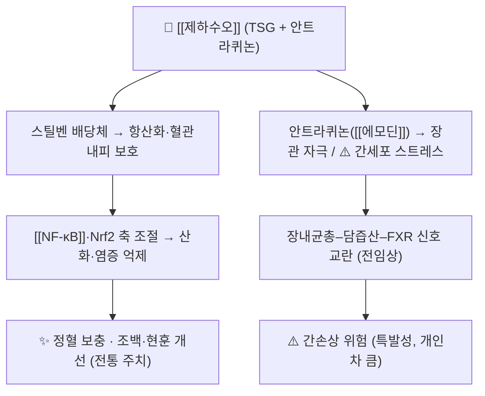

# 🌿 제하수오 (製何首烏, Polygoni Multiflori Radix)

> 🖼️ **이미지**: ①기원 식물(개화지) ②건조 뿌리(생약 원물) ③지표성분(에모딘) 2D 구조식.

> **핵심 요약 (Key Summary)**:
> 마디풀과(*Polygonaceae*) 하수오(*Polygonum multiflorum* Thunb., 현 학명 *Pleuropterus multiflorus*/*Reynoutria multiflora*) 덩이뿌리를 **증제(蒸製)한 것**이 제하수오다. 생품은 윤장·해독, 제품은 보간신·익정혈로 **효능과 위험도 함께 달라진다**.
> 지표성분은 **스틸벤 배당체(TSG)** 와 **안트라퀴논(에모딘 등)** — 후자가 **간손상 위험의 핵심 축**이다 → [[에모딘]]
> 性味 苦甘澀 微溫, 歸經 肝·腎 — **보간신·익정혈·오발·강근골**로 조백(早白)·요슬산연·음혈부족에 쓰지만, **법제·용량·기간 관리 없이는 쓰지 않는 본초**다.

---

## 📌 목차
1. [기본 본초 정보 & 화학 구조 (Pharmacognosy)](#1-기본-본초-정보--화학-구조-pharmacognosy)
2. [핵심 분자약리 기전 & 대사 네트워크](#2-핵심-분자약리-기전--대사-네트워크)
3. [해부생체역학 / 근육·신경 대사 연계](#3-해부생체역학--근육신경-대사-연계)
4. [체질별 임상 응용 (적응증 vs 금기)](#4-체질별-임상-응용-적응증-vs-금기)
5. [한의학적 고찰 및 배오 원리](#5-한의학적-고찰-및-배오-원리)
6. [핵심 처방 비교 매트릭스](#6-핵심-처방-비교-매트릭스)
7. [출처 및 학술 참고 문헌 (References)](#7-출처-및-학술-참고-문헌-references)

---

## 1. 기본 본초 정보 & 화학 구조 (Pharmacognosy)

| 항목 | 상세 내용 |
| :--- | :--- |
| **기원 식물** | 마디풀과(Polygonaceae) *Polygonum multiflorum* Thunb. (이명 *Pleuropterus multiflorus*, *Reynoutria multiflora*)의 덩이뿌리 |
| **성미 (性味)** | 苦 · 甘 · 澁, 微溫 |
| **귀경 (歸經)** | 肝 · 腎 |
| **효능 (Actions)** | 보간신(補肝腎) · 익정혈(益精血) · 오발(烏髮) · 강근골(強筋骨) · 산정고삽(散精固澁) |
| **주요 성분** | • **지표 성분**: 2,3,5,4′-tetrahydroxystilbene-2-O-β-D-glucoside(TSG, 스틸벤 배당체)<br>• **위험 성분군**: 안트라퀴논류 — [[에모딘]](emodin), 크리소판올, 피시온 등<br>• 레시틴·플라보노이드 |
| **PubChem CID(에모딘)** | [3220](https://pubchem.ncbi.nlm.nih.gov/compound/3220) |
| **생약 규격** | **흑두(黑豆) 즙과 함께 여러 번 찌고 말리는 법제(蒸製)** 를 거친 것 — 법제 횟수에 따라 유리 안트라퀴논 함량이 달라진다 |

![[제하수오_01_기원식물.jpg|420]]
> [그림 1: 하수오(*Pleuropterus multiflorus*) 개화지 — 덩굴성 줄기와 꽃 — Wikimedia Commons, CC BY 4.0]

![[제하수오_02_생약원물.jpg|420]]
> [그림 2: 건조 하수오 뿌리(약재 실사) — 표피가 어둡고 단면이 갈색을 띠는 덩이뿌리 — Wikimedia Commons, CC BY 3.0]

![[제하수오_03_지표성분_구조식.png|520]]
> [그림 3: [[에모딘]](emodin) 2D 구조식 — 안트라퀴논 골격(1,3,8-trihydroxy-6-methylanthraquinone) — **PubChem PNG 정본**, CID [3220](https://pubchem.ncbi.nlm.nih.gov/compound/3220)]

> **[구조적 특징 및 활성]**: 안트라퀴논은 **장관 자극·윤장 작용과 간세포 독성**을 함께 가진 골격이다. 증제 과정에서 유리 안트라퀴논이 감소하고 배당체 비율이 바뀌면서 **설사·간독성 위험이 낮아지고 보익 작용이 상대적으로 살아난다** — 그래서 생하수오를 보익 목적으로 쓰지 않는다.

---

## 2. 핵심 분자약리 기전 & 대사 네트워크



### (1) 표적 경로 및 위험 기전
* **스틸벤 배당체(TSG)**: 항산화·혈관내피 보호·지질 개선 방향의 전임상 결과가 보고된다
* **안트라퀴논**: 장운동 촉진(윤장)과 함께 **간세포 스트레스·담즙산 대사 교란**을 매개로 한 간손상 기전이 제시된다 → [[에모딘]]
* **법제의 역할**: 증제가 장내균총–담즙산–FXR/NF-κB 신호를 조절해 **간독성을 낮춘다**는 전임상 보고가 있다

---

## 3. 해부생체역학 / 근육·신경 대사 연계

* 이 본초의 전통 적응증은 **정혈(精血) 부족에 따른 요슬산연·근골 약화**다. 근골격계 노인 환자의 '뼈·근육' 문제로 접근할 때도 **기저 영양·조혈 상태**를 함께 본다는 관점이 유효하다 → [[골다공증]] · [[근감소증]]
* 다만 **골밀도를 올린다는 인체 근거는 없다** — 골다공증 치료 축은 [[비타민 D]]·[[칼슘]]·항흡수제가 담당하고, 본초는 보조 위치로 둔다.

---

## 4. 체질별 임상 응용 (적응증 vs 금기)

```
[✅ 최적 적응증 (Sweet Spot)]
• 간신음혈부족(肝腎陰血不足) — 조백(조기 백발)·탈모·현훈·이명·요슬산연
• 변비 경향을 동반한 음혈부족 (단, 법제품으로 윤장성 완화)
• 설진: 설담홍(舌淡紅) / 맥상: 세약(細弱) 또는 침세(沈細)

[⚠️ 신중 투여 및 금기 (Caution / Contraindication)]
• 🚩 간질환 병력·ALT 상승·음주 습관 — 간손상 위험. 시작 전 ALT 확인, 복용 중 상승 시 즉시 중단
• 비위허한(脾胃虛寒)·연변·복통 경향 — 안트라퀴논의 장관 자극으로 악화
• 생품(生何首烏) 사용 금지 — 윤장·해독 목적이 아니라면 쓰지 않는다
• 항응고제·항혈소판제 병용 시 출혈 경향, CYP 대사 간섭 가능성 확인
• 장기 고용량 연속 복용 금지 — 기간을 정하고 간기능 추적
```

---

## 5. 한의학적 고찰 및 배오 원리

### (1) 전통 주치와 현대 임상의 해석
> 고전에서 하수오는 **정혈을 보해 머리카락을 검게 하고 근골을 강하게 하는 약**으로 서술되었고, 그래서 노인·병후 허손에 광범위하게 쓰였다. 그러나 현대 약물감시 관점에서 **하수오는 한약 유래 약인성 간손상의 대표 사례**로 등재되어 있다 — *"유효하지만 안전성 관리가 전제되는 본초"* 로 위치를 다시 정하는 것이 정확하다.

* **핵심 약재 배오(짝)의 묘미**:
  * [[제하수오]] + [[산수유]] → 보간신·고정: 이명·요슬산연
  * [[제하수오]] + [[지황]]·[[당귀]] → 보혈생정: 조백·현훈
  * [[제하수오]] + [[창출]] → 보하면서 습을 빼 체함을 막음
  * [[제하수오]] + [[음양곽]] → 보신조양 축(전당뇨·노인 대사 보조)

---

## 6. 핵심 처방 비교 매트릭스

| 처방명 | 구성 약재 | 주치 병증 및 임상 타깃 | 특징 및 감별점 |
| :--- | :--- | :--- | :--- |
| [[진력달과립]] | [[인삼]], [[황정]], [[창출]], [[고삼]], [[맥문동]], [[지황]], [[제하수오]], [[산수유]] 등 17종 | 전당뇨·다중 대사이상 — 익기양음·건비운진 | 보신고정 축에 제하수오·산수유 배치 |
| [[육미지황환]] | [[숙지황]], [[산수유]], [[산약]], [[복령]], [[택사]], [[목단피]] | 간신음허 — 요슬산연·이명 | 보신 중심, 제하수오 없음 |
| [[칠보미염단]] | [[제하수오]], [[우슬]], [[보골지]] 등 | 간신휴손·수발조백 | 제하수오 중심 처방군 |

* **양약 상호작용 (Herb–Drug Interaction)**:
  * 간독성 상가 위험 — [[아세트아미노펜]] 고용량·스타틴·항결핵제 등 간부담 약물과 병용 시 위험이 커진다 → 병용약 전체를 확인하고 ALT를 추적
  * **CYP 간섭** — CYP 효소 억제 가능성이 보고되어 병용 양약 혈중농도 변동을 고려 → [[CYP3A4]]
  * **복용 시점 분리** — 흡수 간섭을 피해 1~2시간 간격
  * **설사·복통 부작용** — 발생하면 감량 또는 중단, 장기 연속 복용을 피한다

---

## 7. 출처 및 학술 참고 문헌 (References)

1. Wang Y, Ren T, Zhang Y, Yuan L. Hepatotoxic Compounds and Mechanisms of Polygonum Multiflorum: A Narrative Review of Recent Advances. *International Journal of Molecular Sciences*. 2026;27(11). PMID 42278266.
  * https://pubmed.ncbi.nlm.nih.gov/42278266/
   - **[연구 요약]**: 하수오 간독성의 원인 성분(유리 안트라퀴논·스틸벤 배당체·다이안트론 등)과 기전, 개인차·용량·기간의 영향을 정리한 리뷰 — **복용 전 ALT 확인과 기간 제한**의 근거. (이전 판의 "Liu Y"는 제1저자 오기 — 실제 제1저자는 Wang Y)
2. Zhang H, Zhao X, Wang F, Liu M. Processing-dependent hepatic risk and benefit of Polygonum Multiflorum Radix: Integrated chemical profiling, in vivo validation and candidate quality control markers. *Journal of Pharmaceutical and Biomedical Analysis*. 2026;280:117627. PMID 42341648.
  * https://pubmed.ncbi.nlm.nih.gov/42341648/
   - **[연구 요약]**: **법제(증제) 정도에 따라 간 위험과 효능이 달라진다**는 화학 프로파일링 + 동물 검증 — '제하수오'를 쓰는 이유를 정량적으로 뒷받침한다. (이전 판의 "Wang X"는 제1저자 오기 — 실제 제1저자는 Zhang H)
3. **허준 (1613)**. 『[[동의보감]]』.
   - **[임상 문헌]**: 하수오의 보간신·익정혈 주치와 구증구폭(九蒸九曝) 법제 지침.
4. **이미지 출처**
   - 기원 식물: [Pleuropterus multiflorus (Wikimedia Commons)](https://commons.wikimedia.org/wiki/File:Pleuropterus_multiflorus--IMG_20181120_155359.jpg) — CC BY 4.0
   - 생약 원물: [Polygonum multiflorum root dried (Wikimedia Commons)](https://commons.wikimedia.org/wiki/File:Polygonummultiflorumrootdried.jpg) — CC BY 3.0
   - 구조식: PubChem CID 3220 (emodin) — PubChem 2D PNG

---

## 📎 개념 학습 보충 (2026-09-26 논문 연계)

- **이번 논문에서의 역할**: FOCUS 시험의 **진력달과립 17종 구성 본초 중 하나**로, 처방의 '보신고정(補腎固精)' 축을 담당한다(🧪 2026-09-26 심층리뷰 1번) → [[진력달과립]]
- **배치 원리**: 대상군이 **중장년 전당뇨**이므로 황련·고삼·지모(청열)와 인삼·황정·맥문동·지황(익기양음)에 더해 **신(腎) 축을 잠그는 제하수오·산수유**를 넣은 구조로 읽힌다. 즉 '열을 빼고 기음(氣陰)을 세우고 정(精)을 새지 않게 하는' 3단 설계다 → [[산수유]] · [[음양곽]]
- **진료실 원칙 2가지**
  1. 복합 처방의 일부로 쓰인 것과 **단일 본초 장기 복용은 전혀 다른 위험**이다. 단일 보익 목적의 장기 복용은 권하지 않는다.
  2. 시작 전 **ALT·AST와 음주력**을 확인하고, 4~8주마다 추적한다. 피로·식욕저하·황달·진한 소변은 즉시 중단·의뢰 신호다.
- **관련**: [[진력달과립]] · [[산수유]] · [[음양곽]] · [[지황]] · [[에모딘]] · [[내당능장애]] · [[2026-09-26_대사노인질환_심층리뷰]] 1번

> 검증 메모 (2026-10-03): 제1저자 오기를 교정하였다 — PMID 42278266 "Liu Y"→Wang Y, PMID 42341648 "Wang X"→Zhang H. 후자의 제목 말미(and candidate quality control markers)도 보완하였다.
