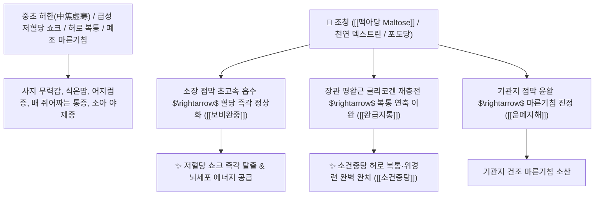

# 🌿 [[조청]] (造淸 / 膠飴 / 飴糖, Maltosum / 천연맥아조청)

> **핵심 요약 (Key Summary)**:
> 멥쌀이나 찹쌀의 곡물 전분을 엿기름(맥아의 아밀라아제 효소)으로 당화하여 농축한 천연 이당류 조청 (교이 膠飴 / 이당 飴糖)
> 고순도 천연 [[맥아당]](Maltose)이 소화기 부담 없이 신속히 글루코오스로 분해 흡수되어 급속한 ATP 에너지 공급과 세포 글리코겐을 충전하여 보비완중 및 완급지통 작용 발휘
> [[상한론]]의 허로 복통(배가 쥐어짜듯 아프고 식은땀이 남)·소화불량 소아 허약 체질 및 당뇨 환자의 저혈당 쇼크 방지·마른기침(폐조해수)을 치료하는 천하제일의 [[보비완중]](補脾緩中)·[[완급지통]](緩急止痛)·[[소건중탕]](小建中湯)의 군약(君藥)

---
## 📌 목차
1. [기본 본초 정보 & 화학 구조 (Pharmacognosy)](#1-기본-본초-정보--화학-구조-pharmacognosy)
2. [핵심 분자약리 기전 & 맥아당·신속 포도당 공급·위장관 연축 완화 네트워크](#2-핵심-분자약리-기전--맥아당신속-포도당-공급위장관-연축-완화-네트워크)
3. [해부생체역학 / 소장 융모 미세점막 & 간세포 글리코겐 대사 연계](#3-해부생체역학--소장-융모-미세점막--간세포-글리코겐-대사-연계)
4. [사상의학 및 임상 응용 (저혈당 쇼크 vs 허로 복통 특화)](#4-사상의학-및-임상-응용-저혈당-쇼크-vs-허로-복통-특화)
5. [상한론 『약징(藥徵)』 분석 및 배오 원리 (소건중탕 & 대건중탕)](#5-상한론-약징藥徵-분석-및-배오-원리-소건중탕--대건중탕)
6. [핵심 처방 비교 매트릭스](#6-핵심-처방-비교-매트릭스)
7. [출처 및 학술 참고 문헌 (References)](#7-출처-및-학술-참고-문헌-references)

---
## 1. 기본 본초 정보 & 화학 구조 (Pharmacognosy)

> [!abstract]+ 🧪 3D 약리 분자 구조 (Interactive 3D Viewer)
> <iframe src="https://molecule-viewer-rho.vercel.app/?cid=439186" style="width: 100%; height: 600px; border: none; border-radius: 12px; box-shadow: 0 4px 20px rgba(0,0,0,0.15);" allowfullscreen></iframe>


| 항목 | 상세 내용 |
| :--- | :--- |
| **기원 재료** | 멥쌀, 찹쌀 또는 옥수수 전분을 맥아(엿기름)의 아밀라아제로 당화 발효시켜 고아 만든 맑은 당 시럽 (교이 膠飴 / 이당 飴糖) |
| **성미 (性味)** | 甘, 溫 (달고 향기로우며 성질이 따뜻하고 윤택함) |
| **귀경 (歸經)** | 脾·胃·肺經 (비경, 위경, 폐경) - **중초를 크게 보하고 폐를 적심** |
| **효능 (Actions)** | [[보비완중]](補脾緩中), [[완급지통]](緩急止痛), [[윤폐지해]](潤肺止咳), [[생진보액]](生津補液) |
| **주요 성분** | • **핵심 이당류(지표물질)**: [[맥아당]] (Maltose, 2분자의 $\alpha$-D-글루코오스 결합), 포도당(Glucose)<br>• **다당류 분획**: 덱스트린(Dextrin), 말토트리오스<br>• **미네랄 및 유기산**: 칼륨, 인, 칼슘, 비타민 B군 |

> **[유래 및 본초학적 기전]**:
> * 곡물을 고아 맑게(淸) 만든 천연 조청(造淸)으로, 전통 한의학에서는 **'교이(膠飴)'** 또는 **'이당(飴糖)'**이라 부르며 최고의 기력 회복제로 사용했습니다.
> * 설탕(자당: 포도당+과당), 물엿(불순물이 섞인 전분당)과 달리 **순수한 맥아당(이당류) 구조로 이루어져 소화 효소 소모 없이 혈액 속으로 즉각 흡수되는 '천연 포도당 수액'** 역할을 합니다.
> * 소화 흡수가 극도로 떨어진 만성 허약 환자, 소아의 허로 복통, 그리고 **당뇨 환자의 급성 저혈당 쇼크를 예방하고 치료하는 구급 에너지원**입니다.

### 🔬 조청의 주요 맥아당 화학 구조
```
     [ $\alpha$-D-글루코오스 ] ───( $\alpha-1,4$ 글리코시드 결합 )───> [ $\alpha$-D-글루코오스 ]  <-- 맥아당 (Maltose)
```
> **[구조적 특징 및 급속 에너지 대사]**: 맥아당은 소장 상피세포 브러시 보더의 말타아제(Maltase)에 의해 즉각 2분자의 순수 포도당으로 분해되어 인슐린 수용체 저항성 환자에게도 가장 신속하게 세포 내 ATP 생성을 유도합니다.

---
## 2. 핵심 분자약리 기전 & 맥아당·신속 포도당 공급·위장관 연축 완화 네트워크



### (1) 표적 보비완중 및 저혈당 구급 작용
* **저혈당 쇼크 및 만성 소화불량 환자 당 공급**:
  * 혈당이 급격히 떨어져 식은땀을 흘리고 손을 떨며 기절하려는 저혈당 환자에게 즉각적인 당을 공급하여 뇌 손상을 방지합니다.
* **허로 복통 및 소아 야제증 완치 ([[완급지통]] 緩急止痛)**:
  * 비위가 차고 허약하여 밤마다 배가 아파 우는 어린이나 사지가 쑤시는 허로증을 달래줍니다 ([[소건중탕]]).
* **폐조 해수 마른기침 진정 ([[윤폐지해]] 潤肺止咳)**:
  * 진액이 말라 인후가 건조하고 가래 없이 켁켁거리는 만성 마른기침을 점막을 적셔 치료합니다.

---
## 3. 해부생체역학 / 소장 융모 미세점막 & 간세포 글리코겐 대사 연계

* **간문맥 혈당 수송체(GLUT2) 활성화**:
  * 간세포 내 신속한 글리코겐 합성을 유도하여 기아 및 탈진 상태를 개선합니다.

---
## 4. 사상의학 및 임상 응용 (저혈당 쇼크 vs 허로 복통 특화)

```
[✅ 최적 적응증 (Sweet Spot)]
• 소아 허약 체질: 밥을 잘 안 먹고, 밤에 배가 아프다고 울며, 코피를 자주 흘리는 소아 ([[소건중탕]])
• 당뇨병 환자의 인슐린 과다 투여로 인한 급성 저혈당 쇼크 구급
• 중병 후 쇠약기 환자의 천연 에너지 보충 수액제
• 복부 근육이 긴장되어 쥐어짜듯 아픈 위장관 경련통
```

---
## 5. 상한론 『약징(藥徵)』 분석 및 배오 원리 (소건중탕 & 대건중탕)

### (1) 장중경의 허로 치료 최고 명방: 소건중탕(小建中湯)
* **완급지통 최고 명약 배오**:
  * [[교이]](조청)` (대량 1홉) + [[백작약]] (증량) + [[계지]] + [[감초]] + [[생강]] + [[대추|대조]] $\rightarrow$ 중초를 튼튼하게 세우는 불후의 명방 ([[소건중탕]])
  * [[교이]](조청)` + [[촉초]] + [[건강]] + [[인삼]] $\rightarrow$ 극심한 한산 복통을 치료 ([[대건중탕]])

---
## 6. 핵심 처방 비교 매트릭스

| 처방명 | 구성 약재 | 주치 병증 및 임상 타깃 | 특징 및 감별점 |
| :--- | :--- | :--- | :--- |
| [[소건중탕]] | [[계지가작약탕]] 원방 + [[교이]](조청 대량) | 허로 복통, 소아 야제증, 피로 권태, 사지 산통, 식욕부진 | 중초를 보하는 황제방 |
| [[대건중탕]] | [[촉초]], [[건강]], [[인삼]], [[교이]](조청) | 중초 허한, 복통 창만, 배에서 뱀이 기어가듯 뭉치는 산통 | 극심한 복부 냉통을 온난화 |
| [[황기건중탕]] | [[소건중탕]] + [[황기]] | **허로 자한, 도한, 기혈 양허, 창상 치유 지연** | 보기와 완중을 겸비 |

---
## 7. 출처 및 학술 참고 문헌 (References)

1. **대한민국약전외한약(생약)규격집(KHP) 제5개정 (2020)**. 이당 (飴糖 / 교이) 규격 기준.
   - **[공정서 규격]**: 맥아 발효 당화물의 성상, 순도시험 및 총당 함량 기준 명시.
2. **장중경 (張仲景, 200)**. 『금궤요략(金匱要略)』: 혈비허로병맥증병치(血痺虛勞病脈證幷治) 조문.
   - **[고전 원전]**: "虛勞裏急, 諸不足, 黃芪建中湯 主之, 小建中湯 亦主之..." - 교이(조청)의 허로 복통 치료 원리 제시.