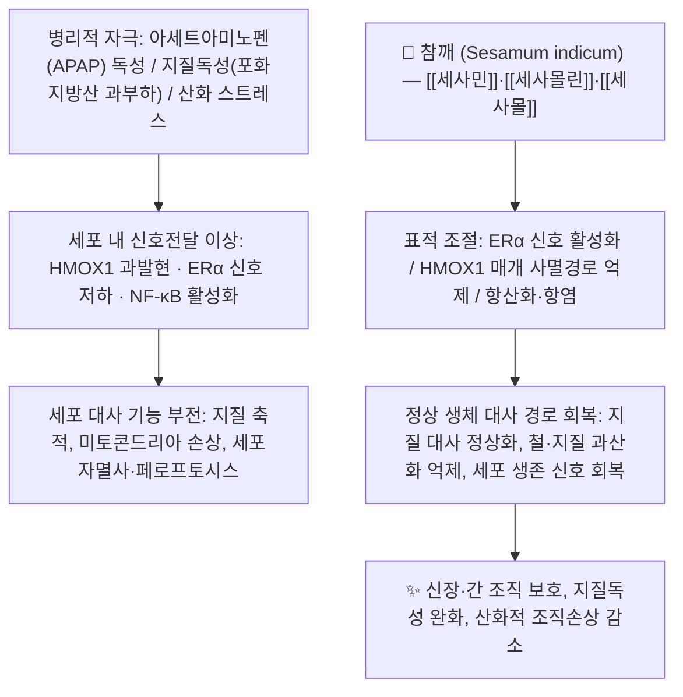

# 🌿 [[참깨]] (胡麻·黑芝麻, *Sesamum indicum* L. / Semen Sesami)

> **핵심 요약 (Key Summary)**:
> 참깨과(Pedaliaceae) 기원식물 *Sesamum indicum* L.의 성숙한 **종자(種子)**를 약용하며, 흑색 종자를 黑芝麻(흑지마)라 하여 補益 목적으로, 백색 종자를 白芝麻라 하여 주로 食用·潤燥 목적으로 쓴다.
> 핵심 지표 성분인 [[세사민]](Sesamin)을 비롯한 [[리그난]]류가 **[[에스트로겐 수용체 알파]](ERα) 신호 활성화** 및 **[[HMOX1]] 매개 [[세포자멸사]]·[[페로프토시스]] 억제** 경로를 조절하여 지질독성 완화·조직 보호 효과를 발휘한다.
> 한의학적으로는 [[보음약]]·[[보혈약]] 계열의 **補肝腎·益精血·潤腸燥** 약재로, 肝腎陰虛로 인한 頭暈眼花·鬚髮早白·腸燥便秘에 응용되며, **[[상한론]] 처방에는 등장하지 않아 『약징(藥徵)』에 조문이 수재되어 있지 않다**(고전적 연원은 『神農本草經』 上品 胡麻).

---
## 📌 목차
1. [기본 본초 정보 & 화학 구조 (Pharmacognosy)](#1-기본-본초-정보--화학-구조-pharmacognosy)
2. [핵심 분자약리 기전 & 대사 네트워크](#2-핵심-분자약리-기전--대사-네트워크)
3. [해부생체역학 / 근육·신경 대사 연계](#3-해부생체역학--근육신경-대사-연계)
4. [사상의학 및 체질별 임상 응용 (적응증 vs 금기)](#4-사상의학-및-체질별-임상-응용-적응증-vs-금기)
5. [한의학적 고찰(유래와 특징) 및 배오 원리](#5-한의학적-고찰유래와-특징-및-배오-원리)
6. [핵심 처방 비교 매트릭스](#6-핵심-처방-비교-매트릭스)
7. [출처 및 학술 참고 문헌 (References)](#7-출처-및-학술-참고-문헌-references)

---
## 1. 기본 본초 정보 & 화학 구조 (Pharmacognosy)

> [!abstract]+ 🧪 핵심 지표성분 3D 분자 구조 (Interactive 3D Viewer)
> <iframe src="https://molecule-viewer-rho.vercel.app/?cid=72307" width="100%" height="450px" frameborder="0" allow="webgl" style="border-radius: 8px;"></iframe>

| 항목 | 상세 내용 |
| :--- | :--- |
| **기원 식물** | 참깨과(Pedaliaceae, 호마과) *Sesamum indicum* L.의 성숙한 종자(種子, Semen Sesami). 한의학에서는 黑色種子를 **[[흑지마]](黑芝麻)**, 白色種子를 白芝麻로 구분하며, 補益·약용 목적에는 통상 黑芝麻를 쓴다. |
| **성미 (性味)** | 甘, 平 (黑芝麻는 甘平에 가깝고, 炒用하면 약간 偏溫·향기 增加). 油脂性 潤下 작용이 두드러진다. |
| **귀경 (歸經)** | 肝, 腎, 大腸 (문헌에 따라 脾·肺를 포함하기도 함) |
| **효능 (Actions)** | **補肝腎, 益精血, 潤腸燥, 烏鬚髮** — 補益類(補陰·補血) 효능 + 潤下類(潤腸通便) 효능을 겸한다. |
| **주요 성분** | • **지표 성분**: [[세사민]](Sesamin), [[세사몰린]](Sesamolin)<br>• **유효 활성 성분군**: [[세사몰]](Sesamol), [[세사민올]](Sesaminol) 등 [[리그난]]류, [[γ-토코페롤]]을 포함한 토코페롤류, [[피토스테롤]](β-sitosterol 등), 불포화지방산(oleic acid, linoleic acid), 단백질·무기질(칼슘·철분)·비타민 B군<br>• **대략적 조성**: 참깨 종자는 지질(참깨유)을 약 45~60% 함유하는 대표적 油糧種子이며, 단백질은 약 20% 수준. 리그난 총함량은 **품종·산지·볶음·탈지 여부에 따라 편차가 커서 본 노트에서는 단일 수치로 확정하지 않음(근거 미확인)**. |
| **PubChem CID** | [72307](https://pubchem.ncbi.nlm.nih.gov/compound/72307) (Sesamin) |

### 🔬 주요 지표물질 화학 구조 해설 (구조 서술)
> **[[세사민]](Sesamin)**: C20H18O6, 분자량 약 354.35. **두 개의 tetrahydrofuran 환이 융합된 furofuran(bis-epoxy) 리그난 골격**에, 양쪽 말단으로 **methylenedioxyphenyl(피페로닐) 환 2개**가 결합한 대칭적 구조. 분자 내에 유리 페놀성 수산기가 없어 **라디칼 소거능 자체는 [[세사몰]]보다 낮지만**, 체내 대사·흡수 후 여러 신호경로를 조절하는 **대사조절형 리그난**으로 분류된다.
> **[[세사몰린]](Sesamolin)**: 세사민과 유사한 furofuran 골격을 공유하되 산소 결합 양상이 다른 리그난으로, 가수분해·열처리 시 [[세사몰]]로 전환된다.
> **[[세사몰]](Sesamol)**: 3,4-methylenedioxyphenol(C7H6O3, 분자량 약 138.12)로, **유리 페놀성 수산기를 가진 저분자 항산화 대사산물**. 참깨유 정제 과정 및 세사몰린 분해에서 생성되며 강한 항산화 활성의 주체로 거론된다.
> **[[세사민올]](Sesaminol)**: 세사민의 수산화 유도체 계열로, 배당체(세사민올 글루코시드) 형태로도 존재한다.
> **구조적 특징과 생체이용률**: 리그난은 **지용성**이어서 참깨유와 함께 섭취할 때 흡수가 개선되는 것으로 리뷰에서 정리되며, 흡수된 일부 리그난은 **장내 미생물 대사**를 거쳐 [[엔테로락톤]](enterolactone) 등 포유류 리그난으로 전환되어 약한 에스트로겐성 활성을 나타낸다(Andargie et al., 2021). 배당체 형태의 정확한 흡수율·생체이용률 수치는 제공 문헌 범위에서 확인되지 않음(근거 미확인).

---
## 2. 핵심 분자약리 기전 & 대사 네트워크



### (1) 표적 수용체 및 신호전달 경로

* **[[에스트로겐 수용체 알파]](ERα) 신호 활성화**: [[세사민]]은 지질독성(lipotoxicity) 및 지질 축적 모델에서 **ERα 신호경로 활성화**를 통해 지질 축적과 세포 독성을 개선하는 것으로 보고되었다(Pham & Lee, 2023, *Biochem Pharmacol*). 즉 참깨 리그난의 지질대사 개선 효과 일부가 **핵수용체(ERα) 매개 전사조절** 수준에서 설명된다. 다만 세사민이 ERα에 **직접 결합하는 리간드인지, 상위 신호를 통한 간접 활성인지**는 제공 문헌 범위에서 확정되지 않음(근거 미확인).

* **[[HMOX1]] 매개 [[세포자멸사]]·[[페로프토시스]] 억제**: 아세트아미노펜(APAP) 유도 **신장독성** 모델에서 세사민이 **HMOX1 매개 세포자멸사와 페로프토시스(철 의존성 지질 과산화 세포사)를 억제**하여 신조직을 보호하는 것으로 보고되었다(Zhu & Ren, 2025, *Redox Rep*). 이는 세사민의 보호 효과가 단순 항산화를 넘어 **세포사 조절 프로그램(apoptosis·ferroptosis) 차단**에 관여함을 시사한다. 모델별 유효 용량, GSH/GPX4·Fe²⁺ 등 세부 지표 변화 수치는 제공 문헌 요약 범위에서 확인되지 않음(근거 미확인).

* **항산화 네트워크**: 참깨 리그난은 **지질 과산화 억제, 라디칼 소거, 항산화 효소계 조절**을 통해 산화 스트레스를 낮추는 것으로 여러 리뷰에서 정리된다(Andargie et al., 2021; Wei & Zhao, 2022). 특히 리그난이 **[[γ-토코페롤]]의 대사(측쇄 산화)를 억제하여 조직 내 비타민 E 활성을 보존**한다는 기전은 참깨 리그난 연구에서 반복적으로 거론되는 대표 기전이다(Wei & Zhao, 2022).

* **대사 및 면역 조절(항염)**: 참깨 종자·오일 추출물은 **항염, 항산화, 항균, 항암, 항당뇨, 완하(緩下)** 활성이 민족약리학·약리학 리뷰에서 종합 정리되어 있다(Mili & Das, 2021). 분자 수준에서는 [[NF-κB]] 등 염증성 전사인자 활성 억제와 염증성 사이토카인(TNF-α, IL-6 등) 저하 기전이 일반적으로 제시되나, **제공된 6편 중 이들 사이토카인의 개별 정량 수치를 직접 보고한 연구는 없어 근거 수준을 구분해 해석해야 한다**.

* **지질·콜레스테롤 대사**: 참깨의 [[피토스테롤]] 및 불포화지방산 조성은 콜레스테롤 흡수 경쟁 억제·담즙산 배설 촉진 등 지질 프로파일 개선과 연결되어 리뷰에서 다루어진다(Wei & Zhao, 2022). 참깨 리그난의 대사조절(지방산 산화·지질 합성 전사인자) 관련 세부 분자 경로는 제공 문헌에서 개별 검증 수준까지 제시되지 않음(근거 미확인).

### (2) 성분·활성 요약표

| 성분 | 화학 분류 | 주요 보고 활성 | 근거 |
| :--- | :--- | :--- | :--- |
| [[세사민]] | furofuran 리그난 | ERα 신호 활성화를 통한 지질독성·지질축적 개선 / HMOX1 매개 세포자멸사·페로프토시스 억제 / 항산화 | Pham & Lee 2023; Zhu & Ren 2025; Andargie 2021 |
| [[세사몰린]] | furofuran 리그난 | 항산화, 세사몰 전구체 | Andargie 2021 |
| [[세사몰]] | 페놀성 리그난 대사산물 | 강한 라디칼 소거·지질 과산화 억제 | Andargie 2021 |
| [[γ-토코페롤]] | 토코페롤 | 비타민 E 활성 보존(리그난과 상승) | Wei & Zhao 2022 |
| 참깨유(지질) | oleic/linoleic acid 등 | 세포막 지질 조성·산화 균형에 기여 | Wei & Zhao 2022 |

---
## 3. 해부생체역학 / 근육·신경 대사 연계

* **근육 섬유 대사**:
  * 참깨 리그난·오일이 **골격근의 유산소/무산소 대사, 미토콘드리아 지방산 산화, 칼슘 채널, 젖산 대사**에 직접 작용한다는 연구는 **제공된 6편의 문헌에서 확인되지 않음(근거 미확인)**.
  * 다만 참깨유의 **불포화지방산 조성**과 리그난의 **지질 과산화 억제** 효과는 근세포막의 산화적 손상 완화, 막 유동성 유지에 기여할 수 있다는 수준의 **간접적 추론**이 가능하며(Wei & Zhao 2022), 이는 가설 수준임을 명시한다.

* **신경 및 혈관계 조절**:
  * 리그난이 [[γ-토코페롤]] 대사를 억제해 **조직 내 비타민 E 활성을 보존**한다는 기전은 신경세포막의 산화적 손상 방어와 연결되어 설명된다(Wei & Zhao 2022).
  * 참깨 리그난의 **항고혈압 활성**은 리뷰에서 정리된 대표 활성 중 하나이나(Andargie et al., 2021), 이는 **개별 임상시험(RCT) 수준의 근거가 아니라 전임상·기전 연구 중심의 정리**이므로 임상 적용 시 근거 수준을 구분해야 한다.
  * **eNOS/NO 매개 혈관확장, 뇌혈류 개선, 자율신경 조절**에 관한 직접적 결론은 제공 문헌에서 확인되지 않음(근거 미확인).

* **소화관·배변 역학**:
  * 참깨의 전통적 **완하(緩下)·윤장(潤腸)** 효능은 민족약리학 리뷰에서 종자·오일의 대표 용도로 정리된다(Mili & Das 2021). 기전적으로는 **지질에 의한 대변 연화 + 장관 윤활**이 중심이며, 자극성 하제(대황류)와 달리 **장관 운동 항진 없이 물리적 윤활로 배변을 돕는 유형**으로 이해된다.

---
## 4. 사상의학 및 체질별 임상 응용 (적응증 vs 금기)

```
[✅ 최적 적응증 (Sweet Spot)]
• 肝腎陰虛 · 精血不足 패턴: 頭暈眼花, 耳鳴, 鬚髮早白·脫髮, 病後 회복기 허약
• 血虛腸燥型 변비: 노인·산후·병후의 마른 변, 口渴 동반 변비
• 皮膚乾燥·乾燥性 瘙痒, 乾咳·肺燥 경향 (潤燥 목적)
• 小兒·노인 등 補益과 潤下를 동시에 요하는 경우 (죽·호상 형태)

[⚠️ 신중 투여 및 금기 (Caution / Contraindication)]
• 脾虛泄瀉·大便溏薄: 油脂性 潤下 작용으로 설사 악화 우려
• 痰濕·肥滿·濕熱 패턴: 甘潤 滋膩하여 濕을 조장할 수 있음
• 脂質 대사 이상·담낭질환 등 기저질환: 고지질 함량 고려
• 참깨 알레르기 병력자: 금기
```

**체질(사상의학)별 해석**
* **[[태음인]]**: 肝大肺小·소화력 비교적 양호하나 腸燥·便秘 경향을 보이는 경우 **黑芝麻의 潤腸·補血** 목적 활용이 이론적으로 정합적이다. 다만 肥滿·痰濕 경향이 뚜렷하면 고지질·滋膩 성분을 과량 장복하지 않도록 주의한다.
* **[[소음인]]**: 脾胃虛弱·虛寒性 泄瀉 경향이 있어, 생것·다량 복용 시 **복부 불편·연변**이 우려된다. 사용 시 **볶아서(炒) 죽·호상 등으로 소량** 복용하는 형태가 무난하다.
* **[[소양인]]**: 熱性 체질로 陰虛·便燥를 겸할 때 潤腸 목적의 소량 활용이 고려될 수 있다.
* **[[태양인]]**: 참깨의 체질별 활용에 관한 문헌 근거가 확인되지 않음(근거 미확인).

> ⚠️ **중요**: **사상의학 원전(『東醫壽世保元』)에서 참깨(胡麻)를 체질별 처방 약재로 명시적으로 운용한 기록은 본 노트에서 확인되지 않음(근거 미확인)**. 위 해석은 **성미(甘平)·귀경(肝腎大腸)·潤下 작용**에 근거한 일반 원리적 추론이며, 임상에서는 체질 진단과 개별 병증을 우선해야 한다.

---
## 5. 한의학적 고찰(유래와 특징) 및 배오 원리

### (1) 본초 연원과 고전 기술
* 「[[신농본초경]]」은 **胡麻(호마, 巨勝)**를 **上品**으로 수재하며, 補五內·益氣力·長肌肉·塡髓腦 등 **補益·强壯** 계열 효능으로 기술한 것으로 전해진다. 이후 「名醫別錄」·「本草綱目」 등에서 胡麻·巨勝·油麻·脂麻 등 이명이 정리되었고, **“服食(복용·양생)에는 黑色을 爲良으로 한다”**는 흑색 종자 선호 원칙이 형성되었다.
* 「[[동의보감]]」 탕액편에는 **胡麻**가 수재되어 補中益氣·潤五臟·補精髓·烏鬚髮 등으로 기술된 것으로 알려져 있으나, 본 노트에서는 **원문 대조를 완료하지 않았음(근거 미확인)** — 인용 시 원전 확인이 필요하다.
* **『약징(藥徵)』과의 관계**: 『약징』은 **『상한론』 처방 53수**에 쓰인 약재를 대상으로 主治·旁治를 고증한 저작이다. 참깨(胡麻)는 **상한론 처방에 배오되지 않으므로 『약징』에 조문이 존재하지 않는다.** 따라서 참깨는 “상한론 약징형 본초”가 아니라 **『신농본초경』 상품 계열의 補益·潤燥 약재**로 위치시키는 것이 정확하다.
  > ※ 참고: 상한론의 **麻子仁丸**에 들어가는 麻子仁은 **대마씨(Cannabis semen)**로, 참깨와는 **다른 약재**이다. 혼동하지 않도록 주의.

### (2) 핵심 약재 배오(짝)의 묘미
* [[흑지마]] + [[상엽]](桑葉) → **[[상마丸]](桑麻丸)**: 肝腎陰虛로 인한 頭暈眼花·鬚髮早白·탈모·眼乾에 補肝腎·祛風明目 목적으로 배오. 潤燥와 淸散(桑葉)을 겸하여 滋膩偏重을 완화한다.
* [[흑지마]] + [[하수오]](何首烏) → 補肝腎·益精血·烏髮 목적의 전형적 보익 배오. 장기 복용 시 脾胃 부담을 고려해 陳皮·砂仁 등 理氣·健脾 약재를 가미하기도 한다.
* [[흑지마]] + [[호도육]](胡桃肉, 核桃) → 補腎益精 + 潤腸을 동시에 겨냥. 노인·산후의 虛性 변비와 腰膝酸軟을 함께 다스리는 식이·약이 겸용 조합.
* [[흑지마]] + [[당귀]]·[[육종용]](肉蓯蓉) → **血虛·腎陽不足을 동반한 腸燥便秘**. 潤下 단독이 아닌 **補血·溫腎 기반의 潤腸** 구성.
* [[참깨]] + [[봉밀]](蜂蜜) → 潤燥·완하의 완만한 조합(노인·소아 대상 식이 요법적 응용).

---
## 6. 핵심 처방 비교 매트릭스

| 처방·제형명 | 구성 약재 | 주치 병증 및 임상 타깃 | 특징 및 감별점 |
| :--- | :--- | :--- | :--- |
| **[[상마丸]]** | [[상엽]], [[흑지마]] | 肝腎陰虛: 頭暈眼花, 鬚髮早白, 脫髮, 眼乾 | 滋補一辺倒가 아니라 **桑葉의 淸散·祛風**을 배합해 補而不滯. 補益은 黑芝麻, 淸散은 桑葉으로 역할 분담이 명확하다. |
| **[[흑지마환]]**(九蒸九曬 胡麻丸 계열) | [[흑지마]] 단미(단독) 또는 소량 보조약 | 精血不足, 病後·노년 虛弱, 乾燥性 변비 | **단미 補益 + 潤下**의 전형. 修治(구증구쇄)로 寒性·油膩를 완화하는 가공법이 핵심 감별점. 濕·痰·泄瀉에는 부적합. |
| **흑지마죽 / 芝麻糊** | [[흑지마]], 粳米(또는 [[호도육]]) | 潤腸通便, 病後·산후 補養, 乾咳·皮膚乾燥 | 처방이라기보다 **食療方**. 완만한 緩下로 자극성 하제를 쓰기 어려운 노인·소아·산후에 적합. |
| **[[유마죽]](油麻粥) 계열** | [[참깨]](油麻), 米穀 | 虛弱·便秘·津液不足 | 粥 形態로 **脾胃 부담 최소화**, 潤燥 위주. 동일 참깨라도 볶음·분말 여부에 따라 香氣·체감 온열성 차이. |
| **香油(참기름) 외용** | 참깨유 | 皮膚乾燥·皸裂, 潤膚·瘡瘍 보조 | **외용 전용**으로 내복 처방과 구분. 내복 시에는 油脂 과다·설사 유발에 주의. |

> 💡 **감별 요점**: ① **자극성 하제(대황·번사엽류)와 달리 참깨는 潤下(연화·윤활)형**이므로 만성 腸燥·虛性 변비에 적합하다. ② **補益 목적이면 黑芝麻(炒), 食用 목적이면 白芝麻**가 관행이다. ③ 滋膩偏重을 피하려면 桑葉·陳皮·砂仁 등 **理氣·健脾 佐使**를 함께 쓴다.

---
## 7. 출처 및 학술 참고 문헌 (References)

1. **Wei P, Zhao F, et al. (2022)**. *Sesame (Sesamum indicum L.): A Comprehensive Review of Nutritional Value, Phytochemical Composition, Health Benefits, Development of Food, and Industrial Applications*. **Nutrients**. PMID: 36235731.
   - **[연구 요약]**: 종합 리뷰. 참깨 종자의 **영양성(지질·단백질·무기질·비타민)**, **파이토케미컬 조성(리그난·토코페롤·피토스테롤 등)**, **건강효과(항산화·항염 등)**, 식품·산업적 응용을 총괄. 본 노트의 성분 조성·영양 항목 및 **γ-토코페롤 보존 기전, 지질 프로파일 개선** 서술의 근거로 사용.

2. **Weldemichael MY, Gebremedhn HM (2023)**. *QTL mapping in sesame (Sesamum indicum L.): A review*. **J Biotechnol**. PMID: 37717598.
   - **[연구 요약]**: 참깨 **육종 형질(종자 수량, 오일 함량·조성, 리그난 함량, 병해 저항성 등)의 QTL mapping** 연구를 정리한 리뷰. **품종 간 성분 함량 편차가 크다**는 본 노트의 서술(지표성분 함량을 단일 수치로 확정하지 않은 근거)을 뒷받침한다.

3. **Andargie M, Vinas M, et al. (2021)**. *Lignans of Sesame (Sesamum indicum L.): A Comprehensive Review*. **Molecules**. PMID: 33562414.
   - **[연구 요약]**: 참깨 **리그난(세사민·세사몰린·세사민올·세사몰)의 화학·생합성·생리활성·대사**를 총괄한 리뷰. 항산화·항고혈압·항암 등 활성 정리, **장내 미생물에 의한 enterolactone 전환** 등 대사 경로 서술의 근거.

4. **Mili A, Das S, et al. (2021)**. *A comprehensive review on Sesamum indicum L.: Botanical, ethnopharmacological, phytochemical, and pharmacological aspects*. **J Ethnopharmacol**. PMID: 34364969.
   - **[연구 요약]**: 식물학적 특징 + **민족약리학적 전통 용도**(종자·잎·뿌리·오일의 완하·진통·항염·항균·항암 등) + 약리활성 종합. 본 노트의 **완하(緩下)·潤腸 전통 효능** 및 약리 활성 범위 서술의 근거.

5. **Zhu S, Ren J, et al. (2025)**. *Sesamin protects against Acetaminophen-induced nephrotoxicity by suppressing HMOX1-mediated apoptosis and ferroptosis*. **Redox Rep**. PMID: 40650944.
   - **[연구 요약]**: **아세트아미노펜(APAP) 유도 신장독성** 모델에서 [[세사민]]이 **HMOX1 매개 세포자멸사와 페로프토시스를 억제**하여 신조직을 보호함을 보고. 본 노트 §2의 “HMOX1–apoptosis/ferroptosis 억제” 기전의 직접 근거. (모델별 유효 용량·세부 지표 수치는 초록 범위에서 미확인)

6. **Pham TH, Lee GH, et al. (2023)**. *Sesamin ameliorates lipotoxicity and lipid accumulation through the activation of the estrogen receptor alpha signaling pathway*. **Biochem Pharmacol**. PMID: 37652106.
   - **[연구 요약]**: [[세사민]]이 **ERα 신호경로 활성화**를 통해 **지질독성(lipotoxicity) 및 지질 축적을 개선**함을 보고. 본 노트 §2의 “ERα 매개 지질대사 조절” 기전의 직접 근거.

7. **WHO Monographs on Selected Medicinal Plants**. WHO Press.
   - **[공인 데이터]**: 본 노트 작성 시점에서 **참깨(胡麻) 종자에 대한 WHO 공식 모노그래프 수재 여부 및 규격 데이터는 확인되지 않음(근거 미확인)**. 규격·안전성 정보가 필요한 경우 별도 원문 확인이 필요하다.

8. **대한민국약전(KP) 제12개정 (2022)** / 대한민국약전외한약(생약)규격집.
   - **[공정서 규격]**: **참깨(胡麻子·黑芝麻)의 공정서 수재 여부, 지표성분(세사민 등) 기준 함량 및 품질관리 규격은 본 노트에서 확인되지 않음(근거 미확인)**. 공정서 기반 품질 판단이 필요한 경우 원문 대조가 필요하다.

9. **길익동동 (1784)**. 『약징(藥徵)』.
   - **[고전 원전]**: 『약징』은 『상한론』 처방 53수를 대상으로 한 主治·旁治 고증서로, **참깨(胡麻) 조문은 수재되어 있지 않다.** 참깨의 고전적 연원은 『[[신농본초경]]』 上品 胡麻 및 『[[동의보감]]』 탕액편 계열에서 찾는 것이 타당하다.

---
### 🔗 관련 개념 링크
[[본초]] · [[보익약]] · [[보음약]] · [[보혈약]] · [[윤하제]] · [[흑지마]] · [[호마]] · [[세사민]] · [[세사몰린]] · [[세사몰]] · [[리그난]] · [[에스트로겐 수용체 알파]] · [[HMOX1]] · [[페로프토시스]] · [[상마丸]] · [[신농본초경]] · [[동의보감]] · [[태음인]] · [[소음인]] · [[소양인]]

<!-- 보관 태그(1회용·링크오류, 필요시 복원): 참깨, 흑지마, 세사민 -->
