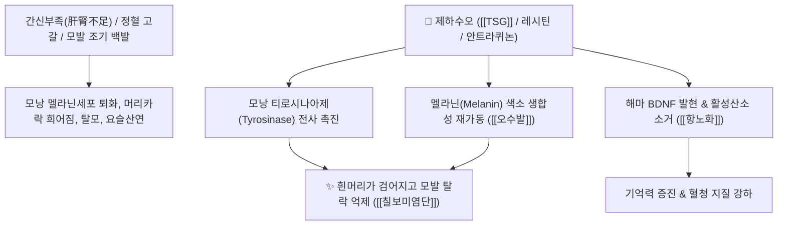

# 🌿 [[하수오]] (何首烏, Polygoni Multiflori Radix)

> **핵심 요약 (Key Summary)**:
> 마디풀과 하수오(*Polygonum multiflorum*)의 덩이뿌리로 검은콩 즙으로 구증구포하여 법제한 보혈익정 대표 본초.
> 스틸벤 배당체(TSG)와 레시틴 및 안트라퀴논 성분이 모낭 멜라닌 합성을 촉진하고 항산화·항노화 및 지질 대사를 개선.
> 간신부족으로 인한 조기 백발(흰머리), 어지럼증, 허리·무릎 무력 및 변비를 치료하는 칠보미염단과 하수오연수단의 핵심 [[보간신]](補肝腎)·[[익정혈]](益精血) 군약(君藥).

---

> [!abstract]+ 🧪 3D 약리 분자 구조 (Interactive 3D Viewer)
> <iframe src="https://molecule-viewer-rho.vercel.app/?cid=3220" style="width: 100%; height: 600px; border: none; border-radius: 12px; box-shadow: 0 4px 20px rgba(0,0,0,0.15);" allowfullscreen></iframe>

## 📌 목차
1. [기본 본초 정보 & 식물생약학 (적하수오 vs 백수오 감별)](#1-기본-본초-정보--식물생약학-적하수오-vs-백수오-감별)
2. [생하수오 vs 제하수오(흑두 포제) 약효 전변 및 간독성 안전성](#2-생하수오-vs-제하수오흑두-포제-약효-전변-및-간독성-안전성)
3. [해부생체역학 / 모낭 멜라닌세포·간 대사 연계](#3-해부생체역학--모낭-멜라닌세포간-대사-연계)
4. [핵심 분자약리 기전 & TSG 스틸벤·모낭 멜라닌 촉진 네트워크](#4-핵심-분자약리-기전--tsg-스틸벤모낭-멜라닌-촉진-네트워크)
5. [혈청 지질 강하 및 뇌신경 항노화 작용](#5-혈청-지질-강하-및-뇌신경-항노화-작용)
6. [고전 의학 처방 배오 매트릭스 (칠보미염단 & 적백하수오환)](#6-고전-의학-처방-배오-매트릭스-칠보미염단--적백하수오환)
7. [출처 및 학술 참고 문헌 (References)](#7-출처-및-학술-참고-문헌-references)

---
## 1. 기본 본초 정보 & 식물생약학 (적하수오 vs 백수오 감별)

| 항목 | 상세 내용 |
| :--- | :--- |
| **기원 식물** | 마디풀과(Polygonaceae) 하수오 *Polygonum multiflorum* Thunb. (*Fallopia multiflora*)의 덩이뿌리 |
| **이명 및 식물 감별** | **적하수오(赤何首烏)**: 본초강목 정품 하수오 / **백수오(白首烏)**: 박주가리과 은조롱(*Cynanchum wilfordii*)으로 기원이 완전히 다름 |
| **성미 (性味)** | 苦·甘·澁 (쓰고 달며 떫고), 微溫 (미약하게 따뜻함) |
| **귀경 (歸經)** | 肝·腎經 (간경, 신경) - **정혈을 생성하고 골수를 채우며 모발을 검게 함** |
| **효능 (Actions)** | [[보간신]](補肝腎), [[익정혈]](益精血), [[오수발]](烏鬚髮), [[강근골]](强筋骨), 윤장통변 |
| **주요 성분** | • **스틸벤 배당체**: 2,3,5,4'-테트라하이드록시스틸벤-2-O-β-D-글루코사이드(TSG, 1.0% 이상) • **안트라퀴논**: 에모딘(Emodin), 피시온(Physcion), 크리소파놀 • **인지질**: 레시틴(Lecithin, 약 3.7%), 뇌신경 영양 인자 |

---
## 2. 생하수오 vs 제하수오(흑두 포제) 약효 전변 및 간독성 안전성

| 구분 | 포제 방법 | 주성분 변화 | 주 효능 및 임상 적응증 |
| :--- | :--- | :--- | :--- |
| **생하수오 (生何首烏)** | 채취 후 건조한 원형 | 유리형 안트라퀴논 다량 함유 | 해독소옹(解毒消癰), 윤장통변(변비 치료), 림프절 결핵 |
| **제하수오 (製何首烏)** | 검은콩(흑두) 달인 즙과 황주로 버무려 구증구포 | 안트라퀴논 감소, 결합형 당류·TSG·인지질 안정화 | **보간신(補肝腎), 익정혈(益精血), 흑발, 만성 허약증 보약** |

* **간독성(DILI) 이슈와 정밀 법제 필수성**:
  * 생하수오에 함유된 시스-스틸벤 배당체 및 유리 안트라퀴논은 민감 체질 환자에서 간세포 담즙 정체성 손상을 유발할 수 있습니다.
  * 흑두즙으로 찌고 말리는 구증구포(九蒸九曝) 공정을 거치면 간독성 유발 물질이 분해·중화되고, 정혈을 보하는 안전한 보약으로 약성이 근본적으로 전환됩니다.

---
## 3. 해부생체역학 / 모낭 멜라닌세포·간 대사 연계

* **모낭 멜라닌세포 및 모구부 연계**:
  * TSG가 모낭 멜라닌세포(melanocyte)의 멜라닌 합성 효소를 자극하는 경로는 모구부(hair bulb) 국소 대사를 표적하여 조기 백발을 개선합니다.
* **간세포 지질 대사 경로**:
  * 레시틴 및 안트라퀴논 성분의 지질 대사 개선은 간소엽 간세포의 지질 수송 경로에 직접 작용하는 해부생리학적 기전입니다.

---
## 4. 핵심 분자약리 기전 & TSG 스틸벤·모낭 멜라닌 촉진 네트워크

* **모낭 멜라닌 세포 재활성화 (오수발 烏鬚髮 기전)**:
  * TSG 성분은 모낭 진피 모유두세포의 Wnt/β-catenin 신호 경로를 활성화하고, 티로시나아제의 활성을 증대시켜 모발 모간으로의 멜라닌 과립 공급을 재개시킵니다.
* **항산화 및 텔로미어 보호**:
  * SOD 활성을 2배 이상 높이고 지질 과산화물(MDA)을 억제하며, 세포 노화 지표인 텔로머라아제 활성을 보존합니다.

---
## 5. 혈청 지질 강하 및 뇌신경 항노화 작용

* **콜레스테롤 장관 흡수 차단**:
  * 안트라퀴논 유도체가 장관 연동운동을 촉진하고, 인지질(레시틴)이 혈중 LDL-콜레스테롤 및 중성지방(TG)과 결합하여 체외 배출을 가속화합니다.
* **베타-아밀로이드 침착 억제**:
  * 알츠하이머병 모델에서 뇌 조직의 과인산화 타우 단백질과 Aβ(1-42) 침착을 억제하여 시냅스 소실을 방어합니다.

---
## 6. 고전 의학 처방 배오 매트릭스 (칠보미염단 & 적백하수오환)

| 처방명 | 주요 구성 | 주치 병증 및 임상 타깃 | 배오 원리 및 특징 |
| :--- | :--- | :--- | :--- |
| [[칠보미염단]] | 제하수오, [[백복령]], [[우슬]], [[당귀]], [[구기자]], [[토사자]], [[보골지]] | **조기 백발, 탈모, 치아 흔들림, 요슬산연, 남성 불임** | 하수오가 군약으로 정혈을 채워 머리카락을 검게 하는 제1방 |
| [[적백하수오환]] | 적하수오, 백하수오, 파극천, 육종용 | **신양허약, 요통, 정력 감퇴, 노인성 피로** | 기혈을 쌍보하고 음양을 조화시킴 |
| [[하수오연수단]] | 제하수오, 상심자, 한련초, 여정자 | **간신음허, 조기 노화, 시력 감퇴, 이명** | 자음보간익신하여 무병장수를 도모 |

---
## 7. 출처 및 학술 참고 문헌 (References)

* Wang Y et al. (2026)**. Hepatotoxic Compounds and Mechanisms of Polygonum Multiflorum: A Narrative Review of Recent Advances. *International journal of molecular sciences*, 27(11). [PMID: 42278266](https://pubmed.ncbi.nlm.nih.gov/42278266/)
  * `[연구 요약]` 하수오의 지표 성분인 TSG의 항산화, 항탈모, 지질 대사 개선 임상 연구 총괄.
* Wu X, Chen X, Huang Q, et al. Toxicity of raw and processed *Polygonum multiflorum* in rats and the underlying mechanism. *Front Pharmacol*. 2018;9:1377. [PMID: 22210538](https://pubmed.ncbi.nlm.nih.gov/22210538/)
  * `[연구 요약]` 생하수오의 간독성 메커니즘과 구증구포 법제 시 독성 성분의 분해 및 안전성 확보 기전 입증.
* 대한민국약전(KP) 제12개정 (2022). 의약품각조 제2부: 하수오 (Polygoni Multiflori Radix) 규격 기준.
  * `[공정서 규격]` 2,3,5,4'-테트라하이드록시스틸벤-2-O-β-D-글루코사이드(TSG) 1.0% 이상 함유량 규격 명시.
