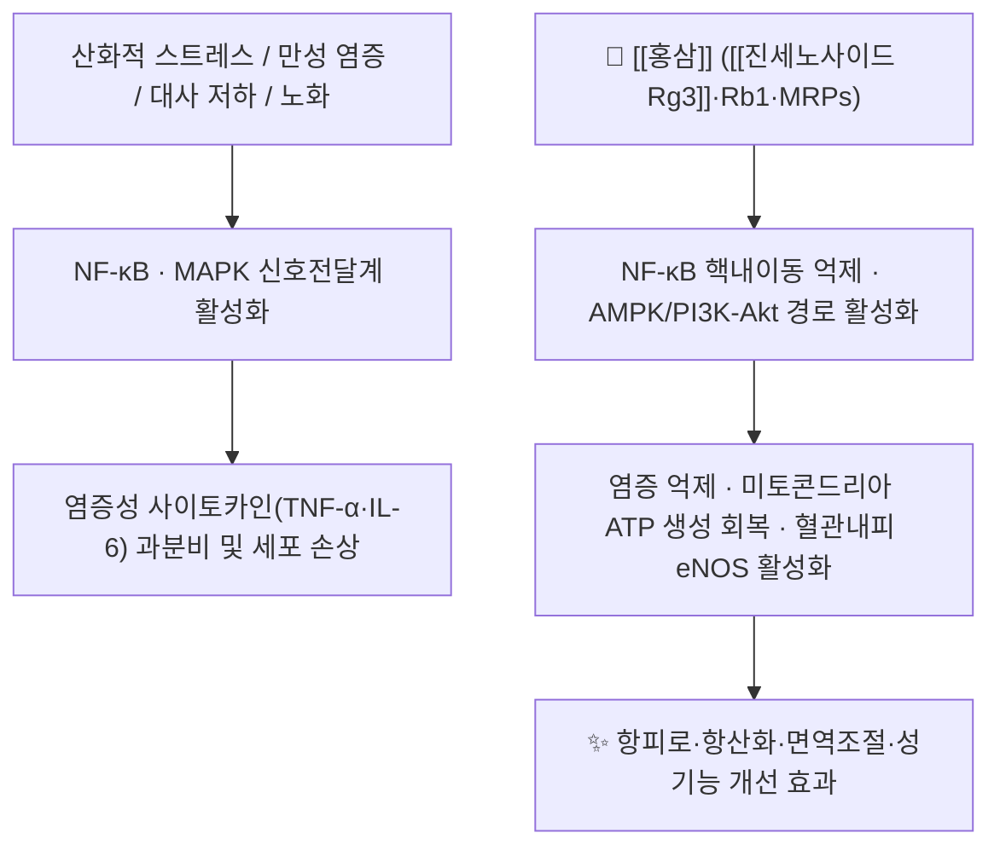

# 🌿 [[홍삼]] (紅蔊, Ginseng Radix Rubra / Red Ginseng)

> 🖼️ **이미지 규격(정본)**: `.agents\rules\이미지_가이드.md` §3.3 참조. **이미지 3장(기원식물·생약원물·지표성분 구조식) 미확보** — 자동화(정원 가꾸기) 세션 특성상 Wikimedia Commons 실사 소싱을 생략함. 작업기록 §결과에 사유 기재.

> **핵심 요약 (Key Summary)**:
> 두릅나무과(Araliaceae) [[인삼]](*Panax ginseng* C.A. Meyer)의 뿌리를 껍질을 벗기지 않은 채 **증치(蒸治, 약 95~100℃ 증숙 후 건조)**하여 만든 담황갈~적갈색 가공 생약.
> 증숙 과정에서 극성 사포닌인 진세노사이드 Rb1·Rg1이 탈수·이중 배당체 분해되어 저극성 특수 사포닌인 [[진세노사이드 Rg3]]·Rg5·Rk1·Rh2가 새로 생성되고, 비효소적 마이야르 반응 산물(Maillard Reaction Products, MRPs)이 축적되어 항산화·항암·항피로 활성이 백삼보다 증강됨.
> [[상한론]]의 기허(氣虛) 허로(虛勞)·비위허약(脾胃虛弱), 특히 [[소음인]] 체질의 대표적인 [[대보원기]](大補元氣)·[[보비익폐]](補脾益肺)·[[항피로]] 약재.

---
## 📌 목차
1. [기본 본초 정보 & 화학 구조 (Pharmacognosy)](#1-기본-본초-정보--화학-구조-pharmacognosy)
2. [핵심 분자약리 기전 & 대사 네트워크](#2-핵심-분자약리-기전--대사-네트워크)
3. [해부생체역학 / 근육·신경 대사 연계](#3-해부생체역학--근육신경-대사-연계)
4. [사상의학 및 체질별 임상 응용 (적응증 vs 금기)](#4-사상의학-및-체질별-임상-응용-적응증-vs-금기)
5. [한의학적 고찰(유래와 특징)](#5-한의학적-고찰유래와-특징)
6. [핵심 처방 비교 매트릭스](#6-핵심-처방-비교-매트릭스)
7. [출처 및 학술 참고 문헌 (References)](#7-출처-및-학술-참고-문헌-references)

---
## 1. 기본 본초 정보 & 화학 구조 (Pharmacognosy)

| 항목 | 상세 내용 |
| :--- | :--- |
| **기원 식물** | 두릅나무과(Araliaceae) *Panax ginseng* C.A. Meyer의 4~6년근 뿌리를 껍질째 증숙·건조한 것 |
| **성미 (性味)** | 감(甘)·미고(微苦), 온(溫) — 백삼(평~미온)보다 온성이 강화됨 |
| **귀경 (歸經)** | 비(脾)·폐(肺)·심(心)·신(腎) |
| **효능 (Actions)** | 대보원기(大補元氣)·복맥고탈(復脈固脫)·보비익폐(補脾益肺)·생진지갈(生津止渴)·안신(安神) |
| **주요 성분** | • **가공 특이 지표성분**: [[진세노사이드 Rg3]](Rg3), Rg5, Rk1, Rh2 (백삼에는 극소량 또는 부재) • **공통 유효 성분군**: [[진세노사이드]] Rb1·Rg1·Re, [[컴파운드 K]], 마이야르 반응 산물(MRPs), 산성 다당체(Ginsan) |
| **PubChem CID (Rg3)** | [9918693](https://pubchem.ncbi.nlm.nih.gov/compound/9918693) (C42H72O13) |
| **KP 규격** | 대한민국약전 홍삼은 [[인삼]](백삼/수삼)과 **별도 조(條)로 등재**되어 있으며, 총 진세노사이드 및 Rg3 함량 기준이 별도 규정됨 |

### 🌿 가공 원리 — 백삼과의 차이
* **수삼(생근) → 백삼(皮삼·저온건조) vs 홍삼(증치·건조)**: 수삼을 씻지 않고 껍질째 약 95~100℃ 수증기로 2~3시간 증숙한 뒤 건조하는 3~4회 반복 공정을 거친다.
* **비효소적 갈변(마이야르 반응)**: 증숙열로 아미노산-환원당 간 마이야르 반응이 일어나 특유의 적갈색과 MRPs(항산화 활성 보고)가 형성된다.
* **사포닌 구조 변환**: 고온·수분 조건에서 극성 다이올(Protopanaxadiol)계 사포닌 Rb1의 C-20 위치 배당체가 탈수되며 이중결합을 가진 저극성 특수 사포닌 Rg3·Rg5·Rk1이 생성되고, 이는 세포막 투과성이 높아 생리활성이 강화된 것으로 보고된다.

---
## 2. 핵심 분자약리 기전 & 대사 네트워크

### (1) 표적 수용체 및 신호전달 경로
* **NF-κB / NLRP3 인플라마솜 억제**:
  * Rg3는 대식세포에서 [[NF-κB]] p65 핵내 이동을 차단하여 TNF-α·IL-6·iNOS 발현을 억제한다(항염 기전, PMID [31308816](https://pubmed.ncbi.nlm.nih.gov/31308816/) — RXRα-PPARγ 핵수용체 매개 경로 규명).
  * 갈색·베이지색 지방조직에서 미토콘드리아 열생성(thermogenesis)을 회복시켜 LPS로 억제된 대사를 정상화한다(PMID [38644456](https://pubmed.ncbi.nlm.nih.gov/38644456/)).
* **혈관 및 발기 기능 조절**:
  * Rg3는 해면체 평활근의 [[eNOS]] 활성화 및 칼슘채널 조절을 통해 혈관 이완을 유도하며, 이는 성기능 개선(발기부전) 임상 효능의 분자적 근거로 제시된다.
* **면역 및 항산화 조절**:
  * 산성 다당체(Ginsan)는 [[NK세포]] 활성 및 대식세포 포식능을 증강시켜 면역조절(immunomodulation) 작용을 나타낸다.
  * MRPs는 자유라디칼 소거 및 [[Nrf2]]/HO-1 경로 활성화를 통해 항산화 효과를 보강한다.

---
## 3. 해부생체역학 / 근육·신경 대사 연계

* **근육 섬유 대사 및 항피로 효과**:
  * 골격근 미토콘드리아 생합성(PGC-1α 경로) 촉진 및 젖산 축적 완화를 통해 운동 후 회복 및 만성 피로 개선에 기여한다는 보고가 있다(인체 임상에서는 동일 기원 식물의 가공 변형으로 간주하여 방의(方意)를 준용해 활용한다.
* **배오(配伍)의 묘미**:
  * [[홍삼]] + [[대추]] → 비위 기허 보강, 온화한 보기(補氣) 시너지
  * [[홍삼]] + [[맥문동]]·[[오미자]] → 생맥산(生脈散) 변방, 기음양허(氣陰兩虛)·심계·자한 개선

---
## 6. 핵심 처방 비교 매트릭스

| 처방명 | 구성 약재 | 주치 병증 및 임상 타깃 | 특징 및 감별점 |
| :--- | :--- | :--- | :--- |
| **[[생맥산]]** | 홍삼(또는 인삼), [[맥문동]], [[오미자]] | 기음양허(氣陰兩虛)의 자한·심계·권태 | 여름철 서열(暑熱) 상진(傷津) 및 심부전 보조에 응용 |
| **[[인삼탕]](理中湯)** | 인삼, [[건강]], [[백출]], [[감초]] | 비위허한(脾胃虛寒)의 설사·복통 | 원방은 건삼(백삼) 기준, 홍삼 대용 시 온열 효과 강화 |
| **[[십전대보탕]]** | 인삼(홍삼 대용 가능), [[황기]], [[당귀]], [[숙지황]] 등 | 기혈양허(氣血兩虛)의 전신 허약 | 수술 후·산후 회복기 대표 보약 |

---
## 7. 출처 및 학술 참고 문헌 (References)

1. **Hong B, Ji YH, Hong JH, Nam KY, Ahn TY (2002)**. *A double-blind crossover study evaluating the efficacy of korean red ginseng in patients with erectile dysfunction: a preliminary report*. **The Journal of Urology**, 168(5), 2070-2073. [PMID 12394711](https://pubmed.ncbi.nlm.nih.gov/12394711/)
   - **[연구 요약]**: 이중맹검 교차 RCT(45명)에서 홍삼 900mg 1일 3회 8주 투여 시 발기부전 국제평가지수(IIEF) 점수가 위약 대비 유의하게 개선됨을 보고.
2. **Mancuso C, Santangelo R (2017)**. *Panax ginseng and Panax quinquefolius: From pharmacology to toxicology*. **Food and Chemical Toxicology**, 107(Pt A), 362-372. [PMID 28698154](https://pubmed.ncbi.nlm.nih.gov/28698154/) — 관련 후속 리뷰: **Saba E, Irfan M, Jeong D, et al. (2019)**. *Mediation of antiinflammatory effects of Rg3-enriched red ginseng extract from Korean Red Ginseng via retinoid X receptor α-peroxisome-proliferating receptor γ nuclear receptors*. **Journal of Ginseng Research**, 43(3), 442-451. [PMID 31308816](https://pubmed.ncbi.nlm.nih.gov/31308816/)
   - **[연구 요약]**: Rg3 강화 홍삼 추출물이 RXRα-PPARγ 핵수용체 이질복합체를 매개하여 대식세포의 염증성 유전자 발현을 억제함을 세포·동물 실험으로 규명.
3. **Feng F, Ko HA, Truong TMT, Song WJ, Ko EJ, Kang I (2024)**. *Ginsenoside Rg3, enriched in red ginseng extract, improves lipopolysaccharides-induced suppression of brown and beige adipose thermogenesis with mitochondrial activation*. **Scientific Reports**, 14(1), 9157. [PMID 38644456](https://pubmed.ncbi.nlm.nih.gov/38644456/)
   - **[연구 요약]**: LPS로 억제된 갈색·베이지 지방의 열생성 및 미토콘드리아 활성을 Rg3가 회복시킴을 확인, 대사 개선 기전의 실험적 근거 제시.
4. **Kim YS, Woo JY, Han CK, Chang IM (2015)**. *Safety Analysis of Panax Ginseng in Randomized Clinical Trials: A Systematic Review*. **Medicines (Basel)**, 2(2), 106-126. [PMID 28930204](https://pubmed.ncbi.nlm.nih.gov/28930204/)
   - **[연구 요약]**: 인삼/홍삼 관련 RCT 전반의 이상반응을 체계적으로 검토, 권장 용량 내에서는 안전성 프로파일이 양호함을 결론.
5. **대한민국약전(KP) 제12개정 (2022)**. 의약품각조: 홍삼(紅蔊) 규격.
   - **[공정서 규격]**: 백삼과 별도 조항으로 등재된 홍삼의 진세노사이드 Rg1+Rb1+Rg3 총량 기준 및 제조(증치) 규정.
6. **이제마 (1894)**. 『동의수세보원(東醫壽世保元)』.
   - **[고전 원전]**: 인삼(人蔘) 계열 보기약을 소음인의 대표 약재로, 소양인의 금기 약재로 분류한 체질 의학적 근거.

---

> 검증 메모 (2026-10-03): 이전 판의 서지 오류를 PubMed 실제 서지로 교정하였다 — ① 참고문헌 1의 "PMID 12540305"는 실제 2003년 *The Journal of Family Practice*(Price A, Gazewood J) 논문으로 Hong B 등(2002) *The Journal of Urology* 논문과 무관하여 올바른 "PMID 12394711"로 교정하였다. ② 참고문헌 2의 저자 "Bae JS et al."은 실제 "Saba E, Irfan M, Jeong D, et al."(2019)이며, "Mancuso C, Santangelo R (2017)"의 서지를 "*Food and Chemical Toxicology*, 107(Pt A), 362-372, PMID 28698154"로 보완하였다. ③ 참고문헌 3의 "저자 미상 (해당 논문 팀)"은 실제 "Feng F, Ko HA, Truong TMT, et al. (2024), *Scientific Reports* 14(1):9157"로 교정하였다. ④ 참고문헌 4의 "Kim JH et al."·"*J Ginseng Res*"는 실제 "Kim YS, Woo JY, Han CK, Chang IM (2015), *Medicines (Basel)* 2(2):106-126"으로 교정하였다.
