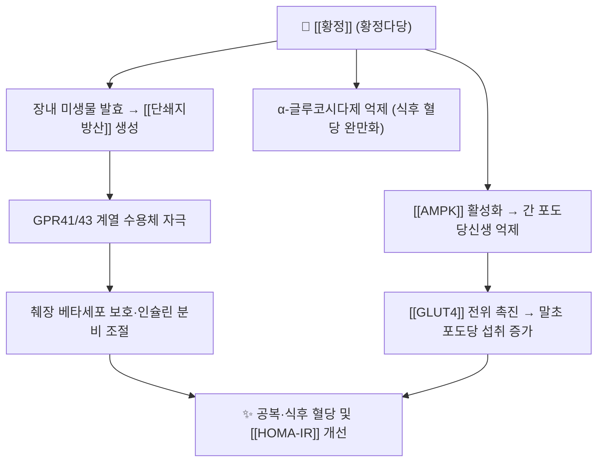

# 🌿 황정 (黃精, Polygonati Rhizoma)

> 🖼️ **이미지**: ①기원 식물 ②뿌리줄기 도해 ③건조 약재 실사 — 지표성분이 **단일 분자가 아닌 다당류(polysaccharide) 중심**이므로 구조식 대신 약재 실사·도해로 채웠다(사유 기록).

> **핵심 요약 (Key Summary)**:
> 둥굴레속(*Polygonatum*) 뿌리줄기 — 한국에서는 둥굴레(*P. odoratum var. pluriflorum*) 계열, 중국약전은 황정(*P. sibiricum*)·전황정(*P. kingianum*)·다화황정(*P. cyrtonema*)을 기원으로 규정한다.
> 핵심 활성군인 황정다당(Polygonatum polysaccharide)이 **α-글루코시다제 억제·AMPK 활성화·장내균총–단쇄지방산 축**을 통해 혈당과 인슐린 감수성을 조절한다 → [[단쇄지방산]] · [[인슐린 저항성]]
> 性味 甘平, 歸經 肺·脾·腎 — **자음윤조(滋陰潤燥)·보비익기(補脾益氣)·생진지갈(生津止渴)** 로 소갈(消渴)의 전단계부터 쓰는 대표 보익약이다 → [[소갈지중소]]

---

## 📌 목차
1. [기본 본초 정보 & 화학 구조 (Pharmacognosy)](#1-기본-본초-정보--화학-구조-pharmacognosy)
2. [핵심 분자약리 기전 & 대사 네트워크](#2-핵심-분자약리-기전--대사-네트워크)
3. [해부생체역학 / 근육·신경 대사 연계](#3-해부생체역학--근육신경-대사-연계)
4. [체질별 임상 응용 (적응증 vs 금기)](#4-체질별-임상-응용-적응증-vs-금기)
5. [한의학적 고찰 및 배오 원리](#5-한의학적-고찰-및-배오-원리)
6. [핵심 처방 비교 매트릭스](#6-핵심-처방-비교-매트릭스)
7. [출처 및 학술 참고 문헌 (References)](#7-출처-및-학술-참고-문헌-references)

---

## 1. 기본 본초 정보 & 화학 구조 (Pharmacognosy)

| 항목 | 상세 내용 |
| :--- | :--- |
| **기원 식물** | 백합과( Asparagaceae 계열로 재분류) 둥굴레속 *Polygonatum* — 한국은 둥굴레(*P. odoratum var. pluriflorum*) 계열, 중국약전은 황정(*P. sibiricum*)·전황정(*P. kingianum*)·다화황정(*P. cyrtonema*)의 뿌리줄기 |
| **성미 (性味)** | 甘, 平 (일부 문헌 微溫) |
| **귀경 (歸經)** | 肺 · 脾 · 腎 |
| **효능 (Actions)** | 자음윤조(滋陰潤燥) · 보비익기(補脾益氣) · 익신(益腎) · 생진지갈(生津止渴) |
| **주요 성분** | • **지표 성분군**: 황정다당(Polygonatum polysaccharide, PPS) — 약전은 다당 함량으로 규격을 관리한다<br>• **유효 활성 성분군**: 스테로이드 사포닌(디오스게닌 계열 배당체) · 플라보노이드 · 알칼로이드 · 미량원소 |
| **생약 규격** | 9~10월 또는 봄에 채취한 뿌리줄기를 **증제(蒸製)** 해 건조 — 법제 정도가 맛·색·성분 조성과 임상 반응을 좌우한다 |

![[황정_01_기원식물.jpg|420]]
> [그림 1: 둥굴레(*Polygonatum odoratum*) 전초 — 잎줄기와 꽃 — Wikimedia Commons, CC BY 4.0]

![[황정_02_생약_도해.jpg|420]]
> [그림 2: 둥굴레속 뿌리줄기(마디가 이어지는 굵은 근경) 도해 — *Encyclopædia Britannica* 11판 삽화 — Public domain]

![[황정_04_약재_실사.jpg|420]]
> [그림 3: 건조 황정 절편(약재 실사) — **실제로 쓰는 생약 원물 성상** — Wikimedia Commons, CC0]

> **[구조적 특징 및 활성]**: 황정의 중심 활성은 단일 분자가 아니라 **분자량이 다른 다당류 분획**이다. 다당류는 장관에서 흡수가 어려운 대신 **장내균총에 의해 발효되어 단쇄지방산을 생산**하고, 이것이 GPR41/43 계열 수용체를 통해 인슐린 분비·포도당 대사를 조절하는 경로가 전임상에서 보고되었다 → [[단쇄지방산]]

---

## 2. 핵심 분자약리 기전 & 대사 네트워크



### (1) 표적 경로 및 대사 조절
* **α-글루코시다제 억제**: 탄수화물 분해 지연 → 식후 혈당 상승 곡선 완만화(아카보스와 유사한 방향, 강도는 약하다) → [[아카보스]]
* **AMPK 활성화**: 간 포도당신생 억제·지방산 산화 증가 → [[AMPK]] · [[인슐린 저항성]]
* **장내균총–단쇄지방산 축**: 고지방·STZ 유도 당뇨 마우스에서 다당류가 **균총 불균형 개선과 포도당 대사 개선을 동반**했다는 전임상 보고가 있다
* **항산화·항염**: 산화스트레스 감소와 염증성 사이토카인 억제 기전이 함께 보고된다 → [[ROS]]

---

## 3. 해부생체역학 / 근육·신경 대사 연계

* **근육 대사**: AMPK–GLUT4 경로를 통한 말초 포도당 섭취 개선은 **운동이 쓰는 것과 같은 최종 경로**다. 그래서 황정류 처방은 운동·생활습관과 병용할 때 의미가 커진다 → [[운동요법]] · [[저항운동]]
* **신경계**: 당뇨병성 말초신경병증 모델에서 다당류의 항산화·신경보호 효과가 전임상 수준으로 보고되나, **인체 임상 근거는 아직 부족**하다 → [[당뇨병성 말초신경병증]]

---

## 4. 체질별 임상 응용 (적응증 vs 금기)

```
[✅ 최적 적응증 (Sweet Spot)]
• 마르거나 중간 체형의 음허(陰虛) 경향 — 입마름·야간 갈증·건조한 기침·변비
• 비위허약(脾胃虛弱)으로 식욕·소화력이 떨어지면서 기력이 저하된 경우
• 소갈(消渴) 전단계 — 내당능장애·공복혈당장애에서 익기양음 구조의 일부로
• 설진: 설홍소태(舌紅少苔) / 맥상: 세삭(細數) 또는 허약

[⚠️ 신중 투여 및 금기 (Caution / Contraindication)]
• 담습(痰濕)·비만 체형에서 습이 성한 경우 — 자음윤조가 습을 더할 수 있다
• 설태 후니(厚膩)·복부 팽만·연변 경향에서는 감량 또는 배제
• 혈당강하제·인슐린 병용 환자 — 상가 작용으로 저혈당 위험 → [[저혈당]]
• 법제하지 않은 생품의 장기 복용은 위장 불편을 늘릴 수 있다
```

---

## 5. 한의학적 고찰 및 배오 원리

### (1) 전통 주치와 현대 임상의 해석
> 고전에서 황정은 **"보중익기(補中益氣)·제풍습(除風濕)·안오장(安五臟)"**, 즉 허손을 채우면서 마르고 건조한 조직을 눅여 주는 약으로 쓰였다. 소갈(消渴) 처방에 반복 등장하는 이유도 **기(氣)를 세우면서 진액을 보존**하는 이중 목적 때문이다.

* **핵심 약재 배오(짝)의 묘미**:
  * [[황정]] + [[인삼]] → 익기생진: 기력 저하 + 갈증이 동반된 전당뇨·회복기
  * [[황정]] + [[맥문동]] → 자음윤폐: 마른기침·인후건조 + 야간 갈증
  * [[황정]] + [[지황]] → 보신익정: 요슬산연·이명·조열
  * [[황정]] + [[창출]]·[[복령]] → 자음에 화습을 붙여 **보하면서 체하지 않게** 조정
  * [[황정]] + [[갈근]] → 생진승양: 갈증·목 뻣뻣함 동반

---

## 6. 핵심 처방 비교 매트릭스

| 처방명 | 구성 약재 | 주치 병증 및 임상 타깃 | 특징 및 감별점 |
| :--- | :--- | :--- | :--- |
| [[진력달과립]] | [[인삼]], [[황정]], [[창출]], [[고삼]], [[맥문동]], [[지황]] 등 17종 | 전당뇨·다중 대사이상 — 익기양음·건비운진 | 다성분 복합 근대 제제, 위약대조 RCT 근거(PMID 38829648) |
| [[옥천환]] 계열 | [[인삼]], [[황정]], [[천화분]], [[맥문동]] 등 | 소갈(消渴) 전통 처방군 | 갈증·다음(多飮) 중심, 전통 방제 구성 |
| [[보중익기탕]] | [[황기]], [[인삼]], [[백출]], [[승마]] 등 | 비위허약·중기하함 | 습·기허 중심, 자음력은 약하다 |

* **양약 상호작용 (Herb–Drug Interaction)**:
  * 혈당 간섭 — 다당류의 혈당강하 방향 작용이 [[메트포르민]]·설폰요소제·인슐린과 상가로 움직일 수 있다 → 자가혈당 측정 강화, 저혈당 증상 교육 필수
  * **복용 시점 분리** — 흡수 간섭을 피하기 위해 경구혈당강하제와 **1~2시간 간격** 권고
  * **법제·제형** — 제조사별 법제 차이로 성분 조성이 달라지므로 **완제 복용 시 제품 정보를 확인**한다

---

## 7. 출처 및 학술 참고 문헌 (References)

1. Ren Z, Chen S, Guo Z, Mei X. Mechanistic insights of hypoglycemic components from Polygonatum polysaccharide. *Frontiers in Endocrinology (Lausanne)*. 2026;17:1744730. PMID 41924526.
  * https://pubmed.ncbi.nlm.nih.gov/41924526/
   - **[연구 요약]**: 황정(다화황정) 다당체를 분획화하여 in vitro·in vivo에서 저혈당 효능을 평가하고, 활성 분획(PP III)의 장내 균총·단쇄지방산·전사체 기전을 규명한 실험 연구(리뷰가 아님). (이전 판의 "Iqbal H"는 제1저자 오기 — 실제 제1저자는 Ren Z)
2. Hu G, Zhu K, Zuo J, Li A. Ameliorative effect of Polygonatum cyrtonema Hua polysaccharide on HFD/STZ-induced type 2 diabetes mice via improving gut microbiota imbalance and glucose metabolism disorder. *International Journal of Biological Macromolecules*. 2026;372:152962. PMID 42264242.
  * https://pubmed.ncbi.nlm.nih.gov/42264242/
   - **[연구 요약]**: 다화황정 다당류(PCP1)가 고지방식이+STZ 당뇨 마우스에서 **장내균총 불균형과 포도당 대사를 함께 개선**한 전임상 연구 — 기전 연결의 근거 수준을 '동물실험'으로 명시해 읽는다. (이전 판의 "Zhang Y"는 제1저자 오기 — 실제 제1저자는 Hu G)
3. **허준 (1613)**. 『[[동의보감]]』.
   - **[임상 문헌]**: 황정의 자음윤조·보비익기 주치와 법제(증제) 지침.
4. **이미지 출처**
   - 기원 식물: [Polygonatum odoratum (Wikimedia Commons)](https://commons.wikimedia.org/wiki/File:20260516_Polygonatum_odoratum.jpg) — CC BY 4.0
   - 뿌리줄기 도해: [EB1911 Stem — Rhizome of Polygonatum multiflorum (Wikimedia Commons)](https://commons.wikimedia.org/wiki/File:EB1911_Stem_-_Rhizome_of_Polygonatum_multiflorum.jpg) — Public domain
   - 약재 실사: [Dried polygonatum odoratum slices (Wikimedia Commons)](https://commons.wikimedia.org/wiki/File:Dried_polygonatum_odoratum_slices.jpg) — CC0

---

## 📎 개념 학습 보충 (2026-09-26 논문 연계)

- **이번 논문에서의 역할**: FOCUS 시험의 **진력달과립 17종 구성 본초 중 하나**로, 처방의 '익기양음' 축을 담당한다(🧪 2026-09-26 심층리뷰 1번).
- **왜 이 축이 필요한가**: 대상군이 내당능장애 + 복부비만 + 대사이상이므로 **청열(황련·고삼)만으로는 기력을 떨어뜨린다.** 황정·인삼·맥문동·지황으로 기음(氣陰)을 세우면서 창출·복령·패란으로 습을 빼는 구조가 이 처방의 설계 원리다 → [[진력달과립]]
- **진료실 적용**: 전당뇨·공복혈당장애 환자에서 **입마름·야간 갈증·피로·설홍소태** 소견이면 황정 배오를 고려한다. 반대로 **설태 후니·복부 팽만·연변**이면 황정을 줄이고 화습·건비를 먼저 세운다.
- **한계 명시**: 황정 단일 본초가 당뇨 발생을 줄인다는 **인체 RCT는 확인되지 않았다.** 근거는 전임상 + 복합 처방 RCT 수준이며, 단일 본초 효능으로 확대 해석하지 않는다.
- **관련**: [[진력달과립]] · [[인삼]] · [[맥문동]] · [[지황]] · [[고삼]] · [[황련]] · [[창출]] · [[내당능장애]] · [[2026-09-26_대사노인질환_심층리뷰]] 1번

---

## 📎 개념 학습 보충 (2026-10-03 논문 연계)

### 신기고 구성 본초로서의 황정 — 대사 개선·근감소 축 (2026-10-03, [PMID: 41763617](https://pubmed.ncbi.nlm.nih.gov/41763617/))
- **역할**: 신기고 8종 중 익기양음(益氣養陰)·보신(補腎) 축. [[산약]]과 함께 **[[AMPK]] 활성화·[[인슐린 저항성]] 개선**으로 대사 개선을 돕는다는 설이 제안된다
- **시험 맥락**: 비신허증 [[당뇨병성 근감소증]] 12주 RCT 구성. 다만 이 시험에서 [[HbA1c]]·[[HOMA-IR]]은 개선되지 않아, 목표는 근육·염증 지표로 둔다
- 관련: [[당뇨병성 근감소증]] · [[약식동원]] · [[AMPK]] · [[인슐린 저항성]]

> 검증 메모 (2026-10-03): 제1저자 오기를 교정하였다 — PMID 41924526 "Iqbal H"→Ren Z(리뷰가 아닌 실험 연구로 성격 정정), PMID 42264242 "Zhang Y"→Hu G.
