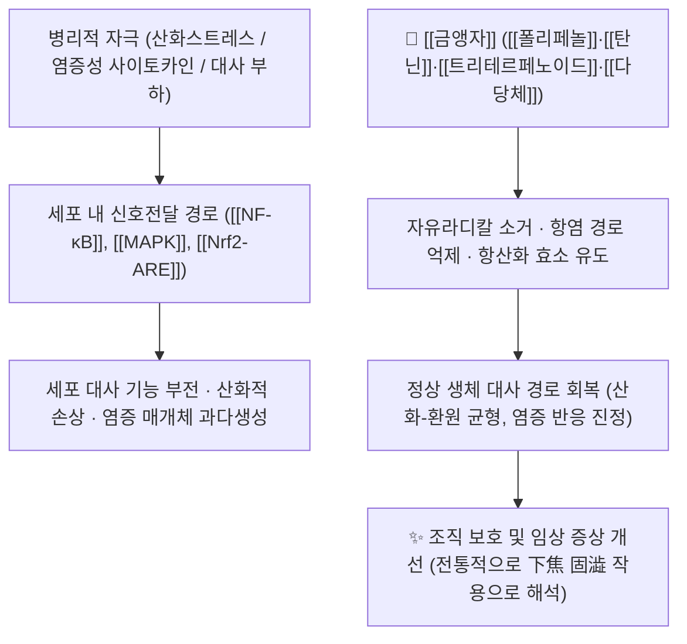

# 🌿 [[금앵자]] (金櫻子, *Rosa laevigata* Michx. / Rosae Laevigatae Fructus)

> **핵심 요약 (Key Summary)**:
> 장미과(Family **Rosaceae**) 기원식물 *Rosa laevigata* Michx.의 **성숙한 위과(僞果, rose hip)를 건조한 약용 부위**로, 같은 식물의 뿌리(金櫻根)와 함께 중국 전통의학에서 오랫동안 사용되어 온 약재다.
> 핵심 활성 성분군인 **[[폴리페놀]]·[[탄닌]]·[[플라보노이드]]**와 **[[트리테르페노이드]]**가 항산화·항염·항균 등 여러 경로([[NF-κB]], [[Nrf2-ARE]])를 조절하여 분자약리 효과를 발휘하는 것으로 보고되었다.
> 한의학적으로는 **산삽수렴(酸澁收斂)**의 대표 약재로, [[신장]](腎)·[[방광]](膀胱)·[[대장]](大腸)에 귀경하여 **[[고정축뇨]](固精縮尿)·[[삽장지사]](澁腸止瀉)**의 효능으로 遺精·遺尿·尿頻·久泄久痢·帶下 등의 **하초 불고(下焦不固)·허손(虛損) 병증**을 치료하는 전형적인 **[[수렴고삽약]]**이다.
> ※ 본 노트에 수록된 현대 약리 근거는 대부분 **세포·동물 수준의 전임상 연구 및 리뷰**이며, 인체 대상 무작위대조시험(RCT) 근거는 제공 논문에서 **근거 미확인**이다.

---
## 📌 목차
1. [기본 본초 정보 & 화학 구조 (Pharmacognosy)](#1-기본-본초-정보--화학-구조-pharmacognosy)
2. [핵심 분자약리 기전 & 대사 네트워크](#2-핵심-분자약리-기전--대사-네트워크)
3. [해부생체역학 / 근육·신경 대사 연계](#3-해부생체역학--근육신경-대사-연계)
4. [사상의학 및 체질별 임상 응용 (적응증 vs 금기)](#4-사상의학-및-체질별-임상-응용-적응증-vs-금기)
5. [한의학적 고찰(유래와 특징) 및 배오 원리](#5-한의학적-고찰유래와-특징-및-배오-원리)
6. [핵심 처방 비교 매트릭스](#6-핵심-처방-비교-매트릭스)
7. [출처 및 학술 참고 문헌 (References)](#7-출처-및-학술-참고-문헌-references)

---
## 1. 기본 본초 정보 & 화학 구조 (Pharmacognosy)

> [!abstract]+ 🧪 핵심 지표성분 3D 분자 구조 (Interactive 3D Viewer)
> <iframe src="https://molecule-viewer-rho.vercel.app/?cid=64945" width="100%" height="450px" frameborder="0" allow="webgl" style="border-radius: 8px;"></iframe>
>
> ※ 뷰어에는 대표적인 트리테르페노이드 골격 성분인 **우르솔릭산(ursolic acid, PubChem CID 64945)**을 예시로 표시하였다. 금앵자의 공정서 규격 지표성분 및 그 함량 기준은 **근거 미확인**이며, 실제 품질관리 규격은 대한민국약전(KP)·중국약전(ChP) 원문 확인이 필요하다.

| 항목 | 상세 내용 |
| :--- | :--- |
| **기원 식물** | 장미과(**Rosaceae**) *Rosa laevigata* Michx.의 성숙한 과실(위과, rose hip)을 건조한 것. 동속 근연식물의 성숙과실도 약용 기원으로 쓰이며, 동일 식물의 뿌리(金櫻根)는 별도의 한약재로 유통된다 (Quan & Huang, 2022). |
| **성미 (性味)** | 酸 · 甘 · 澁, 平 — 삽미(澁味)가 강해 수렴(收斂) 작용의 핵심 근거가 된다. |
| **귀경 (歸經)** | 腎 · 膀胱 · 大腸 — 하초(下焦)의 고삽(固澁) 효능과 직결된다. |
| **효능 (Actions)** | **固精縮尿**(고정축뇨), **澁腸止瀉**(삽장지사), **固崩止帶**(고붕지대) — [[수렴고삽약]]의 대표 효능군. |
| **주요 성분** | • **지표 성분**: 공정서 규격 지표성분 함량 기준 **근거 미확인**<br>• **유효 활성 성분군**: [[폴리페놀]]·[[탄닌]]·[[플라보노이드]] 계열, [[트리테르페노이드]](우르솔릭산·올레아놀산 등), [[다당체]], 유기산·당류, 아스코르브산 등 (Quan & Huang, 2022; Li et al., 2022; Meng & Fang, 2012) |
| **PubChem CID** | [64945](https://pubchem.ncbi.nlm.nih.gov/compound/64945) (ursolic acid, 대표 트리테르페노이드 예시) |

### 🔬 주요 지표물질 화학 구조

* **폴리페놀·탄닌 골격**: 금앵자 과실의 대표적인 활성군은 페놀성 화합물이다. [[gallotannin]]·[[ellagitannin]] 계열의 가수분해형 탄닌과 [[flavonoid]] 배당체가 다수 보고되었으며, **다수의 페놀성 수산기(-OH)**가 자유라디칼 및 금속이온을 포착(chelating)하는 항산화 활성의 구조적 기반이 된다. 탄닌은 단백질·점막 표면에 결합해 조직을 수렴(astringent)시키는 물리화학적 성질을 나타내며, 이것이 전통적인 **지사(止瀉)·지혈(止血) 효능**의 약리학적 해석과 연결된다.
* **트리테르페노이드 골격**: 우르솔릭산(ursane 골격)과 올레아놀산(oleanane 골격)은 **펜타사이클릭 트리테르페노이드**로, 대부분 **비당체(aglycone) 형태 또는 C-3 위에 단당이 결합한 O-배당체**로 존재한다. 비당체는 소수성이 강해 세포막 투과성은 상대적으로 높지만 물용해도가 낮아 경구 흡수율이 제한적이며, 배당체는 물용해도가 높은 대신 장내 미생물에 의한 가수분해 후 흡수되는 특성을 보인다. (성분별 정확한 경구 생체이용률 수치는 제공 논문에서 **근거 미확인**)
* **다당체(polysaccharide)**: 물 추출 분획의 주요 성분으로, 면역조절 및 대사 관련 활성이 논의되지만 단량체 조성·분자량·구조-활성 상관관계는 **근거 미확인**이다.
* **식품학적 특성**: 금앵자 과실은 아스코르브산과 유기산 함량이 높고 향미(flavour) 프로파일이 독특하여 식품·음료 원료로도 연구되어 왔다(Li et al., 2022). 실제로 금앵자 과실로 양조한 와인에서 페놀성 성분 조성과 항산화 활성이 함께 보고된 바 있다(Meng & Fang, 2012).

---
## 2. 핵심 분자약리 기전 & 대사 네트워크

![[금앵자_3.jpg|540]]
> [그림 1: Rose hips and leaves. Watercolour and pen drawings.]



### (1) 표적 수용체 및 신호전달 경로

* **항산화 경로 ([[Nrf2-ARE]] / 자유라디칼 소거)**:
  * 금앵자 과실 추출물의 항산화 활성은 총 페놀성 성분 함량과 연관하여 보고된다(Meng & Fang, 2012; Quan & Huang, 2022). 페놀성 수산기가 라디칼을 직접 소거하고, 세포 내 항산화 효소(예: superoxide dismutase, catalase, glutathione 계열) 발현을 유도하는 방향으로 작용한다는 것이 리뷰 수준에서 정리되어 있다. 다만 특정 효소 활성 변화의 정량적 수치와 인과 사슬의 세부 단계는 **근거 미확인**이다.
* **항염 경로 ([[NF-κB]]·[[MAPK]] 억제)**:
  * 리뷰(Quan & Huang, 2022)에서 금앵자 유래 성분의 항염 활성이 주요 약리 작용 중 하나로 제시된다. 염증성 사이토카인(TNF-α, IL-6 등) 및 염증 매개 효소(iNOS, COX-2 등) 발현 억제 기전이 세포 실험 수준에서 논의되나, 각 표적에 대한 결합 친화도·IC50 등 정량 지표는 **근거 미확인**이다.
* **항균·항바이러스 작용**:
  * 탄닌·플라보노이드 계열 성분에 기인한 항균 활성이 보고되며, 이는 전통적으로 澁腸止瀉 작용이 장내 병원체 억제와 연결될 수 있는 가능성을 시사한다. 다만 어느 균주에 어느 정도 활성을 보이는지에 대한 구체 데이터는 **근거 미확인**이다.
* **대사 및 면역 조절**:
  * 항당뇨·지질 개선·간 보호·면역조절 가능성이 전임상 수준에서 언급되며(Quan & Huang, 2022), 과실의 생물학적 특성 및 영양학적 가치가 종합 리뷰로 정리되어 있다(Li et al., 2022). 그러나 인체를 대상으로 한 임상적 유효성은 **근거 미확인**이다.

### (2) 전통 효능과의 연결 해석

* **固精縮尿**: 하초(腎·膀胱)의 허손으로 精이 고정되지 못하는 상태(遺精·遺尿)에 대해, 탄닌의 수렴 작용이 점막·조직을 수축·안정화시킨다는 일반약리학적 해석이 가능하다. 단, 방광 평활근 수축력·요도 괄약근 조절에 대한 금앵자의 직접적 기전 연구는 **근거 미확인**이다.
* **澁腸止瀉**: 탄닌-단백질 결합에 의한 장점막 표면 보호 및 장운동 완화라는 설명이 가장 널리 인용되나, 금앵자 특이적 임상 데이터는 **근거 미확인**이다.

---
## 3. 해부생체역학 / 근육·신경 대사 연계

* **근육 섬유 대사**:
  * 제공된 3편의 논문(Meng & Fang, 2012; Li et al., 2022; Quan & Huang, 2022)에서 금앵자가 골격근의 유산소/무산소 대사, 미토콘드리아 지방산 산화, 칼슘 채널 또는 젖산 대사에 미치는 영향은 **근거 미확인**이다. 금앵자는 근(筋)·골격근 대사 표적 약재로 연구된 바가 확인되지 않으며, 항산화·수렴 효능 중심의 약재로 이해하는 것이 타당하다.
* **신경 및 혈관계 조절**:
  * [[eNOS]], 자율신경 조절, 뇌혈류 및 말초 순환 개선과 관련된 금앵자의 직접 근거는 제공 논문에서 **근거 미확인**이다. 폴리페놀 계열 성분이 일반적으로 혈관 내피 기능 개선과 연관된다는 총론적 논의는 존재하나, 이를 금앵자 단독의 효과로 단정할 수 없다.
* **해석상의 주의**:
  * 따라서 금앵자는 "해부생체역학적·근육신경 대사 표적"보다는 **점막·분비물·하초(下焦) 배설 기능의 수렴 조절**이라는 전통적 축에서 이해하고, 근육·신경 항목은 향후 연구 과제로 남겨두는 것이 방법론적으로 안전하다.

---
## 4. 사상의학 및 체질별 임상 응용 (적응증 vs 금기)

```
[✅ 최적 적응증 (Sweet Spot)]
• 하초(下焦) 허손으로 인한 遺精·遺尿·尿頻·小便不禁 계열 병증
• 비신양허(脾腎陽虛)로 인한 久泄·久痢 (이질·설사의 만성 허증 단계)
• 帶下過多, 子宮脫 등 收斂이 필요한 만성 허증성 분비물 과다 상태
• 피로감·요부 냉통·야간뇨 등 腎氣不固 자각 증상 패턴을 동반한 환자
• 만성 경과로 邪氣는 거의 소진되고 正氣만 虛한 상태 (순수 허증)

[⚠️ 신중 투여 및 금기 (Caution / Contraindication)]
• 實熱·濕熱로 인한 급성 설사·이질 초기 (사기(邪氣)를 澁滯시킬 우려)
• 小便不利·濕熱淋濁 등 배설이 막힌 상태
• 열이 남아 있는 감염성 질환의 급성기
• 만성 변비 경향, 장폐색 위험군 (수렴 작용에 의한 악화 우려)
• 임신 중 및 소아의 장기 복용 — 안전성 데이터 근거 미확인
```

* **체질적 접근**:
  * 사상의학(四象醫學) 문헌에서 금앵자가 특정 체질([[태음인]] / [[소음인]] / [[소양인]] / [[태양인]])의 대표 처방에 어떻게 배오되는지에 대한 명확한 문헌 근거는 **근거 미확인**이다. 따라서 체질 처방 단위로 단정하기보다는, **허증(虛證)·한증(寒證) 경향의 만성 하초 불고 병증**에 수렴제로서 가미하는 방식이 임상적으로 무리 없다는 수준의 해석이 가능하다.
  * 일반적으로 酸澁收斂之劑는 **정기(正氣)는 허하나 사기(邪氣)가 남아 있는 상태**에서 초기 사용을 피하는 것이 원칙이며, 이는 체질을 떠나 적용되는 공통 금기다.
* **복용 형태 및 주의**:
  * 전통적으로 煎劑·膏劑·丸劑 형태로 쓰이며, 膏(금앵자고) 형태는 수렴·보익을 겸하는 만성 허손 관리에 활용되어 왔다.
  * 구체적 일일 용량, 장기 복용 시 안전성, 약물 상호작용(특히 항응고제·혈당강하제와의 병용)에 대한 정량적 근거는 제공 논문에서 **근거 미확인**이다.

---
## 5. 한의학적 고찰(유래와 특징) 및 배오 원리

> **참고**: 금앵자는 『상한론(傷寒論)』 및 길익동동(吉益東洞)의 『약징(藥徵)』에 수록된 약재가 **아니다**. 상한론·약징은 漢代 및 일본 고방파(古方派)의 처방 약재를 다루는 문헌으로, 금앵자는 이보다 후대에 본초학·방제학 체계 안에서 정립된 **수렴고삽약**이다. 따라서 해당 절은 "상한론·약징 분석"이 아닌 **한의학적 고찰(유래와 특징)**로 대체한다.

### (1) 약성(藥性)의 핵심 — 酸澁收斂

* 금앵자의 약성은 **산(酸)·삽(澁)·평(平)**으로 요약되며, 酸은 수렴(收斂), 澁은 고삽(固澁)을 의미한다. 즉 **흩어지고 새어 나가는 것을 붙잡는 것**이 이 약재의 정체성이다.
* 귀경이 腎·膀胱·大腸인 점에서, 작용 부위가 **하초의 배설·생식 기능**에 집중되어 있음을 알 수 있다. 이 때문에 遺精·滑精·早泄(腎), 遺尿·尿頻·小便不禁(膀胱), 久泄·久痢·脫肛(大腸)이라는 세 축의 적응증이 자연스럽게 도출된다.
* 『약징』식 표현을 빌리면 "主治 **下焦滑脫不禁之證**" 정도로 요약할 수 있으며, 이는 **旁治로 帶下·崩漏**를 포함한다. (원문 조문 자체는 **근거 미확인** — 고전 원전 직접 확인 필요)

### (2) 유래와 특징

* 금앵자(金櫻子)라는 이름은 열매의 형태와 황금빛 결실에서 유래한 것으로 설명되며, 계두자(稽豆子/谿頭子) 등 이명이 함께 쓰인다.
* 동일 식물에서 **과실(金櫻子)**과 **뿌리(金櫻根)**가 모두 약용으로 쓰이며, 두 약재의 전통 용도·성분·품질관리·현대 응용을 함께 정리한 리뷰가 존재한다(Quan & Huang, 2022). 이는 한 그루 식물의 서로 다른 부위가 서로 다른 임상 축(수렴 고삽 vs 청열·활혈 등)으로 활용되는 전형적 사례다.
* 열매는 식품 원료로도 활용 가능성이 높아, 영양학적·관능적 특성이 별도로 연구되고 있다(Li et al., 2022; Meng & Fang, 2012).

### (3) 핵심 약재 배오(짝)의 묘미

> ※ 아래 배오는 **전통 방제학의 관행적 조합**이며, 제공된 3편의 논문이 이 조합들을 직접 검증한 것은 아니다. 배오의 시너지에 대한 현대적 정량 근거는 **근거 미확인**임을 전제로 읽어야 한다.

* [[금앵자]] + [[검실]](芡實) $\rightarrow$ **固精止帶**의 기본 짝. 補益과 收澁을 겸하여 遺精·白濁·帶下를 함께 다스린다(수륙이선단).
* [[금앵자]] + [[복분자]](覆盆子) $\rightarrow$ **補腎澁精**. 腎氣不固로 인한 遺尿·遺精·尿頻의 핵심 배합.
* [[금앵자]] + [[산약]](山藥)·[[산수유]](山茱萸) $\rightarrow$ **補腎固澁兼補脾**. 허증 기반이 뚜렷할 때 보익약을 가미하는 구성.
* [[금앵자]] + [[익지인]](益智仁)·[[상표초]](桑螵蛸) $\rightarrow$ **縮尿**. 야간뇨·소변빈삭 중심의 배합.
* [[금앵자]] + [[백출]](白朮)·[[당삼]](黨參) $\rightarrow$ **健脾澁腸**. 비허(脾虛) 기반의 만성 설사에 수렴제를 가미하는 방식.
* [[금앵자]] + [[황기]](黃芪)·[[승마]](升麻) $\rightarrow$ **升提兼收斂**. 中氣下陷에 동반된 脫肛·子宮脫 등에 대한 전통적 발상.

---
## 6. 핵심 처방 비교 매트릭스

| 처방명 | 구성 약재 | 주치 병증 및 임상 타깃 | 특징 및 감별점 |
| :--- | :--- | :--- | :--- |
| **[[수륙이선단]]** (水陸二仙丹) | [[금앵자]], [[검실]](芡實) | 腎虛不固로 인한 遺精·白濁·帶下過多 | 단 2味로 補益(검실)과 收澁(금앵자)을 동시에 구현하는 최소 구성. 純補純澁하므로 邪氣가 있는 자에게는 부적합. |
| **[[금앵자고]]** (金櫻子膏) / **[[금앵자환]]** (金櫻子丸) | [[금앵자]] 단미(또는 [[복분자]]·[[산약]] 가미) | 만성 遺尿·尿頻, 脾腎兩虛의 久泄久痢 | 膏·丸劑는 장기 복용형. 단미 사용 시 작용이 단순하여 변증에 따라 가미가 필수적. 급성 실열 설사에는 금기. |
| **[[보신고정방]]** (전통 배오 조합, 방제명 미확인) | [[금앵자]], [[복분자]], [[산약]], [[산수유]] | 腎氣不固 + 脾虛를 동반한 복합 허손 (피로·야간뇨·만성 장허) | 補腎·補脾·固澁을 3층으로 쌓는 구성. 처방명과 정확한 용량 배분은 **근거 미확인**이며, 임상 변증에 따라 조정이 필요. |

> **감별 포인트 요약**
> * **邪氣의 유무**가 제1 감별 기준이다. 實邪(급성 염증·감염·습열)가 있으면 [[금앵자]] 계열 수렴제는 배제하고 청열·이습 방제를 우선한다.
> * **병위(病位)**에 따라 배오를 달리한다. 腎 → 補腎固精(복분자·산수유), 膀胱 → 縮尿(익지인·상표초), 大腸 → 健脾澁腸(백출·당삼)의 방향으로 조정한다.

---
## 7. 출처 및 학술 참고 문헌 (References)

1. **Meng J, Fang Y et al. (2012)**. *Phenolics composition and antioxidant activity of wine produced from spine grape (Vitis davidii Foex) and Cherokee rose (Rosa laevigata Michx.) fruits from South China*. **J Food Sci**. PMID: [22181048](https://pubmed.ncbi.nlm.nih.gov/22181048/)
   - **[연구 요약]**: 금앵자(*Rosa laevigata*, Cherokee rose) 과실을 원료로 양조한 와인의 **페놀성 성분 조성과 항산화 활성**을 분석한 연구. 과실 유래 페놀성 화합물이 최종 산물의 항산화 능력에 기여함을 보고하였다. 본 노트에서는 금앵자 과실의 **폴리페놀 함유 및 항산화 활성**에 대한 근거로 인용. 개별 화합물의 정량값 및 IC50 등 세부 수치는 원문 확인 필요.
2. **Quan XX, Huang YY et al. (2022)**. *Traditional uses, phytochemical, pharmacology, quality control and modern applications of two important Chinese medicines from Rosa laevigata Michx.: A review*. **Front Pharmacol**. PMID: [36278229](https://pubmed.ncbi.nlm.nih.gov/36278229/)
   - **[연구 요약]**: *Rosa laevigata* Michx. 유래 **두 가지 한약(과실 金櫻子 및 뿌리 金櫻根)**에 대해 전통 용도·화학성분·약리작용·품질관리·현대 응용을 종합한 리뷰. 본 노트의 **기원·성분군·약리 기전 개요(항산화·항염·항균 등)** 및 두 약용 부위의 구분에 대한 핵심 근거로 인용. 개별 기전의 정량적 세부는 리뷰 원문 확인 필요.
3. **Li H, Fang W et al. (2022)**. *Physicochemical, biological properties, and flavour profile of Rosa roxburghii Tratt, Pyracantha fortuneana, and Rosa laevigata Michx fruits: A comprehensive review*. **Food Chem**. PMID: [34339923](https://pubmed.ncbi.nlm.nih.gov/34339923/)
   - **[연구 요약]**: *Rosa roxburghii*, *Pyracantha fortuneana*, *Rosa laevigata* **세 과실의 이화학적 특성·생물학적 활성·향미 프로파일**을 비교한 종합 리뷰. 본 노트에서는 금앵자 과실의 **영양·이화학적 특성 및 식품학적 응용 가능성**, 생물학적 활성 개요에 대한 근거로 인용.
4. **WHO Monographs on Selected Medicinal Plants / 대한민국약전(KP) / 중국약전(ChP) — 금앵자 수재 여부 및 규격**
   - **[공인 데이터]**: 본 노트 작성에 활용 가능한 범위에서 **근거 미확인**. 금앵자의 공정서 지표성분, 규격 함량, 안전성 데이터는 해당 공정서 원문을 직접 확인하여 별도로 보완해야 한다.
5. **길익동동(吉益東洞) (1784)**. 『약징(藥徵)』.
   - **[고전 원전]**: **금앵자는 『약징』 및 『상한론』에 수록되지 않은 약재**로 확인된다. 따라서 본 노트의 제5장은 상한론·약징 분석 대신 **한의학적 고찰(유래와 특징) 및 배오 원리**로 대체하였다.

<!-- 보관 태그(1회용·링크오류, 필요시 복원): 금앵자, Rosa-laevigata, 고정축뇨 -->
