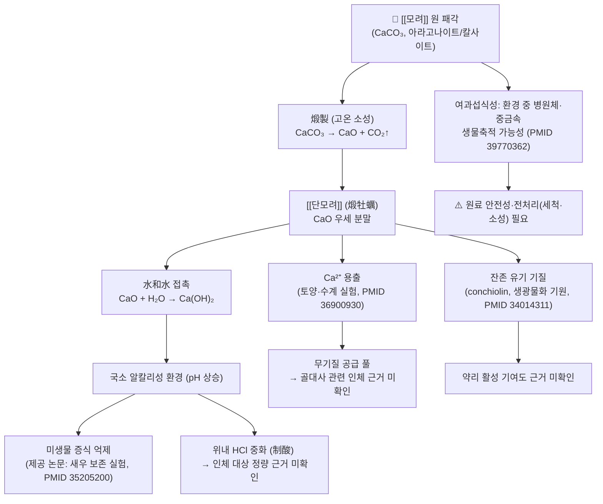

![[단모려_3.jpg|540]]
> [그림 1: Crassostrea virginica (eastern oyster shell) (Virginia Beach, Virginia, USA) 1.jpg]

# 🌿 [[단모려]] (煅牡蠣, *Crassostrea gigas* 煅製 貝殼 / Calcined Oyster Shell)

> **핵심 요약 (Key Summary)**:
> 굴과(Ostreidae, 연체동물문 Mollusca) 참굴 *Crassostrea gigas* Thunberg 및 근연종의 **패각(貝殼)을 고온에서 煅製(소성)한 것**이 단모려(煅牡蠣)이다. 원 패각의 주성분은 탄산칼슘(CaCO₃, 아라고나이트/칼사이트 결정)이며, 煅製 과정에서 **CaCO₃ → CaO + CO₂↑** 의 열분해가 일어나 주성분이 **산화칼슘(CaO)** 으로 전환된다. 이 화학적 상전환은 제공 문헌 중 소성 굴껍질 분말을 다룬 재료과학·환경과학 논문들(PMID: 31018545, 36900930, 42310351)에서 일관되게 확인되는 사실이다.
> 한의학적으로는 鹹·澀, 平(또는 微寒)하며 肝·腎(일부 문헌 胃·膽)에 歸經하여 **收斂固澀(수렴고삽)·制酸止痛(제산지통)·潛陽安神(잠양안신)·軟堅散結(연견산결)** 의 효능을 갖는 것으로 서술된다. 生牡蠣에 비해 **煅製後에는 澁性·收斂力이 강화되고 潛陽(평간잠양) 작용은 상대적으로 약화**되는 것으로 본초학교재는 설명한다(다만 본 노트에 제공된 논문에는 인체·동물 약리 실험 데이터가 포함되어 있지 않아, 해당 효능의 **분자약리 수준 근거는 '근거 미확인'** 으로 표시한다).
> 즉 단모려는 "무기염(Ca) 기반 광물성 본초"로서, **① Ca 공급·알칼리화라는 이화학적 성질**과 **② 收澀·安神이라는 전통적 임상 응용**이라는 두 축으로 이해해야 하며, 두 축을 잇는 정량적 연결고리는 현재 제시된 자료만으로는 확립되어 있지 않다.

---

## 📌 목차
1. [기본 본초 정보 & 화학 구조 (Pharmacognosy)](#1-기본-본초-정보--화학-구조-pharmacognosy)
2. [핵심 분자약리 기전 & 대사 네트워크](#2-핵심-분자약리-기전--대사-네트워크)
3. [해부생체역학 / 근육·신경 대사 연계](#3-해부생체역학--근육신경-대사-연계)
4. [사상의학 및 체질별 임상 응용 (적응증 vs 금기)](#4-사상의학-및-체질별-임상-응용-적응증-vs-금기)
5. [상한론, 『약징(藥徵)』 분석 및 배오 원리](#5-상한론-약징藥徵-분석-및-배오-원리)
6. [핵심 처방 비교 매트릭스](#6-핵심-처방-비교-매트릭스)
7. [출처 및 학술 참고 문헌 (References)](#7-출처-및-학술-참고-문헌-references)

---
## 1. 기본 본초 정보 & 화학 구조 (Pharmacognosy)

> [!abstract]+ 🧪 핵심 지표성분 3D 분자 구조 (Interactive 3D Viewer)
> <iframe src="https://molecule-viewer-rho.vercel.app/?cid=10112" width="100%" height="450px" frameborder="0" allow="webgl" style="border-radius: 8px;"></iframe>
>
> ※ 위 뷰어의 CID 10112은 **탄산칼슘(Calcium carbonate, CaCO₃)** 이며, 이는 生牡蠣 패각의 주성분이다. 煅製(소성) 후의 주성분인 **산화칼슘(CaO)** 은 CID 14778에 해당한다. 단모려의 실제 약효 발현 형태는 CaCO₃와 CaO가 혼재된 다상(多相) 분말이므로, 단일 분자 뷰어는 **대표 무기 성분의 구조 참고용**임을 명시한다(CID 값은 공개 데이터베이스 기준이며, 본 노트에 제공된 논문에서 직접 인용된 값은 아니다).

| 항목 | 상세 내용 |
| :--- | :--- |
| **기원 식물(기원 동물)** | 연체동물문(Mollusca) 이매패강(Bivalvia) 굴과(Ostreidae) **참굴 *Crassostrea gigas* Thunberg** 및 동속 근연종의 **패각(貝殼, shell)** 을 煅製한 것. 제공 문헌에는 *Crassostrea virginica*(eastern oyster) 및 이매패류 일반의 생광물화 연구가 포함되어 있다(PMID: 34014311, 39770362) |
| **성미 (性味)** | **鹹(함)·澀(삽), 平(평)** — 生牡蠣는 鹹·澀·微寒으로 기재되나, 煅製後에는 寒性이 완화되어 平(또는 微溫)으로 서술하는 문헌이 많다. 성미 기재는 본초서 간 이견이 있어 **문헌별 차이 존재(근거 미확인 항목)** |
| **귀경 (歸經)** | **肝·腎** (일부 문헌에서 胃·膽 추가). 收澀之劑는 腎, 潛陽之劑는 肝으로 귀경하는 것으로 해석 |
| **효능 (Actions)** | **① 收斂固澀**(자한·도한·유정·활정·대하·붕루) **② 制酸止痛**(위산과다·속쓰림) **③ 潛陽安神**(번조·불면·계심) **④ 軟堅散結**(담핵·영류, 주로 生牡蠣 응용) — 煅製는 이 중 ①②의 收澀·制酸 쪽에 무게가 실린다 |
| **주요 성분** | • **무기 지표 성분**: **CaCO₃(아라고나이트/칼사이트)** — 패각 건조중량의 대부분을 차지하며, 煅製 시 **CaO**로 전환<br>• **미량 무기 원소**: Mg, Sr, Fe, Zn, Cu, Na, K 등(정량치는 본 노트 제공 자료에서 **근거 미확인**)<br>• **유기 기질(conchiolin)**: 패각 내 유기 단백질·당단백 기질. 이매패류 생광물화 유전자 도구 연구(PMID: 34014311)에서 다뤄지는 영역<br>• **煅製 부산물**: CO₂(열분해 시 방출) |
| **PubChem CID** | [10112 (Calcium carbonate)](https://pubchem.ncbi.nlm.nih.gov/compound/10112) · [14778 (Calcium oxide)](https://pubchem.ncbi.nlm.nih.gov/compound/14778) |

### 🔬 주요 지표물질 화학 구조

본 노트에 제공된 이미지 블록은 **상단의 그림 1(굴 패각 실물 사진) 하나뿐**이며, 별도의 화학 구조 도식은 제공되지 않았으므로 아래와 같이 **텍스트로 구조적 특징을 기술**한다.

> **[구조적 특징 및 활성]**
> - **CaCO₃ (탄산칼슘)**: `Ca²⁺ + CO₃²⁻` 의 이온결합성 염. 결정다형으로 **칼사이트(calcite, 방해석형)·아라고나이트(aragonite, 아라고나이트형)·바테라이트(vaterite)** 가 존재하며, 생체 패각은 주로 **칼사이트/아라고나이트**의 복합 층상 구조로 형성된다. 결정상 비율은 종·서식 환경·계절에 따라 달라지는데, 이 결정다형 전환 및 유기 기질에 의한 결정 제어 기전이 **이매패류 생광물화 도구상자(biomineralization toolbox)** 연구의 핵심 주제이다(PMID: 34014311).
> - **CaO (산화칼슘)**: 煅製(약 800–1000℃ 수준의 고온 소성) 시 탈탄산 반응 `CaCO₃ → CaO + CO₂↑` 로 생성된다. CaO는 물과 만나 강한 발열 반응으로 `Ca(OH)₂`(수산화칼슘)를 만들며, 이로 인해 **국소적으로 강한 알칼리성(pH 상승) 환경**이 조성된다. 재료과학 문헌에서는 이 성질을 시멘트 모르타르의 **팽창성 혼화재(expansive additive)** 로 응용하거나(PMID: 31018545), 전통 흙건축 재료에서 **석회(lime) 대체재**로 사용하는 근거로 다룬다(PMID: 42310351).
> - **생체이용률 관련 해석**: CaCO₃ 자체는 위산(HCl)과 반응하여 `CaCO₃ + 2HCl → CaCl₂ + H₂O + CO₂↑` 로 이온화되므로, 경구 복용 시 **위내 산 중화(制酸)와 Ca²⁺ 공급**이라는 이화학적 결과가 이론적으로 도출된다. 다만 **단모려 제제를 대상으로 한 인체 약동학·위산 중화 정량 연구는 본 노트에 제공된 논문에 포함되어 있지 않다(근거 미확인)**.
> - **배당체 형태 논의**: 단모려는 플라보노이드·사포닌 배당체를 지표로 삼는 식물성 본초와 달리 **무기염 광물성 본초**이므로, C-배당체/O-배당체 논의는 해당되지 않는다. 유기 기질(conchiolin) 일부가 펩타이드성이나, 이의 흡수·활성 기여도는 **근거 미확인**이다.

---
## 2. 핵심 분자약리 기전 & 대사 네트워크



### (1) 표적 수용체 및 신호전달 경로

* **특정 수용체·효소에 대한 작용 — 근거 미확인**:
  * 단모려를 대상으로 한 수용체 결합·효소 활성 억제/촉진 실험(예: 위벽세포 H⁺/K⁺-ATPase 억제, GABA-A 수용체 결합, 아드레날린 수용체 조절 등)은 **본 노트에 제공된 논문에 포함되어 있지 않다**. 따라서 "어떤 수용체를 통해 制酸·安神이 일어난다"는 분자 수준 서술은 **작성 시점 근거 미확인**으로 표시하며, 추정으로 단정하지 않는다.
  * 다만 制酸 작용의 경우 **수용체 매개 기전이라기보다 화학량론적 산-염기 중화 반응**(CaCO₃ + HCl)으로 설명되는 것이 일반적이며, 이는 위에서 기술한 이화학적 성질에 근거한 해석이다.

* **알칼리화·항균 경로(제공 논문 근거)**:
  * 소성 굴껍질 분말은 **수화 시 알칼리성을 띠어 미생물 증식을 억제**하는 방향으로 작용한다는 것이 **흰다리새우(Litopenaeus vannamei) 보존 실험(PMID: 35205200)** 에서 소성 굴껍질 분말을 **천연 보존제(natural preservative)** 로 응용한 근거이다. 이는 단모려의 制酸·收斂 효능을 **항균·환경 pH 조절** 관점에서 간접적으로 참고할 수 있는 자료이나, **시험 대상이 갑각류 식품이지 인체가 아니므로 임상 약리 근거로 전용할 수 없다.**
  * 토양 개량 연구(PMID: 36900930)에서는 자연산·소성 굴껍질 분말 모두 **토양 pH 상승 및 Ca 공급, 질소 용탈(N leaching) 관리**에 기여하는 것으로 보고되었다. 즉 굴껍질 유래 물질의 **Ca 용출 거동과 완충능**은 실험적으로 확인된 성질이다.

* **대사 및 면역 조절**:
  * 단모려의 항염·항산화·면역 조절 기전에 대한 **in vitro/in vivo 실험 근거는 본 노트 제공 자료에 없다(근거 미확인)**. 재료·환경 분야 문헌(PMID: 31018545, 42310351)은 CaO의 수화·탄산화 반응을 다루는 것으로, 인체 대사·면역 경로와 직접 연결되지 않는다.

### (2) 煅製(소성)라는 가공이 만드는 약리적 차이

* **화학적 차이**: 生牡蠣(CaCO₃ 우세) → 煅牡蠣(CaO 우세). 이 전환은 재료과학 문헌에서 시멘트 팽창재(PMID: 31018545) 및 석회 대체 건축재(PMID: 42310351)로 응용될 만큼 **반응성이 큰 상(phase)으로의 변화**로 설명된다.
* **전통 해석**: 生牡蠣는 質重·性寒하여 潛陽·軟堅·鎭靜에 치우치고, 煅製하면 澁性이 강해져 收斂固澀·制酸·止汗 쪽으로 작용이 이동한다는 것이 한의학 본초학의 일반 서술이다.
* **연결의 한계**: 위 "화학적 차이"와 "전통 해석"을 잇는 **정량적 약리 브릿지 데이터는 제공 자료에서 확인되지 않는다.** 이 연결은 현재 **경험적·전통적 근거 수준**임을 명확히 한다.

---
## 3. 해부생체역학 / 근육·신경 대사 연계

* **근육 섬유 대사**:
  * Ca²⁺는 골격근의 흥분-수축 연동(excitation-contraction coupling)에서 트로포닌 C 결합을 매개하는 핵심 이온이며, 평활근에서는 칼모듈린-미오신 경쇄키나아제 경로를 통해 수축을 유발한다. 따라서 **세포외 Ca²⁺ 농도 변화가 근수축에 영향을 준다는 일반 생리학적 배경**은 성립한다.
  * 그러나 **단모려 투여가 골격근의 유산소/무산소 대사, 미토콘드리아 지방산 산화, 젖산 대사에 미치는 영향**을 평가한 연구는 본 노트 제공 자료에 **없다(근거 미확인)**. 단모려를 "근육 대사 개선제"로 단정하는 서술은 피해야 한다.
  * 참고로, 패각의 형성 자체는 **생체광물화(biomineralization)** 라는, 유기 기질과 무기 이온의 정밀한 상호작용 과정이며, 이매패류에서 이 과정에 관여하는 **유전자·단백질 도구상자(toolbox)** 가 정리된 바 있다(PMID: 34014311). 이는 인체 근육 대사와는 무관한 **연체동물 생물학** 영역으로, 본초 노트에서는 "패각 무기질 구조의 생물학적 기원" 참고 수준으로만 인용한다.

* **신경 및 혈관계 조절**:
  * 전통적으로 牡蠣는 **潛陽安神**하여 肝陽上亢에 따른 頭痛·眩暈·煩躁·失眠·心悸에 응용되어 왔으며, 이는 자율신경 흥분 상태·수면장애에 대한 임상적 응용으로 해석된다.
  * 그러나 **eNOS 활성, 자율신경 긴장도, 뇌혈류량, 말초 순환** 등에 대한 단모려의 객관적 지표(혈류측정·HRV·eNOS 발현 등)는 **본 노트 제공 자료에서 근거 미확인**이다. 따라서 이 항목은 **전통 효능 서술과 임상 관찰 수준**으로 한정해 기술한다.

* **칼슘·골 대사 연계(해석상 주의점)**:
  * CaCO₃/CaO 제제는 이론적으로 Ca 공급원이 될 수 있으나, **단모려의 골밀도 개선 효능을 검증한 RCT 또는 동물 실험은 제공 자료에 포함되어 있지 않다(근거 미확인)**. 무기 Ca 제제의 일반적 특성(위산 의존적 흡수, 위장관 부작용, 변비 등)만 참고 가능하다.

---
## 4. 사상의학 및 체질별 임상 응용 (적응증 vs 금기)

> ※ 사상의학(四象醫學) 문헌에서 **단모려(煅牡蠣)의 체질별 배오·주치를 직접 규정한 원문은 본 노트 작성에 제공된 자료에서 확인되지 않는다(근거 미확인)**. 아래는 收澀·重鎭 계열 약물의 일반적 임상 운용 원칙을 단모려에 적용해 정리한 **실무적 감별 프레임**이며, 사상의학적 체질 처방으로 단정하지 않는다.

```
[✅ 최적 적응증 (Sweet Spot)]
• 收澀 대상이 명확한 허증성 증상군
  - 自汗·盜汗(체표 조절력 저하), 遺精·滑精(腎氣不固), 帶下過多, 小便頻數
  - 久瀉·久痢 후의 滑脫 상태
• 위산 과다형 속쓰림·吞酸 (制酸 목적, 煅牡蠣 우선)
• 肝陽上亢 경향의 煩躁·不眠·心悸 (주로 生牡蠣 선호, 煅製는 보조)
• 重鎭之性을 이용한 驚悸·불안 등 과흥분 상태의 안정화 보조

[⚠️ 신중 투여 및 금기 (Caution / Contraindication)]
• 實邪가 남아 있는 상태(表邪未解, 濕熱滯留住) — 收澀之劑는 邪를 留하게 할 수 있음
• 濕熱下注型 帶下·설사(급성 염증성) — 收澀은 오히려 排邪를 방해할 수 있음
• 便祕 경향, 위장관 운동 저하 — 무기 Ca 염의 일반적 부작용(변비) 고려
• 신결석·고칼슘혈증·부갑상선 이상 등 Ca 대사 이상 기저질환 — Ca 부하 우려
• 火逆·실열성 煩躁(진성 열증) — 重鎭·收澀은 부적합할 수 있음
• 장기 복용 시 변비·복부 팽만 등 소화기 증상 모니터링
• 원료 안전성: 굴은 여과섭식성 이매패류이므로 환경 중 **병원체·중금속 등을 생물축적**할 수 있음(PMID: 39770362) → 세척·소성 등 전처리 확인 필요
```

| 체질(사상) 가설적 적용 | 근거 수준 | 코멘트 |
| :--- | :--- | :--- |
| [[소음인]] — 腎氣不固, 汗·尿·精의 滑脫 | **근거 미확인** (사상의학 원문 미확보) | 收澀 계열 운용 원칙과 방향성은 부합하나, 체질 처방으로 규정 불가 |
| [[태음인]] — 濕濁·水氣 저류, 制酸 필요 | **근거 미확인** | 收澀보다는 利水·和中 우선 원칙과 충돌 가능 |
| [[소양인]] — 火熱·上焦 흥분, 心煩不眠 | **근거 미확인** | 生牡蠣의 潛陽은 고려 가능, 煅製 收澀은 부적합 소지 |
| [[태양인]] — 해당 문헌 없음 | **근거 미확인** | — |

---
## 5. 상한론, 『약징(藥徵)』 분석 및 배오 원리

### (1) 『[[약징]]』에 나타난 주치와 방치

> **"『藥徵』 牡蠣 條文 원문은 본 노트 작성에 제공된 자료 범위에서 확인되지 않아(근거 미확인), 본 절은 상한론·금궤요략 계열 처방에서 牡蠣가 담당하는 역할을 중심으로 기술한다."**

* 『약징(藥徵)』은 吉益東洞이 약물의 실제 主治를 처방 증상에서 역추적하는 방식으로 정리한 고전이다. 본 노트에서는 **원문 조문을 직접 인용하지 않고**, 상한론·금궤요략에 牡蠣가 등장하는 처방의 구조를 통해 그 역할을 분석한다(원문 조문 세부는 **근거 미확인** 표시).
* **상한론·금궤요략 계열에서 牡蠣의 위치**:
  * **[[계지감초용골모려탕]](桂枝甘草龍骨牡蠣湯)** — 桂枝·甘草·龍骨·牡蠣. 화역(火逆)·하법(下法)·소침(燒針) 이후 나타나는 **煩躁·心悸**를 다스리는 구성으로, 龍骨·牡蠣의 重鎭·安神 작용이 중심이 된다. (전통적으로 生牡蠣 사용)
  * **[[계지가용골모려탕]](桂枝加龍骨牡蠣湯, 금궤요략)** — 桂枝湯에 龍骨·牡蠣를 더한 것. **男子失精·女子夢交**, 즉 遺精·불면·불안 등 收澀과 安神이 동시에 필요한 병증에 응용된다.
  * **[[모려택사산]](牡蠣澤瀉散, 금궤요략)** — 牡蠣·澤瀉·商陸·海藻·葶藶子 등. 大病 후의 **腰以下 水氣**를 다스리는 利水·軟堅 구성으로, 이 처방에서 牡蠣는 收澀이 아니라 **軟堅·散結** 역할로 배오된다.
  * **[[시호계지건강탕]](柴胡桂枝乾薑湯, 상한론)** — 柴胡·桂枝·乾薑·栝樓根·牡蠣·黃芩·甘草. 胸脅滿微結, 往來寒熱, 但頭汗出, 心煩 등을 대상으로 하며, 牡蠣는 **散結·斂汗** 보조로 참여한다.
* **핵심 포인트**: 고전 처방에서 牡蠣는 **"收澀(止汗·固精)"과 "軟堅散結", "重鎭安神"의 세 방향**으로 배오되며, 이 중 收澀·制酸 목적에서 **煅製(단모려)** 가 후대에 특화되어 사용되었다는 것이 본초학의 일반적 정리이다. 다만 **상한론 원문이 煅製를 명시했는지에 대한 고증은 본 노트에서 근거 미확인**이다(상한론 시대의 가공법과 후대 煅製 관행의 구분 문제).

* **핵심 약재 배오(짝)의 묘미**:

| 배오 조합 | 목표 병증 | 배오 의도(전통 해석) | 근거 수준 |
| :--- | :--- | :--- | :--- |
| 煅牡蠣 + [[용골]] | 心悸·不眠·遺精·自汗 | 重鎭 + 收澀의 상승 작용, 安神과 固澀을 동시 확보 | 전통 문헌·교과서 서술 |
| 煅牡蠣 + [[마황근]]·[[부소맥]] | 自汗·盜汗 | 斂汗 전용 배합(牡蠣散 계열), 체표 津液 漏出 억제 | 전통 문헌·교과서 서술 |
| 煅牡蠣 + [[해표초]](烏賊骨) | 吞酸·속쓰림·胃痛 | 制酸 + 收斂止血, 위점막 자극 완화 목적 | 전통 문헌·교과서 서술 |
| 煅牡蠣 + [[산약]]·[[검실]]·[[금앵자]] | 遺精·滑精·帶下 | 補腎固澀, 補와 澁의 병용 | 전통 문헌·교과서 서술 |
| 煅牡蠣 + [[백작약]] | 陰虛 汗出·근육 경련·번조 | 斂陰和營 + 收澀, 營衛 조절 | 전통 문헌·교과서 서술 |
| 生牡蠣 + [[상기생]]·[[우슬]] | 肝陽上亢 頭痛·眩暈 | 平肝潛陽 + 重鎭 (煅製보다 生品 선호) | 전통 문헌·교과서 서술 |

※ 위 배오는 한의학 본초학·방제학의 통상적 서술을 정리한 것으로, **개별 배합의 분자약리 검증 데이터는 본 노트 제공 자료에 없다(근거 미확인)**.

---
## 6. 핵심 처방 비교 매트릭스

| 처방명 | 구성 약재 | 주치 병증 및 임상 타깃 | 특징 및 감별점 |
| :--- | :--- | :--- | :--- |
| **[[계지감초용골모려탕]]** | [[계지]], [[감초]], [[용골]], [[모려]] | 火逆·誤下·燒針 후의 **煩躁·心悸**, 불안 | 龍骨·牡蠣 重鎭이 중심. **生牡蠣** 개념. 收澀보다 安神 지향 |
| **[[계지가용골모려탕]]** | 桂枝湯 + [[용골]], [[모려]] | 男子失精·女子夢交, **遺精·불면·불안** | 營衛 조화 + 固澀安神. 收澀과 安神의 교집합 처방 |
| **[[모려택사산]]** | [[모려]], [[택사]], [[상륙]], [[해조]], [[정력자]] 등 | 大病 후 **腰以下 水氣**, 부종 | 牡蠣를 **軟堅·利水** 목적으로 사용. 收澀 목적 아님 → 단모려와 구분 필요 |
| **[[시호계지건강탕]]** | [[시호]], [[계지]], [[건강]], [[괄루근]], [[모려]], [[황금]], [[감초]] | 胸脅滿微結, 往來寒熱, **但頭汗出**, 心煩 | 和解 + 牡蠣 散結·斂汗. 少陽 병증 맥락에서의 牡蠣 활용 |
| **[[모려산]]** (和劑局方 계열) | [[모려]], [[황기]], [[마황근]], [[부소맥]] | **自汗·盜汗**, 諸虛不足 | **煅牡蠣** 중심의 斂汗 전용 처방. 단모려의 收澀 특성이 가장 직접적으로 드러나는 예 |
| **[[금쇄고정환]]** | [[사원자]], [[검실]], [[연수]], [[용골]], [[모려]] | **遺精·滑精·帶下**, 腎虛不固 | 補腎 + 固澀. **煅牡蠣** 응용. 순수 收澀 지향 |

**감별 요약**: ① **重鎭·安神**이 목적이면 生牡蠣(계지감초용골모려탕 계열), ② **斂汗·固精·制酸**이 목적이면 煅牡蠣(모려산·금쇄고정환 계열), ③ **軟堅·利水**가 목적이면 生牡蠣(모려택사산 계열)로 운용을 나누는 것이 전통적 감별 포인트이다.

---
## 7. 출처 및 학술 참고 문헌 (References)

> ※ 본 절에는 **사용자가 제공한 실제 PubMed 데이터 6건만** 인용하였다. 아래 각 항목의 "[연구 요약]"은 초록 수준에서 확인 가능한 범위로 기술하였으며, 인체 약리 효능으로의 직접 전용은 하지 않았다.

1. **Seo JH, Park SM (2019)**. *Calcined Oyster Shell Powder as an Expansive Additive in Cement Mortar*. **Materials (Basel)**. PMID: 31018545
   - **[연구 요약]**: 소성 굴껍질 분말을 시멘트 모르타르의 **팽창성 혼화재**로 평가한 재료과학 연구. 소성 굴껍질의 주성분이 CaCO₃에서 **CaO로 전환**되어, 수화 시 수산화칼슘 생성 및 팽창 반응을 유발하는 특성을 활용한다. → **본초 노트 활용 포인트**: "煅製 = CaCO₃ → CaO 상전환"이라는 **가공 화학의 실증 근거**. 인체 약리 효능 근거는 아님.

2. **Lu WC, Chiu CS (2022)**. *Calcined Oyster Shell Powder as a Natural Preservative for Maintaining Quality of White Shrimp (Litopenaeus vannamei)*. **Biology (Basel)**. PMID: 35205200
   - **[연구 요약]**: 소성 굴껍질 분말을 **흰다리새우의 천연 보존제**로 적용하여 품질 유지 효과를 평가. 알칼리성 CaO 유래 환경이 미생물 증식 억제·pH 조절에 기여하는 것으로 해석된다. → **본초 노트 활용 포인트**: 단모려의 **알칼리화·항균** 성질에 대한 간접 참고. 단, **시험 대상이 갑각류 식품이므로 인체 임상 근거로 인용 불가**.

3. **Yang X, Liu K (2023)**. *Application of Natural and Calcined Oyster Shell Powders to Improve Latosol and Manage Nitrogen Leaching*. **Int J Environ Res Public Health**. PMID: 36900930
   - **[연구 요약]**: 자연산 및 소성 굴껍질 분말을 라토솔(Latosol) 토양 개량에 적용하여 **토양 pH 상승, Ca 공급, 질소 용탈 관리** 효과를 평가. → **본초 노트 활용 포인트**: 굴껍질 유래 물질의 **Ca 용출·완충능**이라는 이화학적 거동 근거.

4. **Bi S, Chao Z (2026)**. *Calcined oyster shell powder as a lime substitute in earthen building materials*. **Sci Rep**. PMID: 42310351
   - **[연구 요약]**: 소성 굴껍질 분말을 흙 건축 재료에서 **석회(lime) 대체재**로 응용한 연구. CaO의 수화·탄산화 반응 기반 경화 기전을 다룬다. → **본초 노트 활용 포인트**: 소성 굴껍질이 **석회와 화학적으로 등가적 취급을 받을 만큼 CaO 반응성이 큼**을 보여주는 사례. 마찬가지로 인체 약리 데이터는 아님.

5. **Min JG, Kim YC (2024)**. *Role of Filter-Feeding Bivalves in the Bioaccumulation and Transmission of White Spot Syndrome Virus (WSSV) in Shrimp Aquaculture Systems*. **Pathogens**. PMID: 39770362
   - **[연구 요약]**: **여과섭식성 이매패류**가 WSSV 등 병원체를 **생물축적·전파**할 수 있음을 다룬 수산양식 연구. → **본초 노트 활용 포인트**: 굴(牡蠣)은 여과섭식자이므로 **환경 중 병원체·오염물질을 체내에 농축할 수 있어**, 약용 패각 원료의 **세척·소성 등 전처리와 안전성 관리**가 필요하다는 근거로 인용.

6. **Yarra T, Blaxter M (2021)**. *A Bivalve Biomineralization Toolbox*. **Mol Biol Evol**. PMID: 34014311
   - **[연구 요약]**: 이매패류의 **생광물화(biomineralization)에 관여하는 유전자·단백질 도구상자**를 정리한 분자진화·유전체 연구. 패각의 무기 결정(칼사이트/아라고나이트) 형성과 유기 기질 제어 기전을 다룬다. → **본초 노트 활용 포인트**: 단모려 원료인 패각의 **구조적 기원과 유기 기질(conchiolin) 이해**에 대한 배경 근거. 인체 약리와는 무관.

7. **대한민국약전(KP) 및 공정서 규격 — 근거 미확인**
   - **[공정서 규격]**: 牡蠣(모려)는 동아시아 공정서에 수재된 생약으로 알려져 있으나, **단모려(煅牡蠣)의 지표성분 함량 기준, CaCO₃/CaO 정량 규격, 煅製 조건의 공정서 명시 여부는 본 노트 작성에 제공된 자료에서 확인되지 않았다(근거 미확인)**. 실제 처방·조제 시에는 해당 국가의 최신 공정서 및 생약 규격집을 직접 확인해야 한다.

8. **WHO Monographs on Selected Medicinal Plants — 근거 미확인**
   - **[공인 데이터]**: 굴 패각(牡蠣)에 대한 WHO 공식 모노그래프 수재 여부 및 규격·안전성 데이터는 **제공 자료에서 확인되지 않음(근거 미확인)**.

9. **吉益東洞 (18세기) 『약징(藥徵)』 — 원문 조문 근거 미확인**
   - **[고전 원전]**: 『약징』의 牡蠣 조문 원문은 본 노트 작성에 제공된 자료에서 확인되지 않았다. 따라서 본 노트 제5절은 **상한론·금궤요략 계열 처방 구조를 통한 해석**으로 대체하였으며, 원문 대조는 별도 고전 문헌 확보 후 보완이 필요하다.

---

### 📝 작성 시 유의사항 요약 (근거 수준 표기 원칙)

| 서술 범주 | 근거 수준 | 비고 |
| :--- | :--- | :--- |
| CaCO₃ → CaO 상전환, 알칼리화, 항균·토양 개량 거동 | **제공 논문 근거 있음**(비의료 분야) | PMID 31018545, 35205200, 36900930, 42310351 |
| 패각 생광물화 기전·유기 기질 | **제공 논문 근거 있음** | PMID 34014311 |
| 원료의 생물축적·안전성 이슈 | **제공 논문 근거 있음** | PMID 39770362 |
| 收澀·制酸·潛陽安神의 인체 약리 기전(수용체·효소) | **근거 미확인** | 제공 자료에 인체/동물 약리 실험 없음 |
| 사상의학 체질별 주치 규정 | **근거 미확인** | 사상의학 원문 미확보 |
| 『약징』 원문 조문 | **근거 미확인** | 원문 미확보 |
| KP/WHO 공정서 함량 규격 | **근거 미확인** | 최신 공정서 직접 확인 필요 |

<!-- 보관 태그(1회용·링크오류, 필요시 복원): 제산, 잠양안신 -->
