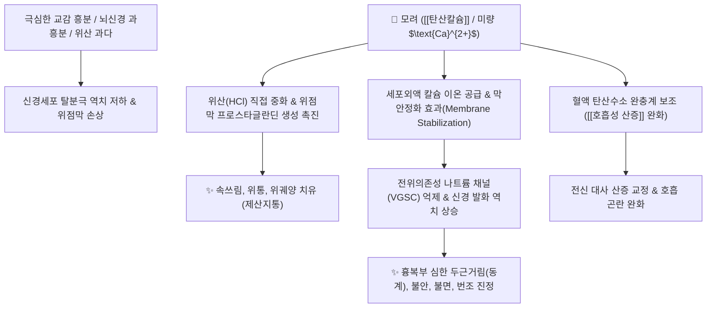

# 🌿 [[모려]] (牡蠣, Ostreae Testa)

> **핵심 요약 (Key Summary)**:
> 굴과(*Ostreidae*) 굴(*Crassostrea gigas*) 등의 껍데기(패각)
> 주성분인 [[탄산칼슘]]($\text{CaCO}_3$)이 위산을 중화하고 혈중 산염기 완충계와 칼슘 농도를 조절하여 신경세포막 안정화
> [[상한론]]의 흉복동(胸腹動, 심한 두근거림)과 경광(驚狂)·번조(煩躁)를 가라앉히는 대표적인 [[중진안신]](重鎭安神)·[[잠양포음]](潛陽補陰)·[[연견산결]](軟堅散結)·[[제산지통]](制酸止痛) 약재

---
## 📌 목차
1. [기본 본초 정보 & 화학 구조 (Pharmacognosy)](#1-기본-본초-정보--화학-구조-pharmacognosy)
2. [핵심 분자약리 기전 & 신경·산염기 완충 네트워크](#2-핵심-분자약리-기전--신경산염기-완충-네트워크)
3. [해부생체역학 / 신경 흥분성 & 자율신경 연계](#3-해부생체역학--신경-흥분성--자율신경-연계)
4. [사상의학 및 체질별 임상 응용 (적응증 vs 금기)](#4-사상의학-및-체질별-임상-응용-적응증-vs-금기)
5. [상한론 『약징(藥徵)』 분석 및 배오 원리](#5-상한론-약징藥徵-분석-및-배오-원리)
6. [핵심 처방 비교 매트릭스](#6-핵심-처방-비교-매트릭스)
7. [출처 및 학술 참고 문헌 (References)](#7-출처-및-학술-참고-문헌-references)

---
## 1. 기본 본초 정보 & 화학 구조 (Pharmacognosy)

> [!abstract]+ 🧪 3D 약리 분자 구조 (Interactive 3D Viewer)
> <iframe src="https://molecule-viewer-rho.vercel.app/?cid=57340108" style="width: 100%; height: 600px; border: none; border-radius: 12px; box-shadow: 0 4px 20px rgba(0,0,0,0.15);" allowfullscreen></iframe>


| 항목 | 상세 내용 |
| :--- | :--- |
| **기원 동물** | 굴과(Ostreidae) 참굴 *Crassostrea gigas* (Thunberg) 또는 근연종의 조개껍질(패각) |
| **성미 (性味)** | 鹹·澁, 微寒 |
| **귀경 (歸經)** | 肝·膽·腎經 (간경, 담경, 신경) |
| **효능 (Actions)** | [[중진안신]](重鎭安神), [[잠양포음]](潛陽補陰), [[연견산결]](軟堅散結), [[수렴고삽]](收斂固澁), [[제산지통]](制酸止痛) |
| **주요 성분** | • **주성분 광물**: [[탄산칼슘]] ($\text{CaCO}_3$, KP 규격 $\ge 90.0\%$)<br>• **미량 원소**: 인산칼슘($\text{Ca}_3(\text{PO}_4)_2$), 황산칼슘($\text{CaSO}_4$), 마그네슘, 철, 아연, 알루미늄 등<br>• **유기 기질 단백질**: 콘키올린(Conchiolin), 아미노산 복합체 |

> **[생체 물리화학적 특징 및 약리 기전]**:
> * 모려는 방해석(Calcite) 형태의 탄산칼슘 덩어리로 이루어져 있어, 체내 전해질과 혈중 산염기 평형을 맞추는 데 핵심 역할을 합니다.
> * 이온화된 [[칼슘]]($\text{Ca}^{2+}$)을 체내에 공급하며, 탄산칼슘은 강알칼리성 완충 물질로 [[호흡성 산증]](Respiratory Acidosis) 및 대사성 산증에서 혈중 pH를 정상화하는 데 기여합니다.
> * 불에 달군 단모려(煅牡蠣)는 제산 작용과 수렴 고삽 작용이 강화되고, 생모려(生牡蠣)는 잠양안신과 연견산결 작용에 특화됩니다.

### 🔬 모과의 탄산칼슘 결정 및 제산 반응
```
CaCO3 (모려 탄산칼슘) + 2HCl (위산) ---> CaCl2 (염화칼슘) + H2O + CO2 (가스)
                                           |
                                   (장관 흡수 및 체액 Ca2+ 공급)
```
> **[구조적 특징 및 이온화 특성]**: 패각 층상 구조 내에 유기 고분자(콘키올린)가 결합되어 있어, 합성 무기 탄산칼슘 제제보다 위장관 자극이 적고 생체 내 칼슘 이온 방출 속도가 완만하여 지속적인 신경 안정 작용을 유지합니다.

---
## 2. 핵심 분자약리 기전 & 신경·산염기 완충 네트워크



### (1) 표적 기전 및 분자 작용
* **신경세포막 안정화 (Membrane-Stabilizing Effect)**:
  * 세포외액의 $\text{Ca}^{2+}$ 농도를 정상화하여 전위의존성 나트륨 채널(Voltage-Gated $\text{Na}^+$ Channel)의 개방을 억제합니다.
  * 신경세포막의 탈분극 역치를 상승시켜 중추 및 자율신경계의 과도한 흥분 발화를 억제함으로써 **공황발작, 불면증, 가슴 두근거림(동계 動悸), 신경성 경련**을 가라앉힙니다.
* **위산 중화 및 점막 재생 ([[제산지통]] 制酸止痛)**:
  * 위 내 염산과 반응하여 위액의 산도를 pH 3.5~5.0의 최적 범위로 중화시킵니다.
  * 펩신의 단백 분해 활성을 억제하여 위점막 자가소화를 차단하고 위궤양 출혈을 지혈합니다.
* **림프절 결절 및 종괴 소산 ([[연견산결]] 軟堅散結)**:
  * 칼슘과 결합된 유기 단백 분획이 대식세포와 림프 순환을 자극하여 만성 림프절염(나력), 갑상선 결절, 유방 섬유선종의 섬유성 경화를 무르게 풀어줍니다.

---
## 3. 해부생체역학 / 신경 흥분성 & 자율신경 연계

* **심혈관계 및 복부 대동맥 박동 (흉복동 胸腹動)**:
  * 교감신경 긴장으로 복부 대동맥이 쿵쾅거리며 박동하는 복부 동통 및 심계항진 상태에서 심근 및 혈관 평활근의 과흥분을 진정시킵니다.
* **수렴고삽 (땀, 정액, 혈액 누출 방지)**:
  * 땀샘과 비뇨생식기 점막의 투과성을 낮추어 도한(식은땀), 자한, 유정(遺精), 대하증을 수렴시킵니다.

---
## 4. 사상의학 및 체질별 임상 응용 (적응증 vs 금기)

```
[✅ 최적 적응증 (Sweet Spot)]
• 신경증 및 공황장애: 사소한 일에 잘 놀라고 가슴이 쿵쾅거리며(심계), 불안하여 잠을 이루지 못하는 경우
• 흉복부 박동(흉복동): 명치나 배꼽 주변에서 대동맥이 심하게 뛰는 것이 느껴지는 복진 소견
• 위산과다증: 속쓰림, 신물 올라옴, 위·십이지장궤양 통증
• 음허화왕(陰虛火旺): 오후에 열감이 뜨고 식은땀(도한)이 나며 가슴이 답답한 갱년기 증후군
• 만성 나력(경부 림프절 결핵/종대), 갑상선종, 연부조직 결절

[⚠️ 신중 투여 및 금기 (Caution / Contraindication)]
• 고칼슘혈증 및 신장 결석 병력 환자 (장기 대량 복용 주의)
• 실열(實熱)이나 급성 외감병 초기, 담음이 없는 순수한 허증 환자
```

---
## 5. 상한론 『약징(藥徵)』 분석 및 배오 원리

### (1) 『[[약징]]』에 나타난 모려의 주치
> **"牡蠣 主治胸腹動也. 旁治驚狂, 煩躁..."**  
> (모려의 주치는 가슴과 배가 쿵쾅거리며 뛰는 것(胸腹動)이며, 곁들여 깜짝깜짝 놀라고 미쳐 날뛰는 것(驚狂), 가슴이 답답하여 안절부절못하는 것(煩躁)을 치료한다.)

* **핵심 배오 원리**:
  * [[모려]] + [[용골]] $\rightarrow$ 최고의 잠양안신(潛陽安神) 짝으로 뇌신경 흥분과 심계항진, 불면, 유정을 강력히 진정 ([[시호가용골모려탕]], [[계지가용골모려탕]])
  * [[모려]] + [[시호]] + [[황금]] $\rightarrow$ 간담(肝膽)의 화열을 내리면서 상열감과 신경과민을 해소
  * [[모려]] + [[현삼]] + [[패모]] $\rightarrow$ 화를 내리고 담을 삭혀 완고한 림프절 멍울(나력)과 갑상선 결절을 연견산결 ([[소라환]])

---
## 6. 핵심 처방 비교 매트릭스

| 처방명 | 구성 약재 | 주치 병증 및 임상 타깃 | 특징 및 감별점 |
| :--- | :--- | :--- | :--- |
| [[시호가용골모려탕]] | [[시호]], [[반하]], [[복령]], [[황금]], [[용골]], [[모려]], [[대황]] 등 | **소양병 + 흉만, 번경(煩驚), 섬어, 흉복동, 불면, 공황** | 간기울결과 뇌신경 과흥분을 다스리는 대표 중진안신제 |
| [[계지가용골모려탕]] | [[계지탕]] + [[용골]], [[모려]] | **음양기혈 허약, 몽유(夢遺), 도한, 탈모, 극심한 피로/불안** | 허증 환자의 신경 쇠약 및 진액 누출을 고섭 |
| [[모려산]] | [[모려]], [[황기]], [[마황근]], [[부소맥]] | **체력 허약자의 자한(自汗) 및 야간 도한(盜汗)** | 땀샘을 조여 식은땀을 멈추게 하는 대표 지한제 |
| [[소라환]] | [[모려]], [[현삼]], [[패모]] | **나력(경부 림프절염), 갑상선종, 피하 결절** | 담화(痰火)가 엉킨 단단한 종괴를 삭힘 |
| [[일관전]](가미) | [[사삼]], [[맥문동]], [[당귀]], [[생지황]], [[구기자]], [[천련자]] + [[모려]] | 간음부족, 협통, 구고, 위완통, 산역(속쓰림) | 음을 자양하면서 위산과다 통증 제압 |

---
## 7. 출처 및 학술 참고 문헌 (References)

   **Yang W et al. (2026)**. Oyster-derived peptide DLAGRDLTDYLM attenuates dexamethasone-induced osteoporosis in rats: associations with lipid metabolism and bone remodeling signatures. *Food & function*, 17: 6517-6533. [PMID: 42360339](https://pubmed.ncbi.nlm.nih.gov/42360339/)
   - **[연구 요약]**: 굴 유래 펩타이드의 글루코코르티코이드 유발 골다공증 개선 연구.
2. **대한민국약전(KP) 제12개정 (2022)**. 의약품각조 제2부: 모려 (Ostreae Testa) 규격 기준.
   - **[공정서 규격]**: 건조물 기준 탄산칼슘($\text{CaCO}_3$) 90.0% 이상 함유 규격 및 중금속, 비소 안전 기준치 명시.
3. **길익동동 (吉益東洞, 1784)**. 『약징(藥徵)』: 牡蠣 조문.
   - **[고전 원전]**: "牡蠣 主治胸腹動也. 旁治驚狂, 煩躁" - 흉복부 대동맥 박동 및 신경과민 병태에 대한 주치 조문 제시.
