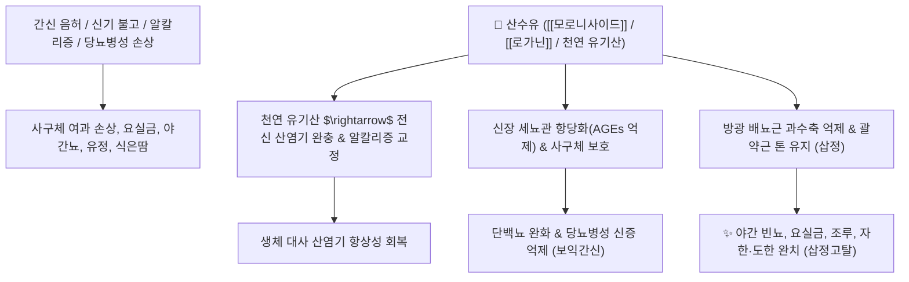

# 🌿 [[산수유]] (山茱萸, Corni Fructus)

> **핵심 요약 (Key Summary)**:
> 층층나무과(*Cornaceae*) 산수유나무(*Cornus officinalis*)의 씨를 제거한 잘 익은 열매살(과육)
> 이리도이드 배당체인 [[모로니사이드]](Morroniside)와 [[로가닌]](Loganin) 및 풍부한 천연 유기산이 알칼리증을 완충하고 신장 세뇨관 사구체 손상 및 방광 과활동성을 억제하여 보익·수렴 작용 발휘
> 간신부족(肝腎不足)으로 인한 허리·무릎 시림(요슬산연)·어지럼증·이명 및 남성 조루·유정·야간 빈뇨·식은땀을 치료하는 대표적인 [[보익간신]](補益肝腎)·[[삽정고탈]](澁精固脫) 약재

---
## 📌 목차
1. [기본 본초 정보 & 화학 구조 (Pharmacognosy)](#1-기본-본초-정보--화학-구조-pharmacognosy)
2. [핵심 분자약리 기전 & 이리도이드·신장 수렴 네트워크](#2-핵심-분자약리-기전--이리도이드신장-수렴-네트워크)
3. [해부생체역학 / 산염기 완충 & 방광 배뇨근 연계](#3-해부생체역학--산염기-완충--방광-배뇨근-연계)
4. [사상의학 및 임상 응용 (적응증 vs 씨앗 독성)](#4-사상의학-및-임상-응용-적응증-vs-씨앗-독성)
5. [고전 의학 및 배오 원리 (육미지황탕 배오)](#5-고전-의학-및-배오-원리-육미지황탕-배오)
6. [핵심 처방 비교 매트릭스](#6-핵심-처방-비교-매트릭스)
7. [출처 및 학술 참고 문헌 (References)](#7-출처-및-학술-참고-문헌-references)

---
## 1. 기본 본초 정보 & 화학 구조 (Pharmacognosy)

> [!abstract]+ 🧪 3D 약리 분자 구조 (Interactive 3D Viewer)
> <iframe src="https://molecule-viewer-rho.vercel.app/?cid=11228693" style="width: 100%; height: 600px; border: none; border-radius: 12px; box-shadow: 0 4px 20px rgba(0,0,0,0.15);" allowfullscreen></iframe>


| 항목 | 상세 내용 |
| :--- | :--- |
| **기원 식물** | 층층나무과(Cornaceae) 산수유나무 *Cornus officinalis* Sieb. et Zucc.의 씨를 발라내어 말린 열매(과육) |
| **성미 (性味)** | 酸·微溫 (약간 따뜻함) |
| **귀경 (歸經)** | 肝·腎經 (간경, 신경) |
| **효능 (Actions)** | [[보익간신]](補益肝腎), [[삽정고탈]](澁精固脫), [[렴한지고]](斂汗止固), [[생진지갈]](生津止渴) |
| **주요 성분** | • **이리도이드 배당체**: [[모로니사이드]] (Morroniside, KP 규격 $\ge 0.50\%$), [[로가닌]] (Loganin, KP 규격 $\ge 0.50\%$), 스웨로사이드, 코르닌<br>• **풍부한 천연 유기산**: 사과산(Malic acid), 구연산(Citric acid), 주석산, 갈산, 탄닌<br>• **다당류 및 플라보노이드**: 산수유 다당체, 텔리마그란딘 |

> **[유래 및 본초학적 기전]**:
> * 야산에서 자라는 붉은 열매로, 맛이 매우 시고 떫어 몸에서 빠져나가는 정기(精氣), 땀, 소변을 꽉 잡아주는 수렴(收斂)의 으뜸 본초입니다.
> * 각종 천연 유기산이 풍부하여 체내 [[산염기 불균형]](대사성/호흡성 알칼리증)을 교정하고, 간과 신장의 음정(陰精)을 보충하여 노인성 요통, 이명, 만성 피로를 회복시킵니다.
> * 씨앗에는 정액을 활성화하지 못하고 활정(滑精)을 유발하는 독성이 있으므로 반드시 씨를 제거(거핵 去核)하고 과육만 사용합니다.

### 🔬 산수유의 주요 이리도이드 배당체 화학 구조
```
        O──[ Glc ]
       /
   [ 세코이리도이드 골격 ]───COOCH3  <-- 모로니사이드 (Morroniside)
      \     /
       CH──OH
```
> **[구조적 특징 및 신장 보호]**: [[모로니사이드]]와 [[로가닌]]은 강력한 항산화 및 항당화 작용을 지녀 신장 사구체 간질세포의 세포사멸을 방지하고 당뇨병성 신장 손상을 억제합니다.

> 🧬 **현대 학술 근거 (2026-09-12 B-7 패치)** — PubChem 실측 분자 앵커: [[로가닌]](Loganin) CID **87691** · 분자식 C₁₇H₂₆O₁₀ · MW 390.4

🔬 **분자 구조** (Wikimedia Commons, Public Domain)

![[Loganin_구조.png|480]]
> [그림] 로가닌(Loganin, C₁₇H₂₆O₁₀) 분자 구조 — 출처: Wikimedia Commons (기존 첨부 재사용)

---
## 2. 핵심 분자약리 기전 & 이리도이드·신장 수렴 네트워크



### (1) 신장 보호 및 수렴 고탈 작용
* **방광 괄약근 조절 및 야간뇨 완화 ([[삽정고탈]] 澁精固脫)**:
  * 방광의 과민성 수축을 억제하고 요도 괄약근의 지지력을 높여 노인성 야간 빈뇨, 유뇨, 요실금, 조루증을 치료합니다.
* **항산화 및 당뇨병성 신증 억제**:
  * 최종당화산물(AGEs) 생성을 억제하고 신장 조직 내 산화 스트레스를 줄여 단백뇨 배출을 경감시킵니다.
* **진액 보존 및 식은땀 수렴 ([[렴한]](斂汗))**:
  * 기력이 쇠해 저절로 흐르는 식은땀(자한, 도한)을 멎게 하고 허약자의 탈진을 방어합니다.

> 🧬 **현대 학술 근거 (2026-09-12 B-7 패치)**
> [[로가닌]]이 세보플루란 마취 노출 고령 마우스 모델에서 SIRT1 활성화 및 NF-κB 경로 억제를 통해 해마 신경염증과 소교세포 활성화를 억제하고 공간학습·기억력을 유의하게 개선함이 확인되어, 노인성 이명·어지럼증 외 인지기능 보호 가능성에 대한 성분 수준 근거가 추가됨(PMID 42045663).

---
## 3. 해부생체역학 / 산염기 완충 & 방광 배뇨근 연계

* **체액 산-염기 완충 시스템 조절**:
  * 과호흡이나 대사성으로 치우친 알칼리증 환경에서 세포 내외 수소이온 농도를 완충합니다.
* **골반저근 및 방광 삼각부 안정화**:
  * 노화로 인해 처진 방광 경부의 신경근 조절력을 회복시킵니다.

---
## 4. 사상의학 및 임상 응용 (적응증 vs 씨앗 독성)

```
[✅ 최적 적응증 (Sweet Spot)]
• 간신부족 요슬산연: 허리와 무릎이 시큰거리고 힘이 없으며 다리가 가늘어지는 노인성 허약
• 비뇨생식기 기능 저하: 소변을 자주 보고(빈뇨), 밤에 자다 깨서 소변을 보며(야간뇨), 유정·조루가 있는 경우
• 이명 및 어지럼증: 머리가 맑지 못하고 귀에서 매미 소리가 나는 신허 이명
• 식은땀(도한) 및 만성 피로 ([[육미지황탕]], [[공진단]])

[⚠️ 씨앗 제거(거핵 去核) 필수 수칙]
• 산수유 씨앗에는 활혈을 방해하고 유정을 일으키는 독성 성분이 포함되어 있으므로 반드시 씨를 뺀 과육만 사용
• 습열(濕熱)로 인해 소변이 붉고 찌릿하게 아픈 급성 방광염 환자는 단독 사용 금기
```

---
## 5. 고전 의학 및 배오 원리 (육미지황탕 배오)

### (1) 보신의 최고 명방: 육미지황탕(六味地黃湯)
* **삼보삼사(三補三瀉) 배오**:
  * [[산수유]] $\rightarrow$ **간(肝)을 보하고 수렴함** (補肝) $\leftrightarrow$ [[목단피]]가 간화를 식힘 (瀉肝火)
  * [[숙지황]] $\rightarrow$ **신(腎)을 보함** (補腎) $\leftrightarrow$ [[택사]]가 신탁을 뺌 (瀉腎濁)
  * [[산약]] $\rightarrow$ **비(脾)를 보함** (補脾) $\leftrightarrow$ [[복령]]이 비습을 뺌 (瀉脾濕)
* **시너지**: 보하면서도 새어나가지 않게 묶어주는 산수유의 수렴력이 처방의 핵심 기둥.

---
## 6. 핵심 처방 비교 매트릭스

| 처방명 | 구성 약재 | 주치 병증 및 임상 타깃 | 특징 및 감별점 |
| :--- | :--- | :--- | :--- |
| [[육미지황탕]] | [[숙지황]], [[산수유]], [[산약]], [[택사]], [[목단피]], [[복령]] | **간신음허, 요슬산연, 현훈이명, 도한, 소아 발육부전** | 보음보신의 천하제일 방 |
| [[공진단]] | [[녹용]], [[당귀]], [[산수유]], [[사향]] | **만성 피로, 원기 쇠약, 허로, 정력 감퇴** | 산수유가 음혈과 정기를 보존 |
| [[좌귀음]] | [[숙지황]], [[산약]], [[구기자]], [[산수유]], [[복령]], [[감초]] | **진음고갈, 골증조열, 구갈, 요통, 몽유** | 순수하게 음액만을 보충 |
| [[청아원]] | [[두충]], [[보골지]], [[호도육]] + [[산수유]] | **신허요통, 하지 무력, 무릎 냉통** | 뼈와 관절을 튼튼하게 보강 |

---
## 7. 출처 및 학술 참고 문헌 (References)

1. **Wang X et al. (2026)**. Morroniside in Cornus officinalis Sieb. et Zucc. protects renal tubular epithelial cells from hypoxia/reoxygenation damage by inhibiting oxidative stress and ferroptosis. *Journal of clinical biochemistry and nutrition*, 78(2): 121-125. [PMID: 41841103](https://pubmed.ncbi.nlm.nih.gov/41841103/)
   - **[연구 요약]**: 산수유의 모로니사이드가 산화 스트레스와 염증을 억제하여 당뇨병성 신장 손상과 단백뇨를 현저히 억제함을 규명.
2. **대한민국약전(KP) 제12개정 (2022)**. 의약품각조 제2부: 산수유 (Corni Fructus) 규격 기준.
   - **[공정서 규격]**: 건조물 기준 모로니사이드 0.50% 이상, 로가닌 0.50% 이상 함유 및 씨앗 이물 규격 명시.
