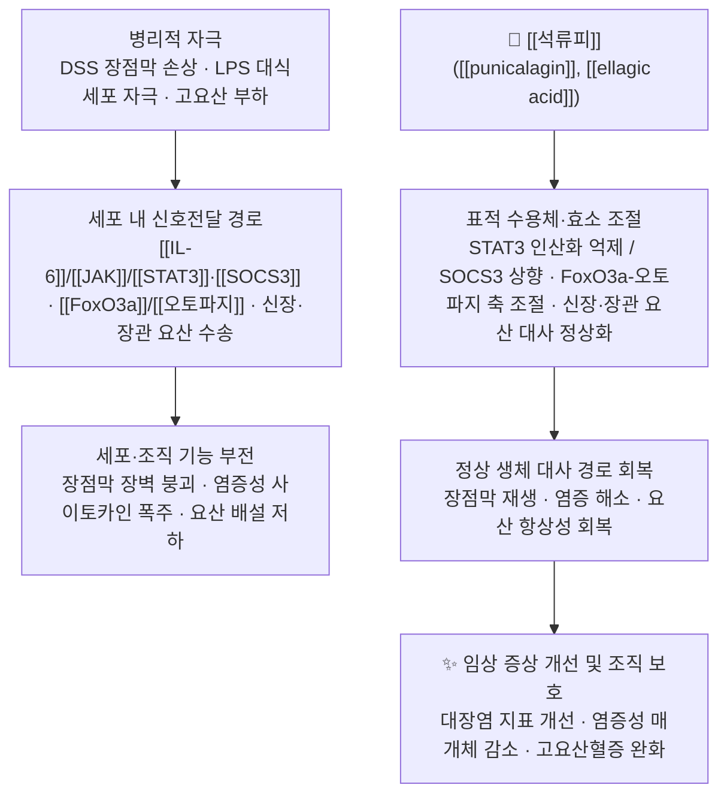

# 🌿 [[석류피]] (石榴皮, *Punica granatum* L. / Granati Pericarpium)

> **핵심 요약 (Key Summary)**:
> 부처꽃과(Lythraceae) 석류 *Punica granatum* L.의 **성숙한 과피(果皮)** 를 건조한 약재로, 酸·澁·溫의 성미를 지닌 대표적 [[수렴고삽약]]이다.
> 핵심 지표 성분인 [[punicalagin]](엘라기탄닌계)이 [[IL-6]]/[[STAT3]]/[[SOCS3]] 신호축과 [[FoxO3a]]/[[오토파지]] 경로를 조절하여 장점막 염증 완화·요산 대사 정상화 등 분자약리 효과를 발휘한다.
> 한의학적으로는 澁腸止瀉(수렴지사)·止血(지혈)·驅蟲(구충)의 효능으로 久瀉久痢, 崩漏帶下, 蟲積腹痛에 응용되어 온 전통 [[수렴]]·[[구충]] 약재이다. 『[[상한론]]』 및 『[[약징]]』에는 수록되지 않은 후대 본초로, 邪가 성한 초기 실열 이질에는 收澁禁忌가 따른다.

---
## 📌 목차
1. [기본 본초 정보 & 화학 구조 (Pharmacognosy)](#1-기본-본초-정보--화학-구조-pharmacognosy)
2. [핵심 분자약리 기전 & 대사 네트워크](#2-핵심-분자약리-기전--대사-네트워크)
3. [해부생체역학 / 근육·신경 대사 연계](#3-해부생체역학--근육신경-대사-연계)
4. [사상의학 및 체질별 임상 응용 (적응증 vs 금기)](#4-사상의학-및-체질별-임상-응용-적응증-vs-금기)
5. [상한론 『약징(藥徵)』 분석 및 배오 원리](#5-상한론-약징藥徵-분석-및-배오-원리)
6. [핵심 처방 비교 매트릭스](#6-핵심-처방-비교-매트릭스)
7. [출처 및 학술 참고 문헌 (References)](#7-출처-및-학술-참고-문헌-references)

---
## 1. 기본 본초 정보 & 화학 구조 (Pharmacognosy)

> [!abstract]+ 🧪 핵심 지표성분 3D 분자 구조 (Interactive 3D Viewer)
> <iframe src="https://molecule-viewer-rho.vercel.app/?cid=16148453" width="100%" height="450px" frameborder="0" allow="webgl" style="border-radius: 8px;"></iframe>

| 항목 | 상세 내용 |
| :--- | :--- |
| **기원 식물** | 부처꽃과(Lythraceae; 전통 분류상 石榴科 Punicaceae) **석류** *Punica granatum* L.의 성숙한 **과피(果皮, pericarpium)** 를 건조한 것 |
| **성미 (性味)** | 酸·澁, 溫 — 酸味는 收斂, 澁味는 固澁의 작용 기반. 일부 본초서에 小毒으로 기재 |
| **귀경 (歸經)** | 大腸經 (문헌에 따라 胃·大腸經으로 기재) — [[대장경]] 귀속이 澁腸止瀉 효능의 이론적 근거 |
| **효능 (Actions)** | ① **澁腸止瀉**([[지사]]) ② **止血**([[지혈]]) ③ **驅蟲**([[구충]]) — 收澁·固腸·殺蟲의 3대 축 |
| **주요 성분** | • **지표 성분**: [[punicalagin]](푸니칼라진, 엘라기탄닌계)<br>• **유효 활성 성분군**: [[ellagic acid]](엘라그산), [[gallic acid]](갈산), punicalin, pelletierine·isopelletierine(구충 활성 알칼로이드) 등 |
| **PubChem CID** | [16148453](https://pubchem.ncbi.nlm.nih.gov/compound/16148453) (punicalagin 기준) |

### 🔬 주요 지표물질 화학 구조

**1) [[punicalagin]] (Punicalagin, C₄₈H₂₈O₃₀, MW ≈ 1084.7)**
- **골격 특징**: 포도당(glucose) 중심 코어에 **gallagic acid** 및 **ellagic acid** 잔기가 에스터 결합으로 연결된 **고분자 엘라기탄닌(ellagitannin)** 이다. 분자 내 다수의 페놀성 수산기(-OH)가 존재하여 강력한 수소공여능(항산화능)을 나타낸다.
- **α/β 아노머**: 수용액 중 α- 및 β-푸니칼라진의 평형 혼합물로 존재하는 것으로 보고된다.
- **생체이용률 특성**: 분자량이 크고 수산기가 많은 고분자 탄닌이므로 **장관 흡수율이 낮고**, 대부분 대장 미생물총에 의해 가수분해되어 **urolithin 계열 대사체**로 전환된 뒤 흡수된다. 따라서 석류피의 효과는 위장관 국소 작용과 미생물 대사체 매개 전신 작용의 이중 기전으로 설명된다.

**2) [[ellagic acid]] (C₁₄H₆O₈, MW ≈ 302.2)** — 라크톤형 폴리페놀. 푸니칼라진의 가수분해 산물로, 항산화·항염 활성의 핵심 대사체.

**3) [[gallic acid]] (C₇H₆O₅, MW ≈ 170.1)** — 탄닌의 기본 단량체. 폴리페놀성 수렴 작용에 직접 기여.

> **수렴(收澁) 작용의 물리화학적 기초**: 탄닌의 다가 페놀성 수산기가 점막 표면 단백질과 **수소결합·소수성 결합**을 형성하여 단백질을 가교·침전시키고, 이로써 점막 표면에 **보호성 피막**이 형성되어 삼출·분비가 감소한다. 이것이 한의학적 澁腸止瀉 효능의 현대적 해석 중 하나이다.

> [!warning] 공정서 규격 관련
> 대한민국약전(KP) 및 대한민국약전외한약(생약)규격집의 **석류피 수록 여부와 지표성분 규격 함량은 본 노트에서 근거 미확인**이다(별도 공정서 확인 필요). 중국약전(ChP)에는 石榴皮가 수록되어 있으며 **鞣質(탄닌) 함량 규격**이 설정되어 있는 것으로 알려져 있으나, 구체 수치는 **근거 미확인**이다.

---
## 2. 핵심 분자약리 기전 & 대사 네트워크

![[석류피_3.jpg|540]]
> [그림 1: A catalogue of Indian medicinal plants and drugs, with their names in the Hindustani and Sanscrit languages (IA b33288161).pdf]



### (1) 표적 수용체 및 신호전달 경로

* **[[IL-6]]/[[JAK]]/[[STAT3]]/[[SOCS3]] 축 — 장점막 염증 조절**
  * 논문 1(Cheng & Zhou, 2024)에 따르면, 전통 배오인 **[[마치현]](Portulacae Herba) + 석류피(Granati Pericarpium)** 조합은 DSS(dextran sulfate sodium) 유도 **마우스 궤양성 대장염 모델**에서 **IL-6/STAT3/SOCS3 신호 경로**를 매개로 염증을 완화하였다.
  * 기전적 해석: IL-6가 수용체에 결합하면 JAK를 통해 **STAT3 인산화**가 유도되고, 인산화 STAT3는 핵 내로 이동해 염증성 유전자 전사를 촉진한다. 석류피 유래 탄닌 성분은 이 인산화 단계를 억제하고, **염증의 음성 피드백 조절자인 [[SOCS3]](Suppressor of Cytokine Signaling 3)를 상향**시킴으로써 염증 신호를 스스로 차단하는 방향으로 작용하는 것으로 해석된다.
  * 결과적으로 대장 길이 보존, 질병활성도 지수 감소, 조직학적 점막 손상 완화가 관찰되었다. (구체적 수치·투여 용량은 본 노트에서 **근거 미확인** — 원문 확인 필요)

* **[[FoxO3a]]/[[오토파지]] 축 — 대식세포 염증 억제**
  * 논문 2(Cao & Chen, 2019)에서 **[[punicalagin]]** 은 LPS로 자극한 **RAW264.7 대식세포**에서 **FoxO3a/Autophagy 신호 경로를 억제**하여 염증을 차단하였다.
  * 해석: LPS 자극 시 활성화되는 FoxO3a는 오토파지 관련 인자(LC3, Beclin-1 등)의 발현을 조절하는데, 푸니칼라진은 이 축을 조절하여 **NO·PGE₂·iNOS·COX-2·TNF-α·IL-6 등 염증성 매개체의 과잉 생성을 억제**하는 것으로 보고되었다. 즉, 염증성 자극에 대한 대식세포의 과도한 반응을 진정시키는 방향으로 작용한다.

* **신장·장관 요산 대사 축 — 고요산혈증 개선**
  * 논문 3(Han & Ren, 2025)에 따르면 **punicalagin**은 고요산혈증 상태에서 **신장 및 장관 기능 이상을 회복**시킴으로써 고요산혈증을 완화하였다.
  * 해석: 요산 항상성은 신장의 재흡수/배설 수송체(예: URAT1, GLUT9 계열)와 **장관 배설 경로(ABCG2 등)** 및 장내 미생물총·장벽 기능이 복합적으로 관여한다. 푸니칼라진은 신장과 장관 양쪽의 기능 이상을 동시에 개선하는 방향으로 작용한 것으로 보고되었다. (특정 수송체별 정량 변화 수치는 본 노트에서 **근거 미확인**)

### (2) 대사 및 면역 조절

* **항산화**: 푸니칼라진·엘라그산의 다가 페놀 구조가 자유라디칼을 소거하고 지질과산화를 억제한다(논문 2의 항염 기전과 연결).
* **장점막 장벽 보호**: 염증성 사이토카인 억제와 함께 점막 상피 재생을 돕는 방향으로 작용(논문 1).
* **전신 대사 조절**: 고요산혈증 모델에서 신장·장관 기능 회복을 통해 전신 대사 항상성에 기여(논문 3).
* **국소 수렴 작용**: 탄닌의 단백질 침전 작용에 기반한 점막 보호·삼출 억제(전통 약리 기술, 분자 수준 정량 근거는 **근거 미확인**).

---
## 3. 해부생체역학 / 근육·신경 대사 연계

> [!note] 근거 수준 안내
> 제공된 3편의 논문은 **장점막 염증(대장염), 대식세포 염증, 고요산혈증·신장/장관 기능**을 주제로 하며, **골격근 대사·신경계·혈관계에 대한 직접 실험 근거는 포함하지 않는다.** 아래 내용은 기전적 추론과 전통 문헌 기반 해석이며, 해당 항목은 **근거 미확인**으로 표시한다.

* **근육 섬유 대사**:
  * 석류피 및 푸니칼라진이 골격근의 유산소/무산소 대사, 미토콘드리아 지방산 산화, 칼슘 채널, 젖산 대사에 미치는 직접적 영향은 **근거 미확인**이다.
  * 다만 푸니칼라진이 대식세포에서 **오토파지 축을 조절**한다는 보고(논문 2)는 자가포식-미토콘드리아 품질관리 축과 개념적으로 연결되나, 이를 근육 조직에 그대로 외삽할 수는 없다.
* **신경 및 혈관계 조절**:
  * eNOS 활성화, 자율신경 조절, 뇌혈류 및 말초 순환 개선 효과는 본 노트에서 **근거 미확인**.
  * 전통적으로 석류피는 收澁藥으로 분류되어 순환계보다는 **소화관·생식기·출혈 증상**에 응용되어 왔다.
* **해부학적 작용 부위 요약**:

| 작용 부위 | 확인된 근거 | 근거 수준 |
| :--- | :--- | :--- |
| 대장 점막(장벽·염증) | 논문 1 — DSS 대장염, IL-6/STAT3/SOCS3 | 전임상(in vivo, 마우스) |
| 대식세포(면역세포) | 논문 2 — LPS 자극 RAW264.7, FoxO3a/오토파지 | in vitro |
| 신장·장관(요산 대사) | 논문 3 — 고요산혈증 모델, 신·장 기능 회복 | 전임상(in vivo) |
| 골격근·신경·혈관 | — | **근거 미확인** |

---
## 4. 사상의학 및 체질별 임상 응용 (적응증 vs 금기)

> [!warning] 사상의학 문헌 근거
> 『동의수세보원』 등 사상의학 원전에서 **석류피가 특정 체질 처방으로 명시된 조문은 본 노트에서 근거 미확인**이다. 아래는 酸澁收斂·溫性이라는 성미와 전통 임상 관행에 기반한 **일반적 해석**이며, 체질 진단과 결합한 처방은 임상가의 판단이 필요하다.

```
[✅ 최적 적응증 (Sweet Spot)]
• 久瀉久痢 — 오랜 설사·이질로 正氣가 허해진 만성 경향 (邪가 이미 衰退한 단계)
• 脾腎虛寒型 五更泄瀉 경향에서 收澁 배오의 보조 약재로 고려
• 虛寒性 帶下·崩漏 등 收澁이 필요한 출혈·분비 과다 패턴
• 蟲積(회충·요충·촌충 등)으로 인한 복통 — 구충 목적의 전통 응용
• 산성·삽성 성미에 반응하는 虛寒 체질(전통적으로 少陰人·太陰人 虛寒證 군에서 고려되는 경향)

[⚠️ 신중 투여 및 금기 (Caution / Contraindication)]
• 實熱·濕熱痢의 初期 — 邪가 성한 단계에서 收澁하면 邪를 內閉시킬 우려
• 外感 初期, 表邪未解 — 조기 수렴은 해표를 방해
• 便秘 경향, 燥熱 체질 — 酸澁收斂이 배변을 더욱 굳게 할 수 있음
• 小毒 기재 약재이므로 과량·장기 투여 주의(pelletierine계 알칼로이드 관련)
• 임신부·소아·신기능 저하자 — 안전성 데이터 근거 미확인, 전문가 판단 필요
```

---
## 5. 상한론 『약징(藥徵)』 분석 및 배오 원리

### (1) 『[[약징]]』에 나타난 주치와 방치

> **"[石榴皮] — 『약징(藥徵)』 및 『상한론』 미수록"**

* **[고전 문헌 위치]**: 석류피는 吉益東洞의 『약징(藥徵)』에 수록된 약물이 **아니며**, 『상한론』·『금궤요략』의 처방 구성에도 등장하지 않는다. 즉 **경방(經方) 계열 약재가 아닌 후대 본초**이다.
* **[연원]**: 석류(安石榴)는 『名醫別錄』에 최초 기재된 것으로 전해지며, 이후 『本草綱目』 등 역대 본초서에서 果皮의 酸澁收斂 효능이 정리되었다. (원문 조문의 축자적 인용은 본 노트에서 **근거 미확인** — 원전 대조 필요)
* **[현대 임상적 해석]**: 경방의 收澁 계열이 烏梅·訶子·罌粟殼 등으로 대표된다면, 석류피는 **탄닌 함량이 매우 높은 수렴성 약재**로서 만성 설사·구충 영역에서 독자적으로 활용되어 왔다.

### (2) 핵심 약재 배오(짝)의 묘미

* **[[석류피]] + [[마치현]] (Portulacae Herba)** $\rightarrow$ **대장염 타깃**
  * 논문 1에서 검증된 전통 배오. 청열해독·수렴지사를 겸하여 **궤양성 대장염(DSS 대장염 모델)** 의 IL-6/STAT3/SOCS3 축을 조절.
* **[[석류피]] + [[訶子]]·[[肉豆蔻]]** $\rightarrow$ **久瀉久痢 澁腸**
  * 酸澁收斂 약재를 중첩 배오하여 만성 설사·탈항을 다스리는 전통 조합.
* **[[석류피]] + [[黃連]]·[[黃柏]]** $\rightarrow$ **濕熱痢 겸 收澁**
  * 청열조습(黃連·黃柏)에 收澁(석류피)을 가미하여 濕熱이 남아 있으면서 久痢로 正氣가 손상된 경우를 겨냥.
* **[[석류피]] + [[使君子]]·[[檳榔]]** $\rightarrow$ **구충(驅蟲)**
  * 석류피의 pelletierine계 알칼로이드와 使君子·檳榔의 구충 작용을 병용하여 蟲積腹痛에 응용(전통 응용, 정량 근거 **근거 미확인**).

---
## 6. 핵심 처방 비교 매트릭스

| 처방명 | 구성 약재 | 주치 병증 및 임상 타깃 | 특징 및 감별점 |
| :--- | :--- | :--- | :--- |
| **[[석류피]] 단방·배오 (石榴皮煎)** | [[석류피]] (± [[黃連]], [[訶子]]) | 久瀉久痢, 脫肛, 蟲積腹痛 | 탄닌 함량 기반의 강한 收澁力. **만성·허증 단계**에 적합하며 初期 實邪에는 부적합 |
| **[[마치현]]·[[석류피]] 배오 (Portulacae Herba + Granati Pericarpium)** | [[마치현]], [[석류피]] | 궤양성 대장염 계열 장점막 염증 | 논문 1에서 IL-6/STAT3/SOCS3 경로 매개 효과 확인. **청열 + 收澁**의 이중 구조 |
| **[[사신환]] (四神丸)** | [[補骨脂]], [[五味子]], [[肉豆蔻]], [[吳茱萸]], 生薑, 大棗 | 脾腎虛寒 五更泄瀉 | 溫補脾腎 + 收澁. 석류피와 달리 **온신(溫腎)** 이 주축이며 구충 작용 없음 |
| **[[진인양장탕]] (眞人養臟湯)** | [[罌粟殼]], [[訶子]], [[肉豆蔻]], [[人蔘]], [[白朮]], [[白芍]] 등 | 久瀉久痢, 脫肛, 腹痛 | 澁腸固脫 + 益氣養血. 收澁力이 가장 강하나 **의존성·금단 주의**(罌粟殼) |
| **[[오매환]] (烏梅丸)** | [[烏梅]], [[細辛]], [[乾薑]], [[黃連]], [[黃柏]], [[附子]] 등 | 蛔厥, 久痢 | 酸收 + 溫臟安蛔. 석류피와 **구충·수렴 영역에서 감별**되나, 寒熱錯雜 배오가 특징 |

> **감별 요점**: 석류피는 ① **탄닌 기반 수렴력**이 강하고 ② **구충 작용**을 겸하며 ③ **경방 계열이 아닌 후대 본초**라는 점에서 烏梅·訶子·罌粟殼과 구분된다. 임상에서는 "邪가 남아 있는가"를 먼저 판단하여, 實邪 未盡이면 收澁을 미루는 것이 원칙이다.

---
## 7. 출처 및 학술 참고 문헌 (References)

1. **Cheng Z, Zhou Y (2024)**. *Traditional herbal pair Portulacae Herba and Granati Pericarpium alleviates DSS-induced colitis in mice through IL-6/STAT3/SOCS3 pathway*. **Phytomedicine**. [PMID: 38422652](https://pubmed.ncbi.nlm.nih.gov/38422652/)
   - **[연구 요약]**: **in vivo(마우스 DSS 유도 궤양성 대장염 모델)** 연구. 전통 배오인 **마치현(Portulacae Herba) + 석류피(Granati Pericarpium)** 가 대장염 증상을 완화하였으며, 그 기전이 **IL-6/STAT3/SOCS3 신호 경로** 조절과 연관됨을 제시. 즉 STAT3 인산화 억제 및 SOCS3 상향을 통한 염증 신호 차단이 핵심. (개별 수치·용량 데이터는 **근거 미확인** — 원문 확인 필요)
2. **Cao Y, Chen J (2019)**. *Punicalagin Prevents Inflammation in LPS-Induced RAW264.7 Macrophages by Inhibiting FoxO3a/Autophagy Signaling Pathway*. **Nutrients**. [PMID: 31731808](https://pubmed.ncbi.nlm.nih.gov/31731808/)
   - **[연구 요약]**: **in vitro(LPS 자극 RAW264.7 대식세포)** 연구. 석류피 지표성분 **[[punicalagin]]** 이 **[[FoxO3a]]/[[오토파지]] 신호 경로를 억제**함으로써 염증성 매개체 생성을 감소시켰다. 대식세포 과활성 억제라는 점에서 항염 기전의 세포 수준 근거를 제공.
3. **Han QQ, Ren QD (2025)**. *Punicalagin attenuates hyperuricemia via restoring hyperuricemia-induced renal and intestinal dysfunctions*. **J Adv Res**. [PMID: 38609050](https://pubmed.ncbi.nlm.nih.gov/38609050/)
   - **[연구 요약]**: **in vivo(고요산혈증 모델)** 연구. **[[punicalagin]]** 이 고요산혈증으로 손상된 **신장 및 장관 기능을 회복**시켜 요산 수치를 개선하였다. 요산 항상성에 관여하는 **신장·장관 이중 경로**를 표적으로 한다는 점이 특징. (특정 요산 수송체별 정량 결과는 **근거 미확인**)
4. **WHO Monographs on Selected Medicinal Plants**. *석류피(Pomegranate rind / Granati Pericarpium) 수록 여부 및 공식 모노그래프명*.
   - **[공인 데이터]**: 본 노트에서 **근거 미확인** — WHO 모노그래프 수록 여부, 규격 및 안전성 데이터는 별도 원문 확인이 필요하다.
5. **대한민국약전(KP) 제12개정 (2022)**. 의약품각조: 석류피 관련 규격.
   - **[공정서 규격]**: KP 및 대한민국약전외한약(생약)규격집의 **석류피 수록 여부와 지표성분 기준 함량은 근거 미확인**. 중국약전(ChP)의 石榴皮 鞣質 함량 규격이 참고 대상이나 구체 수치는 원문 확인 필요.
6. **길익동동(吉益東洞, 1784)**. 『약징(藥徵)』.
   - **[고전 원전]**: **석류피는 『약징』에 수록되어 있지 않으며**, 『상한론』·『금궤요략』 처방에도 등장하지 않는다. 따라서 본 약재의 전통 근거는 경방이 아닌 **후대 본초서(名醫別錄, 本草綱目 등)** 에 의존한다(원문 축자 인용은 **근거 미확인**).