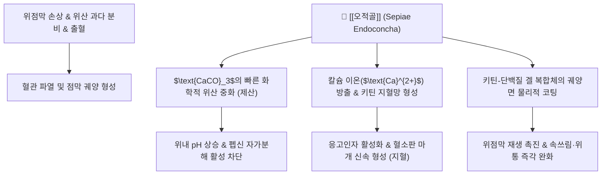

---
aliases:
  - 오적골
  - 烏賊骨
  - 해표초
  - 海螵蛸
  - Sepiae Endoconcha
  - 갑오징어뼈
tags:
  - 본초
  - 수렴고삽약
  - 고삽제
  - 수렴지혈
  - 제산지통
  - 삽정지대
  - 위궤양
  - 제산제
  - 지혈약
---
# 🌿 [[오적골]] (烏賊骨, 해표초 海螵蛸, Sepiae Endoconcha)

> **핵심 요약 (Key Summary)**:
> 오징어과(Sepiidae) 참갑오징어(*Sepia esculenta* Hoyle) 등의 내각(內殼, 체내 석회질 뼈).
> 탄산칼슘($\text{CaCO}_3$) 및 키틴 다당체가 위산 중화, 위점막 펩신 활성 억제, 혈소판 응집을 통한 피브린 혈괴 형성 촉진.
> 위·십이지장궤양으로 인한 속쓰림(위완통), 토혈, 혈변, 붕루, 유정(遺精), 대하(帶下) 및 외상성 출혈을 지혈·치유하는 대표 수렴고삽 약재.

---

> [!abstract]+ 🧪 3D 약리 분자 구조 (Interactive 3D Viewer)
> <iframe src="https://molecule-viewer-rho.vercel.app/?cid=57340108" style="width: 100%; height: 600px; border: none; border-radius: 12px; box-shadow: 0 4px 20px rgba(0,0,0,0.15);" allowfullscreen></iframe>

## 📌 목차
1. [기본 본초 정보 & 화학 성분 (Pharmacognosy)](#1-기본-본초-정보--화학-성분-pharmacognosy)
2. [핵심 분자약리 기전 & 대사 네트워크](#2-핵심-분자약리-기전--대사-네트워크)
3. [해부생체역학 / 위점막·응고계 연계](#3-해부생체역학--위점막응고계-연계)
4. [사상의학 및 체질별 임상 응용](#4-사상의학-및-체질별-임상-응용)
5. [상한·임상 배오 원리 및 주요 방제](#5-상한임상-배오-원리-및-주요-방제)
6. [핵심 처방 비교 매트릭스](#6-핵심-처방-비교-매트릭스)
7. [출처 및 학술 참고 문헌 (References)](#7-출처-및-학술-참고-문헌-references)

---

## 1. 기본 본초 정보 & 화학 성분 (Pharmacognosy)

| 항목 | 상세 내용 |
| :--- | :--- |
| **기원 동물** | 오징어과(Sepiidae) 참갑오징어(*Sepia esculenta*) 등의 체내 석회질 뼈(내각) |
| **성미 (性味)** | 함(鹹), 삽(澀), 미온(微溫) |
| **귀경 (歸經)** | 간경(肝經), 신경(腎經), 위경(胃經) |
| **전통 효능** | 수렴지혈(收斂止血), 삽정지대(澀精止帶), 제산지통(制酸止痛), 수습렴창(收濕斂瘡) |
| **주요 성분** | • **무기 미네랄**: 탄산칼슘($\text{CaCO}_3$, 80~85% 이상), 인산칼슘, 탄산마그네슘, 콜로이드성 규산 • **유기 고분자**: 키틴(Chitin), 조단백질(Conchiolin), 아미노산 |

---

## 2. 핵심 분자약리 기전 & 대사 네트워크

* **신속한 위산 중화(제산) 및 점막 보호**:
  * 주성분인 탄산칼슘이 위산($\text{HCl}$)과 반응하여 염화칼슘과 물로 변환되면서 위내 pH를 신속하게 상승시켜 산 자극성 통증을 완화하고 점막 소화효소인 펩신의 공격을 무력화.
* **국소 물리화학적 지혈 작용**:
  * 풍부한 칼슘 이온이 혈액 응고 캐스케이드(내인성/외인성 경로)를 촉진하며, 키틴 성분이 혈소판을 흡착하여 피브린 그물망 형성을 가속화함으로써 점막 출혈을 지혈.
* **항궤양 및 조직 재생 촉진**:
  * 궤양 표면에 불용성 보호막을 형성하여 위산, 담즙산, 음식물의 물리적 자극을 차단하고 육아조직의 성장을 촉진하여 상처 유합(수습렴창)을 유도.

---

## 3. 해부생체역학 / 위점막·응고계 연계

* **위·십이지장 점막 산 중화 경로**:
  * 탄산칼슘이 위강 내에서 직접 위산을 중화하는 작용은 위·십이지장 점막의 궤양 병소에 물리적으로 도달하는 해부학적 경로입니다.
* **국소 혈소판 응집 및 지혈 경로**:
  * 키틴 다당체의 피브린 혈괴 형성 촉진은 점막 손상 부위 모세혈관의 국소 응고 캐스케이드를 가속하는 경로로, 토혈·혈변 등 상부 위장관 출혈에 작용합니다.
* **위점막 방어벽 강화**:
  * 위점막 상피세포의 중탄산염 분비와 점액 합성을 보좌하여 위장 방어 인자를 강화.
* **창상 수렴 및 궤양면 흡착**:
  * 미세 다공성 골격 구조가 삼출액을 흡수하고 건조시켜 삼출성 궤양과 외상 출혈면을 수렴.

---

## 4. 사상의학 및 체질별 임상 응용

* **소음인(少陰人) 위산과다 속쓰림의 필수 약재**:
  * 소음인은 비위가 차고 기능이 떨어져 신경성 위염, 속쓰림, 산역(신트림)이 잦은데, 이때 [[안중산]]에 오적골을 배합하여 위벽을 보호.
* **소양인(少陽人) 부인과 붕루 및 대하증**:
  * 간신음허로 자궁 혈관이 약화되어 나타나는 부정기 출혈(붕루)에 수렴지혈 목적으로 응용.
* **주의사항**:
  * 장기 복용 시 변비를 유발할 수 있으므로, 평소 변비가 심한 환자는 윤장약과 함께 투약.

---

## 5. 상한·임상 배오 원리 및 주요 방제

* **배오 원리**:
  * 오적골 + [[패모]]: 오적골의 제산·수렴과 패모의 청열·진통 화담이 합쳐져 위궤양 치료의 명방인 [[오패산]](烏貝散)을 구성.
  * 오적골 + [[백급]]: 백급의 점조한 피막 형성과 오적골의 칼슘 지혈이 결합하여 상부 위장관 출혈의 응급 지혈 처방 구성.
* **대표 처방**:
  * [[오패산]]: 위산과다, 소화성 궤양, 위통, 속쓰림의 명방.
  * [[안중산]] 가감방: 만성 위염, 신경성 위장 질환.
  * [[완대탕]]: 비허습성 만성 백대하(여성 냉대하증).

---

## 6. 핵심 처방 비교 매트릭스

| 처방명 | 배오 목적 및 주치 | 배오 구성 |
| :--- | :--- | :--- |
| [[오패산]] | 위산과다, 소화성 궤양, 위통, 속쓰림 치료 | [[오적골]], [[패모]] |
| [[안중산]] 가감방 | 만성 위염, 신경성 위장 질환 (소음인 속쓰림) | [[오적골]] 가미 |
| [[완대탕]] | 비허습성 만성 백대하(여성 냉대하증) | [[오적골]] 배합 |

---
## 7. 출처 및 학술 참고 문헌 (References)

* 전국한의과대학 본초학 교수공편. 『본초학(本草學)』, 영림사 — 오적골(海螵蛸) 조: 성미(鹹·澁, 微溫), 귀경(肝·脾), 효능(수렴지혈·제산지통·수습생기), 임상 응용(위산과다·소화성궤양·제반출혈·습창).
* 대한민국약전외한약(생약)규격집(KHP) — 오적골 (Sepiae Endoconcha) 규격 기준.

