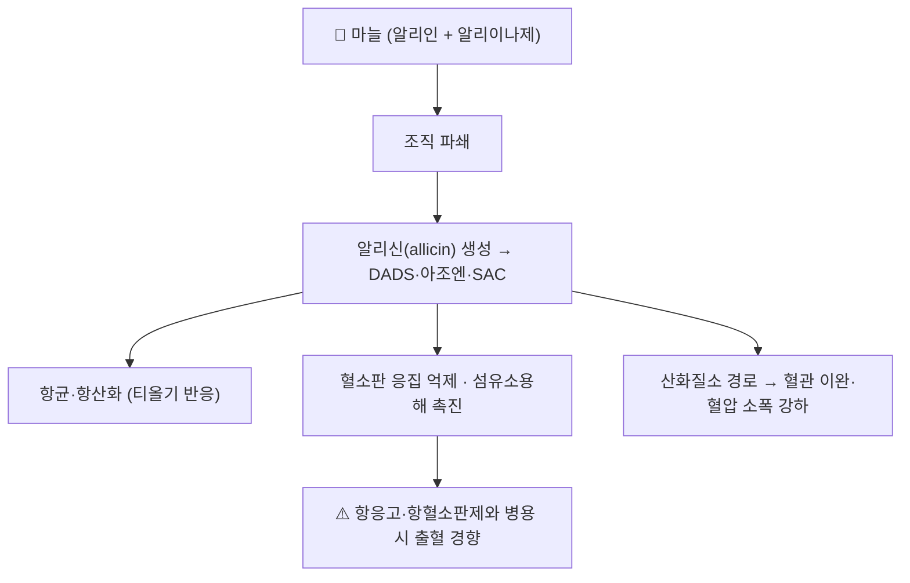

# 🌿 마늘 (大蒜, Garlic, *Allium sativum* L.)

> **핵심 요약 (Key Summary)**
> 수선화과(Amaryllidaceae, 구 백합과) *Allium sativum* L.의 **비늘줄기(인경)** — 생약명 大蒜
> 세포가 상하면 무취의 **알리인(alliin)** 이 **알리이나제**와 만나 **알리신(allicin)** 을 만들고, 이것이 유기황화합물(DADS·아조엔·S-알릴시스테인)로 이어져 **항균·항산화·혈소판 응집 억제** 작용을 낸다
> 한의학적으로는 辛·溫, 歸脾·胃·肺經으로 **해독·살충·소종·지리(止痢)·행체(行滯)** — 주로 외용·식이·민간요법 영역
> ⚠️ 실무 핵심은 **항혈소판·항응고제 병용 시 출혈 경향**과 **수술 전 중단 안내**, 그리고 "천연이라 안전하다"는 인식 교정이다

---

## 📌 목차
1. [기본 본초 정보 & 화학 성분](#1-기본-본초-정보--화학-성분)
2. [핵심 분자약리 기전](#2-핵심-분자약리-기전)
3. [해부생체역학 / 혈관·대사 연계](#3-해부생체역학--혈관대사-연계)
4. [임상 적용 및 적응증 (적응증 vs 금기)](#4-임상-적용-및-적응증-적응증-vs-금기)
5. [병용 관리 원칙 및 통합의학적 고찰](#5-병용-관리-원칙-및-통합의학적-고찰)
6. [성분-작용 매트릭스](#6-성분-작용-매트릭스)
7. [출처 및 학술 참고 문헌 (References)](#7-출처-및-학술-참고-문헌-references)

---

## 1. 기본 본초 정보 & 화학 성분

| 항목 | 상세 내용 |
| :--- | :--- |
| **기원 식물** | 수선화과(Amaryllidaceae) *Allium sativum* L. — 비늘줄기(인경) |
| **성미 (性味)** | 辛·溫 |
| **귀경 (歸經)** | 脾 · 胃 · 肺 |
| **효능 (Actions)** | 해독 · 살충 · 소종 · 지리(止痢) · 行滯(체기 소통) |
| **주요 성분** | 무취의 **알리인(alliin, S-allyl-cysteine sulfoxide)** + **알리이나제** → 조직 파쇄 시 **알리신(allicin)** 생성 → **다이알릴 다이설파이드(DADS)**, 아조엔, **S-알릴시스테인(SAC)**, S-알릴메르캅토시스테인 |
| **PubChem CID** | 지표성분별 CID는 PubChem에서 직접 확인 권장(allicin 등) |

> 🔬 **가공·제형에 따라 화학이 달라진다**: 생마늘을 으깨면 알리신이 급격히 생성되지만, 가열·숙성(흑마늘)에서는 알리신이 줄고 **SAC 등 안정한 수용성 유기황**이 늘어난다 — 항혈소판·혈압 관련 문헌의 결과 차이가 여기서 생긴다.

---

## 2. 핵심 분자약리 기전



- **(1) 항균·항산화**: 알리신의 **티올(SH) 반응성**이 세균 효소·막 단백을 비가역적으로 변형 — 시험관에서 광범위 항균·일부 내성균(MRSA 등) 억제 보고. 인체 감염 치료 근거는 제한적
- **(2) 혈소판·응고**: **혈소판 응집 억제, 혈소판–내피 상호작용 감소, 섬유소용해 촉진** 보고 → 출혈시간 연장 가능성
- **(3) 순환·대사**: 산화질소(NO) 경로를 통한 혈관 이완([[NO]]·[[eNOS]]), 혈압·LDL-C **경미한** 개선 보고(연구 간 이질성 큼)

---

## 3. 해부생체역학 / 혈관·대사 연계

* **말초 순환**: 내피 기능 개선·혈류 증가 보고 → 한방에서 溫通(온통)·행체(行滯) 효능과 겹치는 영역
* **지질·혈당**: 보충제 메타분석에서 총콜레스테롤·LDL-C 소폭 감소 보고가 있으나 효과 크기·이질성 문제로 **단독 치료 근거는 아님**
* **위장관**: 생마늘의 알리신은 점막 자극이 강해 **속쓰림·위통·설사** 유발 → 脾胃虛寒·위염 환자에서는 공복 복용 회피

---

## 4. 임상 적용 및 적응증 (적응증 vs 금기)

```
[✅ 사용 맥락 (Sweet Spot)]
• 식이 차원의 조미·전통적 항균·구충 목적
• 혈압·지질 보조 목적의 건기식 자가 복용 (효과 크기는 작음)
• 한의학적으로는 외용·민간요법 영역 (처방 배오 빈도는 낮음)

[⚠️ 신중 투여 및 금기 (Caution / Contraindication)]
• 항응고제(와파린·DOAC)·항혈소판제(아스피린·클로피도그렐) 복용자
• 수술 예정자 — 수술 7~10일 전 중단 안내를 흔히 권고(기관 지침 확인)
• 위염·위궤양·역류성 식도염 등 위점막 질환자(공복 생마늘)
• 출혈성 질환·혈소판 감소증·임신 말기
```

---

## 5. 병용 관리 원칙 및 통합의학적 고찰

### (1) 근거·수치
- **2026-09-17 심층리뷰 3번** ([PMID: 41539457](https://pubmed.ncbi.nlm.nih.gov/41539457/), *Complement Ther Med* 2026;97:103319): T2DM 환자의 본초 사용 유병률 **53%**, 최다 사용 4종 중 하나가 **마늘(Allium sativum L.)**. 전체 49종 중 금기 7종·주의 19종·**잠재적 약물 상호작용 12종**으로 분류
- **와파린 병용 위험의 실제 크기**: 같은 리뷰는 마늘에 대해 와파린 환자를 대상으로 한 체계적 고찰(*Br J Clin Pharmacol* 2021;87:352–374)이 **"임상적 영향 없음(minor)"** 으로 평가했다고 정리한다 → **기전적 우려(혈소판 응집 억제)는 실재하나, 관찰된 임상 영향의 크기는 제한적**이다. 과잉 경고와 무경고 사이에서 균형을 잡을 것

### (2) 한의 진료실 적용
- **문진**: "마늘 추출물·흑마늘 캡슐, 마늘즙, 알리신 보충제"를 혈압·혈당 건기식 항목에 포함해 확인한다
- **출혈 위험군**: 항응고·항혈소판제 복용자에게 고용량 마늘 보충제를 권하지 않고, 잇몸 출혈·코피·멍(반상출혈) 증가를 관찰 지표로 안내한다
- **시술 전 확인**: 약침·침 치료 자체는 위험하지 않으나, **수술·발치 예정** 환자에게는 중단 시점을 안내한다
- **환자 스크립트**: "마늘은 피를 묽게 하는 방향으로 작용할 수 있어, 아스피린이나 항응고제를 드시는 분은 고용량 보충제를 함께 드시지 않는 것이 좋습니다. 드시던 제품이 있으면 알려주세요."

---

## 6. 성분-작용 매트릭스

| 성분 | 화학 분류 | 작용 | 임상 함의 |
| :--- | :--- | :--- | :--- |
| **알리인 → 알리신** | 유기황산화물 | 항균·항산화, 점막 자극 | 생마늘 공복 복용 시 속쓰림 |
| **DADS·아조엔** | 유기황화합물 | 혈소판 응집 억제·혈관 이완 | 출혈 경향, 혈압 소폭 강하 |
| **S-알릴시스테인(SAC)** | 수용성 유기황(숙성·흑마늘) | 항산화·내피 보호 | 가열·숙성 제형의 주성분 |
| **셀레늄·플라보노이드** | 미량원소·폴리페놀 | 항산화 보조 | 보조적 |

---

## 7. 출처 및 학술 참고 문헌 (References)

1. **2026-09-17 심층리뷰 3번 원논문**. 제2형 당뇨병 환자의 본초 사용 안전성: 체계적 고찰 및 메타분석. *Complementary Therapies in Medicine*, 2026;97:103319. [PMID: 41539457](https://pubmed.ncbi.nlm.nih.gov/41539457/)
   - **[연구 요약]**: 단면연구 22편(19개국) — 마늘이 최다 사용 4종 중 하나, 금기·주의·상호작용 분류에 포함.
2. **와파린–마늘 병용 체계적 고찰(Br J Clin Pharmacol 2021;87:352–374)** — 2026-09-17 원본 리뷰가 인용한 문헌.
   - **[연구 요약]**: 와파린 환자에서 마늘 병용의 임상적 영향은 **"임상적 영향 없음(minor)"** 으로 평가 — 기전적 우려 대비 관찰된 위험 크기는 제한적.
3. **WHO Monographs / 대한민국한약전(KHP)** — 大蒜(마늘) 항목: 기원·성상·전통 용도·주의사항.

> ⚠️ 본 노트는 **2026-09-17 심층리뷰에 실린 실제 문헌**과 표준 교과서 범위 지식만으로 작성했다. 개별 보충제의 성분·함량은 제품 표시사항으로 확인할 것.

---

## 🔗 함께 보기
- [[호로파]] · [[당뇨병]] · [[저혈당]] · [[NO]] · [[eNOS]] · [[NSAID]] · [[클로피도그렐]] · [[리바록사반]] · [[CYP3A4]]
- 관련 논문: [[2026-09-17_통합의학약리학_심층리뷰]] 3번
