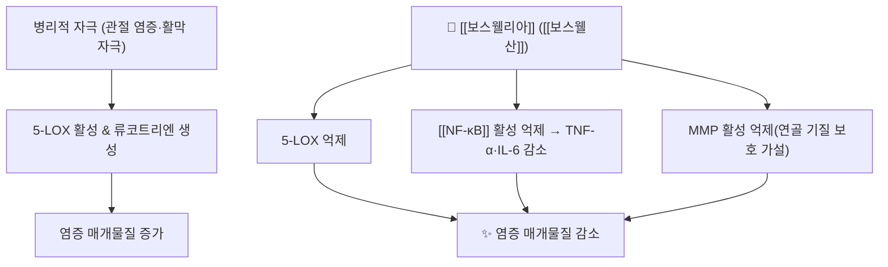

---
aliases:
  - 보스웰리아
  - Boswellia
  - Boswellia serrata
  - 인도유향
  - Indian frankincense
  - 보스웰산
  - Boswellic acid
tags:
  - 약리
  - 본초
  - 항염
  - 골관절염
  - 건기식
title: 보스웰리아
date: 2026-09-24
출처: "PMID: 42331134"
---
# 🌿 보스웰리아 (Boswellia serrata, Indian Frankincense)

> **핵심 요약 (Key Summary)**:
> 감람나무과(Burseraceae) *Boswellia serrata*의 **줄기 수지(gum-resin)** 를 건조·추출한 약재로, 인도 아유르베다 전통 약재(인도유향)다. 국내에서는 **건강기능식품·보충제 원료**로 유통되며 한의 처방 상용 본초는 아니다.
> 핵심 지표 성분인 보스웰산류([[보스웰산]], β-boswellic acid 등)가 **5-리포옥시게나제(5-LOX)** 와 [[NF-κB]] 경로를 억제해 류코트리엔·염증성 사이토카인 생성을 줄이는 방향으로 보고됐다.
> 한의학적으로는 같은 감람나무과 Boswellia 속 수지인 [[유향]](乳香, 주로 *B. carterii*·*B. sacra*)과 **기원 속이 같고 종이 다르다** — 활혈·지통 축의 전통 약재와 임상 위치를 비교해 이해하면 좋다.
> ⚠️ 2026-09-24 ATLAS 시험에서는 보스웰리아를 포함한 **경구 보충제 복합제가 위약과 차이가 없었다**(무릎 OA, 84명·12주) — 단일 성분 근거와 복합제 근거를 구분해야 한다.

---

## 📌 목차
1. [기본 본초 정보 & 화학 구조 (Pharmacognosy)](#1-기본-본초-정보--화학-구조-pharmacognosy)
2. [핵심 분자약리 기전 & 대사 네트워크](#2-핵심-분자약리-기전--대사-네트워크)
3. [해부생체역학 / 근육·신경 대사 연계](#3-해부생체역학--근육신경-대사-연계)
4. [임상 응용 (적응증 vs 금기)](#4-임상-응용-적응증-vs-금기)
5. [한의학적 고찰·배오 원리](#5-한의학적-고찰배오-원리)
6. [핵심 처방·제품 비교 매트릭스](#6-핵심-처방제품-비교-매트릭스)
7. [출처 및 학술 참고 문헌 (References)](#7-출처-및-학술-참고-문헌-references)

---

## 1. 기본 본초 정보 & 화학 구조 (Pharmacognosy)

> [!abstract]+ 🧪 핵심 지표성분 3D 분자 구조 (Interactive 3D Viewer)
> <iframe src="https://molecule-viewer-rho.vercel.app/?cid=168928" width="100%" height="450px" frameborder="0" allow="webgl" style="border-radius: 8px;"></iframe>

| 항목 | 상세 내용 |
| :--- | :--- |
| **기원 식물** | 감람나무과(Burseraceae) *Boswellia serrata* Roxb. ex Colebr. — 수지(gum-resin) |
| **성미 (性味)** | 한방 본초 분류 적용 대상 아님(서양 허브·건기식 원료). 전통적으로 溫性·辛味 계열의 활혈·지통 약재로 이해 |
| **귀경 (歸經)** | 고전 한의 귀경 미기재 — [[유향]]과 기원 속이 같은 계열로 비교 |
| **효능 (Actions)** | 항염·진통(관절), 활혈·통락, 소염·항류마티스 보조 |
| **주요 성분** | • **지표 성분**: [[보스웰산]](β-boswellic acid, PubChem CID 168928) 및 보스웰산류(AKBA 등)<br>• **유효 활성 성분군**: 트리테르페노이드산, 정유(α-thujene 등) |
| **PubChem CID** | [168928](https://pubchem.ncbi.nlm.nih.gov/compound/168928) (boswellic acid, C30H48O3, 456.7 g/mol) |

### 🔬 주요 지표물질 화학 구조
* 보스웰산은 **펜타사이클릭 트리테르페노이드(pentacyclic triterpenoid) 산** 골격으로, 우르솔산·올레아놀산 계열과 같은 생합성 경로(스쿠알렌 → 트리테르페노이드)를 공유한다.
* 5-LOX 활성 부위에 결합하는 **비경쟁적·비가역적 억제** 특성이 보고돼, 류코트리엔(LTB4 등) 생성 억제와 함께 항염 작용을 설명하는 축이 된다.
* 시판 제품은 원료 수지 추출물의 **보스웰산 함량(%)** 으로 규격화되며 제품별 편차가 크다 — 제품 라벨의 표준화 함량을 확인해야 한다.

---

## 2. 핵심 분자약리 기전 & 대사 네트워크



### (1) 표적 및 신호전달 경로
* **5-LOX 억제**: 류코트리엔 경로를 차단해 염증·통증 매개물질을 감소시킨다 — COX 억제제([[NSAIDs]])와 **다른 효소 축**을 겨냥한다.
* [[NF-κB]] 활성 억제 — 염증성 전사인자를 억제해 TNF-α·[[IL-6]] 등 사이토카인 전사를 낮추는 기전이 시험관·동물 모델에서 보고됐다.
* **보체·카텝신 경로 억제**: 연골 손상 관련 효소 억제가 제시되지만 사람 임상에서 구조 개선으로 확증된 것은 아니다.

---

## 3. 해부생체역학 / 근육·신경 대사 연계

* **관절 환경**: 활막 염증·활액 사이토카인 감소 방향의 작용은 통증·강직 완화와 연결해 해석된다.
* **근육 대사**: 항염 작용이 간접적으로 근육 사용성(통증으로 인한 사용 억제)을 개선할 수 있다는 가설 수준이며, 직접적 근비대·근력 효과 근거는 없다.
* **정직성 표기**: 위 기전은 시험관·동물 연구 중심이고, 사람 임상에서 기전이 직접 검증된 것은 아니다.

---

## _의학/04_임상 응용 (적응증 vs 금기)

```
[✅ 임상 활용 위치]
• 무릎 골관절염([[퇴행성 슬관절염]]) 보조 요법 문의가 잦은 대표 건기식 원료
• 단일 추출물 대상 RCT·메타분석 근거가 일부 존재 → 환자 문의 시 근거 수준을 구분해 설명
• 항염 축에서 COX 억제제와 다른 기전(5-LOX)이라 병용 시 상가 작용 이론

[⚠️ 신중 투여 및 금기]
• 2026-09-24 ATLAS: 보스웰리아+커큐민+MSM+소나무껍질 복합제는 위약과 차이 없음 → 복합제 기대 금지
• 항응고·항혈소판제와 병용 시 출혈 이론 위험(고품질 상호작용 연구 제한적)
• 임신·수유부, 수술 전후, 소화기 궤양 환자 — 제품 허가·라벨 확인
• 제품별 표준화 함량 편차가 커 '같은 보스웰리아'로 비교하지 말 것
```

---

## 5. 한의학적 고찰·배오 원리

### (1) 유향(乳香)과의 관계
> 유향(乳香)은 감람나무과 Boswellia 속 수지(주로 *B. carterii*·*B. sacra*)로, 한방에서는 **활혈지통(活血止痛)·소종생기(消腫生肌)** 의 대표 약재다. 보스웰리아(*B. serrata*)는 같은 속의 인도종으로, **전통적 사용 축(활혈·지통·소염)이 유향과 겹친다** — 임상에서는 [[유향]]·[[몰약]] 배오의 근거를 이해하는 참조점이 된다(단, 국내 처방에서 대체 사용을 의미하지 않는다).

* **배오 관점의 참고**:
  * [[유향]] + [[몰약]] → 활혈·지통·소종(고전 배오)
  * 보스웰리아 + [[커큐민]] → 항염 경로 중첩(시험관·동물 수준), 사람 임상 조합 근거는 09-24 ATLAS에서 **음성이었다**
  * 보스웰리아 + [[피페린]] → 흡수 증대 전략(제품 설계 관행)

---

## 6. 핵심 처방·제품 비교 매트릭스

| 구분 | 성분 | 임상 근거 위치 | 감별 포인트 |
| :--- | :--- | :--- | :--- |
| 보스웰리아 단일 추출물 | [[보스웰산]] | 파일럿 RCT·제품별 RCT 일부 보고 | 제품 표준화 함량 차이 주의 |
| 복합 보충제 | 보스웰리아 + [[커큐민]] + [[메틸설포닐메탄]] + 소나무껍질 | 09-24 ATLAS 위약 대비 차이 없음 | "성분별 근거 ≠ 조합 근거" |
| 전통 활혈 본초 | [[유향]] · [[몰약]] | 처방 배오 근거(고전) | 국내 처방 상용, 대체 아님 |
| 대조 축 | [[NSAIDs]] | 계열 근거 풍부 | 위장관·심혈관 위험 관리 필요 |

---

## 7. 출처 및 학술 참고 문헌 (References)

1. **2026-09-24 심층리뷰 2번**: Osteoarthritis and Cartilage 2026;34(10):1515-1524, [PMID: 42331134](https://pubmed.ncbi.nlm.nih.gov/42331134/) · DOI [10.1016/j.joca.2026.06.008](https://doi.org/10.1016/j.joca.2026.06.008)
   - [연구 요약] 보스웰리아 추출물 250 mg을 포함한 경구 복합제가 무릎 OA 12주에서 위약과 차이 없었다(군간차 0.16 mm, 95% CI −6.81~7.12) — 단일 성분 근거를 조합 근거로 확대 해석할 수 없음을 보여준 RCT다.
2. **Pilot randomized double-blind placebo-controlled trial of a novel Boswellia serrata extract in osteoarthritis.** *Phytotherapy Research*. 2019;33(5):1457-1468. [PMID: 30838706](https://pubmed.ncbi.nlm.nih.gov/30838706/)
   - [연구 요약] 보스웰리아 추출물 단독 투여의 안전성·유효성을 무릎 OA에서 탐색한 파일럿 무작위 시험이다.
3. **A standardized Boswellia serrata extract improves knee joint function and cartilage morphology in mild-to-moderate osteoarthritis.** *Journal of the American Nutrition Association*. 2025;44(5):375-386. [PMID: 39700461](https://pubmed.ncbi.nlm.nih.gov/39700461/)
   - [연구 요약] 표준화 보스웰리아 추출물이 무릎 기능 지표를 개선했다고 보고한 최근 무작위 시험이다(제품·함량 의존).
4. **Liu X, et al.** Dietary supplements for treating osteoarthritis: a systematic review and meta-analysis. *British Journal of Sports Medicine*. 2018;52(3):167-175. [PMID: 29018060](https://pubmed.ncbi.nlm.nih.gov/29018060/)
   - [연구 요약] 골관절염 보충제 중 보스웰리아 추출물이 상대적으로 근거가 양호한 그룹으로 분류됐다고 정리한 메타분석이다.
5. **PubChem CID 168928 (boswellic acid)**: https://pubchem.ncbi.nlm.nih.gov/compound/168928 — 분자식 C30H48O3, 분자량 456.7 확인.
6. 국내 유통은 건강기능식품·보충제 원료로, **한약 처방 본초로 사용되지 않는다** — 처방 사용 시 원료·규격은 별도 확인이 필요하다.

---

## 🔗 함께 보기

- 관련 성분·본초: [[보스웰산]] · [[유향]] · [[몰약]] · [[커큐민]] · [[피페린]] · [[메틸설포닐메탄]]
- 질환: [[퇴행성 슬관절염]] · [[요추 골관절염]]
- 기전: [[NF-κB]] · [[COX]] · [[프로스타글란딘]]
- 근거·평가: [[Kellgren-Lawrence 등급]] · [[MCID]] · [[OARSI 2019 가이드라인]] · [[NSAIDs]] · [[국소 NSAID]]
- 관련 리뷰: [[2026-09-24_통합의학약리학_심층리뷰]] 2번 · [[2026-09-24_통합의학약리학_개념학습]]

<!-- 보관 태그(1회용·링크오류, 필요시 복원): 서양허브 -->
