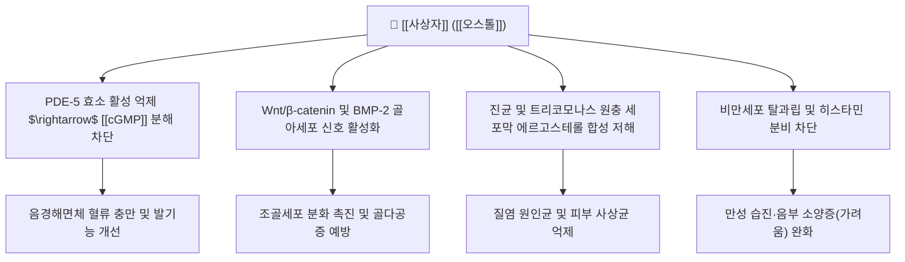

---
aliases:
  - 사상자
  - 蛇床子
  - Cnidii Fructus
tags:
  - 본초
  - 온신장양
  - 살충지양
  - 거풍조습
  - 오스톨
---
# 🌿 [[사상자]] (蛇床子, Cnidii Fructus)

> **핵심 요약 (Key Summary)**:
> 미나리과(Apiaceae) 식물인 벌사상자(*Cnidium monnieri*)의 성숙한 건조 과실
> 핵심 지표 쿠마린 성분인 [[오스톨]](Osthole)이 PDE-5 억제 및 Wnt/β-catenin 경로를 촉진하여 발기부전 개선과 골형성 촉진 및 항진균·지양 활성 발휘
> 신양허로 인한 음위증(발기부전)과 요슬산통을 치료하고 외용 시 트리코모나스 질염·습진·외음부 가려움증을 해소하는 내복·외용 겸용 약재

---

> [!abstract]+ 🧪 3D 약리 분자 구조 (Interactive 3D Viewer)
> <iframe src="https://molecule-viewer-rho.vercel.app/?cid=10228" style="width: 100%; height: 600px; border: none; border-radius: 12px; box-shadow: 0 4px 20px rgba(0,0,0,0.15);" allowfullscreen></iframe>

## 📌 목차
1. [기본 본초 정보 & 생약 규격 (Pharmacognosy)](#1-기본-본초-정보--생약-규격-pharmacognosy)
2. [핵심 분자약리 기전 & 대사 네트워크](#2-핵심-분자약리-기전--대사-네트워크)
3. [주요 약리학적 효능 & 실험 연구](#3-주요-약리학적-효능--실험-연구)
4. [임상 응용: 내복(온신) vs 외용(살충지양)](#4-임상-응용-내복온신-vs-외용살충지양)
5. [배합 처방 매트릭스](#5-배합-처방-매트릭스)
6. [출처 및 학술 참고 문헌 (References)](#6-출처-및-학술-참고-문헌-references)

---

## 1. 기본 본초 정보 & 생약 규격 (Pharmacognosy)

| 항목 | 상세 내용 |
| :--- | :--- |
| **기원 식물** | 미나리과(Apiaceae) 벌사상자(*Cnidium monnieri* (L.) Cusson)의 잘 익은 열매 |
| **성미 (性味)** | 신(辛), 고(苦), 온(溫), 소독(小毒) |
| **귀경 (歸經)** | 신경(腎經) |
| **효능 (Actions)** | 온신장양(溫腎壯陽), 조습살충(燥濕殺蟲), 거풍지양(祛風止痒) |
| **주요 성분** | • **지표 성분쿠마린계**: 임페라토린(Imperatorin), 베르갑텐, 이소핌피넬린 |

---

## 2. 핵심 분자약리 기전 & 대사 네트워크

* **PDE-5 억제를 통한 발기능 개선**:
  * 오스톨은 비아그라(실데나필)와 유사하게 포스포디에스테라아제 5형(PDE-5)을 경쟁적으로 억제하여 음경해면체 평활근 내 [[cGMP]] 농도를 유지시킴으로써 혈관 확장을 유도.
* **골대사 촉진 및 골조송증 예방**:
  * 파골세포 분화를 억제하고 조골세포 활성을 높여 난소 절제 골다공증 동물 모델에서 골밀도 감소를 유의하게 역전.
* **항진균 및 항원충(살충) 작용**:
  * 칸디다균(Candida albicans)과 질 트리코모나스 원충에 강력한 증식 억제 효과를 발휘하여 부인과 외용 세척제로 다용.

---

## 3. 주요 약리학적 효능 & 실험 연구

* **항소양 및 항아토피 효능**:
  * 피내 히스타민 및 P물질(Substance P)에 의한 가려움 신호를 억제하고, Th2 염증 반응을 낮추어 만성 습진 병변 개선.
* **항부정맥 및 혈관 이완 작용**:
  * 심근 칼슘 유입을 억제하여 심실성 부정맥 발생을 완화.

---

## 4. 임상 응용: 내복(온신) vs 외용(살충지양)

* **내복 (內服 - 온신장양)**:
  * 적응증: 신양허 쇠약으로 인한 남성 음위(발기부전), 조루, 낭습(음낭 밑 축축함), 여성 자궁허한성 불임, 요슬산통.
  * 용량: 3~9g 전탕 또는 환산제 복용.
* **외용 (外用 - 조습살충지양)**:
  * 적응증: 여성 질트리코모나스 질염, 대하음양(생식기 가려움), 외음부 습진, 피부 개선(옴), 비듬.
  * 용법: 15~30g을 달여 훈증하거나 좌욕 및 환부 세척.
* **금기 및 주의**:
  * 신음부족(腎陰不足)으로 인한 음허화왕(음허 발열, 성욕 과항진) 환자는 내복 금기.

---

## 5. 배합 처방 매트릭스

| 처방명 | 배합 특징 | 임상 주치 |
| :--- | :--- | :--- |
| [[사상자환]] | 사상자, 토사자, 육종용, 파극천 | 신양허 쇠약, 음위증, 낭습증 |
| 사상자탕 (외용) | 사상자, 백반, 고삼, 황백 | 여성 적백대하, 외음부 트리코모나스 소양증 |
| [[반룡환]] 가감방 | 녹용, 숙지황, 사상자 | 노인성 퇴행성 골다공증, 극심한 요통 |

---

## 6. 출처 및 학술 참고 문헌 (References)
* State Pharmacopoeia Commission of PRC. *Pharmacopoeia of the People's Republic of China*. 2020: 326.
  * `[연구 요약]`: 사상자의 기원 식물, 박층크로마토그래피 감별 및 오스톨 규격(1.0% 이상) 수록.
* Zhang Z, et al. Osthole: A review on its bioactivities and pharmacological properties. *Phytochemistry*. 2015;113:176-191.
  * `[연구 요약]`: 사상자 지표 성분 오스톨의 PDE5 억제, Wnt/β-catenin 골형성 촉진, 항염증 및 항소양 작용 총괄 리뷰.
