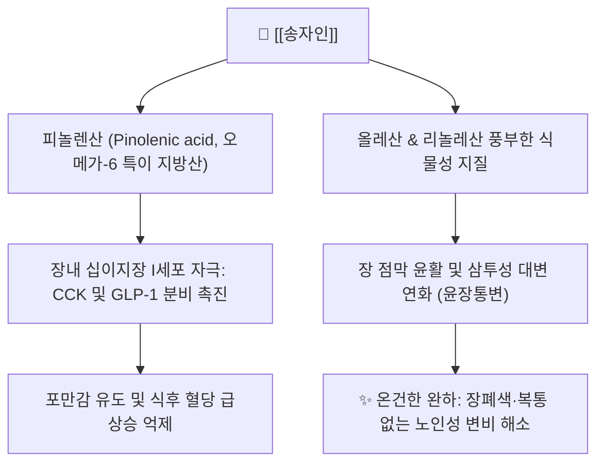

# 🌲 [[송자인]] (松子仁, Pini Koraiensis Semen)

> **핵심 요약 (Key Summary)**:
> 소나무과 잣나무의 성숙한 씨앗(잣)을 건조한 본초로 윤폐지해와 윤장통변의 대표 약재
> 피놀렌산, 올레산 등 풍부한 불포화지방산 함유로 콜레시스토키닌 분비 촉진 및 장관 윤활
> 노인성 변비, 만성 마른기침, 산후 진액 고갈 및 오인환의 핵심 지표 본초

---

> [!abstract]+ 🧪 3D 약리 분자 구조 (Interactive 3D Viewer)
> <iframe src="https://molecule-viewer-rho.vercel.app/?cid=16133831" style="width: 100%; height: 600px; border: none; border-radius: 12px; box-shadow: 0 4px 20px rgba(0,0,0,0.15);" allowfullscreen></iframe>

## 📌 목차
1. [기본 정보 & 기원](#1-기본-정보--기원)
2. [본초학적 특성 & 귀경](#2-본초학적-특성--귀경)
3. [분자약리 기전 & 현대 효능](#3-분자약리-기전--현대-효능)
4. [대표 배오 처방](#4-대표-배오-처방)
5. [복용법, 안전성 및 주의사항](#5-복용법-안전성-및-주의사항)
6. [출처 및 학술 참고 문헌 (References)](#6-출처-및-학술-참고-문헌-references)

---
## 1. 기본 정보 & 기원

| 항목 | 상세 내용 |
| :--- | :--- |
| **본초명** | [[송자인]] (松子仁, Pine Nut) |
| **이명** | 해송자(海松子), 송자(松子), 신라송자(新羅松子) |
| **기원 식물** | 소나무과(Pinaceae) 잣나무(*Pinus koraiensis* Siebold & Zucc.)의 성숙한 종자 |
| **약용 부위** | 종실의 외종피를 벗긴 배유와 배 |
| **분류** | 사하약(瀉下藥) / 윤하약(潤下藥) 및 보익약(보음양혈제) |

---
## 2. 본초학적 특성 & 귀경

| 항목 | 상세 내용 |
| :--- | :--- |
| **성미 (性味)** | 감(甘), 온(溫), 무독(無毒) |
| **귀경 (歸經)** | 폐경(肺經), 간경(肝經), 대장경(大腸經) |
| **효능 (效能)** | 윤폐지해(潤肺止咳), 윤장통변(潤腸通便), 양음식풍(養陰熄風), 윤부택모(潤膚澤毛) |
| **주치 (主治)** | 장조변비(腸燥便秘), 노인 및 산후 변비, 폐조해수(肺燥咳嗽), 골증열, 현훈두통, 피부건조 |

---
## 3. 분자약리 기전 & 현대 효능

### (1) 장 점막 보습 및 온건한 완하 작용 (Lubricant Laxative)
* **식물성 유지 성분**: 지방유 함량이 70%에 달하여 건조해진 장관 내벽을 윤활하고 수분 손실을 방지하여 자극성 완하제 없이도 배변을 촉진함.
* **노인·허약자 변비 최적화**: 대황이나 망초처럼 장벽을 자극하거나 복통을 유발하지 않고 부드럽게 숙변을 배출시킴.

### (2) 피놀렌산(Pinolenic Acid) 매개 식욕 및 대사 조절
* 잣 특이적 다가불포화지방산인 피놀렌산이 위장관 호르몬인 CCK(Cholecystokinin)와 GLP-1의 분비를 자극하여 포만감을 높이고 지질 프로파일을 개선함.

---
## 4. 대표 배오 처방

| 처방명 | 배오 목적 및 주치 | 배오 구성 |
| :--- | :--- | :--- |
| [[오인환]] | 노인 및 허약자의 진액 고갈로 인한 장조변비 치료 | [[송자인]], [[도인]], [[백자인]], [[욱리인]], [[행인]] |
| [[해송자고]] | 만성 마른기침, 가래 없이 기침만 하는 폐조해수 치료 | 송자인을 찧어 꿀에 재워 복용 |
| [[보음환]] | 노화로 인한 관절통, 피부 건조, 어지럼증 치료 | [[숙지황]], [[구판]], [[백자인]]과 배오 |

---
## 5. 복용법, 안전성 및 주의사항

* **비허설사(脾虛泄瀉) 금기**: 장관을 매끄럽게 하는 지질 성분이 많아 평소 대변이 묽고 설사를 자주 하거나 소화력이 약한 환자는 복용을 금함.
* **담다습성(痰多濕盛) 주의**: 몸에 습담이 많아 가래가 끓는 환자는 기침을 악화시킬 수 있음.
* **산패 방지 보관**: 불포화지방산 함량이 높아 고온다습한 환경에서 산패되기 쉬우므로 밀폐하여 냉장 보관함.

---
## 6. 출처 및 학술 참고 문헌 (References)

* 신민교, 《임상본초학》, 영림사
* 전국한의과대학 본초학교수 공편저, 《본초학》, 영림사
* Hughes GM et al. Novel pinolenic acid-rich pine nut oil induces cholecystokinin and glucagon-like peptide-1 in overweight women. Lipids Health Dis. 2008.
  * [연구 요약] 잣나무 종자유 피놀렌산이 위장관 포만 호르몬 분비를 촉진하고 장관 운동성 균형을 맞추는 작용을 규명함.
