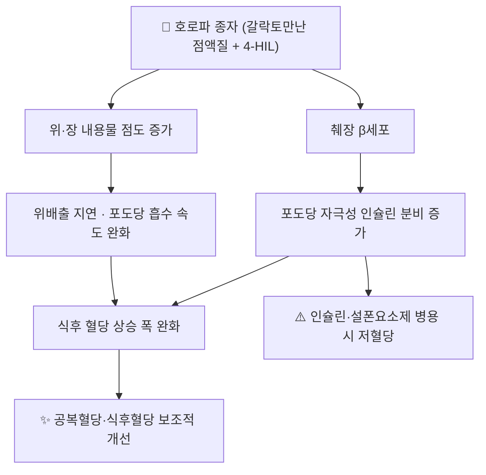

# 🌿 호로파 (胡蘆巴, Fenugreek, *Trigonella foenum-graecum* L.)

> **핵심 요약 (Key Summary)**
> 콩과(Fabaceae) *Trigonella foenum-graecum* L.의 **성숙 종자**(생약명 호로파/胡蘆巴, Semen Trigonellae)
> 종자에 **갈락토만난 점액질(25~30%)** 과 **4-하이드록시이소류신(4-HIL)** 이 풍부해 **식후 포도당 흡수 지연 + 포도당 자극성 인슐린 분비 촉진**의 두 경로로 혈당을 낮춘다
> 한의학적으로는 苦溫·歸腎經으로 **溫腎助陽·散寒止痛**(신허 요슬냉통·한산·소복냉통), 서양에서는 혈당 관리·산모 젖분비(galactagogue) 목적의 **보충제로 광범위하게 자가 복용**된다
> ⚠️ **인슐린·설폰요소제와 병용 시 중증 저혈당 보고** — 2026-09-17 심층리뷰 3번이 지목한 T2DM 환자 대표 상호작용 본초

---

## 📌 목차
1. [기본 본초 정보 & 화학 성분](#1-기본-본초-정보--화학-성분)
2. [핵심 분자약리 기전](#2-핵심-분자약리-기전)
3. [대사·장관 연계](#3-대사장관-연계)
4. [임상 적용 및 적응증 (적응증 vs 금기)](#4-임상-적용-및-적응증-적응증-vs-금기)
5. [병용 관리 원칙 및 통합의학적 고찰](#5-병용-관리-원칙-및-통합의학적-고찰)
6. [핵심 성분-작용 매트릭스](#6-핵심-성분-작용-매트릭스)
7. [출처 및 학술 참고 문헌 (References)](#7-출처-및-학술-참고-문헌-references)

---

## 1. 기본 본초 정보 & 화학 성분

> [!abstract]+ 🧪 약리 분자 구조 (Interactive 3D Viewer)
> <iframe src="https://molecule-viewer-rho.vercel.app/?cid=99474" width="100%" height="450px" frameborder="0" allow="webgl" style="border-radius: 8px;"></iframe>

| 항목 | 상세 내용 |
| :--- | :--- |
| **기원 식물** | 콩과(Fabaceae) *Trigonella foenum-graecum* L. — 성숙 종자(生藥名 胡蘆巴) |
| **성미 (性味)** | 苦·溫 (중의학 기준) |
| **귀경 (歸經)** | 腎經 (일부 문헌 肝·腎) |
| **효능 (Actions)** | 溫腎助陽 · 散寒止痛 · (서양) 혈당 보조 · 젖분비 촉진 |
| **주요 성분** | • **갈락토만난(점액질 다당)** — 종자 건조중량의 약 25~30%<br>• **4-하이드록시이소류신(4-HIL)** — 인슐린 분비 촉진 아미노산<br>• **디오스게닌 등 스테로이드 사포닌**, 트리고넬린, 소량의 쿠마린, 플라보노이드(비텍신 등) |
| **PubChem CID** | 지표성분별 CID는 PubChem에서 직접 확인 권장(4-하이드록시이소류신·디오스게닌 등) |

> 🔬 **표준화 관점**: 시판 보충제는 '종자 분말'과 '추출물(4-HIL·사포닌 표준화)'로 나뉘며 **점액질 함량이 제품마다 크게 다르다** — 혈당 관련 문헌의 용량을 그대로 환자에게 옮길 때 주의해야 하는 이유다.

---

## 2. 핵심 분자약리 기전



- **(1) 점액질(갈락토만난) 경로**: 수용성 섬유가 위·소장에서 겔을 형성 → **위배출 지연·포도당 확산 저항 증가** → 식후 혈당 곡선 완만화. [[단쇄지방산]] 생성 등 장내 미생물 경유 효과도 보고된다
- **(2) 4-HIL 경로**: 췌장 β세포에서 **포도당 의존성 인슐린 분비 자극**(혈당이 낮을 때는 분비를 크게 늘리지 않는 포도당 의존성이라는 점이 중요 — 그러나 인슐린·설폰요소제가 함께 있으면 그 보호가 사라진다)
- **(3) 기타**: 스테로이드 사포닌(디오스게닌)의 대사·항산화 작용, AMPK 경로 관련 실험 보고가 있으나 **인체 근거는 제한적**([[AMPK]])

---

## 3. 대사·장관 연계

* **장관 통과 시간 변화**: 점액질 섬유는 변 부피·점도를 높여 배변을 부드럽게 하나, 과량에서는 **복부 팽만·가스·연변**을 유발한다 — 한의 처방에서 行氣·和中 약재와 배오하는 이유와 맞닿아 있다
* **약물 흡수 간섭**: 점액질이 다른 경구약의 흡수를 지연시킬 수 있어, **복용 시간 간격(2시간 내외)** 을 안내하는 것이 안전하다
* **체중·지질**: 포만감 증가로 체중·LDL-C 개선 보고가 있으나 이질성이 크고, 당뇨 조절의 주역은 어디까지나 표준 치료다

---

## 의학/04_임상 적용 및 적응증 (적응증 vs 금기)

```
[✅ 사용 맥락 (Sweet Spot)]
• 腎陽虛 계열의 요슬냉통·한산·소복냉통 (한의학적 전통 응용)
• 서양 보충제 영역: 혈당 관리 보조, 산모 젖분비 촉진(전통적 galactagogue)
• 대사증후군 환자가 스스로 복용하는 대표 건기식 — 문진에서 반드시 확인

[⚠️ 신중 투여 및 금기 (Caution / Contraindication)]
• 인슐린·설폰요소제·메글리티니드 복용자 → 중증 저혈당 보고, 자가 복용 금지·감독 필요
• 임신 중 고용량 — 자궁 자극 작용이 보고되어 회피
• 땅콩·콩과 알레르기 환자 — 교차 알레르기 가능
• 위장관 민감자·과민성 장 증후군 — 팽만·가스 악화 가능
• 소량 쿠마린 함유 — 항응고제 복용자는 제품 성분표 확인
```

---

## 5. 병용 관리 원칙 및 통합의학적 고찰

### (1) 근거·수치
- **2026-09-17 심층리뷰 3번** ([PMID: 41539457](https://pubmed.ncbi.nlm.nih.gov/41539457/), *Complement Ther Med* 2026;97:103319, 단면연구 22편·19개국): T2DM 환자의 본초 사용 유병률 **53%**, 최다 사용 4종 중 하나가 **호로파**. 전체 49종 중 **금기 7종 / 주의 19종 / 안전 23종**, 잠재적 상호작용 12종
- 같은 리뷰에서 **호로파 종자 + 혼합인슐린 병용 후 저혈당 혼수 증례**가 인용됨(원본 리뷰가 참조한 *Drugs & Therapy Perspectives* 2026 증례 보고) → **단순 건기식이 아니라 약물로 취급해야 하는 근거**

### (2) 한의 진료실 적용
- **초진 문진 추가 항목**: "호로파 차·캡슐(혈당·젖분비 목적), 기타 혈당 건기식"을 별도로 묻는다 — 유병률이 절반을 넘는 항목을 환자가 먼저 말하지 않는다
- **위험군 관리**: 설폰요소제·인슐린 병용 환자에게 호로파를 처방·권유하지 않으며, 이미 복용 중이면 **자가혈당 측정 강화 + 야간 저혈당 증상(식은땀·악몽·새벽 두통) 확인** → [[저혈당]]
- **중재 시작·중단 시점 정렬**: 시작 전 [[HbA1c]]·간기능·신기능 검사, 2~4주 후 혈당 일지 검토
- **환자 스크립트**: "호로파 같은 본초는 혈당을 낮추는 방향으로 작용해서, 인슐린이나 설폰요소제와 겹치면 혈당이 지나치게 떨어질 수 있습니다. 드시는 약과 함께 결정해야 합니다."

---

## 6. 핵심 성분-작용 매트릭스

| 성분 | 화학 분류 | 작용 | 임상 함의 |
| :--- | :--- | :--- | :--- |
| **갈락토만난 점액질** | 수용성 다당 | 위배출 지연·포도당 흡수 완화, 점도 증가 | 식후혈당 완만화, 과량 시 팽만·연변 |
| **4-하이드록시이소류신(4-HIL)** | 아미노산 | 포도당 의존성 인슐린 분비 촉진 | 저혈당 위험의 주 기전 |
| **디오스게닌 등 사포닌** | 스테로이드 사포닌 | 대사·항산화 실험 효과 | 인체 근거 제한적 |
| **트리고넬린·플라보노이드** | 알칼로이드·폴리페놀 | 항산화·미세혈관 실험 효과 | 보조적 |
| **쿠마린(소량)** | 벤조피론 | 항응고 상호작용 가능성 | 항응고제 복용자 확인 |

---

## 7. 출처 및 학술 참고 문헌 (References)

1. **2026-09-17 심층리뷰 3번 원논문**. 제2형 당뇨병 환자의 본초 사용 안전성: 체계적 고찰 및 메타분석. *Complementary Therapies in Medicine*, 2026;97:103319. [PMID: 41539457](https://pubmed.ncbi.nlm.nih.gov/41539457/)
   - **[연구 요약]**: 단면연구 22편(19개국) 메타분석 — 본초 사용 유병률 53%, 최다 사용 4종에 호로파 포함, 금기 7종·주의 19종·상호작용 12종 분류.
2. **대한민국약전(KP) / 대한민국한약전(KHP)**. 호로파(胡蘆巴) 규격 항목.
   - **[공정서 규격]**: 생약 규격·기원·확인시험 기준. (규격 세부는 최신 공정서 원문 확인)
3. **WHO Monographs on Selected Medicinal Plants** — *Trigonella foenum-graecum* 항목.
   - **[공인 데이터]**: 기원·성분·전통 용도·안전성 요약(WHO 모노그래프 시리즈).

> ⚠️ 본 노트의 수치는 **2026-09-17 심층리뷰에 실린 실제 문헌**과 표준 교과서 범위 지식으로 작성했다. 개별 제품의 성분·용량은 제품 표시사항과 공정서 원문으로 재확인할 것.

---

## 🔗 함께 보기
- [[당뇨병]] · [[저혈당]] · [[HbA1c]] · [[인슐린]] · [[메트포르민]] · [[마늘]] · [[육계]] · [[단쇄지방산]] · [[AMPK]]
- 관련 논문: [[2026-09-17_통합의학약리학_심층리뷰]] 3번
