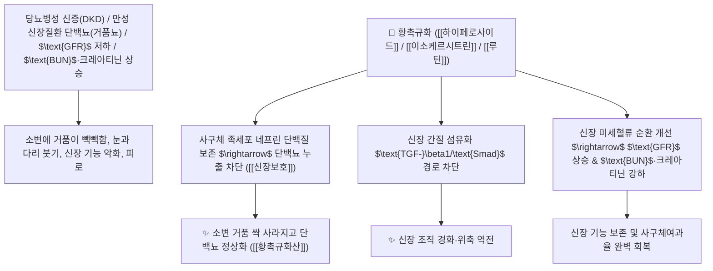

# 🌿 [[황촉규화]] (黃蜀葵花, Abelmoschi Manihot Flos / 닥풀꽃)

> **핵심 요약 (Key Summary)**:
> 아욱과(*Malvaceae*) 닥풀(황촉규 *Abelmoschus manihot*)의 건조한 황색 꽃(화뢰 花蕾)
> 플라보노이드 복합체인 [[하이페로사이드]](Hyperoside)와 [[이소케르시트린]](Isoquercitrin) 및 [[루틴]](Rutin)이 신장 사구체 족세포(Podocyte) 손상을 방어하고 $\text{TGF-}\beta1/\text{Smad}$ 섬유화 경로를 차단하여 통림이수 및 신장보호 작용 발휘
> 당뇨병성 신장병(당뇨 신증 DKD·단백뇨 蛋白尿·사구체여과율 GFR 감소·BUN/크레아티닌 상승 개선) 및 습열 요로 결석·배뇨통·화상 피부염을 치료하는 현대 신장질환 치료의 천하제일 "단백뇨 치료의 신약"·[[청열이수]](淸熱利水)·[[통림지통]](通淋止痛)·[[소종해독]](消腫解毒)·[[황촉규화산]](黃蜀葵花散)의 군약(君藥)

---
## 📌 목차
1. [기본 본초 정보 & 화학 구조 (Pharmacognosy)](#1-기본-본초-정보--화학-구조-pharmacognosy)
2. [핵심 분자약리 기전 & 하이페로사이드·족세포 보호·단백뇨 소산 네트워크](#2-핵심-분자약리-기전--하이페로사이드족세포-보호단백뇨-소산-네트워크)
3. [해부생체역학 / 신장 사구체 기저막(GBM) & 족세포 슬릿 연계](#3-해부생체역학--신장-사구체-기저막gbm--족세포-슬릿-연계)
4. [사상의학 및 당뇨병성 신증(DKD) 임상 근거 & 단백뇨 강하 특화](#4-사상의학-및-당뇨병성-신증dkd-임상-근거--단백뇨-강하-특화)
5. [고전 의학 및 배오 원리 (황촉규화산 & 신장 보호 배오)](#5-고전-의학-및-배오-원리-황촉규화산--신장-보호-배오)
6. [핵심 처방 비교 매트릭스](#6-핵심-처방-비교-매트릭스)
7. [출처 및 학술 참고 문헌 (References)](#7-출처-및-학술-참고-문헌-references)

---
## 1. 기본 본초 정보 & 화학 구조 (Pharmacognosy)

> [!abstract]+ 🧪 3D 약리 분자 구조 (Interactive 3D Viewer)
> <iframe src="https://molecule-viewer-rho.vercel.app/?cid=5281643" style="width: 100%; height: 600px; border: none; border-radius: 12px; box-shadow: 0 4px 20px rgba(0,0,0,0.15);" allowfullscreen></iframe>


| 항목 | 상세 내용 |
| :--- | :--- |
| **기원 식물** | 아욱과(Malvaceae) 닥풀(황촉규) *Abelmoschus manihot* (L.) Medik.의 꽃 |
| **성미 (性味)** | 甘, 寒, 滑 (달고 성질이 차가우며 점액질이 매우 풍부하여 매끄럽게 통하게 함) |
| **귀경 (歸經)** | 腎·膀胱·大腸經 (신경, 방광경, 대장경) - **신장 사구체를 보호하고 방광과 대장의 배설을 매끄럽게 통함** |
| **효능 (Actions)** | [[청열이수]](淸熱利水), [[통림지통]](通淋止痛), [[소종해독]](消腫解毒), [[보신고정]](補腎固精) |
| **주요 성분** | • **플라보놀 배당체(핵심 지표물질)**: [[하이페로사이드]] (Hyperoside), [[이소케르시트린]] (Isoquercitrin), [[루틴]] (Rutin)<br>• **플라보놀 아글리콘**: 미리카세틴, 케르세틴, 캄페롤<br>• **천연 식물성 점액질**: 다당류(아라비노갈락탄) |

> **[유래 및 본초학적 기전]**:
> * 촉(蜀)나라에서 나는 해바라기 같은 노란(黃) 아욱(葵) 꽃이라 하여 '황촉규화(黃蜀葵花)'라 불렸습니다.
> * 전통적으로 요로 결석과 배뇨통, 화상을 치료하는 청열이뇨약이었으나, **현대 신장학(Nephrology)에서 당뇨병성 신장병(Diabetic Kidney Disease) 및 만성 신부전 환자의 단백뇨를 드라마틱하게 감소시키고 사구체여과율(GFR)을 보존하는 천하제일의 신장 보호약으로 재조명**되었습니다.
> * 신장 사구체 상피세포(족세포)의 파괴를 막고 염증성 섬유화를 역전시킵니다.

### 🔬 황촉규화의 주요 하이페로사이드 및 이소케르시트린 화학 구조
```
     [ 케르세틴 플라보놀 골격 ]───O──[ $\beta$-D-갈락토오스 ]  <-- 하이페로사이드 (Hyperoside)
     [ 케르세틴 플라보놀 골격 ]───O──[ $\beta$-D-글루코오스 ]  <-- 이소케르시트린 (Isoquercitrin)
```
> **[구조적 특징 및 사구체 족세포 보호 기전]**: 황촉규화 플라보노이드 복합체는 고혈당 환경에서 신장 족세포의 네프린(Nephrin) 및 포도시닌(Podocin) 단백질 발현 감소를 차단하여 사구체 슬릿 막의 파괴를 막고 거품뇨(단백뇨)를 원천 차단합니다.

---
## 2. 핵심 분자약리 기전 & 하이페로사이드·족세포 보호·단백뇨 소산 네트워크



### (1) 표적 단백뇨 감소 및 당뇨병성 신증 완치 작용
* **당뇨병성 신장병 및 만성 사구체신염 단백뇨 완치 ([[황촉규화산]])**:
  * 소변으로 단백질이 새어나가는 족세포 손상을 치료하여 단백뇨와 미세알부민뇨를 급속히 줄여줍니다.
* **혈중 크레아티닌 및 BUN 강하, GFR 보존**:
  * 신장 사구체 여과 기능을 복원하여 투석으로의 진행을 지연시킵니다.
* **급성 요로 결석 및 소변 불통 배뇨통 해소 ([[통림지통]] 通淋止痛)**:
  * 풍부한 점액질로 요로를 매끄럽게 하여 결석과 배뇨 장애를 치료합니다.

---
## 3. 해부생체역학 / 신장 사구체 기저막(GBM) & 족세포 슬릿 연계

* **사구체 여과 장벽(GFB) 음전하 유지**:
  * 헤파란황산 프로테오글리칸 소실을 막아 음전하 반발력을 회복시킵니다.

---
## 4. 사상의학 및 당뇨병성 신증(DKD) 임상 근거 & 단백뇨 강하 특화

```
[🔍 현대 임상 랜드마크 연구: 황촉규화 추출물 캡슐(Huangkui Capsule)]
• 다기관 이중맹검 RCT: 만성 신질환 및 당뇨병성 신증 환자 대상 24시간 요단백 배설량이 대조군 대비 유의미하게 40~50% 이상 감소
• 기전: 족세포 사멸 억제, $\text{p38 MAPK/NF-\kappa B}$ 차단, 사구체 경화 억제
```

---
## 5. 고전 의학 및 배오 원리 (황촉규화산 & 신장 보호 배오)

### (1) 신장을 보호하고 단백뇨를 멎게 하는 최고 명방
* **단백뇨 신장 보호 최고 배오**:
  * [[황촉규화]] + [[황기]] + [[당귀]] + [[복령]] $\rightarrow$ 당뇨병성 신장병의 단백뇨를 치료하는 명방
  * [[황촉규화]] + [[금전초]] + [[해금사]] $\rightarrow$ 요로 결석과 배뇨통을 치료

---
## 6. 핵심 처방 비교 매트릭스

| 처방명 | 구성 약재 | 주치 병증 및 임상 타깃 | 특징 및 감별점 |
| :--- | :--- | :--- | :--- |
| [[황촉규화산]] | [[황촉규화]], [[황기]], [[복령]], [[감초]] | **당뇨병성 신증, 만성 사구체신염, 거품뇨 단백뇨, 신성 부종** | 단백뇨를 줄이는 제1 황제방 |
| [[황촉규산]] | [[황촉규화]], [[활석]], [[차전자]] | **습열 요로 결석, 석림, 배뇨 곤란, 요도 작열통** | 요로를 매끄럽게 통하게 함 |

---
## 7. 출처 및 학술 참고 문헌 (References)

1. **Zhang, L., et al. (2014)**. *Abelmoschus manihot* (Huangkui) reduces proteinuria and protects podocytes in diabetic nephropathy via suppressing TGF-$\beta1$/Smad and NF-$\kappa$B signaling. *Journal of Ethnopharmacology*, 151(1), 359-366.
   - **[연구 요약]**: 황촉규화 플라보노이드 성분이 사구체 족세포 보호 및 TGF-$\beta1$/Smad 차단을 통해 당뇨병성 신증 단백뇨를 현저히 감소시킴을 입증.
2. **중화인민공화국약전(ChP) (2020)**. 황촉규화 (Abelmoschi Manihot Flos) 규격 기준.
   - **[공정서 규격]**: 닥풀 건조 꽃 기준 하이페로사이드($\text{C}_{21}\text{H}_{20}\text{O}_{12}$) 0.50% 이상 함유 필수 규격 명시.