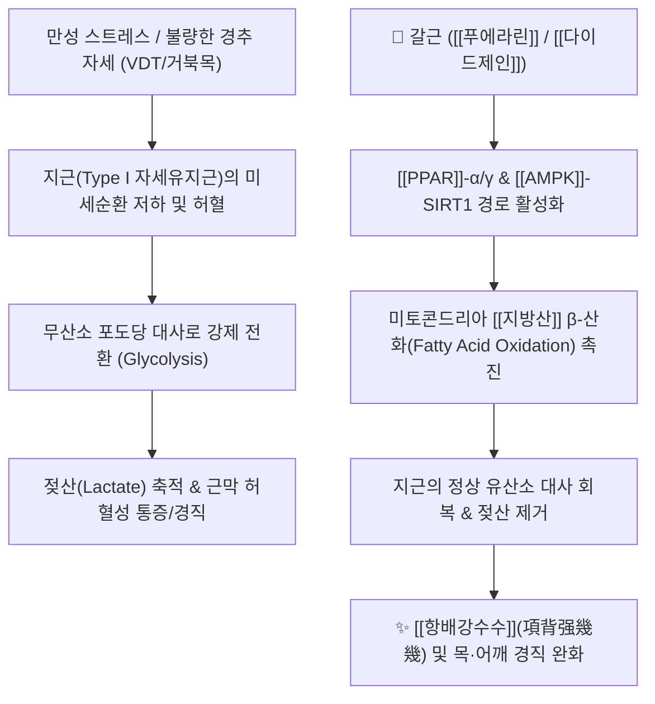

# 🌿 [[갈근]] (葛根, Puerariae Radix)

> **핵심 요약 (Key Summary)**:
> 콩과(*Fabaceae*) 칡(*Pueraria lobata*)의 주피를 제거한 뿌리
> 주성분인 [[푸에라린]](Puerarin)과 [[이소플라보노이드]]가 [[PPAR]] 및 [[AMPK]] 경로를 활성화하여 [[지근]](Type I 근육)의 지방산 대사를 촉진하고 [[젖산]] 축적을 해소
> [[상한론]]의 [[항배강수수]](項背强幾幾, 목·어깨 뭉침)와 [[태음인]] [[간수열리열병]](肝受熱裏熱病)의 핵심 군약(君藥)

---
## 📌 목차
1. [기본 본초 정보 & 화학 구조 (Pharmacognosy)](#1-기본-본초-정보--화학-구조-pharmacognosy)
2. [핵심 기전 ①: 지근(Type I) 대사 & 항배강수수(項背强幾幾)](#2-핵심-기전--지근type-i-대사--항배강수수項背强幾幾)
3. [핵심 기전 ②: 이소플라본 수용체 활성화 (ER-β & PPAR) & 조직 재생](#3-핵심-기전--이소플라본-수용체-활성화-er-β--ppar--조직-재생)
4. [핵심 기전 ③: 심·뇌혈관 확장 & 알코올/간 대사](#4-핵심-기전--심뇌혈관-확장--알코올간-대사)
5. [사상의학 및 체질별 임상 응용 (적응증 vs 금기)](#5-사상의학-및-체질별-임상-응용-적응증-vs-금기)
6. [상한론 『약징(藥徵)』 분석 및 처방 매트릭스](#6-상한론-약징藥徵-분석-및-처방-매트릭스)
7. [출처 및 학술 참고 문헌 (References)](#7-출처-및-학술-참고-문헌-references)

---
## 1. 기본 본초 정보 & 화학 구조 (Pharmacognosy)

| 항목 | 상세 내용 |
| :--- | :--- |
| **기원 식물** | 콩과(Fabaceae) 칡 *Pueraria lobata* (Willd.) Ohwi 또는 *Pueraria thomsonii* Benth.의 뿌리 |
| **성미 (性味)** | 甘·辛, 凉 (또는 平) |
| **귀경 (歸經)** | 脾·胃經 (비경, 위경) |
| **효능 (Actions)** | **해기퇴열(解肌退熱)**, **생진지갈(生津止渴)**, **투진(透疹)**, **승양지사(升陽止瀉)**, **통경활락(通經活絡)**, **해주독(解酒毒)** |
| 주요 성분 | • [[이소플라보노이드]]: [[푸에라린]] (Puerarin, KP 규격 $\ge 2.4\%$), [[다이드진]] (Daidzin), [[다이드제인]] (Daidzein), [[게니스틴]] (Genistin), [[게니스테인]] (Genistein), [[포르모노네틴]] (Formononetin)<br>• 사포닌(Saponins): Soyasaponin, Kudzusaponin<br>• 기타: 다량의 전분(Starch), Pueraroside, Allantoin |

### 🔬 갈근의 주요 지표물질 화학 구조
![[갈근-20241030144520610.jpg|520]]
> [구조적 특징]: 갈근의 핵심 지표성분인 [[푸에라린]](Puerarin)은 [[다이드제인]](Daidzein)의 8번 탄소에 포도당이 직접 결합한 C-배당체(C-glucoside) 구조로, 일반 O-배당체보다 장내 세균 분해에 안정적이어서 높은 생체이용률과 독특한 약리 활성을 나타냅니다.

> 🧬 **현대 학술 근거 (2026-09-08 B-7 패치)** — PubChem 실측 분자 앵커: 푸에라린(Puerarin) CID **5281807** · 분자식 C₂₁H₂₀O₉ · MW 416.4

🔬 **분자 구조** (Wikimedia Commons, Public Domain)

![[Puerarin_구조.png|420]]
> [그림 1] 푸에라린(Puerarin, C₂₁H₂₀O₉) 분자 구조 — 출처: Wikimedia Commons (기존 첨부 재사용)

---
## 2. 핵심 기전 ①: 지근(Type I) 대사 & 항배강수수(項背强幾幾)



### (1) 근육 섬유별 대사 특성과 갈근의 작용점
* [[지근]] (Type I, 적색근/자세유지근: [[후두하근]], [[판상근]], [[승모근]] 등):
  * 정상 상태: 미토콘드리아와 미오글로빈이 풍부하여 주로 [[지방산]](Fatty acid)을 산소와 함께 연소시켜 지속적인 지구력을 냅니다.
  * 병리 상태: 스트레스, [[거북목 증후군|거북목]], 구부정한 자세가 지속되면 혈관이 압박되어 무산소 포도당 대사로 전환되고, [[젖산]]이 과다 축적되면서 굳고 결리는 만성 통증(Myogelosis)이 발생합니다.
* **갈근의 해결 메커니즘**:
  * 갈근의 [[푸에라린]](Puerarin)과 [[다이드제인]](Daidzein)은 [[PPAR]]-α/γ 및 [[AMPK]] 경로를 활성화하여 근육 세포 내 [[지방산]] 공급과 β-산화를 촉진합니다.
  * 지근이 본래의 지방 에너지원을 원활히 사용하게 만들어 [[젖산]] 생성을 차단하고 목·어깨 근육의 경직([[항배강수수]])을 근본적으로 해소합니다.

### 📊 [[PPAR]] ($\alpha, \gamma, \delta$) 경로를 통한 조직별 대사 조절도
![[갈근-20241030145528062.jpg|600]]
> **[조직별 핵심 대사 기전 요약]**
> * **근육 (Muscle)**: `PPAR-α/δ` 활성화 $\rightarrow$ **유리지방산 산화(FFA Oxidation ↑)**로 [[젖산]] 생성 억제 및 [[항배강수수]] 해소, `PPAR-γ`로 [[인슐린]] 매개 포도당 흡수 촉진.
> * **간 (Liver)**: 지방산 산화 촉진, 중성지방(Triglyceride) 감소, 양질의 HDL 증가.
> * **지방 조직 (Adipose)**: 아디포넥틴 분비 촉진, 염증성 사이토카인(TNF-α, Resistin) 억제.
> * **혈관벽 (Vessel Wall)**: 혈관 염증 억제 및 역콜레스테롤 수송 촉진.

---
## 3. 핵심 기전 ②: 이소플라본 수용체 활성화 (ER-β & PPAR) & 조직 재생

### 🧬 이소플라본 유도체의 표적 수용체 결합 경로
![[갈근-20241030145338876.jpg|550]]

### (1) 표적 조직과 작용
* [[이소플라보노이드]]:
  * 체내 대사를 통해 `3'-chloro daidzein`, `Equol` 등으로 전환되며, ER-β(에스트로겐 수용체 베타) 및 [[PPAR]]-α/γ에 다중 결합하여 생체 효과를 발휘.
* **진피층 & 피하지방층 합성**:
  * 섬유아세포(Fibroblast)의 [[콜라겐]] 합성 촉진 $\rightarrow$ 피부 탄력 및 결합조직 보강.
  * 피하지방 조직의 정상적인 분화와 지방산 저장을 유도하여 **거칠고 마른 피부 패턴 개선**.
* **골대사 보호**:
  * 조골세포(Osteoblast)의 분화를 촉진하고 파골세포(Osteoclast) 활성을 억제하여 [[골다공증]] 예방.

---
## 4. 핵심 기전 ③: 심·뇌혈관 확장 & 알코올/간 대사

### (1) 뇌혈관 및 관상동맥 순환 개선
* **eNOS 활성화 및 혈관 확장**:
  * 내피세포의 산화질소(NO) 생성을 증가시키고 칼슘 이온 채널을 조절하여 **관상동맥 및 뇌혈관의 혈류량을 대폭 증가**시킵니다.
  * 경추 주변 혈류 저하로 인한 **두통, 어지럼증, [[항강증]](頸項强痛), [[뇌경색]] 후유증**에 다용.
> 🧬 **현대 학술 근거 (2026-09-08 B-7 패치)**
> - 뇌혈관 재생 확장 근거(연구 결과): 네트워크 약리학으로 예측한 116개 공통 표적 중 HIF-1α/VEGF 신호축이 핵심으로 확인되었고, 산소-포도당 결핍/재관류(OGD/R) 인간 제대정맥 내피세포(HUVEC) 실험에서 푸에라린이 농도의존적으로 내피세포 이동·증식·혈관신생을 촉진 — 뇌경색 후유증 회복기의 혈관 재생 기전에 대한 신규 실험적 근거(PMID 40992269).

### (2) 간 보호 및 알코올 대사 ([[해주독]] 解酒毒)
* **알데히드 대사 조절**:
  * [[다이드진]](Daidzin)과 [[푸에라린]]이 ALDH(Aldehyde dehydrogenase) 활성에 관여하여 **아세트알데히드 축적을 억제하고 주벽(알코올 갈망)을 감소**시킴.

---
## 5. 사상의학 및 체질별 임상 응용 (적응증 vs 금기)

```
[✅ 최적 적응증 (Sweet Spot)]
• [[태음인]] 열성 체질 (간열 편중, 덩치가 크고 근육이 발달한 곰형 환자)
• 피로하고 몸이 무거우며, 목·어깨가 단단하게 뭉치고 열감이 뜨는 경우
• 잘 먹는데 살이 찌고 피로한 대사증후군/지방간 환자
• 피부가 거칠고 메마르며 질긴 남성형/갱년기 패턴
• [[태음인]] [[갱년기 증후군]] (상열감 + 복부비만)

[⚠️ 신중 투여 및 금기 (Caution / Contraindication)]
• [[소음인]] 등 비위허한(脾胃虛寒): 평소 소화가 잘 안 되고, 몸이 차며 무른 변을 보는 환자
• 한습 부종형: 피부가 희고 부석부석하며 붓기가 심한 소심한 체질 ('백돼지형')
• 에스트로겐 수용체 양성 종양: 유방암/자궁내막증 병력 환자는 고용량 장기 복용 시 모니터링
```

---
## 6. 상한론 『약징(藥徵)』 분석 및 처방 매트릭스

### (1) 『[[약징]]』에 나타난 갈근의 주치
> **"葛根 主治項背强幾幾也. 旁治痙, 喘, 汗出, 渴..."**  
> (갈근의 주치는 뒷목과 등이 뻣뻣하고 굳은 것[[[항배강수수]]]이며, 경련, 숨참, 땀흘림, 갈증을 곁들여 치료한다.)

* **지근/속근과 약재 배오의 묘미**:
  * [[지근]](자세유지근)의 뻣뻣함 $\rightarrow$ [[갈근]] + [[대추|대조]] 조합
  * [[속근]](순간수축근)의 경련/쥐남 $\rightarrow$ [[작약]] + [[감초]] ([[작약감초탕]])

### (2) 갈근 관련 핵심 처방 비교 매트릭스

| 처방명 | 구성 약재 | 병증 및 임상 타깃 | 특징 및 감별점 |
| :--- | :--- | :--- | :--- |
| [[갈근탕]] | [[갈근]], [[마황]], [[계지]], [[작약]], [[생강]], [[대추|대조]], [[감초]] | 태양병, 무한(無汗) + 오한발열 + [[항배강수수]] | 땀이 나지 않고 목뒤가 뻣뻣한 실증 감기 초기 |
| [[계지가갈근탕]] | [[계지탕]] + [[갈근]] | 태양병, 유한(有汗) + 악풍 + [[항배강수수]] | 땀이 조금씩 나면서 목덜미가 굳어 있는 허증 패턴 |
| [[갈근황련황금탕]] | [[갈근]], [[황련]], [[황금]], [[감초]] | 표증 미해 + **이열(裏熱) 폭주 + 설사(열리 熱痢) + 천(喘)** | 표열이 속으로 들어가 폭발적 설사와 고열을 유발할 때 |
| [[승마갈근탕]] | [[승마]], [[갈근]], [[백작약]], [[감초]] | 풍열 감모, **마진/홍역 초기 발진 불투**, 안면 신경염 | 가벼운 발한투진 및 피부 해열 |
| [[시갈해기탕]] | [[시호]], [[갈근]], [[황금]], [[석고]], [[강활]], [[백지]] 등 | 삼양합병(태양·양명·소양), **고열, 심한 전신 근육통, 두통** | 외감 몸살 발열의 명방 |
| [[갈근해기탕]] | [[갈근]], [[황금]], [[마황]]/[[원화]] 등 | 태음인 [[간수열리열병]](肝受熱裏熱病) | 사상의학 태음인 상열/두통/근육통 기본방 |
| [[열다한소탕]] | [[갈근]], [[고본]], [[황금]], [[나복자]], [[길경]] 등 | 태음인 **간열(肝熱) 억제 + 폐음(肺陰) 보존** | 태음인 중풍 전조, 뇌혈관 순환, 대사질환 대표방 |

---
## 7. 출처 및 학술 참고 문헌 (References)

1. **Zhou YX et al. (2014)**. Puerarin: a review of pharmacological effects. *Phytotherapy research : PTR*, 28(7): 961-75. [PMID: 24339367](https://pubmed.ncbi.nlm.nih.gov/24339367/)
   - **[연구 요약]**: 푸에라린의 약리학적 활성에 대한 체계적 문헌고찰. 항염증(NF-κB 억제), 심근 허혈 재관류 손상 억제, 뇌혈류 개선, 골밀도 유지 및 인슐린 감수성 개선 효과를 종합 검증.
2. **Chen XF et al. (2018)**. Effect of puerarin in promoting fatty acid oxidation by increasing mitochondrial oxidative capacity and biogenesis in skeletal muscle in diabetic rats. *Nutrition & diabetes*, 8(1): 1. [PMID: 29330446](https://pubmed.ncbi.nlm.nih.gov/29330446/)
   - **[연구 요약]**: 골격근(지근)에서 푸에라린이 AMPK 인산화 및 PPAR-α/γ 발현을 유도하여 미토콘드리아 생합성과 지방산 β-산화를 촉진함을 규명. 불량 자세 및 스트레스로 인한 젖산 축적을 유의하게 감소시키는 분자 기전 제공.
   - **[연구 요약]**: 갈근의 주요 이소플라보노이드(Daidzein, Puerarin 등)가 인체 내에서 ER-β 수용체와 결합하여 진피층 콜라겐 합성 촉진 및 파골세포 억제를 통한 골대사 보호 효과를 나타냄을 입증.
4. **World Health Organization (2009)**. *WHO Monographs on Selected Medicinal Plants*, Vol. 4: Radix Puerariae. WHO Press, Geneva.
   - **[공인 데이터]**: WHO 공인 갈근의 약리학적 효능(해열, 진경, 진통, 당뇨 및 혈관 질환 완화), 유효 성분 규격 및 안전성/독성학적 가이드라인 수록.
5. **대한민국약전(KP) 제12개정 (2022)**. 의약품각조 제2부: 갈근 (Puerariae Radix) 규격 기준.
   - **[공정서 규격]**: 푸에라린(Puerarin, $\text{C}_{21}\text{H}_{20}\text{O}_9$) 2.4% 이상 함유 필수 규격 및 순도시험 기준 명시.
6. **길익동동 (吉益東洞, 1784)**. 『약징(藥徵)』: 葛根 조문.
   - **[고전 원전]**: "葛根 主治項背强幾幾也. 旁治痙, 喘, 汗出, 渴" - 갈근의 주치증인 항배강수수와 속근/지근 경련의 고전적 운용 기준 제시.
