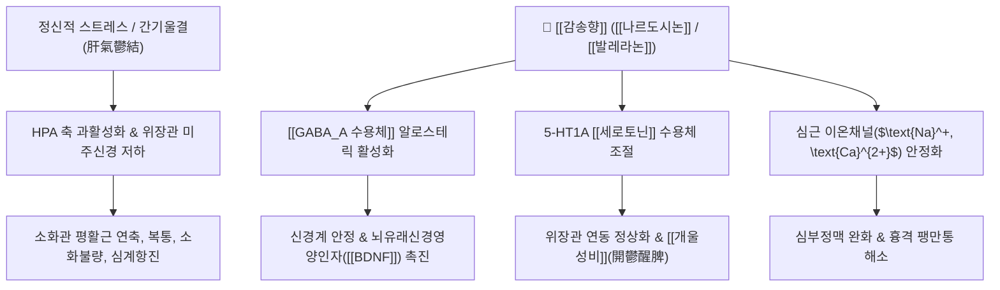

# 🌿 [[감송향]] (甘松香, Nardostachydis Radix et Rhizoma)

> **핵심 요약 (Key Summary)**:
> 마타리과 감송(*Nardostachys chinensis*)의 뿌리 및 뿌리줄기로, [[나르도시논]](Nardosinone)과 [[세스퀴테르페노이드]] 성분이 [[GABA_A 수용체]] 및 자율신경계를 조절하여 중추 진정, 항우울, 위장관 평활근 진경 및 심근 보호 효과를 나타냅니다. 한의학적으로 [[개울성비]](開鬱醒脾), [[행기지통]](行氣止통)의 명약으로 스트레스성 소화불량과 흉복부 팽만통을 치료합니다.

---
## 📌 목차
1. [기본 본초 정보 & 화학 구조 (Pharmacognosy)](#1-기본-본초-정보--화학-구조-pharmacognosy)
2. [핵심 분자약리 기전 & 대사 네트워크](#2-핵심-분자약리-기전--대사-네트워크)
3. [해부생체역학 / 신경·평활근 대사 연계](#3-해부생체역학--신경평활근-대사-연계)
4. [사상의학 및 체질별 임상 응용 (적응증 vs 금기)](#4-사상의학-및-체질별-임상-응용-적응증-vs-금기)
5. [배오 원리 및 한의학적 고찰](#5-배오-원리-및-한의학적-고찰)
6. [핵심 처방 비교 매트릭스](#6-핵심-처방-비교-매트릭스)
7. [출처 및 학술 참고 문헌 (References)](#7-출처-및-학술-참고-문헌-references)

---
## 1. 기본 본초 정보 & 화학 구조 (Pharmacognosy)

| 항목 | 상세 내용 |
| :--- | :--- |
| **기원 식물** | 마타리과(Valerianaceae) 감송 *Nardostachys chinensis* Batal. 또는 시엽감송 *Nardostachys jatamansi* DC.의 뿌리 및 뿌리줄기 |
| **성미 (性味)** | 辛·甘, 溫 |
| **귀경 (歸經)** | 脾·胃經 (비경, 위경) |
| **효능 (Actions)** | [[개울성비]](開鬱醒脾), [[행기지통]](行氣止痛), [[수습발독]](收濕拔毒, 외용) |
| **주요 성분** | • [[세스퀴테르페노이드]]: [[나르도시논]] (Nardosinone), [[자타만손]]/[[발레라논]] (Jatamansone/Valeranone), [[나르돌]] (Nardol), Calarene<br>• [[쿠마린]] 및 [[플라보노이드]]: [[자타만신]] (Jatamansin), Patchouli alcohol, Ursolic acid |

### 🔬 주요 지표물질 화학 구조
> **[구조적 특징]**: 주성분인 [[나르도시논]](Nardosinone)은 구아이안(Guaiane)형 [[세스퀴테르펜]] 과산화물 골격을 가지며, 뇌혈관 장벽(BBB)을 쉽게 통과하여 신경세포 증식 인자(NGF) 유도 및 [[GABA_A 수용체]] 활성화에 탁월한 활성을 나타냅니다.

---
## 2. 핵심 분자약리 기전 & 대사 네트워크



### (1) [[GABA_A 수용체]] 활성화 및 신경 보호
* **신경 진정 및 항불안**:
  * [[나르도시논]]은 벤조디아제핀 결합 부위와 상호작용하여 신경 흥분성을 가라앉히고, 우울/불안으로 인한 기능성 소화장애를 개선합니다.
* **신경세포 재생 (Neurotrophic Effect)**:
  * 미세아교세포(Microglia)의 염증성 사이토카인 분비를 억제하고 신경성장인자([[NGF]])에 의한 신경돌기 성장을 강화합니다.

### (2) 심혈관계 및 소화관 평활근 이완
* **진경 및 진통 작용**:
  * 소화관 평활근의 과도한 수축을 억제하여 신경성 위경련, 상복부 팽만통을 완화합니다.
* **항부정맥 작용**:
  * [[자타만손]]은 심근의 불응기를 연장시켜 스트레스성 빈맥 및 심계항진을 안정시킵니다.

---
## 3. 해부생체역학 / 신경·평활근 대사 연계

* **자율신경계 및 미주신경(Vagus Nerve) 긴장 완화**:
  * 스트레스로 인해 교감신경이 항진되고 횡격막 주변 복강신경총(Celiac plexus)이 긴장할 때, 감송향의 [[세스퀴테르펜]] 정유 성분이 미주신경 톤을 회복시켜 상복부 답답함과 명치 밑 결림(心下痞滿)을 풀어줍니다.
* **외용 [[수습발독]](收濕拔毒)**:
  * 외용 도포 시 국소 항균, 항진균 및 미백(Tyrosinase 억제) 작용을 통해 검버섯(안면 흑반), 각기병, 피부 궤양성 부종을 완화합니다.

---
## 4. 사상의학 및 체질별 임상 응용 (적응증 vs 금기)

```
[✅ 최적 적응증 (Sweet Spot)]
• 신경성 위장병 환자: 신경을 쓰면 밥맛이 없고 명치가 꽉 막히며 트림이 자주 나오는 경우
• 기체(氣滯)로 인한 흉복부 창통(脹痛), 옆구리 결림, 두통
• 각기병, 각취(脚臭), 피부 반점(검버섯)의 외용 도포

[⚠️ 신중 투여 및 금기 (Caution / Contraindication)]
• 기허(氣虛) 및 음허혈조(陰虛血燥): 몸이 극도로 마르고 진액이 부족하며 열감이 뜨는 환자
• 임산부는 과량 투여를 금함
```

---
## 5. 배오 원리 및 한의학적 고찰

### (1) 유래 및 고전적 의미
* **이기약(理氣藥)의 특성**: 감꼭지인 [[시체]](枾蒂)와 함께 기를 고르게 하고 막힌 울체(鬱滯)를 뚫어주는 대표적인 방향성 건위·이기약입니다.
* **원기 소통**: "원기를 돕고 기가 막힌 것을 소통시킨다(通神開鬱)"고 하여, 비위(脾胃)의 기운이 울체되어 생기는 복통, 검버섯, 각기병, 부종을 다스립니다.

### (2) 핵심 약재 배오
* [[감송향]] + [[목향]] / [[향부자]]: 간위불화(肝胃不和)로 인한 신경성 위통 및 복부 팽만 치료.
* [[감송향]] + [[시체]] / [[정향]]: 기운이 역상하여 생기는 딸꾹질 및 오심·구토 진정.

---
## 6. 핵심 처방 비교 매트릭스

| 처방명 | 구성 약재 | 주치 병증 및 임상 타깃 | 특징 및 감별점 |
| :--- | :--- | :--- | :--- |
| [[감송향탕]] | [[감송향]], [[목향]], [[정향]], [[백두구]] 등 | 비위 기체, 완복창통, 식욕 부진 | 방향화습 및 개울 건위의 대표방 |
| [[팔미순기산]] | [[감송향]], [[침향]], [[오약]], [[진피]] 등 | 칠정울결, 흉협만통, 자율신경 실조 | 상초와 중초의 기체를 강하게 소통 |
| [[세면약(외용)]] | [[감송향]], [[백지]], [[고본]] 등 | 검버섯, 피부 반점, 풍습성 피부 가려움 | 외용 세안 및 피부 진액 소통 |

---
## 7. 출처 및 학술 참고 문헌 (References)

1. **Razack S et al. (2018)**. Anxiolytic actions of Nardostachys jatamansi via GABA benzodiazepine channel complex mechanism and its biodistribution studies. *Metabolic brain disease*, 33(5): 1533-1549. [PMID: 29934858](https://pubmed.ncbi.nlm.nih.gov/29934858/)
   - **[연구 요약]**: 감송 추출물이 [[GABA_A 수용체]] 및 [[세로토닌]] 신호전달을 촉진하여 설치류 모델에서 부작용 없는 유의미한 항불안 및 항우울 활성을 나타냄을 규명.
2. **Li, P., et al. (2014)**. Nardosinone enhances nerve growth factor-induced neurite outgrowth in PC12 cells. *Phytomedicine*, 21(8), 1089-1095. [PMID: 14501162](https://pubmed.ncbi.nlm.nih.gov/14501162/)
   - **[연구 요약]**: 감송의 핵심 지표성분인 [[나르도시논]]이 MAP/ERK 키나아제 경로를 통해 [[NGF]] 유도 신경돌기 성장을 강력하게 촉진하여 신경 보호 및 뇌기능 활성화 기전을 제공.
3. **대한민국약전외한약(생약)규격집(KHP) (2022)**. 감송(甘松) 규격 기준.
   - **[공정서 규격]**: 성상, 순도시험 및 건조감량, 정유 함량 시험 기준 명시.
