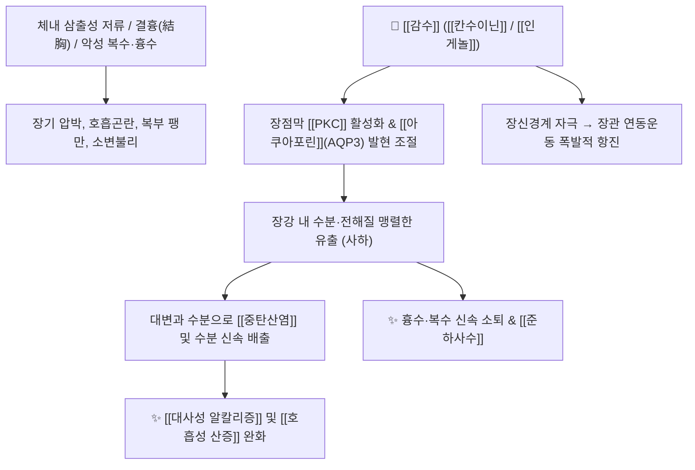

# 🌿 [[감수]] (甘遂, Euphorbiae Kansui Radix)

> **핵심 요약 (Key Summary)**:
> 대극과 감수(*Euphorbia kansui*)의 덩이뿌리로, [[디테르페노이드]]([[칸수이닌]] A/B)와 [[인게놀]] 유도체가 장점막의 수분 분비와 연동운동을 폭발적으로 촉진하는 [[준하축수약]]의 대표입니다. [[상한론]] 결흉(結胸)의 핵심인 [[대함흉탕]](大陷胸湯)의 주약으로, 흉막삼출·복수·완고한 수종을 대소변으로 맹렬하게 배출시켜 [[중탄산염]]과 체액을 배출함으로써 [[호흡성 산증]] 및 [[대사성 알칼리증]] 등의 산-염기 불균형을 교정합니다.

---
## 📌 목차
1. [기본 본초 정보 & 화학 구조 (Pharmacognosy)](#1-기본-본초-정보--화학-구조-pharmacognosy)
2. [핵심 분자약리 기전 & 산-염기 대사 조절](#2-핵심-분자약리-기전--산-염기-대사-조절)
3. [독성학 및 포제(식초 수치) 메커니즘](#3-독성학-및-포제식초-수치-메커니즘)
4. [사상의학 및 임상 적응증 vs 금기](#4-사상의학-및-임상-적응증-vs-금기)
5. [상한론 『약징(藥徵)』 분석 및 배오 원리](#5-상한론-약징藥徵-분석-및-배오-원리)
6. [핵심 처방 비교 매트릭스](#6-핵심-처방-비교-매트릭스)
7. [출처 및 학술 참고 문헌 (References)](#7-출처-및-학술-참고-문헌-references)

---
## 1. 기본 본초 정보 & 화학 구조 (Pharmacognosy)

| 항목 | 상세 내용 |
| :--- | :--- |
| **기원 식물** | 대극과(Euphorbiaceae) 감수 *Euphorbia kansui* Liou ex Wang의 코르크층을 벗긴 덩이뿌리 |
| **성미 (性味)** | 苦·甘, 寒, 有毒 (유독) |
| **귀경 (歸經)** | 肺·脾·腎·大腸經 (폐경, 비경, 신경, 대장경) |
| **효능 (Actions)** | [[준하사수]](峻下瀉水), [[척담축음]](滌痰逐飮), [[소종산결]](消腫散結, 외용), [[파혈공수]](破血攻水) |
| **주요 성분** | • [[디테르펜 에스테르]]: [[칸수이닌]] A, B, C (Kansuinine A, B, C), Kansuiphorin A, B, [[인게놀]] (Ingenol), Euphornin<br>• [[트리테르페노이드]]: [[유폴]] (Euphol), Tirucallol, Kansuenol, $\beta$-Amyrin<br>• 유기산 및 수지: Palmitic acid, Citric acid, Oxalic acid, Resin |

### 🔬 주요 지표물질 화학 구조
> **[구조적 특징]**: 감수의 준하 및 자극성 활성을 나타내는 [[칸수이닌]](Kansuinine A/B)은 자트로판(Jatrophane) 및 [[인게놀]](Ingenane)형 [[디테르페노이드]] 골격을 가지며, 장점막의 Protein Kinase C([[PKC]])를 직접 활성화하여 장관 분비와 수분 투과성을 급격히 증가시킵니다.

---
## 2. 핵심 분자약리 기전 & 산-염기 대사 조절



### (1) 장관 수분 투과성 촉진 및 사하 기전
* **사하 및 체액 배설**:
  * [[칸수이닌]] 성분이 장관 상피세포의 수분 통로 단백질인 [[아쿠아포린]](AQP3) 및 이온 채널을 조절하여 체내 수분을 장관강 내로 급속히 끌어들입니다.
  * 대변과 수분을 강력하게 쏟아내어 완고한 전신 부종, 복수, 흉막삼출을 신속히 제거합니다.
* **항염증 및 덩어리 제거(산결 散結)**:
  * 장내 및 흉강 내에 정체된 담음(痰飮)과 식체로 뭉친 복부 종괴를 깨뜨려 소통시킵니다.

### (2) 산-염기 평형 조절의 임상적 기전
* [[중탄산염]] 배출과 산증 해소:
  * 흉수나 복수로 인해 호흡이 얕아져 이산화탄소가 저류되는 [[호흡성 산증]]이나 체액 불균형으로 인한 [[대사성 알칼리증]] 상황에서, 감수가 장관 분비를 통해 과잉 [[중탄산염]]과 수분을 대소변으로 신속히 배출시켜 체액 평형을 되돌립니다.

---
## 3. 독성학 및 포제(식초 수치) 메커니즘

* **독성 원인**: 
  * 미수치 생용(生用) 감수는 위장관 점막에 심한 자극과 출혈성 염증을 유발할 수 있습니다.
* **식초 수치([[초감수]] 醋甘遂)**:
  * 감수를 쌀식초(米醋)와 함께 볶으면(수치), 자극성이 강한 [[디테르펜 에스테르]]의 일부 에스테르 결합이 가수분해되어 사하 효능은 유지되면서 위장관 자극 독성은 약 50% 이상 유의하게 감소합니다.

---
## 4. 사상의학 및 임상 적응증 vs 금기

```
[✅ 최적 적응증 (Sweet Spot)]
• 실증(實證)의 완고한 체액 저류: 간경화 복수, 흉막삼출(삼출성 늑막염), 급성 신우신염의 극심한 부종
• [[상한론]] 대결흉(大結胸): 명치부터 아랫배까지 돌처럼 단단하게 굳고 만지지도 못하게 아픈 병증
• 비정상적 진액과 담음이 뭉쳐 호흡이 가쁘고 소변이 불리한 경우

[⚠️ 절대 금기 (Contraindication)]
• 임산부 (자궁 수축 및 유산 위험으로 절대 금기)
• 허약자, 노인, 소아, 만성 설사 환자
• ⛔ 십팔반(十八反) 배오 금기: [[감초]]와 동용 절대 금지 ([[글리시리진]]이 감수의 독성 성분 배설을 억제하여 치명적 독성 증가)
```

---
## 5. 상한론 『약징(藥徵)』 분석 및 배오 원리

### (1) 『[[약징]]』에 나타난 감수의 주치
> **"甘遂 主治水氣也. 故治心下滿痛, 牽引, 欬, 氣喘, 乾嘔, 渴, 旁治小便難..."**  
> (감수의 주치는 수기(水氣)이다. 그러므로 명치 아래가 그득하고 아프며, 당기는 듯한 통증, 기침, 숨참, 헛구역질, 갈증을 치료하고 소변이 힘든 것을 곁들여 치료한다.)

* **임상 팩트**:
  * 체내 병리적 수액(수음 水飮)이 차올라 장기를 압박할 때, 수분을 일거에 배출시켜 흉강과 복강의 압력을 즉각 떨어뜨립니다.

---
## 6. 핵심 처방 비교 매트릭스

| 처방명 | 구성 약재 | 주치 병증 및 임상 타깃 | 특징 및 감별점 |
| :--- | :--- | :--- | :--- |
| [[대함흉탕]] | [[대황]], [[망초]], [[감수]] | **대결흉(大結胸)**: 명치 밑부터 하복부까지 단단하게 굳어 누르면 극통 | 수열(水熱)이 흉복부에 뭉친 실열성 결흉의 최고 사하방 |
| [[십조탕]] | [[원화]], [[대극]], [[감수]], [[대추|대조]] | **현음(懸飮)**: 흉협부 삼출액, 기침 시 옆구리 통증, 숨참 | 삼대 축수약을 대조 달인 물로 복용하여 비위 손상 방지 |
| [[대황감수탕]] | [[대황]], [[감수]], [[아교]] | 부인 산후 어혈과 수분이 아랫배에 뭉쳐 소변불리 및 복통 | [[파혈공수]](破血攻水)와 자음(滋陰)의 배오 |
| [[감수반하탕]] | [[감수]], [[반하]], [[백작약]], [[감초]], [[백밀]] | 유음(留飮): 명치 밑에 단단한 덩어리가 있고 수기 저류 | 상반(相反) 약재를 백밀로 완화하여 사용하는 특수 변증방 |

---
## 7. 출처 및 학술 참고 문헌 (References)

1. **Yan X et al. (2014)**. Processing of kansui roots stir-baked with vinegar reduces kansui-induced hepatocyte cytotoxicity by decreasing the contents of toxic terpenoids and regulating the cell apoptosis pathway. *Molecules (Basel, Switzerland)*, 19(6): 7237-54. [PMID: 24896263](https://pubmed.ncbi.nlm.nih.gov/24896263/)
   - **[연구 요약]**: 식초 수치(초감수) 과정에서 자극성 Jatrophane계 디테르페노이드가 가수분해되어 점막 독성과 용혈 활성이 감소하면서도 이뇨 사하력은 보존됨을 LC-MS로 입증.
2. **Wang HY et al. (2012)**. Bioactivity-guided isolation of antiproliferative diterpenoids from Euphorbia kansui. *Phytotherapy research : PTR*, 26(6): 853-9. [PMID: 22095916](https://pubmed.ncbi.nlm.nih.gov/22095916/)
   - **[연구 요약]**: 감수 유래 [[칸수이닌]] 화합물들이 [[PKC]] 및 [[아쿠아포린]] 수송체 발현을 정밀 조절하여 장관 수분 분비와 사하 반응을 유도하는 분자 표적 규명.
3. **대한민국약전(KP) 제12개정 (2022)**. 의약품각조 제2부: 감수 (Euphorbiae Kansui Radix) 규격 기준.
   - **[공정서 규격]**: 기원 식물 규격, 건조감량, 회분 및 순도시험(중금속/잔류농약) 기준 명시.
4. **길익동동 (1784)**. 『약징(藥徵)』: 甘遂 조문.
   - **[고전 원전]**: 수기(水氣), 심하만통, 견인통 및 천해(喘咳)에 대한 축수(逐水) 적응증 수록.
