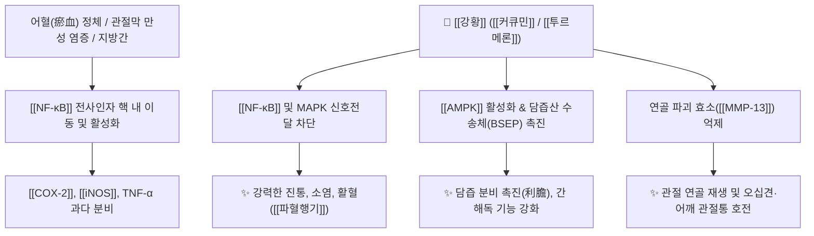

# 🌿 [[강황]] (薑黃, Curcumae Longae Rhizoma)

> **핵심 요약 (Key Summary)**:
> 생강과 강황(*Curcuma longa*)의 뿌리줄기로, [[커큐민]](Curcumin)과 [[투르메론]](Turmerone) 성분이 [[NF-κB]] 및 [[COX-2]] 경로를 차단하여 강력한 항염·항산화·이담(담즙 분비 촉진) 및 연골 보호 효과를 나타냅니다. 한의학적으로 [[파혈행기]](破血行氣), [[통경지통]](通經止痛)의 온성(溫性) 활혈약으로 어깨·상지 관절통, 무월경, 지방간 및 타박상 어혈을 치료합니다.

---
## 📌 목차
1. [기본 본초 정보 & 화학 구조 (Pharmacognosy)](#1-기본-본초-정보--화학-구조-pharmacognosy)
2. [핵심 분자약리 기전 & 간·지질 대사 네트워크](#2-핵심-분자약리-기전--간지질-대사-네트워크)
3. [해부생체역학: 강황 vs 울금의 기미(氣味)와 상하지 감별](#3-해부생체역학-강황-vs-울금의-기미氣味와-상하지-감별)
4. [사상의학 및 체질별 임상 응용 (적응증 vs 금기)](#4-사상의학-및-체질별-임상-응용-적응증-vs-금기)
5. [배오 원리 및 한의학적 고찰](#5-배오-원리-및-한의학적-고찰)
6. [핵심 처방 비교 매트릭스](#6-핵심-처방-비교-매트릭스)
7. [출처 및 학술 참고 문헌 (References)](#7-출처-및-학술-참고-문헌-references)

---
## 1. 기본 본초 정보 & 화학 구조 (Pharmacognosy)

| 항목 | 상세 내용 |
| :--- | :--- |
| **기원 식물** | 생강과(Zingiberaceae) 강황 *Curcuma longa* L. (또는 *Curcuma aromatica* Salisb., 누른강황 *Curcuma zanthorrhiza* Roxb.)의 뿌리줄기(Rhizome) |
| **성미 (性味)** | 辛·苦, 溫 |
| **귀경 (歸經)** | 肝·脾經 (간경, 비경) |
| **효능 (Actions)** | [[파혈행기]](破血行氣), [[통경지통]](通經止痛), [[온경통락]](溫經通絡), [[이담해독]](利膽解毒) |
| **주요 성분** | • [[커큐미노이드]] (KP $\ge 3.0\%$): [[커큐민]] (Curcumin), Demethoxycurcumin, Bisdemethoxycurcumin<br>• [[세스퀴테르펜]] 정유: ar-[[투르메론]] (ar-Turmerone), $\alpha,\beta$-Turmerone, Curlone, [[진기베렌]] (Zingiberene) |

### 🔬 주요 지표물질 화학 구조
> **[구조적 특징]**: [[커큐민]](Curcumin)은 폴리페놀성 다이페룰로일메탄(Diferuloylmethane) 골격을 가지며, 활성 케토-에놀 호변이성질체(Keto-enol tautomerism)를 통해 강력한 자유라디칼 소거능 및 단백질 키나아제 차단 활성을 나타냅니다.

---
## 2. 핵심 분자약리 기전 & 간·지질 대사 네트워크



### (1) 소염 및 진통 기전
* **염증 경로 차단**: [[커큐민]]은 [[NF-κB]] 활성화를 차단하여 [[COX-2]]와 류코트리엔 생성을 억제, 비스테로이드성 소염진통제([[NSAIDs]])와 유사한 진통 효과를 위장관 점막 손상 없이 발휘합니다.
* **연골 보호**: 관절 활액막에서 염증성 사이토카인과 연골 분해 효소([[MMP-13]])를 억제합니다.

### (2) 간세포 보호 및 담즙 분비 촉진 ([[이담]] 利膽)
* **간 해독 효소 유도**:
  * 글루타티온 S-전이효소(GST) 등 2상 해독 효소를 활성화하여 간염, 지방간, 알코올성 손상을 완화합니다.
  * 담즙산 배출을 촉진하여 담석증 및 소화관 지질 대사를 개선합니다.

---
## 3. 해부생체역학: 강황 vs 울금의 기미(氣味)와 상하지 감별

```
[🌿 [[강황]] (Curcumae Longae Rhizoma)]
• 약용 부위: 뿌리줄기 (Rhizome)
• 성질: 辛·苦, 溫 (따뜻함)
• 약효 특성: 기운이 따뜻하여 혈관을 확장시키고 파혈(破血)력이 강함. 주로 상지(어깨, 견비통)로 주행.

[🌿 [[울금]] (Curcumae Radix)]
• 약용 부위: 덩이뿌리 (Tuber)
• 성질: 辛·苦, 寒 (차고 서늘함)
• 약효 특성: 기운이 서늘하여 열을 식히고 행기(行氣)력이 강함. 주로 하지 및 간담 습열 해열에 작용.
```

---
## 4. 사상의학 및 체질별 임상 응용 (적응증 vs 금기)

```
[✅ 최적 적응증 (Sweet Spot)]
• 어깨 관절통(오십견, 석회화 건염, 회전근개염)이 찬 기운을 받으면 심해지는 경우
• 어혈성 생리통, 무월경, 자궁근종, 하복부 징가(동결 어혈 덩어리)
• 비알코올성 지방간, 대사증후군, 타박상으로 인한 국소 피하출혈

[⚠️ 신중 투여 및 금기 (Caution / Contraindication)]
• 임산부 (자궁 평활근 수축을 유도하므로 절대 투여 금지)
• 혈소판 응집 억제제(아스피린, 와파린 등) 복용 환자는 출혈 위험 주의
• 음허화왕(陰虛火旺) 및 혈열(血熱)로 인한 출혈 환자
```

---
## 5. 배오 원리 및 한의학적 고찰

### (1) 핵심 약재 배오
* [[강황]] + [[계지]] / [[강활]]: 어깨와 견배부의 한습 어혈을 뚫어주는 오십견 치료의 대표 배오.
* [[강황]] + [[당귀]] / [[홍화]]: 어혈로 막힌 월경통 및 타박상 어혈 소퇴.

---
## 6. 핵심 처방 비교 매트릭스

| 처방명 | 구성 약재 | 주치 병증 및 임상 타깃 | 특징 및 감별점 |
| :--- | :--- | :--- | :--- |
| [[서경탕]] | [[강황]], [[당귀]], [[해동피]], [[백출]], [[적작약]], [[감초]] | **견비통(肩臂痛)**, 오십견, 팔을 들어올리지 못함 | 상지 기혈 순환과 견관절 통증의 명방 |
| [[강황산]] | [[강황]], [[당귀]], [[몰약]], [[유향]] | **타박상 어혈, 염좌 부종, 극심한 찌르는 통증** | 파혈축어 및 진통 소종 |
| [[오적산(가미)]] | [[오적산]] + [[강황]], [[독활]] | 한랭성 요통, 어깨 결림, 만성 소화불량 | 한·습·기·혈·담 5적을 동시에 해결 |

---
## 7. 출처 및 학술 참고 문헌 (References)

1. **Daily, J. W., Yang, M., & Park, S. (2016)**. Efficacy of turmeric extracts and curcumin for alleviating the symptoms of joint arthritis: A systematic review and meta-analysis. *Journal of Medicinal Food*, 19(8), 717-729. [PMID: 27533649](https://pubmed.ncbi.nlm.nih.gov/27533649/)
   - **[연구 요약]**: 무작위 대조 임상시험(RCT) 메타분석. 강황 추출물(1,000mg/day)이 관절염 환자의 통증 지수(VAS)를 [[이부프로펜]] 수준으로 유의미하게 개선함을 입증.
2. **Aggarwal, B. B., & Sung, B. (2009)**. Pharmacological basis for the role of curcumin in chronic diseases: an engine with many track. *Trends in Pharmacological Sciences*, 30(2), 85-94. [PMID: 19110321](https://pubmed.ncbi.nlm.nih.gov/19110321/)
   - **[연구 요약]**: [[커큐민]]이 [[NF-κB]], [[COX-2]], [[5-LOX]] 등 다중 분자 경로를 표적하여 항염, 항암 및 대사 개선을 발휘하는 포괄적 기전 규명.
3. **대한민국약전(KP) 제12개정 (2022)**. 의약품각조 제2부: 강황 (Curcumae Longae Rhizoma) 규격 기준.
   - **[공정서 규격]**: 커큐미노이드 3.0% 이상 함유 규격 명시.
