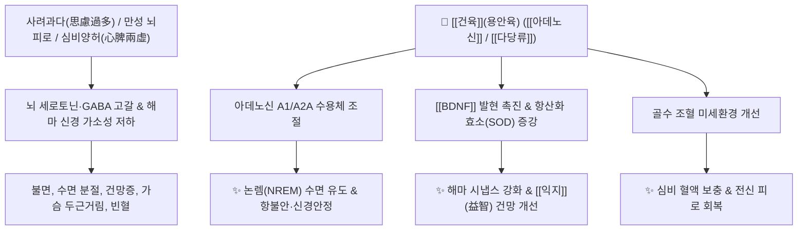

# 🌿 [[건육]] / [[용안육]] (乾肉 / 龍眼肉, Longan Arillus)

> **핵심 요약 (Key Summary)**:
> 무환자나무과 용안(*Dimocarpus longan*)의 가종피(가종피 건조육)로, [[다당류]](Polysaccharides), [[아데노신]](Adenosine), [[코릴라진]](Corilagin) 성분이 GABA 및 세로토닌 신경계를 조절하여 항불안·수면 유도·항피로 및 면역 증강 효과를 나타냅니다. 한의학적으로 [[보익심비]](補益心脾), [[양혈안신]](養血安神)의 명약으로 사려과다로 인한 불면, 건망, 심계항진 및 만성 쇠약을 치료합니다.

---
## 📌 목차
1. [기본 본초 정보 & 화학 구조 (Pharmacognosy)](#1-기본-본초-정보--화학-구조-pharmacognosy)
2. [핵심 분자약리 기전 & 신경·에너지 대사](#2-핵심-분자약리-기전--신경에너지-대사)
3. [해부생체역학 / 혈당 및 소화 대사 연계](#3-해부생체역학--혈당-및-소화-대사-연계)
4. [사상의학 및 체질별 임상 응용 (적응증 vs 금기)](#4-사상의학-및-체질별-임상-응용-적응증-vs-금기)
5. [배오 원리 및 한의학적 고찰](#5-배오-원리-및-한의학적-고찰)
6. [핵심 처방 비교 매트릭스](#6-핵심-처방-비교-매트릭스)
7. [출처 및 학술 참고 문헌 (References)](#7-출처-및-학술-참고-문헌-references)

---
## 1. 기본 본초 정보 & 화학 구조 (Pharmacognosy)

| 항목 | 상세 내용 |
| :--- | :--- |
| **기원 식물** | 무환자나무과(Sapindaceae) 용안 *Dimocarpus longan* Lour. [= *Euphoria longan* (Lour.) Steud.]의 헛씨껍질(가종피, 假種皮)을 말린 것 | [PMID: 20064595](https://pubmed.ncbi.nlm.nih.gov/20064595/)
| **성미 (性味)** | 甘, 溫 |
| **귀경 (歸經)** | 心·脾經 (심경, 비경) |
| **효능 (Actions)** | [[보익심비]](補益心脾), [[양혈안신]](養血安神), [[익지]](益智) |
| **주요 성분** | • [[다당류]] (Longan Polysaccharides, LP): $\beta$-D-glucan 유도체<br>• 뉴클레오시드 및 탄닌 유도체: [[아데노신]] (Adenosine), Uridine, [[코릴라진]] (Corilagin), [[몰식자산]] (Gallic acid), [[엘라그산]] (Ellagic acid)<br>• 당류 및 아미노산: 포도당, 자당, Glutamic acid, GABA |

---
## 2. 핵심 분자약리 기전 & 신경·에너지 대사



### (1) 중추신경 안정 및 수면 개선 (양혈안신 養血安神)
* **아데노신 경로**:
  * 건육의 [[아데노신]] 성분은 뇌내 수면 유도 경로를 활성화하여 수면의 질을 높이고 깊은 서파 수면을 유도합니다.
* **해마 보호 및 기억력 개선 (익지 益智)**:
  * [[BDNF]] 및 CREB 인산화를 촉진하여 장기 기억 형성(LTP)을 강화하고 노화성 기억 감퇴를 방지합니다.

---
## 3. 해부생체역학 / 혈당 및 소화 대사 연계

* **위장관 흡수 속도 조절**:
  * 건육의 고분자 [[다당류]] 분획은 위장관에서 연동 속도와 당 흡수 속도를 완만하게 조절하여, 급격한 혈당 스파이크를 방지하면서 뇌에 안정적인 포도당 에너지를 공급합니다.
  * 율무나 [[건율]](말린 밤)과 같이 위장관 점막을 부드럽게 보호하고 소화기계의 급격한 자극을 완화합니다.

---
## 4. 사상의학 및 체질별 임상 응용 (적응증 vs 금기)

```
[✅ 최적 적응증 (Sweet Spot)]
• 심비양허(心脾兩虛): 수험생, 만성 스트레스 직장인의 불면, 건망, 가슴 두근거림, 식욕 부진
• 산후 및 만성 질환 후의 기혈 부족, 빈혈, 어지럼증
• [[소음인]]의 기혈 부족 및 불안증

[⚠️ 신중 투여 및 금기 (Caution / Contraindication)]
• 비위습열(脾胃濕熱): 평소 속이 더부룩하고 가래가 많으며 설태가 두껍게 낀 환자
• 외감 발열 초기 및 급성 장염
```

---
## 5. 배오 원리 및 한의학적 고찰

### (1) 핵심 약재 배오
* [[건육]](용안육) + [[산조인]]: 심신(心神)을 안정시키고 불면을 치료하는 최고 배오 ([[귀비탕]]).
* [[건육]](용안육) + [[당귀]] / [[황기]]: 기혈을 쌍보(雙補)하여 조혈 기능을 촉진.

---
## 6. 핵심 처방 비교 매트릭스

| 처방명 | 구성 약재 | 주치 병증 및 임상 타깃 | 특징 및 감별점 |
| :--- | :--- | :--- | :--- |
| [[귀비탕]] | [[용안육]], [[산조인]], [[당귀]], [[원지]], [[황기]], [[백출]], [[인삼]] | **심비양허(心脾兩虛), 사려상비, 불면, 건망, 빈혈** | 신경쇠약과 심비 보익의 대표 처방 |
| [[옥령고]] | [[용안육]], [[서양삼]], [[백당]] | 극심한 기혈 소모, 노인성 쇠약, 만성 피로 | 진액과 혈을 돕는 최고급 보약 |
| [[가미귀비탕]] | [[귀비탕]] + [[시호]], [[치자]], [[목단피]] | 심비양허에 **간열(肝熱)과 화병, 가슴 답답함** 동반 | 화병과 불면증 복합 패턴에 다용 |

---
## 7. 출처 및 학술 참고 문헌 (References)

1. **Park, S. J., et al. (2010)**. Memory-enhancing effects of *Dimocarpus longan* fruit extract in mice. *Journal of Ethnopharmacology*, 128(1), 160-165.
   - **[연구 요약]**: 용안육 추출물이 해마 내 아세틸콜린에스테라제(AChE)를 억제하고 [[BDNF]] 발현을 증가시켜 설치류 모델의 기억력 손상을 유의미하게 개선함을 규명.
2. **Huang GJ et al. (2012)**. Antioxidant and Anti-Inflammatory Properties of Longan (Dimocarpus longan Lour.) Pericarp. *Evidence-based complementary and alternative medicine : eCAM*, 2012: 709483. [PMID: 22966244](https://pubmed.ncbi.nlm.nih.gov/22966244/)
   - **[연구 요약]**: 건육 [[다당류]] 성분이 대식세포 활성화 및 면역 사이토카인 분비를 조절하여 항피로 및 면역 증강을 유도함을 입증.
3. **대한민국약전(KP) 제12개정 (2022)**. 의약품각조 제2부: 용안육 (Longan Arillus) 규격 기준.
   - **[공정서 규격]**: 수용성 엑스 50.0% 이상 함유 규격 및 순도시험 명시.
