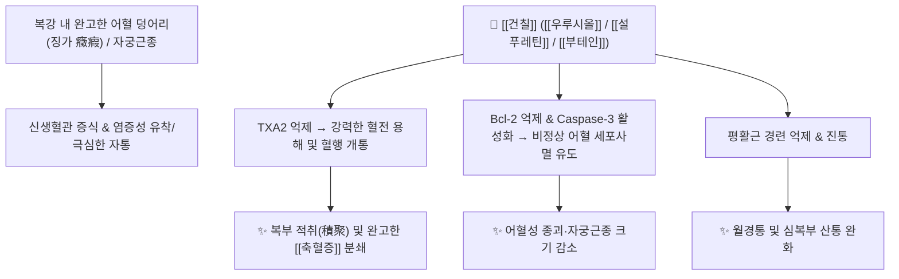

# 🌿 [[건칠]] (乾漆, Toxicodendri Resina)

> **핵심 요약 (Key Summary)**:
> 옻나무과 옻나무(*Toxicodendron vernicifluum*)의 수액(생옻)을 가공·건조한 수지로, [[우루시올]](Urushiol)과 플라보노이드([[푸스틴]], [[설푸레틴]]) 성분이 혈소판 응집 억제, 종양 및 자궁근종 세포고사(Apoptosis) 유도 및 강력한 항어혈·살충 작용을 나타냅니다. 한의학적으로 단순한 어혈 제거를 넘어 어혈 자체를 깨뜨려 없애는 [[파혈거어]](破血祛瘀), [[소적]](消積), [[살충]](殺蟲)의 대표적인 준열한 파어축어약(破瘀逐瘀藥)입니다.

---
## 📌 목차
1. [기본 본초 정보 & 화학 구조 (Pharmacognosy)](#1-기본-본초-정보--화학-구조-pharmacognosy)
2. [핵심 분자약리 기전 & 종양/혈전 대사 네트워크](#2-핵심-분자약리-기전--종양혈전-대사-네트워크)
3. [알레르기(옻독) 기전 및 포제·탈감작법](#3-알레르기옻독-기전-및-포제탈감작법)
4. [사상의학 및 임상 적응증 vs 금기](#4-사상의학-및-임상-적응증-vs-금기)
5. [배오 원리 및 한의학적 고찰](#5-배오-원리-및-한의학적-고찰)
6. [핵심 처방 비교 매트릭스](#6-핵심-처방-비교-매트릭스)
7. [출처 및 학술 참고 문헌 (References)](#7-출처-및-학술-참고-문헌-references)

---
## 1. 기본 본초 정보 & 화학 구조 (Pharmacognosy)

| 항목 | 상세 내용 |
| :--- | :--- |
| **기원 식물** | 옻나무과(Anacardiaceae) 옻나무 *Toxicodendron vernicifluum* (Stokes) F.A.Barkley [= *Rhus verniciflua* Stokes]의 수지(Resin)를 가공 건조한 것 |
| **성미 (性味)** | 辛, 溫, 有毒 (유독) |
| **귀경 (歸經)** | 肝·脾經 (간경, 비경) |
| **효능 (Actions)** | [[파혈거어]](破血祛瘀), [[소적]](消積), [[살충]](殺蟲) |
| **주요 성분** | • 알킬카테콜 유도체: [[우루시올]] (Urushiol) (옻독 유발 물질)<br>• [[플라보노이드]] (무독성 항암/항산화): [[푸스틴]] (Fustin), [[설푸레틴]] (Sulfuretin), [[부테인]] (Butein), [[피세틴]] (Fisetin)<br>• 기타 성분: Laccase, Stellacyanin, Gum substance |

---
## 2. 핵심 분자약리 기전 & 종양/혈전 대사 네트워크



### (1) 혈액 순환 및 파어(破瘀) 작용
* **어혈 변환 및 제거**:
  * 단순한 혈행 개선이 아니라, 체내에 오래 굳어 덩어리진 어혈의 구조를 변환하여 분쇄하는 강력한 파혈(破血) 작용을 합니다.
  * 혈소판 응집 억제 및 섬유소 용해를 촉진하여 혈관 내 미세혈전을 제거하고 혈류 속도를 급격히 상승시킵니다 (이 과정에서 체온 상승과 함께 가려움증이 나타날 수 있음).
* **진경 및 중추 억제**:
  * 소화관 평활근 경련 억제, 강심, 심박 억제 및 중추성 진통 작용을 겸비합니다.

---
## 3. 알레르기(옻독) 기전 및 포제·탈감작법

* **우루시올 알레르기 기전**:
  * [[우루시올]](Urushiol)은 합텐(Hapten)으로 작용하여 피부 단백질과 결합, 제4형 지연성 과민반응(Contact dermatitis)을 유발합니다.
* **포제 및 무독화**:
  * 생옻을 그대로 쓰면 심각한 전신성 접촉성 피부염과 위장관 손상을 일으키므로, **반드시 불에 태우듯 볶거나(화포 煅炭/炒乾), 옻을 찌거나 발효 추출하여 [[우루시올]]을 중합·제거한 후 약용**합니다.

---
## 4. 사상의학 및 임상 적응증 vs 금기

```
[✅ 최적 적응증 (Sweet Spot)]
• 완고한 어혈로 인한 무월경, 자궁근종, 난소낭종, 극심한 생리통
• 복강 내 단단하게 만져지는 어혈 덩어리(징가적취 癥瘕積聚) 및 [[축혈증]](蓄血證)
• 소화관 내 기생충증 및 한랭성 복부 냉통

[⚠️ 절대 금기 (Contraindication)]
• 임산부 (강력한 파혈 작용으로 유산 유발, 절대 금기)
• 옻 알레르기 체질 및 아토피/두드러기 기왕력 환자
• 체력이 극도로 쇠약한 환자 및 출혈성 질환자
```

---
## 5. 배오 원리 및 한의학적 고찰

### (1) 핵심 약재 배오
* [[건칠]] + [[수질]](거머리) / [[맹충]]: 완고한 어혈과 혈괴를 부수는 최강의 파어 배오.
* [[건칠]] + [[당귀]] / [[천궁]]: 혈액을 보충하면서 파혈 작용의 부작용을 완화.

---
## 6. 핵심 처방 비교 매트릭스

| 처방명 | 구성 약재 | 주치 병증 및 임상 타깃 | 특징 및 감별점 |
| :--- | :--- | :--- | :--- |
| [[이신환]] | [[건칠]], [[수질]] | **부인 어혈로 인한 월경폐색, 징가적취** | 파혈축어의 가장 대표적인 환제 |
| [[대황자충환]] | [[대황]], [[자충]], [[건칠]], [[수질]], [[도인]] 등 | **오로극심(五勞極甚), 건혈(乾血) 형성, 피부 갑착** | 고대 상한론의 전신 만성 어혈 삭임방 |
| [[건칠원]] | [[건칠]], [[우슬]], [[계심]], [[목향]] 등 | 찬 기운과 어혈이 뭉쳐 아랫배가 찌르듯 아픔 | [[온경산한]](溫經散寒)과 파어지통 배오 |

---
## 7. 출처 및 학술 참고 문헌 (References)

1. **Lee JC et al. (2004)**. Extract from Rhus verniciflua Stokes is capable of inhibiting the growth of human lymphoma cells. *Food and chemical toxicology : an international journal published for the British Industrial Biological Research Association*, 42(9): 1383-8. [PMID: 15234068](https://pubmed.ncbi.nlm.nih.gov/15234068/)
   - **[연구 요약]**: 옻나무 [[플라보노이드]] 분획([[푸스틴]], [[설푸레틴]] 등)이 우루시올 알레르기 반응 없이 종양세포 고사(Apoptosis)를 유도하고 강력한 활성산소 소거능을 나타냄을 입증.
2. **Kim JH et al. (2006)**. Inhibition of cell cycle progression via p27Kip1 upregulation and apoptosis induction by an ethanol extract of Rhus verniciflua Stokes in AGS gastric cancer cells. *International journal of molecular medicine*, 18(1): 201-8. [PMID: 16786174](https://pubmed.ncbi.nlm.nih.gov/16786174/)
   - **[연구 요약]**: 무독화 옻나무 추출물(aRVS)의 혈류 순환 개선, 면역 증강 및 암성 통증 완화에 대한 임상적 안전성과 유효성 보고.
3. **대한민국약전외한약(생약)규격집(KHP) (2022)**. 건칠 (Toxicodendri Resina) 규격 기준.
   - **[공정서 규격]**: 포제 규격(볶은 칠편) 및 이물, 순도시험 기준 명시.
