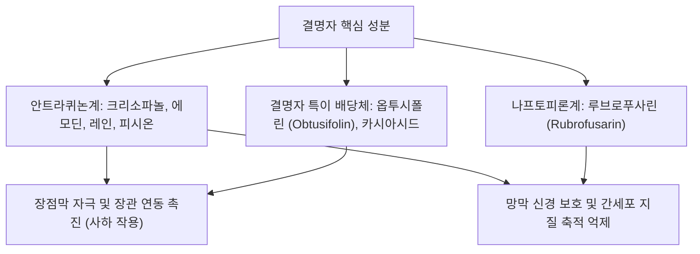

---
aliases:
  - Cassiae Semen
  - 결명자
  - 결명자(決明子)
tags:
  - 본초
  - 청열사화약
  - 명목약
  - 윤장통변
  - 안트라퀴논
---

# 결명자 (決明子, Cassiae Semen)

> 핵심 요약 (Key Summary):
> 콩과(Fabaceae) 식물인 결명(Cassia obtusifolia / Cassia tora)의 잘 익은 씨를 건조한 본초로, "눈을 밝게 틔워주는 씨앗(決明)"이라는 뜻을 지님.
> 성미는 감고함(甘苦鹹)하고 미한(微寒)하며 간(肝)과 대장(大腸)경으로 귀경하여, 간화(肝火)를 식혀 안구 충혈과 두통을 치료하고 대장을 적셔 변비를 해소(淸肝明目, 潤腸通便).
> [[크리소파놀]], [[에모딘]], 옵투시폴린 등 안트라퀴논(Anthraquinone) 화합물의 망막 신경절세포 보호, 안압 강하, 장관 연동 촉진 및 혈중 콜레스테롤 저하 작용.
⚠️ 주의사항: 안트라퀴논의 완화한 사하 작용이 있으므로, 비위허한(脾胃虛寒)으로 설사를 자주 하거나 저혈압 경향이 있는 환자는 복용 주의.

---

## 1. 본초 기본 정보 (Herbal Profile)

| 항목 | 내용 |
| :--- | :--- |
| **본초명** | 결명자 (決明子, Cassiae Semen) |
| **기원 식물** | 콩과(Fabaceae) 결명(*Cassia obtusifolia* L. 또는 *Cassia tora* L.)의 성숙 종자 |
| **성미(性味)** | 감고함(甘苦鹹), 미한(微寒) |
| **귀경(歸經)** | 간(肝), 대장(大腸) |
| **효능** | 청간명목(淸肝明目), 평간잠양(平肝潛陽), 윤장통변(潤腸通便) |
| **주치 병증** | 목적종통(目赤腫痛, 안구 충혈·통증), 수루안화(눈물 흘림, 눈 침침함), 두통현훈, 장조변비(대변 굳음), 고혈압 |
| **표준 용량** | 10~15g (탕제), 차(Tea)로 음용 시 볶아서(초결명 炒決明) 사용 |

---

## 2. 주요 약리 활성 성분 (Chemical Constituents)

결명자의 유효 약리 활성은 주로 다양한 안트라퀴논(Anthraquinone)계 및 나프토피론(Naphthopyrone)계 화합물에 기인합니다:

* **안트라센 유도체**:
  * [[크리소파놀]](Chrysophanol): 장내 유익균에 의해 분해되어 대장 연동운동을 자극.
  * [[에모딘]](Emodin): 강력한 항염증, 항산화 및 지질 대사 개선.
  * [[레인]](Rhein): 장관 분비 촉진 및 신장 보호 작용.
* **옵투시폴린 (Obtusifolin)**: 결명자의 고유 지표 성분으로, 혈중 총콜레스테롤 및 중성지방(TG)을 낮추고 혈관 내피세포를 보호.

---

## 3. 현대 약리 연구 및 분자 기전 (Pharmacological MoA)

### 1) 안구 보호 및 안압 조절 (Ocular Protection & Anti-glaucoma)
- 망막 신경절 세포(RGC)의 산화적 손상 및 글루타메이트 독성 세포사를 억제합니다.
- 섬유주(Trabecular meshwork) 세포의 방수 배출을 원활히 하여 안압(IOP) 상승을 완화하고 시신경 혈류를 개선합니다.

### 2) 완화한 윤장 사하 작용 (Laxative Effect)
- 결명자의 결합형 안트라퀴논 배당체가 소장에서 흡수되지 않고 대장으로 이동한 뒤, 장내 세균의 $\beta$-glucosidase에 의해 아글리콘으로 활성화됩니다.
- 대장 점막의 연동 반사를 자극하고 수분 재흡수를 억제하여 굳은 변을 부드럽게 배출시킵니다.

### 3) 지질 대사 개선 및 혈압 강하 (Hypolipidemic & Hypotensive)
- 간세포 내 HMG-CoA 환원효소 활성을 억제하고 담즙산 배출을 촉진하여 혈청 LDL-콜레스테롤을 낮춥니다.
- 혈관 평활근의 $Ca^{2+}$ 유입을 억제하여 말초 혈관 저항을 감소시킴으로써 수축기 혈압을 안정시킵니다.

---

## 4. 한의 임상 응용 및 배오 네트워크

* **청간명목(淸肝明目)의 황금 배오**:
  * 간화상염(肝火上炎)으로 눈이 붉게 붓고 찌르듯 아플 때: [[국화]], [[치자]], [[용담]]과 배오.
  * 간신음허(肝腎陰虛)로 눈이 침침하고 건조할 때: [[구기자]], [[숙지황]], [[산수유]]와 배오.
* **윤장통변(潤腸通便) 배오**:
  * 노인성 진액 부족 변비: [[마자인]], [[당귀]]와 합방하여 자극 없이 윤활한 배변 유도.
* **포제법(볶음, 炒결명)**:
  * 생결명자는 성질이 차고 사하력이 강하나, 약하게 볶으면(微炒) 찬 성질이 온화해지고 고소한 풍미가 우러나와 장기 복용 차(Tea)로 적합해집니다.

---

## 5. 📚 출처 및 학술 연구 요약 (References)

1. Dong, X., et al. (2017). "The review of Cassiae Semen: A comprehensive review on its botany, traditional uses, phytochemistry, pharmacology and toxicity." *The American Journal of Chinese Medicine*, 45(4), 699-723.
   - [연구 요약] 결명자의 식물학, 전통 효능, 안트라퀴논 성분 분리 및 안질환·간질환·지질대사 현대 약리 작용을 총망라한 결정판 리뷰.
2. Hou, R., et al. (2018). "Obtusifolin from Cassia obtusifolia attenuates non-alcoholic fatty liver disease in mice." *Phytotherapy Research*, 32(11), 2244-2253.
   - [연구 요약] 결명자 핵심 성분 옵투시폴린이 비알코올성 지방간 모델에서 AMPK 신호전달계를 활성화하여 간 지질 축적을 유의미하게 차단함을 입증.
