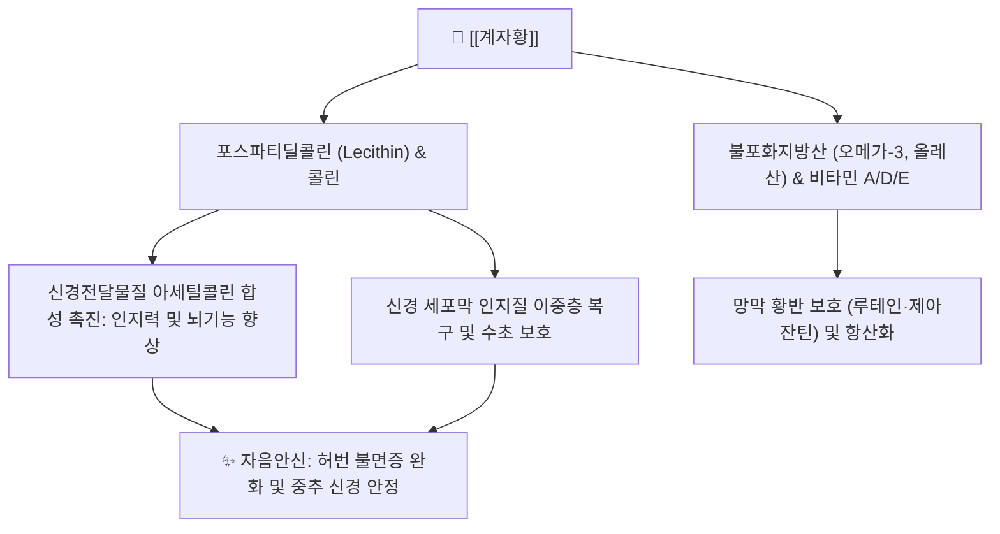

# 🥚 [[계자황]] (鷄子黃, Galli Ovum Yolk)

> **핵심 요약 (Key Summary)**:
> 꿩과에 속한 동물인 닭의 알(달걀) 노른자로 자음양혈과 윤조식풍의 대표적 혈육유정지품
> 고농도 레시틴, 콜린, 불포화지방산 함유로 뇌신경 세포막 안정화 및 아세틸콜린 합성 촉진
> 온병 후기 음허풍동, 허번불면, 산후 혈허구갈 및 황련아교탕의 핵심 군약으로 활용

---
## 📌 목차
1. [기본 정보 & 기원](#1-기본-정보--기원)
2. [본초학적 특성 & 귀경](#2-본초학적-특성--귀경)
3. [분자약리 기전 & 현대 효능](#3-분자약리-기전--현대-효능)
4. [대표 배오 처방](#4-대표-배오-처방)
5. [복용법, 안전성 및 주의사항](#5-복용법-안전성-및-주의사항)
6. [출처 및 학술 참고 문헌 (References)](#6-출처-및-학술-참고-문헌-references)

---
## 1. 기본 정보 & 기원

| 항목 | 상세 내용 |
| :--- | :--- |
| **본초명** | [[계자황]] (鷄子黃, Egg Yolk) |
| **이명** | 난황(卵黃), 계란황(鷄卵黃) |
| **기원 동물** | 꿩과(Phasianidae) 닭(*Gallus gallus domesticus* Brisson)의 알 노른자 |
| **약용 부위** | 신선한 알의 난황(卵黃) |
| **분류** | 보익약(補益藥) / 보혈약(補血藥) (자음양혈제) |

---
## 2. 본초학적 특성 & 귀경

| 항목 | 상세 내용 |
| :--- | :--- |
| **성미 (性味)** | 감(甘), 평(平) / 미온(微溫), 무독(無毒) |
| **귀경 (歸經)** | 심경(心經), 신경(腎經), 비경(脾經) |
| **효능 (效能)** | 자음양혈(滋陰養血), 윤조식풍(潤燥熄風), 건비익위(健脾益胃), 안신정경(安神定驚) |
| **주치 (主治)** | 열병상음(熱病傷陰), 허번불민(虛煩不得眠), 음허풍동(陰虛風動), 경련, 산후 허열, 설사구갈 |

---
## 3. 분자약리 기전 & 현대 효능

### (1) 뇌신경 보호 및 아세틸콜린 합성 촉진
* **콜린 공급원**: 난황 레시틴은 인체에서 콜린(Choline)으로 전환되어 신경전달물질인 아세틸콜린의 전구체로 작용, 기억력 감퇴 및 신경 쇠약을 개선함.
* **신경막 유동성 개선**: 고도 불포화지방산과 인지질이 뇌세포막 손상을 복구하고 신경세포 간 신호전달 효율을 증대시킴.

### (2) 심신불교(心腎不交) 음허화왕(陰虛火旺) 해소
* 진액과 정혈이 고갈되어 심화(心火)가 치솟는 불면·불안 병태에서, 계자황의 유정(有情)한 지질·단백 복합체가 신음(腎陰)을 급속히 보충하여 상열감을 진정시킴.

---
## 4. 대표 배오 처방

| 처방명 | 배오 목적 및 주치 | 배오 특징 |
| :--- | :--- | :--- |
| [[황련아교탕]] | 소음병 열화증으로 인한 심번불면, 심신불교 불면증 치료 | 탕액을 끓인 후 불을 끄고 생난황을 저어 풀어 넣음(교충 攪衝) |
| [[백합계자탕]] | 백합병으로 심신이 황홀하고 불안하며 진액이 마른 병증 | 백합 달인 즙에 계자황을 타서 복용하여 자음안신 |
| [[대계교탕]] | 온병 후기 진액 고갈로 인한 음허풍동, 수족연휵(손발 떨림) | [[아교]], [[구판]], [[별갑]]과 함께 혈맥을 자윤하고 경련 진정 |

---
## 5. 복용법, 안전성 및 주의사항

* **특수 복용법 (교충 攪衝)**: 계자황은 단백질과 유효 지질 성분이 열에 의해 변성·응고되면 약효가 감소하므로, 약을 다 달인 후 불에서 내려 미지근해졌을 때 생노른자를 넣고 빠르게 저어 풀어 복용함.
* **위장 정체 주의**: 평소 비위가 차고 습담(濕痰)이 많아 소화가 잘 안 되고 설사를 자주 하는 환자는 소화불량을 유발할 수 있으므로 신중 투여함.
* **알레르기 주의**: 난류 알레르기가 있는 소아 및 환자에게는 투여를 금함.

---
## 6. 출처 및 학술 참고 문헌 (References)

* 장중경, 《상한론(傷寒論)》, 《금궤요략(金匱要略)》
* 신민교, 《임상본초학》, 영림사
* **Thomas MS et al. (2022)**. Comparison between Egg Intake versus Choline Supplementation on Gut Microbiota and Plasma Carotenoids in Subjects with Metabolic Syndrome. *Nutrients*, 14(6). [PMID: 35334836](https://pubmed.ncbi.nlm.nih.gov/35334836/)
  * [연구 요약] 난황 유래 포스파티딜콜린과 콜린이 세포막 완전성을 유지하고 항염증 및 지질 대사 균형에 긍정적으로 작용함을 체계적으로 정리함.
