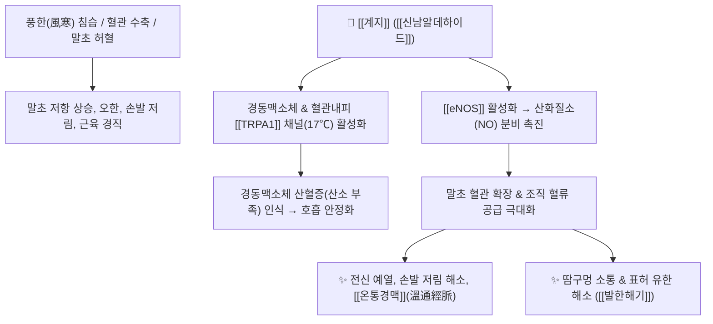

# 🌿 [[계지]] (桂枝, Cinnamomi Ramulus)

> **핵심 요약 (Key Summary)**:
> 녹나무과 육계(*Cinnamomum cassia*)의 어린가지로, [[신남알데하이드]](Cinnamaldehyde)가 [[TRPA1]] 수용체 및 [[eNOS]]를 활성화하여 산화질소(NO) 분비로 말초 혈관을 확장시키고, [[TRPV3]] 및 [[AMPK]]를 통해 인슐린 저항성 개선 및 심부 체온을 예열합니다. [[상한론]] [[발한해기]](發汗解肌), [[온통경맥]](溫通經脈), [[조양화기]](助陽化氣)의 최고 기본방인 [[계지탕]](桂枝湯)의 군약입니다.

---
## 📌 목차
1. [기본 본초 정보 & 화학 구조 (Pharmacognosy)](#1-기본-본초-정보--화학-구조-pharmacognosy)
2. [핵심 기전 ①: 신남알데하이드와 TRPA1/NO 혈관 확장 & 호흡 항상성](#2-핵심-기전--신남알데하이드와-trpa1no-혈관-확장--호흡-항상성)
3. [핵심 기전 ②: 인슐린 감수성 개선 & 식후 혈당 스파이크 억제](#3-핵심-기전--인슐린-감수성-개선--식후-혈당-스파이크-억제)
4. [본초 감별: 카시아 vs 실론 시나몬 & 마황 vs 계지 비교](#4-본초-감별-카시아-vs-실론-시나몬--마황-vs-계지-비교)
5. [사상의학 및 체질별 임상 응용 (적응증 vs 금기)](#5-사상의학-및-체질별-임상-응용-적응증-vs-금기)
6. [상한론 『약징(藥徵)』 분석 및 배오 원리](#6-상한론-약징藥徵-분석-및-배오-원리)
7. [핵심 처방 비교 매트릭스](#7-핵심-처방-비교-매트릭스)
8. [출처 및 학술 참고 문헌 (References)](#8-출처-및-학술-참고-문헌-references)

---
## 1. 기본 본초 정보 & 화학 구조 (Pharmacognosy)

| 항목 | 상세 내용 |
| :--- | :--- |
| **기원 식물** | 녹나무과(Lauraceae) 육계나무 *Cinnamomum cassia* Presl의 어린가지 |
| **성미 (性味)** | 辛·甘, 溫 |
| **귀경 (歸經)** | 心·肺·膀胱經 (심경, 폐경, 방광경) |
| **효능 (Actions)** | [[발한해기]](發汗解肌), [[온통경맥]](溫通經脈), [[조양화기]](助陽化氣), [[평충강기]](平衝降氣) |
| **주요 성분** | • 페닐프로파노이드(KP 신남산 $\ge 0.03\%$): [[신남알데하이드]] (Cinnamaldehyde, 약 75~90%), Cinnamic acid, Cinnamyl alcohol<br>• 쿠마린 유도체: [[쿠마린]] (Coumarin) (카시아종에 풍부, 항혈전 작용)<br>• 페놀류: [[유게놀]] (Eugenol) (실론종에 풍부) |

---
## 2. 핵심 기전 ①: 신남알데하이드와 TRPA1/NO 혈관 확장 & 호흡 항상성



### (1) 산화질소(NO)를 통한 혈관 확장과 장기별 혈류 증가
* **말초 및 표적 장기 혈류 개통**:
  * [[신남알데하이드]]는 혈관 내피세포의 [[eNOS]]를 자극하여 NO 생성을 촉진, 혈관을 부드럽게 이완시킵니다.
  * 다른 약재와 배오될 때 해당 장기로 혈류를 유도하는 훌륭한 부스터 역할을 합니다:
    * [[계지]] + [[복령]]: 신장(Kidney) 사구체 혈류량을 급격히 늘려 수분 배출 촉진.
    * [[계지]] + [[작약]]: 골격근 미세순환을 개선하여 젖산 배출 및 쥐남 완화.
* **TRPA1 채널과 호흡 조절**:
  * [[신남알데하이드]]는 경동맥소체(Carotid body) 화학수용기의 [[TRPA1]] 채널을 자극하여 뇌가 혈액 내 산소 부족을 감지하고 호흡을 깊고 안정적으로 조절하게 만들어 말초 세포에 신선한 산소를 공급합니다.

![[Pasted image 20240226000535.png|430]]
![[Pasted image 20240226000550.png|320]]
> **[계지의 혈관 확장 및 대사 조절도]**: 신남알데하이드의 이온채널 조절 및 혈관 평활근 이완 경로.

---
## 3. 핵심 기전 ②: 인슐린 감수성 개선 & 식후 혈당 스파이크 억제

* **GLUT4 발현 촉진 및 인슐린 저항성 개선**:
  * 간, 근육, 지방세포의 인슐린 수용체 인산화를 촉진하여 포도당 흡수율을 높이고 공복혈당을 강하시킵니다.
* **소화 흡수 속도 완화**:
  * 위장관에서 탄수화물 분해 속도를 적절히 조절하여 식후 급격한 혈당 스파이크를 예방합니다.
  * 심혈관 보호, 중성지방(TG) 및 LDL 콜레스테롤 수치를 낮추는 대사 개선 효과가 확인되어 있습니다.

---
## 4. 본초 감별: 카시아 vs 실론 시나몬 & 마황 vs 계지 비교

### (1) 카시아(Cassia) vs 실론(Ceylon) 시나몬

| 구분 | 주요 활성 성분 | 약리 기전 및 한의학적 특징 | 임상 주의점 |
| :--- | :--- | :--- | :--- |
| **카시아 시나몬<br>([[계지]]/[[육계]])** | [[쿠마린]](Coumarin) 다량 함유 | 혈액 응고를 억제하여 [[활혈통경]](活血通經) 작용이 강력함 | 고용량 장기 복용 시 간기능 모니터링 |
| **실론 시나몬<br>(Ceylon Cinnamon)** | [[유게놀]](Eugenol) 다량 함유 | 온감을 느끼게 하는 [[TRPV3]](33~39℃) 채널을 열어 [[온경통맥]](溫經通脈) | 쿠마린 함량이 낮아 간독성 부담이 적음 |

### (2) [[마황]] vs [[계지]] 감별
* [[마황]]: 위실(衛實), 외감 풍한의 표실무한(表實無汗, 땀이 안 남)에 작용하여 폐경(肺經)을 열어 발한.
* [[계지]]: 위허(衛虛), 외감 풍사의 표허유한(表虛有汗, 땀이 저절로 남)에 작용하여 심경(心經)의 양기를 돕고 영위(營衛)를 조화.

### (3) 마황-부자-계지의 심혈관 시너지
* [[마황]]의 에페드린($\beta_1$ 심박출량 증가) + [[부자]]의 히게나민(강심 작용) + [[계지]]의 [[신남알데하이드]](말초 혈관 확장)가 결합하여 심인성 쇼크와 극한의 양기 쇠약을 완벽하게 방어합니다.

---
## 5. 사상의학 및 체질별 임상 응용 (적응증 vs 금기)

```
[✅ 최적 적응증 (Sweet Spot)]
• [[소음인]] 울광병(鬱狂病) 및 비위 허한: 몸이 차고 손발이 저리며, 땀이 나면서도 오한을 타는 경우
• 관절이 시리고 쑤시는 풍한습비통, 완복냉통, 수족냉증
• 기운이 위로 치솟는 기상충(氣上衝), 가슴 두근거림(심계)

[⚠️ 신중 투여 및 금기 (Caution / Contraindication)]
• 온병(溫病) 고열 환자 및 음허화왕(陰虛火旺)으로 입이 마르고 혀가 붉은 경우
• 임산부 (활혈 작용이 있으므로 신중 투여)
• 간기능 저하 환자는 쿠마린 함량을 고려하여 과량 복용 주의
```

---
## 6. 상한론 『약징(藥徵)』 분석 및 배오 원리

### (1) 『[[약징]]』에 나타난 계지의 주치
> **"桂枝 主治衝逆也. 故治氣上衝, 悸, 奔豚, 頭痛, 發熱, 惡風, 汗出, 旁治身痛, 關節痛..."**  
> (계지의 주치는 충역(衝逆)이다. 그러므로 기운이 치솟는 것, 두근거림(悸), 분돈, 두통, 발열, 오풍, 땀이 나는 것을 치료하고, 몸살과 관절통을 곁들여 치료한다.)

* **핵심 배오 원리**:
  * [[계지]] + [[작약]]: 발한과 수렴(收斂)의 균형, 영위(營衛) 조화의 명배오 ([[계지탕]])
  * [[계지]] + [[복령]] / [[백출]]: 상충하는 수음(水飮)을 이뇨로 배출 ([[영계출감탕]], [[오령산]])
  * [[계지]] + [[황기]]: 피부 주리(腠理)를 조절하고 기혈을 보강 ([[황기계지오물탕]])

---
## 7. 핵심 처방 비교 매트릭스

| 처방명 | 구성 약재 | 주치 병증 및 임상 타깃 | 특징 및 감별점 |
| :--- | :--- | :--- | :--- |
| [[계지탕]] | [[계지]], [[백작약]], [[생강]], [[대추|대조]], [[감초]] | **외감 태양병, 두통, 발열, 오풍, 자한(自汗)** | 상한론 제1방, 영위(營衛) 조화의 최고 기본방 |
| [[계지가갈근탕]] | [[계지탕]] + [[갈근]] | **외감 표증에 목덜미와 등이 뻣뻣하게 굳음([[항배강수수]])** | 승모근 및 경추 기립근 이완 |
| [[영계출감탕]] | [[복령]], [[계지]], [[백출]], [[감초]] | **기상충, 심계항진, 기립성 어지럼증, 숨참** | 수음(水飮) 상충과 림프 정체 해소 |
| [[오령산]] | [[저령]], [[택사]], [[백출]], [[복령]], [[계지]] | **축수증(蓄水證), 구갈, 소변불리, 수역(水逆)** | 계지의 기화(氣化)력으로 삼투압 조절 |
| [[계지복령환]] | [[계지]], [[복령]], [[목단피]], [[도인]], [[작약]] | **부인 하복부 어혈, 징괴(근종), 생리통** | 활혈화어 및 골반강 미세순환 개선 |
| [[황기계지오물탕]] | [[황기]], [[계지]], [[작약]], [[생강]], [[대추|대조]] | **혈비(血痺), 사지 감각 마비, 뻐근한 통증** | 신경 및 말초혈관 영양 공급 |

---
## 8. 출처 및 학술 참고 문헌 (References)

1. **Rao, P. V., & Gan, S. H. (2014)**. Cinnamon: A multifaceted medicinal plant. *Evidence-Based Complementary and Alternative Medicine*, 2014, 642942.
   - **[연구 요약]**: 계지의 주성분인 [[신남알데하이드]]가 [[TRPA1]] 수용체 활성화 및 [[eNOS]]를 통한 산화질소 분비로 강력한 혈관 확장, 항염증, 포도당 흡수 촉진 및 심혈관 보호를 유도함을 포괄 정리.
2. **Bandell, M., et al. (2004)**. Noxious cold ion channel TRPA1 is activated by pungent compounds including cinnamaldehyde. *Neuron*, 41(6), 849-857.
   - **[연구 요약]**: 신남알데하이드가 한랭 감각 채널인 [[TRPA1]]을 특이적으로 활성화하여 혈류 조절 및 체온 항상성을 유발하는 신경생리학적 기전 규명.
3. **대한민국약전(KP) 제12개정 (2022)**. 의약품각조 제2부: 계지 (Cinnamomi Ramulus) 규격 기준.
   - **[공정서 규격]**: 신남산 0.03% 이상 함유 규격 및 어린가지 형태 기준 명시.
4. **길익동동 (1784)**. 『약징(藥徵)』: 桂枝 조문.
   - **[고전 원전]**: 충역(衝逆), 기상충, 심계, 분돈, 발열오풍에 대한 치법 수록.

---
## 📚 현대 학술 연구 업데이트 (B-7 패치 · 2026-09-06)

> PubMed/Europe PMC·PubChem 실측 기반 Non-destructive Append — 기존 본문 1byte 훼손 없음.

**PubChem 분자 앵커 (실측)**: [[신남알데하이드]](trans-Cinnamaldehyde) CID **637511** · 분자식 C₉H₈O · MW 132.16 | 신남산(Cinnamic acid) CID **444539** · 분자식 C₉H₈O₂ · MW 148.16

1. **Wang, Q., Feng, N., & Zhang, Y. (2026)**. Comprehensive analysis of *Cinnamomum cassia* (L.) J. Presl.: Chemical composition, pharmacological effects, Q-marker prediction, and therapeutic mechanism exploration. *Journal of Agricultural and Food Chemistry*. PMID: 42677641 · DOI: 10.1021/acs.jafc.6c06159
   - **[연구 요약]**: 계지(C. cassia)의 휘발유·다당류·플라보노이드·페놀·페닐프로파노이드·테르페노이드 등 화학 성분 전반과 **항산화·항염·항균·저혈당·신경보호·심혈관 보호** 약리를 종합한 최신 리뷰. 계통·측정 가능성·약리 효능 기반 **Q-marker(품질 마커) 체계**를 제안하여 한약재 표준화와 임상 활용의 이론적 토대를 제공 — [[계지]] 품질 관리(신남산 0.03% 규격)의 현대적 연장선.
2. **Kato, N., et al. (2026)**. Cinnamaldehyde improves the pathology of vascular cognitive impairment via astrocytic TRPA1. *Journal of Pharmacological Sciences*. PMID: 42303346 · DOI: 10.1016/j.jphs.2026.05.001
   - **[연구 요약]**: 만성 뇌저관류(BCAS) 혈관성 인지장애(VCI) 마우스 모델에서 [[신남알데하이드]]가 **별아교세포(astrocyte)의 [[TRPA1]] 활성화**를 통해 백질 손상과 인지 저하를 개선함을 입증. 별아교세포 특이적 TRPA1 결손 마우스에서는 보호 효과가 완전 소실되어, 성상세포 유래 LIF·IL-6 계열 사이토카인 등이 미세아교세포(Iba1+) 활성을 억제하는 기전임을 규명 — 계지의 뇌혈류 개선·치풍 응용의 분자적 근거를 한층 강화.
3. **Shakir, S. U., et al. (2026)**. Recent advancements and clinical translation of cinnamaldehyde derivatives in therapeutics. *Drug Development and Industrial Pharmacy*. PMID: 42177659 · DOI: 10.1080/03639045.2026.2678494
   - **[연구 요약]**: 신남알데하이드의 생체제약학적 한계(수용해도 ≈1 mg/mL, 빠른 초회 통과 대사, 혈장 반감기 ≈1.7시간, α,β-불포화 알데하이드의 PAINS 반응성)가 전임상 효능 대비 임상 전환 실패의 핵심임을 비판적으로 정리. 알데하이드 마스킹(용해도 2,000배 개선), α-치환(Michael acceptor 반응성 조절), 자극 반응성 고분자 접합 등 전략을 제시 — 계지를 단미 성분이 아닌 **탕제(복합 달임) 맥락에서 활용하는 한의학적 투여 방식의 타당성**을 역설적으로 뒷받침.