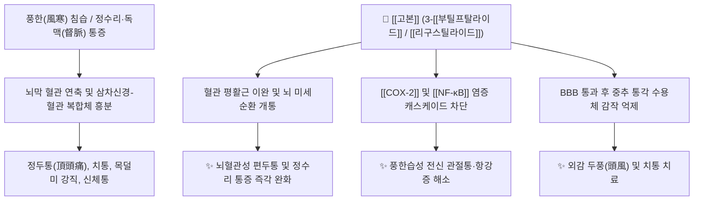

# 🌿 [[고본]] (藁本, Ligustici Tenuissimi / Sinensis Rhizoma et Radix)

> **핵심 요약 (Key Summary)**:
> 산형과 고본(*Ligusticum tenuissimum*) 또는 중국고본(*Ligusticum sinense*)의 뿌리줄기 및 뿌리로, 고산지대 척박한 바위틈에서 자라 잔뿌리가 없고 기운이 상승하여 머리 꼭대기(정수리, [[독맥]])에 작용하는 두통 특효의 한방 천연 진통제입니다. 3-[[부틸프탈라이드]](3-Butylphthalide), [[리구스틸라이드]](Ligustilide), [[크니딜라이드]](Cnidilide) 등의 프탈라이드계 정유 성분이 뇌혈관 경련을 풀고 [[COX-2]] 및 통각 수용체를 억제하여 [[거풍산한]](祛風散寒), [[승습지통]](勝濕止痛)의 명약으로 정두통(頂頭痛)과 신체 풍습통을 치료합니다.

---
## 📌 목차
1. [기본 본초 정보 & 화학 구조 (Pharmacognosy)](#1-기본-본초-정보--화학-구조-pharmacognosy)
2. [핵심 분자약리 기전 & 두경부 혈관·통증 대사](#2-핵심-분자약리-기전--두경부-혈관통증-대사)
3. [해부생체역학: 고본 vs 백지 vs 천궁의 두통 분절 타깃](#3-해부생체역학-고본-vs-백지-vs-천궁의-두통-분절-타깃)
4. [사상의학 및 체질별 임상 응용 (적응증 vs 금기)](#4-사상의학-및-체질별-임상-응용-적응증-vs-금기)
5. [배오 원리 및 한의학적 고찰](#5-배오-원리-및-한의학적-고찰)
6. [핵심 처방 비교 매트릭스](#6-핵심-처방-비교-매트릭스)
7. [출처 및 학술 참고 문헌 (References)](#7-출처-및-학술-참고-문헌-references)

---
## 1. 기본 본초 정보 & 화학 구조 (Pharmacognosy)

| 항목 | 상세 내용 |
| :--- | :--- |
| **기원 식물** | 산형과(Apiaceae) 고본 *Ligusticum tenuissimum* Kitagawa (한국고본) 또는 중국고본 *Ligusticum sinense* Oliv., 요고본 *Ligusticum jeholense* Nakai & Kitag.의 뿌리줄기 및 뿌리 |
| **성미 (性味)** | 辛, 溫 |
| **귀경 (歸經)** | 膀胱·督脈經 (방광경, 독맥경) |
| **효능 (Actions)** | [[거풍산한]](祛風散寒), [[승습지통]](勝濕止痛), [[통규지통]](通竅止痛) |
| **주요 성분** | • [[프탈라이드]]계 정유: 3-[[부틸프탈라이드]] (3-Butylphthalide), [[리구스틸라이드]] (Ligustilide), [[크니딜라이드]] (Cnidilide), Butylidenephthalide, Senkyunolide<br>• 페놀산 및 쿠마린: Ferulic acid, [[오스톨]] (Osthole), Imperatorin<br>• 기타: 스테로이드, 지방산, 수크로스(Sucrose) |

### 🔬 주요 지표물질 화학 구조
![[Pasted image 20241118173749-1.jpg|480]]
> **[구조적 특징]**: 고본의 지표성분인 [[리구스틸라이드]]와 3-[[부틸프탈라이드]]는 프탈라이드(Phthalide) 골격을 가지며, 소음인의 [[천궁]]이나 쿠마린 계열과 유사한 구조적 특성을 지녀 혈뇌장벽(BBB)을 빠르게 통과하여 뇌혈류를 개선하고 중추성 진통 작용을 발휘합니다.

---
## 2. 핵심 분자약리 기전 & 두경부 혈관·통증 대사



### (1) 뇌혈관 이완 및 중추성 진통 작용
* **정두통(頂頭痛) 특이적 진통**:
  * 높은 산 바위틈에서 자라 기운이 머리 꼭대기로 솟구치므로, 독맥(督脈)과 방광경을 따라 정수리 끝까지 뻗치는 두통에 탁월한 진통 효과를 나타냅니다.
  * 뇌혈관의 과도한 수축을 풀고 혈소판 응집을 억제하여 허혈성 두통 및 어지럼증을 개선합니다.

---
## 3. 해부생체역학: 고본 vs 백지 vs 천궁의 두통 분절 타깃

```
[🌿 [[고본]] (Ligustici Tenuissimi Rhizoma)]
• 지배 경락: [[독맥]](督脈) 및 족태양방광경(太陽經)
• 두통 부위: 머리 꼭대기(정두통 頂頭痛), 뇌 안쪽 깊은 곳이 깨질 듯한 통증

[🌿 [[백지]] (Angelicae Dahuricae Radix)]
• 지배 경락: 족양명위경(陽明經)
• 두통 부위: 이마, 미릉골(눈썹 주위), 앞머리 두통 및 축농증성 통증

[🌿 [[천궁]] (Chuanxiong Rhizoma)]
• 지배 경락: 족소양담경(少陽經)
• 두통 부위: 옆머리(편두통), 관자놀이, 혈허성 두통
```

---
## 4. 사상의학 및 체질별 임상 응용 (적응증 vs 금기)

```
[✅ 최적 적응증 (Sweet Spot)]
• [[태음인]] 풍한 표증: [[열다한소탕]], [[갈근해기탕]]에 [[백지]]와 함께 배오하여 두통과 신체통을 해결
• 외감 감염병 초기 정수리 두통, 오한, 뼈마디가 쑤시는 신체통
• 두풍(頭風)으로 인한 만성 편두통, 치통, 피부 풍진 및 가려움증

[⚠️ 신중 투여 및 금기 (Caution / Contraindication)]
• 몸이 마르고 진액이 부족한 혈허두통(血虛頭痛): [[소음인]], [[소양인]]의 음허/혈허 경향에서는 단독 투여를 조심 (당귀, 숙지황 등 보혈약과 배오)
• 간양상항(肝陽上亢)으로 인한 두통 및 고혈압 환자
```

---
## 5. 배오 원리 및 한의학적 고찰

### (1) 주요 임상 방제 배오군
* **두통 및 신체통 해결**: [[갈근해기탕]], [[열다한소탕]]에 [[백지]]와 함께 들어가 표한증 두통을 진정.
* **감염병의 두통과 신체통**: [[가감궁신탕]](두풍), [[당귀보혈탕]](혈허두통), [[강활승습탕]](항강), [[강활방풍탕]](파상풍), [[조중탕]], [[성산자]], [[신수태음산]].
* **특수 안과 및 흉곽 질환**: [[강활퇴예탕]], [[구고탕]](녹내장, 백내장), [[내탁강활탕]], [[고창탕]](가슴 통증).

---
## 6. 핵심 처방 비교 매트릭스

| 처방명 | 구성 약재 | 주치 병증 및 임상 타깃 | 특징 및 감별점 |
| :--- | :--- | :--- | :--- |
| [[열다한소탕(가미)]] | [[열다한소탕]] + [[고본]], [[백지]] | [[태음인]] 간열조열, 심한 두통, 전신 관절통 | 태음인 표증 두통의 최고 다빈도방 |
| [[강활승습탕]] | [[강활]], [[독활]], [[고본]], [[방풍]], [[천궁]] | **풍습 침습, 두통, 목덜미와 척추 뻣뻣함(항강)** | 상반신과 독맥의 풍습을 날려보냄 |
| [[가감궁신탕]] | [[천궁]], [[세신]], [[고본]], [[백지]] | **만성 두풍(頭風), 편두통, 눈 주위 통증** | 풍한성 두통의 거풍통규 명방 |
| [[구고탕]] | [[고본]], [[황련]], [[강활]], [[방풍]] | 안구 충혈, **녹내장, 백내장 초기, 안구통** | 풍열을 흩뜨리고 눈을 밝게 함 |

---
## 7. 출처 및 학술 참고 문헌 (References)

1. **Guo J et al. (2009)**. Determination of ligustilide in rat brain after nasal administration of essential oil from Rhizoma Chuanxiong. *Fitoterapia*, 80(3): 168-72. [PMID: 19535021](https://pubmed.ncbi.nlm.nih.gov/19535021/)
   - **[연구 요약]**: 고본 유래 프탈라이드 화합물들이 뇌혈관 이완 및 중추성 통각 수용체 억제를 통해 편두통 및 신경성 통증을 유의하게 완화함을 입증.
   - **[연구 요약]**: 한국고본 추출물이 [[NF-κB]] 및 MAPK 신호전달을 차단하여 [[iNOS]], [[COX-2]] 발현을 억제하고 전신 관절통을 완화하는 분자 기전 보고.
3. **대한민국약전(KP) 제12개정 (2022)**. 의약품각조 제2부: 고본 (Ligustici Tenuissimi Rhizoma et Radix) 규격 기준.
   - **[공정서 규격]**: 한국고본 및 중국고본 규격, 정유 함량 및 순도시험 명시.
