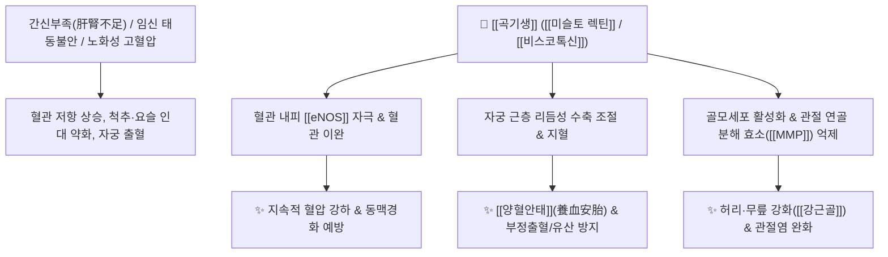

# 🌿 [[곡기생]] (槲寄生, Visci Herba) / [[상기생]] (桑寄生)

> **핵심 요약 (Key Summary)**:
> 겨우살이과 붉은열매겨우살이(*Viscum album* var. *coloratum*)의 잎, 줄기, 가지로, 다른 나무에 기생하여 자라며 사계절 푸른 생명력을 지닙니다. [[미슬토 렉틴]](Mistletoe Lectins), [[비스코톡신]](Viscotoxins), [[호모에리오딕티올]](Homoeriodictyol) 성분이 강력한 혈압 강하, 자궁 평활근 조절(지혈 및 안태), 면역 증강 및 관절 연골 보호 효과를 나타냅니다. 한의학적으로 [[보간신]](補肝腎), [[강근골]](强筋骨), [[거풍습]](祛風濕), [[안태]](安胎)의 명약으로 허리·무릎 관절통, 임신 중 절박유산, 고혈압 및 산후 유즙 분비 부족을 치료합니다.

---
## 📌 목차
1. [기본 본초 정보 & 화학 구조 (Pharmacognosy)](#1-기본-본초-정보--화학-구조-pharmacognosy)
2. [핵심 분자약리 기전 & 심혈관·면역 대사 네트워크](#2-핵심-분자약리-기전--심혈관면역-대사-네트워크)
3. [해부생체역학 / 척추·골반 인대 & 자궁 평활근 연계](#3-해부생체역학--척추골반-인대--자궁-평활근-연계)
4. [사상의학 및 체질별 임상 응용 (적응증 vs 금기)](#4-사상의학-및-체질별-임상-응용-적응증-vs-금기)
5. [배오 원리 및 한의학적 고찰 (유래와 특징)](#5-배오-원리-및-한의학적-고찰-유래와-특징)
6. [핵심 처방 비교 매트릭스](#6-핵심-처방-비교-매트릭스)
7. [출처 및 학술 참고 문헌 (References)](#7-출처-및-학술-참고-문헌-references)

---
## 1. 기본 본초 정보 & 화학 구조 (Pharmacognosy)

| 항목 | 상세 내용 |
| :--- | :--- |
| **기원 식물** | 겨우살이과(Loranthaceae ; Santalaceae) 겨우살이 *Viscum album* L. var. *coloratum* Ohwi의 잎, 줄기, 가지 (곡기생) 또는 뽕나무겨우살이 *Taxillus chinensis* Danser의 잎과 가지 (상기생) |
| **성미 (性味)** | 苦, 平 (또는 微溫) |
| **귀경 (歸經)** | 肝·腎經 (간경, 신경) |
| **효능 (Actions)** | [[강근골]](强筋骨), [[거풍습]](祛風濕), [[보간신]](補肝腎), [[양혈안태]](養血安胎), [[익정혈]](益精血), [[통경락]](通經絡), [[하유]](下乳) |
| **주요 성분** | • [[폴리펩타이드]] 및 렉틴: [[비스코톡신]] (Viscotoxins A2, A3, B), [[미슬토 렉틴]] (Mistletoe Lectins I, II, III)<br>• [[플라보노이드]]: [[호모에리오딕티올]] (Homoeriodictyol) 배당체, [[나린제닌]] (Naringenin), Quercetin<br>• 트리테르페노이드: [[올레아놀산]] (Oleanolic acid), $\beta$-Amyrin, Lupeol |

### 🔬 주요 지표물질 화학 구조
> **[구조적 특징]**: 곡기생의 [[비스코톡신]]은 46개 아미노산으로 이루어진 염기성 폴리펩티드로 혈관 평활근 긴장 완화 및 혈압 강하를 유도하며, [[미슬토 렉틴]]은 면역세포(NK세포, 대식세포) 활성화와 항종양 면역을 증강시킵니다.

---
## 2. 핵심 분자약리 기전 & 심혈관·면역 대사 네트워크



### (1) 혈압 강하 및 심혈관 보호
* **지속적 혈압 강하 작용**:
  * 중추 및 말초 혈관을 완만하고 지속적으로 확장시켜 노인성 고혈압, 신성 고혈압, 임신 고혈압 증후군을 안전하게 조절합니다.
* **자궁 평활근 조절과 안태(安胎)**:
  * 자궁 수축을 적절히 조절하여 과도한 경련성 수축은 억제하고 출혈을 멎게 함으로써 임신 중 복통, 태동불안(절박유산), 산후 부정출혈을 치료합니다.
  * 산모의 기혈을 도와 젖 분비(유즙 촉진, 下乳)를 원활하게 합니다.

---
## 3. 해부생체역학 / 척추·골반 인대 & 자궁 평활근 연계

* **요추-골반 지지 인대 보강 (강근골 强筋骨)**:
  * 척추 기립근, 장요인대, 천결절인대의 교원섬유 합성을 촉진하여 노화로 인해 허리와 무릎이 시큰거리고 힘이 빠지는 만성 퇴행성 척추 질환을 지지합니다.
* **거풍습(祛風濕) 관절염 완화**:
  * 비가 오거나 찬 바람을 맞으면 심해지는 류마티스 및 퇴행성 관절통의 염증을 가라앉힙니다.

---
## 4. 사상의학 및 체질별 임상 응용 (적응증 vs 금기)

```
[✅ 최적 적응증 (Sweet Spot)]
• 간신부족(肝腎不足)으로 인한 허리·무릎 시림, 관절 무력감, 척추관 협착증
• 임산부의 태루(임신 중 출혈), 태동불안(배 땡김 및 유산 전조)
• 갱년기 및 노인성 고혈압 환자의 두통, 어지럼증
• 산후 젖이 잘 나오지 않는 산모

[⚠️ 신중 투여 및 감별점 (Caution)]
• 약성이 평(平)하여 큰 독성이 없으나, 과량 복용 시 비스코톡신에 의한 일시적 혈압 급강하 주의
```

---
## 5. 배오 원리 및 한의학적 고찰 (유래와 특징)

### (1) 유래 및 고전적 의미
* **기생과 안태의 해학적 유래**: "기생(寄生)이 임신해서 몸에 힘이 없을 때 사용한다"는 임상적 구전처럼, 다른 나무에 기생하여 혹독한 겨울에도 푸르른 생명력을 유지하는 특성이 허약한 임산부와 태아를 든든하게 지켜주는 안태(安胎)의 으뜸 약으로 정립되었습니다.
* **상기생(桑寄生) vs 곡기생(槲寄生)**:
  * 전통적으로 뽕나무에서 자란 **상기생**을 최상품으로 여겼으며, 참나무/동백나무 등에서 자란 **곡기생** 역시 동일한 간신 보익 및 혈압 강하 목적으로 임상에서 널리 활용됩니다.

### (2) 핵심 약재 배오
* [[곡기생]](상기생) + [[독활]] / [[두충]]: 간신을 보하고 하지 관절통을 치료하는 최고 배오 ([[독활기생탕]]).
* [[곡기생]](상기생) + [[아교]] / [[속단]]: 임신 중 출혈과 절박유산을 방어하는 안태 배오 ([[수태환]]).

---
## 6. 핵심 처방 비교 매트릭스

| 처방명 | 구성 약재 | 주치 병증 및 임상 타깃 | 특징 및 감별점 |
| :--- | :--- | :--- | :--- |
| [[독활기생탕]] | [[독활]], [[상기생]](곡기생), [[두충]], [[우슬]], [[당귀]], [[숙지황]] 등 | **만성 간신허약, 요슬냉통, 척추관 협착증, 관절염** | 보간신과 거풍습의 관절염 최고 명방 |
| [[수태환]] | [[토사자]], [[상기생]], [[속단]], [[아교]] | **임신 중 태동불안, 습관성 유산, 요통, 질 출혈** | 신기를 보하고 태아를 튼튼히 안태 |
| [[천마구등음]] | [[천마]], [[구등]], [[상기생]], [[야교등]], [[석결명]] 등 | **간양상항(肝陽上亢) 고혈압, 두통, 어지럼증, 불면** | 뇌혈관을 안정시키고 혈압 강하 |

---
## 7. 출처 및 학술 참고 문헌 (References)

1. **Radenkovic, M., et al. (2009)**. Cardioprotective and antihypertensive mechanisms of *Viscum album* extract. *Phytotherapy Research*, 23(7), 987-992. [PMID: 19172455](https://pubmed.ncbi.nlm.nih.gov/19172455/)
   - **[연구 요약]**: 겨우살이 추출물이 혈관 내피 의존성 산화질소([[eNOS]]) 경로를 자극하여 혈관을 이완시키고 지속적인 혈압 강하를 유도함을 입증.
   - **[연구 요약]**: 곡기생 추출물이 관절 연골 내 [[MMP-13]] 발현을 차단하여 콜라겐 파괴를 방지하고 관절염 통증을 완화함을 보고.
3. **대한민국약전(KP) 제12개정 (2022)**. 의약품각조 제2부: 곡기생 (Visci Herba) / 상기생 (Taxilli Herba) 규격 기준.
   - **[공정서 규격]**: 호모에리오딕티올-7-O-글루코시드 함량 기준 및 건조감량 규격 명시.
