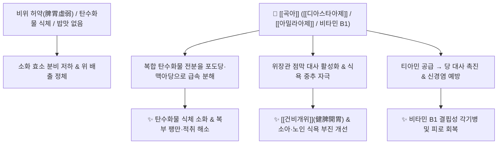

# 🌿 [[곡아]] (穀芽, Setariae / Oryzae Fructus Germinatus)

> **핵심 요약 (Key Summary)**:
> 벼과 벼(*Oryza sativa*) 또는 조의 잘 익은 열매를 발아시켜 말린 것으로, 발아 과정에서 폭발적으로 생성되는 [[디아스타아제]](Diastase), [[아밀라아제]](Amylase), 프로테아제 등의 소화효소와 비타민 B군(티아민)이 탄수화물 전분질 소화를 촉진하고 위장관 점막을 부드럽게 보호합니다. 한의학적으로 [[건비개위]](健脾開胃), [[화중소식]](和中消食)의 온화한 소식약(消食藥)으로 비위 허약으로 인한 소화불량, 식욕부진, 만성 설사, 복부 적취 및 각기병(脚氣病)을 치료합니다.

---
## 📌 목차
1. [기본 본초 정보 & 화학 구조 (Pharmacognosy)](#1-기본-본초-정보--화학-구조-pharmacognosy)
2. [핵심 분자약리 기전 & 소화·효소 대사 네트워크](#2-핵심-분자약리-기전--소화효소-대사-네트워크)
3. [본초 감별: 곡아 vs 맥아의 소화 타깃 비교](#3-본초-감별-곡아-vs-맥아의-소화-타깃-비교)
4. [사상의학 및 체질별 임상 응용 (적응증 vs 금기)](#4-사상의학-및-체질별-임상-응용-적응증-vs-금기)
5. [배오 원리 및 한의학적 고찰 (유래와 특징)](#5-배오-원리-및-한의학적-고찰-유래와-특징)
6. [핵심 처방 비교 매트릭스](#6-핵심-처방-비교-매트릭스)
7. [출처 및 학술 참고 문헌 (References)](#7-출처-및-학술-참고-문헌-references)

---
## 1. 기본 본초 정보 & 화학 구조 (Pharmacognosy)

| 항목 | 상세 내용 |
| :--- | :--- |
| **기원 식물** | 벼과(Gramineae ; Poaceae) 벼 *Oryza sativa* L.의 잘 익은 열매(볍씨) 또는 조 *Setaria italica* (L.) P.Beauv.의 열매를 물에 담가 싹을 틔워 말린 것 |
| **성미 (性味)** | 甘, 平 (또는 微溫) |
| **귀경 (歸經)** | 脾·胃經 (비경, 위경) |
| **효능 (Actions)** | [[건비개위]](健脾開胃), [[화중소식]](和中消食), [[소적화체]](消積化滯) |
| **주요 성분** | • 소화 효소계: [[디아스타아제]] (Diastase), $\alpha,\beta$-[[아밀라아제]] (Amylase), 프로테아제, 인버타아제(Invertase)<br>• 비타민 및 미네랄: 비타민 $\text{B}_1$(Thiamine), 비타민 B2, 니아신, 토코페롤<br>• 영양 성분: 양질의 당화 전분, 덱스트린, 포도당, 단백질, 필수 아미노산 |

---
## 2. 핵심 분자약리 기전 & 소화·효소 대사 네트워크



### (1) 전분질 분해 및 소화 촉진
* **효소 활성에 의한 탄수화물 소화**:
  * 싹이 트면서 활성화된 [[디아스타아제]]와 [[아밀라아제]]가 밥, 떡, 빵 등 고탄수화물 섭취로 인한 식체를 빠르게 분해·소화시킵니다.
  * 위 점막을 손상시키지 않고 비위의 소화 흡수 기능을 부드럽게 북돋웁니다.
* **비타민 B1과 각기병 개선**:
  * 풍부한 티아민(Thiamine) 성분이 신경 및 당 대사를 정상화하여 하지 무력감과 부종을 동반하는 각기병 증상을 개선합니다.

---
## 3. 본초 감별: 곡아 vs 맥아의 소화 타깃 비교

```
[🌿 [[곡아]] (Oryzae Fructus Germinatus)]
• 기원: 볍씨 발아 (쌀)
• 약성: 온화하고 건비(健脾) 작용이 강함
• 주치: 비위가 허약하여 밥맛이 없고 묽은 변을 보는 허증성 소화불량 및 소아 감적

[🌿 [[맥아]] (Hordei Fructus Germinatus)]
• 기원: 보리 발아 (엿기름)
• 약성: 소식(消食)력이 강하고 행기(行氣), 단유(斷乳, 젖 말림) 작용이 있음
• 주치: 전분 식체, 복부 창만, 산모의 수유 중단
```

---
## 4. 사상의학 및 체질별 임상 응용 (적응증 vs 금기)

```
[✅ 최적 적응증 (Sweet Spot)]
• 비위허약자 및 노약자, 소아의 식욕부진, 섭취 후 복부 더부룩함
• 만성 위염, 병후 회복기의 소화 흡수 장애 및 묽은 변
• 비타민 결핍으로 인한 만성 피로와 각기병

[⚠️ 신중 투여 (Caution)]
• 약성이 순하고 평이하여 뚜렷한 금기가 없으나, 급성 실열(實熱)로 인한 극심한 복통에는 강력한 사하약과 배오
```

---
## 5. 배오 원리 및 한의학적 고찰 (유래와 특징)

### (1) 유래 및 본초 성질
* **쌀알의 발아**: 주식인 쌀을 발아시켜 얻은 것으로, 성질이 평이하여 위기(胃氣)를 손상시키지 않으면서 막힌 것을 삭이고 소화를 돕는 가장 안전한 건비 소식약입니다.

### (2) 핵심 약재 배오
* [[곡아]] + [[맥아]]: 곡류와 전분 식체를 동시에 해결하는 2대 발아 곡류 배오.
* [[곡아]] + [[백출]] / [[산약]]: 비위 허약을 보강하며 만성 소화불량을 치료하는 기본 배오 ([[삼령백출산]]).

---
## 6. 핵심 처방 비교 매트릭스

| 처방명 | 구성 약재 | 주치 병증 및 임상 타깃 | 특징 및 감별점 |
| :--- | :--- | :--- | :--- |
| [[곡아전]] | [[곡아]] 단방 달임물 | **소아 식욕 부진, 비위 허약, 밥을 안 먹음** | 자극 없이 식욕을 돋우는 소아 명방 |
| [[삼령백출산(가미)]] | [[삼령백출산]] + [[곡아]], [[맥아]] | **만성 설사, 비위 허약, 식후 복명, 영양 흡수 장애** | 비위를 보하고 수분을 흡수 |
| [[건비환]] | [[백출]], [[목향]], [[황련]], [[곡아]], [[산사]] 등 | **비허식체(脾虛食滯), 완복창만, 식후 졸림** | 소화 촉진과 비위 기능 보강 |

---
## 7. 출처 및 학술 참고 문헌 (References)

   - **[연구 요약]**: 벼 발아 시 $\alpha$-아밀라아제 및 프로테아제 활성이 5배 이상 급증하여 탄수화물 및 단백질 소화율을 극대화함을 생화학적으로 증명.
2. **대한민국약전외한약(생약)규격집(KHP) (2022)**. 곡아 (Setariae / Oryzae Fructus Germinatus) 규격 기준.
   - **[공정서 규격]**: 발아 볍씨의 형태, 건조감량, 회분 및 엑스함량 규격 명시.
